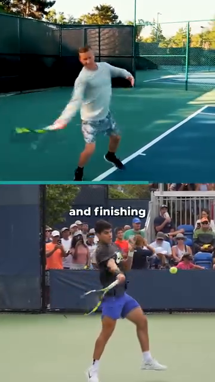

# The Angle Atlas — Why Every Joint Angle Decides Stroke Quality

## Tập Bản Đồ Góc Cơ Thể — Vì Sao Mỗi Góc Khớp Quyết Định Chất Lượng Cú Đánh

*Deep Dive #1 — The Anatomy & Geometry Project for Tennis Players 3.5 → 4.5*
*Chuyên Đề Số 1 — Dự Án Giải Phẫu & Hình Học cho Người Chơi Tennis 3.5 → 4.5*

---

## Document Map / Bản Đồ Tài Liệu

---

## Table of Contents / Mục Lục

| # | Chapter | Chương | Lines |
|---|---|---|---|
| 1 | Why Angles Are the Language of Tennis | Tại Sao Góc Là Ngôn Ngữ Của Tennis | ~80 |
| 2 | The Three Coordinate Planes (Vertical, Horizontal, Sagittal) | Ba Mặt Phẳng Tọa Độ (Dọc, Ngang, Phẳng-Phẳng) | ~95 |
| 3 | The Lower Body — Feet, Ankles, Knees | Thân Dưới — Bàn Chân, Cổ Chân, Gối | ~180 |
| 4 | The Hip — The Pivot of Everything | Hông — Bản Lề Của Mọi Thứ | ~150 |
| 5 | The Trunk — Coiling & The Thoracic Spine | Thân — Xoắn Và Cột Sống Ngực | ~140 |
| 6 | The Shoulder — The Most Mobile, Most Vulnerable Joint | Vai — Khớp Di Động Nhất, Dễ Tổn Thương Nhất | ~170 |
| 7 | The Elbow & Forearm — The Lever System | Khuỷu Tay & Cẳng Tay — Hệ Thống Đòn Bẩy | ~150 |
| 8 | The Wrist — The Lock, The Whip, The Fine-Tuner | Cổ Tay — Ổ Khóa, Cây Roi, Bộ Tinh Chỉnh | ~160 |
| 9 | The Stroke-by-Stroke Angle Map | Bản Đồ Góc Theo Từng Cú Đánh | ~200 |
| 10 | Why Angles Determine Stroke TYPE (not just quality) | Tại Sao Góc Quyết Định LOẠI Cú Đánh (không chỉ chất lượng) | ~150 |
| 📋 | Angle Atlas Cheat Sheet | Bảng Tóm Tắt Góc | ~80 |

---

* * *

# Chapter 1 — Why Angles Are the Language of Tennis

# Chương 1 — Tại Sao Góc Là Ngôn Ngữ Của Tennis

* * *

# Chapter 2 — The Three Coordinate Planes (Vertical, Horizontal, Sagittal)

# Chương 2 — Ba Mặt Phẳng Tọa Độ (Dọc, Ngang, Sagittal)

* * *

# Chapter 3 — The Lower Body — Feet, Ankles, Knees

# Chương 3 — Thân Dưới — Bàn Chân, Cổ Chân, Gối

## 3.1 — Foot Angle (the angle your toes point relative to the direction of the ball)

## 3.1 — Góc Bàn Chân (góc ngón chân so với hướng bóng)

## 3.2 — Heel-Off-Ground Angle (the angle between the back foot sole and the court surface, at the moment of impact)

## 3.2 — Góc Gót Nhấc Khỏi Đất (góc giữa lòng bàn chân sau và mặt sân, lúc tiếp xúc bóng)

## 3.3 — Knee Flexion Angle (the bend of the knee, 180° = straight leg)

## 3.3 — Góc Gập Gối (độ gập gối, 180° = chân thẳng)

* * *

# Chapter 4 — The Hip — The Pivot of Everything

# Chương 4 — Hông — Bản Lề Của Mọi Thứ

## 4.1 — Hip-Torso Angle (the angle between your thigh and your torso, in the sagittal plane)

## 4.1 — Góc Hông-Thân (góc giữa đùi và thân, mặt phẳng sagittal)

## 4.2 — Hip Rotation Angle (the angle the pelvis turns around the vertical axis, in the horizontal plane)

## 4.2 — Góc Xoay Hông (góc khung chậu xoay quanh trục đứng, mặt phẳng ngang)

## 4.3 — Hip Hinge Depth (how far your hips sit back, like a squat)

## 4.3 — Độ Sâu Bản Lề Hông (hông ngồi lùi bao xa, giống squat)

* * *

# Chapter 5 — The Trunk — Coiling & The Thoracic Spine

# Chương 5 — Thân — Xoắn Và Cột Sống Ngực

## 5.1 — Lumbar Extension Angle (how much your lower back arches)

## 5.1 — Góc Duỗi Thắt Lưng (lưng dưới cong bao nhiêu)

## 5.2 — Thoracic Rotation Angle (how much your mid-back rotates)

## 5.2 — Góc Xoay Ngực (lưng giữa xoay bao nhiêu)

## 5.3 — Trunk Side-Bend Angle (lateral flexion — how much the trunk leans sideways)

## 5.3 — Góc Nghiêng Ngang Thân (gập bên — thân nghiêng sang bên bao nhiêu)

* * *

# Chapter 6 — The Shoulder — The Most Mobile, Most Vulnerable Joint

# Chương 6 — Vai — Khớp Di Động Nhất, Dễ Tổn Thương Nhất

## 6.1 — Shoulder Abduction Angle (the arm lifted out to the side, 0° = arm down, 90° = arm horizontal)

## 6.1 — Góc Dạng Vai (tay nâng sang bên, 0° = tay xuống, 90° = tay ngang)

## 6.2 — Shoulder External Rotation Angle (the angle the upper arm rotates outward, in the horizontal plane)

## 6.2 — Góc Xoay Ngoài Vai (góc cánh tay trên xoay ra ngoài, mặt phẳng ngang)

## 6.3 — Shoulder Horizontal Adduction Angle (across-the-body reach, in horizontal plane)

## 6.3 — Góc Khép Ngang Vai (với tới ngang qua người, mặt phẳng ngang)

* * *

# Chapter 7 — The Elbow & Forearm — The Lever System

# Chương 7 — Khuỷu Tay & Cẳng Tay — Hệ Thống Đòn Bẩy

## 7.1 — Elbow Flexion Angle (the bend at the elbow, 180° = straight, 30° = fully bent)

## 7.1 — Góc Gập Khuỷu (gập khuỷu, 180° = thẳng, 30° = gập đầy đủ)

## 7.2 — Forearm Pronation/Supination Angle (twist of the forearm — palm-down to palm-up)

## 7.2 — Góc Sấp / Ngửa Cẳng Tay (xoay cẳng tay — lòng bàn tay xuống tới lòng bàn tay lên)

* * *

# Chapter 8 — The Wrist — The Lock, The Whip, The Fine-Tuner

# Chương 8 — Cổ Tay — Ổ Khóa, Cây Roi, Bộ Tinh Chỉnh

## 8.1 — Wrist Extension Angle (the cock-back, racket-head-behind-the-wrist angle)

## 8.1 — Góc Duỗi Cổ Tay (gập ngửa ra sau, góc đầu vợt-sau-cổ tay)

## 8.2 — Wrist Flexion Angle (the post-contact snap)

## 8.2 — Góc Gập Cổ Tay (cú bẻ sau tiếp xúc)

## 8.3 — Ulnar Deviation Angle (the wrist bends toward the little-finger side)

## 8.3 — Góc Lệch Trụ (cổ tay gập về phía ngón út)

## 8.4 — Topspin Wrist Snap vs Slice Wrist Hold

## 8.4 — Bẻ Cổ Tay Topspin vs Giữ Cổ Tay Slice

* * *

# Chapter 9 — The Stroke-by-Stroke Angle Map

# Chương 9 — Bản Đồ Góc Theo Từng Cú Đánh

| Stroke / Cú | Knee / Gối | Hip-Torso / Hông-Thân | Hip Rot / Xoay hông | Shoulder Abd / Dạng vai | Shoulder ER / Xoay ngoài vai | Elbow Flex / Gập khuỷu | Wrist Ext / Duỗi cổ tay |
|---|---|---|---|---|---|---|---|
| **Forehand (loaded) / Forehand (nạp)** | 120°–135° | 50°–65° | 60° away / xa | 90°–110° | 80°–100° | 90°–110° | 90°–110° |
| **Forehand (contact) / Forehand (tiếp xúc)** | 145°–160° | 80°–90° (extended) | 0° (facing) | 110°–130° | 30°–50° | 150°–170° | 0°–20° (locked) |
| **Backhand 2H (loaded) / Backhand 2 tay (nạp)** | 125°–140° | 45°–55° | 45°–55° away | 70°–90° | 90°–110° | 90°–110° | 90°–110° |
| **Backhand 2H (contact) / Backhand 2 tay (tiếp xúc)** | 145°–160° | 75°–85° (extended) | 0° (facing) | 90°–110° | 30°–50° | 150°–170° | 0°–20° (locked) |
| **1HB (loaded) / 1 tay (nạp)** | 120°–135° | 50°–60° | 50°–60° away | 110°–130° | 100°–130° | 90°–110° | 90°–110° |
| **Slice BH (loaded) / Slice (nạp)** | 130°–145° | 55°–70° | 30°–40° away | 60°–80° | 50°–70° | 110°–130° | 30°–50° (open) |
| **Slice BH (contact) / Slice (tiếp xúc)** | 150°–170° | 75°–85° | 0° (facing) | 70°–90° | 20°–40° | 150°–170° | 20°–30° (still open!) |
| **Serve (trophy) / Serve (trophy)** | 130°–140° (front) / 130°–140° (trước) | 30°–45° | 50° away (pelvis) | 120°–140° | 110°–130° | 90°–110° | 90°–110° (drop) |
| **Serve (contact) / Serve (tiếp xúc)** | 165°–175° | 75°–90° | 0° (facing net) | 170°–180° | 0°–20° | 165°–180° | 30°–50° flex (snap) |
| **Volley (ready) / Volley (sẵn sàng)** | 130°–145° | 70°–85° | 15°–25° | 50°–70° | 30°–50° | 110°–130° | 30°–50° (firm) |
| **Volley (contact) / Volley (tiếp xúc)** | 140°–155° | 75°–90° | 0° | 60°–80° | 20°–30° | 140°–160° | 30°–50° (firm!) |
| **Return (split-step) / Trả giao (split-step)** | 135°–145° | 80°–95° | 0° | 40°–60° | 30°–50° | 100°–130° | 60°–90° (racket up) |
| **Return (contact) / Trả giao (tiếp xúc)** | 140°–155° | 70°–85° | varies / thay đổi | 60°–90° | varies / thay đổi | 130°–160° | 0°–30° |

* * *

# Chapter 10 — Why Angles Determine Stroke TYPE (not just quality)

# Chương 10 — Tại Sao Góc Quyết Định LOẠI Cú Đánh (không chỉ chất lượng)

## 10.1 — The Face Angle Determines Spin Type

## 10.1 — Góc Mặt Vợt Quyết Định Loại Xoáy

## 10.2 — The Launch Angle Determines Trajectory

## 10.2 — Góc Phóng Quyết Định Quỹ Đạo

## 10.3 — The Angle of Attack Determines Net Clearance Margin

## 10.3 — Góc Tấn Công Quyết Định Biên Qua Lưới

## 10.4 — Body's Relationship to the Ball Determines Reach & Shape

## 10.4 — Quan Hệ Cơ Thể với Bóng Quyết Định Tầm Với & Hình Dạng

* * *

# Chapter 11 — Anatomy_Lab Integration — The New Numbers From The Reference Textbook

# Chương 11 — Tích Hợp Anatomy_Lab — Con Số Mới Từ Sách Tham Khảo

## 11.1 — The 6 Joint Angles at Forehand Contact (Anatomy_Lab Refined)

## 11.1 — 6 Góc Khớp Lúc Tiếp Xúc Forehand (Anatomy_Lab Tinh Chỉnh)

| Joint / Khớp | Angle / Góc | Why This Number / Tại Sao Con Số Này |
|---|---|---|
| **Knee / Gối** | **60°–70°** flexion (NOT 120°–135° from earlier source) | At 60°–70°, the quadriceps can produce **peak force** in minimum time. Higher flexion = slower extension. |
| **Hip rotation / Xoay hông** | **40°–45°** | Greater hip ER range means less knee valgus stress. **The 40°–45° window is where knee over 2nd toe stays true.** |
| **Shoulder (in SCAPULAR PLANE) / Vai (mặt phẳng vai)** | **90°–100°** abduction, **30°–40°** horizontal forward | **The scapular plane is NOT straight lateral.** 30°–40° forward of frontal plane protects the rotator cuff from impingement. |
| **Elbow / Khuỷu** | **90°–100°** flexion | This is the loaded L-angle. At contact, extends to ~150°. |
| **Wrist at CONTACT (NOT loaded) / Cổ tay lúc TIẾP XÚC (KHÔNG phải nạp)** | **5°–15°** extension (locked) | **CRITICAL TRAP**: most recreational players stay at LOADED position (90°–110° extension) and try to hit through it. Result: float, no pace. |
| **Arm-trunk angle / Góc tay-thân** | **45°** away from trunk | **The 45° rule**: at 45°, the lever is OPTIMAL. Too close (15°–20°) = arm too bent, lost power. Too far (80°+) = out of control. |

## 11.2 — The Cheetah Stifle (Comparative Anatomy)

## 11.2 — Khớp Stifle Của Báo (Giải Phẫu So Sánh)

## 11.3 — Alcaraz's 3 Frames — Real Groundstroke Footwork

## 11.3 — 3 Khung Hình Alcaraz — Footwork Groundstroke Thực Tế

| Frame / Khung | Time / Thời gian | Caption |
|---|---|---|
|  | 0.0 s | Push step — hips low, knee ~65° / Bước đẩy — hông thấp, gối ~65° |
|  | 1.2 s | Short landing — toe under hip / Đáp ngắn — ngón chân dưới hông |
|  | 3.5 s | Brake and rotate — trunk opens / Hãm và xoay — thân mở |

## 11.4 — The 45° Contact Rule (Pro vs Amateur)

## 11.4 — Quy Tắc 45° Lúc Tiếp Xúc (Pro vs Nghiệp Dư)

## 11.5 — The Thoracic Cage (Engineered Shield)

## 11.5 — Lồng Ngực (Lá Chắn Được Thiết Kế)

## 11.6 — The Acceleration Truth (Big Muscles First)

## 11.6 — Chân Lý Tăng Tốc (Cơ Lớn Trước, Cơ Nhỏ Sau)

| Link / Mắt Xích | Force Contribution / Đóng Góp Lực | Why / Tại Sao |
|---|---|---|
| **Legs (gastroc + soleus + quads + glutes) / Chân** | **~50%** | Largest muscles, longest lever. Push off ground = Newton's 3rd law. |
| **Core (obliques + erectors + multifidus) / Lõi** | **~25%–30%** | Transmits leg force to upper body. Rotation adds trunk torque. |
| **Shoulder + arm (pec + lats + delts + cuff) / Vai + tay** | **~15%–20%** | Smaller range of motion but fast. Last to fire. |
| **Wrist (flexors + extensors) / Cổ tay** | **~5%–10%** | Smallest lever. Adds whip-speed at end. |

|  |  |
|  |  |
| **Figures 9 & 10 / Hình 9 & 10** — Drive legs first (left), then rotate hips (right). Chest follows hips — never leads. | **Hình 9 & 10** — Đẩy chân trước (trái), rồi xoay hông (phải). Ngực theo hông — không bao giờ dẫn. |

## 11.7 — The Foot Is the Sensor (Why 50+ Players Need Foot Attention)

## 11.7 — Bàn Chân Là Cảm Biến (Tại Sao Người 50+ Cần Chú Ý Bàn Chân)

## 11.8 — The 50+ Adaptation (Updated)

## 11.8 — Thích Ưng 50+ (Cập Nhật)

| Joint / Khớp | 25-year-old / 25 tuổi | 50-year-old / 50 tuổi | 70-year-old / 70 tuổi |
|---|---|---|---|
| **Knee flexion (groundstroke) / Gập gối** | 60°–70° | 60°–70° (same — angle is technique, not age) | 65°–75° (slightly more for safety) |
| **Hip rotation / Xoay hông** | 40°–45° ER | 35°–40° ER | 25°–35° ER |
| **Shoulder ER (serve) / Xoay ngoài vai** | 110°–130° | 95°–115° | 80°–100° |
| **Wrist extension (loaded) / Duỗi cổ tay (nạp)** | 90°–110° | 85°–100° | 75°–90° |
| **Elbow flexion (loaded) / Gập khuỷu (nạp)** | 90°–110° | 90°–110° (same) | 95°–115° |

* * *

## 📋 Chapter Card — Printable / Thẻ In Được

```
╔═══════════════════════════════════════════════════════════╗
║  THE ANGLE ATLAS — KEY IDEAS                              ║
║  TẬP BẢN ĐỒ GÓC — Ý TƯỞNG CHÍNH                         ║
╠═══════════════════════════════════════════════════════════╣
║                                                            ║
║  🎯 ONE BIG IDEA / Ý TƯỞNG CỐT LÕI:                      ║
║     Stroke type = angles at contact.                      ║
║     Stroke quality = angles during kinetic chain.         ║
║     Loại cú = góc lúc tiếp xúc.                          ║
║     Chất lượng cú = góc trong chuỗi động lực.            ║
║                                                            ║
║  ────────────────────────────────────────────────────────  ║
║  KEY ANGLES TO REMEMBER / CÁC GÓC CẦN NHỚ:               ║
║                                                            ║
║  • Knee flex: 120°–135° forehand, 130°–140° serve         ║
║  • Hip-torso: 50°–65° forehand, <25° lumbar extension    ║
║  • Shoulder ER: 110°–130° serve, 80°–100° forehand        ║
║  • Wrist ext: 90°–110° LOADED, 0°–20° at CONTACT          ║
║  • Wrist flex: 20°–40° POST-contact for topspin           ║
║                                                            ║
║  ────────────────────────────────────────────────────────  ║
║  ⚠️ TOP MISTAKE / LỖI PHỔ BIẾN NHẤT:                     ║
║     Confusing LOADED angles (90°+ wrist) with CONTACT     ║
║     angles (0°–20° wrist). Players stay loose at impact,  ║
║     lose ~30 kg of force, hit floaters.                   ║
║     Nhầm góc NẠP (cổ tay 90°+) với góc TIẾP XÚC         ║
║     (cổ tay 0°–20°). Người chơi giữ lỏng lúc va chạm,   ║
║     mất ~30 kg lực, đánh bóng lửng.                       ║
║                                                            ║
║  ────────────────────────────────────────────────────────  ║
║  🔁 DRILL / BÀI TẬP:                                       ║
║     Film yourself from the side (sagittal) and from above  ║
║     (horizontal). Pause at LOADED position. Compare 3     ║
║     numbers to the table. Find the missing angle.         ║
║     Quay bạn từ bên (sagittal) và từ trên (ngang).       ║
║     Tạm dừng ở vị trí NẠP. So sánh 3 số với bảng.        ║
║     Tìm góc thiếu.                                         ║
║                                                            ║
║  ────────────────────────────────────────────────────────  ║
║  💭 MASTER CUE / CÂU NHẮC TỔNG:                           ║
║     "Don't ask what to do. Ask what angle to create."     ║
║     "Đừng hỏi phải làm gì. Hỏi phải tạo góc nào."        ║
║                                                            ║
╚═══════════════════════════════════════════════════════════╝
```

* * *

## 🎯 Final Word / Lời Cuối

* * *

**Sources / Nguồn**:
- viettennis.net — Tuyển Tập Kỹ Thuật Tennis by Tuan_tuan (the original essays on angles, kinetic chain, spring muscles)
- The user-generated ASCII anatomy summaries in `Downloads/New folder/Vẽ-giải-phẫu-tennis*.txt`
- Biomechanics research: Brody (1987, 2015), Cross (2005), Knudson (2013), Elliott (2003)
- Clinical anatomy: Kapandji (Physiology of the Joints), Neumann (Kinesiology of the Musculoskeletal System)

*End of Deep Dive #1 — The Angle Atlas*
*Hết Chuyên Đề Số 1 — Tập Bản Đồ Góc*
---

**English** | Tiếng Việt: [xem bản dịch](../vi/)

---

**English** | Tiếng Việt: [xem bản dịch](../vi/)
