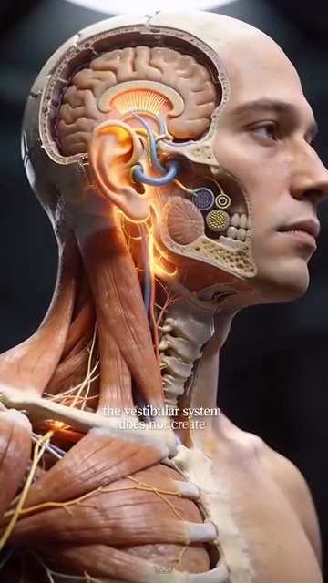

# Neurological Foundation — Brain, Proprioception, Vision & Reaction Anatomy

# Nền Tảng Thần Kinh — Não, Cảm Giác Sâu, Thị Giác & Giải Phẫu Phản Xạ

*Deep Dive #3 — The Anatomy & Geometry Project for Tennis Players 3.5 → 4.5*
*Chuyên Đề Số 3 — Dự Án Giải Phẫu & Hình Học cho Người Chơi Tennis 3.5 → 4.5*

---

## Document Map / Bản Đồ Tài Liệu

---

## Table of Contents / Mục Lục

| # | Chapter | Chương |
|---|---|---|
| 1 | The Reaction Chain — From Eye to Ball | Chuỗi Phản Xạ — Từ Mắt Tới Bóng |
| 2 | The Eye — How Vision Drives the Stroke | Mắt — Cách Thị Giác Dẫn Cú Đánh |
| 3 | Proprioception — The Hidden 6th Sense | Cảm Giác Sâu — Giác Quan Thứ 6 Ẩn |
| 4 | The Brain Regions Behind a Tennis Stroke | Vùng Não Sau Một Cú Tennis |
| 5 | Reaction Time, Decision Time, Movement Time | Thời Gian Phản Xạ, Quyết Định, Vận Động |
| 6 | The Three Reaction Layers | Ba Lớp Phản Xạ |
| 7 | The Vestibular System — Balance & Equilibrium | Hệ Tiền Đình — Thăng Bằng & Cân Bằng |
| 8 | Neuroplasticity — Why 50+ Brains Still Learn | Dẻo Dai Thần Kinh — Tại Sao Não 50+ Vẫn Học |
| 📋 | Neurological Cheat Sheet | Bảng Tóm Tắt Thần Kinh |

---

* * *

# Chapter 1 — The Reaction Chain — From Eye to Ball

# Chương 1 — Chuỗi Phản Xạ — Từ Mắt Tới Bóng

* * *

# Chapter 2 — The Eye — How Vision Drives the Stroke

# Chương 2 — Mắt — Cách Thị Giác Dẫn Cú Đánh

* * *

# Chapter 3 — Proprioception — The Hidden 6th Sense

# Chương 3 — Cảm Giác Sâu — Giác Quan Thứ 6 Ẩn

* * *

# Chapter 4 — The Brain Regions Behind a Tennis Stroke

# Chương 4 — Vùng Não Sau Một Cú Tennis

* * *

# Chapter 5 — Reaction Time, Decision Time, Movement Time

# Chương 5 — Thời Gian Phản Xạ, Quyết Định, Vận Động

* * *

# Chapter 6 — The Three Reaction Layers

# Chương 6 — Ba Lớp Phản Xạ

* * *

# Chapter 7 — The Vestibular System — Balance & Equilibrium

# Chương 7 — Hệ Tiền Đình — Thăng Bằng & Cân Bằng

* * *

# Chapter 8 — Neuroplasticity — Why 50+ Brains Still Learn

# Chương 8 — Dẻo Dai Thần Kinh — Tại Sao Não 50+ Vẫn Học

* * *

# Chapter 9 — Anatomy_Lab Integration — The Three-Layer Control System

# Chương 9 — Tích Hợp Anatomy_Lab — Hệ Kiểm Soát Ba Lớp

## 9.1 — The Vestibular System (The 3rd Layer of the Kinetic Chain)

## 9.1 — Hệ Tiền Đình (Lớp Thứ 3 Của Chuỗi Động Học)

## 9.2 — The 5-Phase Visual Cycle (Quiet Eye)

## 9.2 — Chu Kỳ Thị Giác 5 Pha (Mắt Im Lặng)

| Phase / Pha | Duration / Thời Lượng | What Happens / Chuyện Gì Xảy Ra |
|---|---|---|
| **1. Wide perception / Nhận thức rộng** | ~0.5 s before stroke | Soft eyes, gaze wide. Reads opponent's body, court, ball. |
| **2. Lock-on / Khóa mục tiêu** | ~0.3 s before contact | Eyes narrow to the ball. Gaze centers. |
| **3. Narrow focus / Tập trung hẹp** | ~0.1 s before contact | Gaze locks on the contact zone on opponent's racket. |
| **4. Quiet eye / Mắt im lặng** | **0.05–0.1 s** | Gaze FIXED on the contact point. **Eyes DO NOT MOVE.** This is the critical period. |
| **5. Re-expand / Mở rộng lại** | ~0.2 s after contact | Gaze widens to track ball and read opponent's response. |

|  |  |
|  |  |
| **Figures 3 & 4 / Hình 3 & 4** — The quiet eye in action (left), and the full 5-phase tracking sequence (right). | **Hình 3 & 4** — Mắt im lặng trong hành động (trái), và trình tự theo dõi 5 pha đầy đủ (phải). |

## 9.3 — The Reaction Time Cascade (Anatomy_Lab DD8 Numbers)

## 9.3 — Thác Phản Xạ (Số Anatomy_Lab DD8)

| Age / Tuổi | Total Reaction Time / Tổng Phản Xạ | Can Return / Có Thể Trả |
|---|---|---|
| **25 / 25 tuổi** | **~400 ms** | 100+ mph serve |
| **50 / 50 tuổi** | **~500 ms** | 70–80 mph serve |
| **65 / 65 tuổi** | **~600 ms** | 50–60 mph serve |
| **75 / 75 tuổi** | **~700 ms** | <40 mph serve (recreational pace) |

|  |  |
|  |  |
| **Figures 5 & 6 / Hình 5 & 6** — Reaction time cascade visualized (left), and visual reaction at the moment of contact (right). | **Hình 5 & 6** — Thác phản xạ được hình dung (trái), và phản xạ thị giác lúc tiếp xúc (phải). |

## 9.4 — The 50+ Sensory Triad (Anatomy_Lab DD8 Critical Insight)

## 9.4 — Bộ Ba Giác Quan 50+ (Insight Then Chốt Anatomy_Lab DD8)

| System / Hệ | Decline by 50 / Suy Giảm Đến 50 | Decline by 70 / Suy Giảm Đến 70 | Tennis Impact / Tác Động Tennis |
|---|---|---|---|
| **Vision / Thị giác** | ~10°–15° peripheral narrowing | ~20° narrowing, presbyopia | Tracking ball, judging depth |
| **Vestibular / Tiền đình** | ~20%–30% hair cell loss | ~40%–50% loss | Balance on rapid direction changes |
| **Proprioception / Cảm giác sâu** | ~10%–15% accuracy loss | ~25%–30% accuracy loss | Spacing, recovery, court awareness |

|  |  |
|  |  |
| **Figures 7 & 8 / Hình 7 & 8** — The 50+ sensory triad visualized (left), and strategies to compensate (right). | **Hình 7 & 8** — Bộ ba giác quan 50+ được hình dung (trái), và chiến lược bù (phải). |

## 9.5 — The Foot as a 30 ms Reflex Sensor (Connecting to DD2)

## 9.5 — Bàn Chân Như Cảm Biến Phản Xạ 30 ms (Kết Nối Với DD2)

## 9.6 — Updated Brain-Region Map (Anatomy_Lab Sharpened)

## 9.6 — Bản Đồ Vùng Não Cập Nhật (Anatomy_Lab Tinh Chỉnh)

| Brain Region / Vùng Não | Function / Chức Năng | Tennis Connection / Kết Nối Tennis |
|---|---|---|
| **Occipital lobe / Thùy chẩm** | Visual processing / Xử lý thị giác | Reads the ball, depth, spin |
| **Parietal lobe / Thùy đỉnh** | Spatial mapping / Ánh xạ không gian | Maps ball position relative to body |
| **Temporal lobe / Thùy thái dương** | Pattern recognition / Nhận diện mẫu | "This serve looks like the last one" |
| **Cerebellum / Tiểu não** | Timing & coordination / Định giờ & phối hợp | Makes the swing look smooth, not jerky |
| **Basal ganglia / Hạch nền** | Habit / Thói quen | The "autopilot" forehand after 10,000 reps |
| **Prefrontal cortex / Vỏ trước trán** | Decision / Quyết định | The slowest layer (THE bottleneck) |
| **Brainstem (vestibular) / Thân não** | Balance / Thăng bằng | The 3rd layer of the kinetic chain |

|  |  |
|  |  |
| **Figures 10 & 11 / Hình 10 & 11** — Brain region integration (left), and the vestibular neural pathway (right). | **Hình 10 & 11** — Tích hợp vùng não (trái), và đường thần kinh tiền đình (phải). |

* * *

## 📋 Chapter Card — Printable / Thẻ In Được

```
╔═══════════════════════════════════════════════════════════╗
║  NEUROLOGICAL FOUNDATION — KEY IDEAS                      ║
║  NỀN TẢNG THẦN KINH — Ý TƯỞNG CHÍNH                     ║
╠═══════════════════════════════════════════════════════════╣
║                                                            ║
║  🎯 ONE BIG IDEA / Ý TƯỞNG CỐT LÕI:                      ║
║     Reaction time bottleneck is the DECISION step,         ║
║     not the legs. Train the brain with random             ║
║     drills and the body follows.                          ║
║     Nút thắt phản xạ là bước QUYẾT ĐỊNH, không phải     ║
║     chân. Tập não với bài ngẫu nhiên và cơ thể theo.     ║
║                                                            ║
║  ────────────────────────────────────────────────────────  ║
║  KEY NUMBERS / CÁC CON SỐ CHÍNH:                          ║
║                                                            ║
║  • Total reaction time: 0.45–0.95s for 4.0 player         ║
║  • Decision time: 0.10–0.30s (the bottleneck)             ║
║  • Quiet eye duration: 0.3–0.5s (elite), 0.1–0.2s (rec)  ║
║  • VOR reflex time: ~0.015s (head-motion stabilizer)       ║
║  • Stretch reflex time: ~0.05s (split-step layer)         ║
║  • Proprioception accuracy: 2°–5° at joint level           ║
║                                                            ║
║  ────────────────────────────────────────────────────────  ║
║  ⚠️ TOP MISTAKE / LỖI PHỔ BIẾN NHẤT:                     ║
║     Training only muscles. The 0.20s gap between 3.5      ║
║     and 4.5 is mostly decision time. Train the brain.      ║
║     Chỉ tập cơ. Khoảng cách 0.20s giữa 3.5 và 4.5        ║
║     phần lớn là thời gian quyết định. Tập não.           ║
║                                                            ║
║  ────────────────────────────────────────────────────────  ║
║  🔁 DRILL / BÀI TẬP:                                       ║
║     Partner randomly calls "forehand!" / "backhand!"      ║
║     just before they hit a ball. You react and call       ║
║     back the shot choice. 50 reps × 3 sessions/week.      ║
║     Bạn cùng hô ngẫu nhiên "forehand!" / "backhand!"     ║
║     ngay trước khi họ đánh bóng. Bạn phản ứng và hô     ║
║     lại lựa chọn cú. 50 lần × 3 buổi/tuần.               ║
║                                                            ║
║  ────────────────────────────────────────────────────────  ║
║  💭 MASTER CUE / CÂU NHẮC TỔNG:                           ║
║     "Train the decision. The legs are fine."              ║
║     "Tập quyết định. Chân ổn rồi."                        ║
║                                                            ║
╚═══════════════════════════════════════════════════════════╝
```

* * *

## 🎯 Final Word / Lời Cuối

* * *

**Sources / Nguồn**:
- viettennis.net — Tuyển Tập Kỹ Thuật Tennis by Tuan_tuan (eye position and ball-tracking cues)
- Vickers (1996, 2007) — Quiet Eye research
- Schmidt & Wrisberg (2008) — Motor Learning and Performance
- Komi (2003), Robertson (2005) — Stretch reflex and SSC
- Lambert (2010), Han (2015) — Vestibular system in sport
- Voss et al. (2020) — Neuroplasticity in older adults
- Squire et al. (2013) — Fundamental Neuroscience

*End of Deep Dive #3 — Neurological Foundation*
*Hết Chuyên Đề Số 3 — Nền Tảng Thần Kinh*
---

**English** | Tiếng Việt: [xem bản dịch](../vi/)

---

**English** | Tiếng Việt: [xem bản dịch](../vi/)
