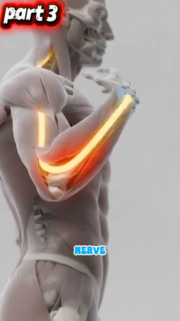
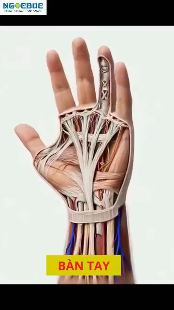

# DD7 — The Sensor System — Feedback Loops, PV vs SV, and Error Correction

# DD7 — Hệ Cảm Biến — Vòng Phản Hồi, PV vs SV, và Sửa Lỗi

*Deep Dive #7 — The Anatomy & Geometry Project for Tennis Players 3.5 → 4.5*
*Chuyên Đề Số 7 — Dự Án Giải Phẫu & Hình Học cho Người Chơi Tennis 3.5 → 4.5*

*Built from the 20-chapter body perception handbook at `Cẩm nang về cảm nhận cơ thể trong tennis/` and `Proprioception in Tennis` (Claude coauthor)*
*Xây từ cẩm nang 20 chương nhận thức cơ thể tại `Cẩm nang về cảm nhận cơ thể trong tennis/` và `Proprioception in Tennis` (đồng tác giả Claude)*

---

## Document Map / Bản Đồ Tài Liệu

---

## Table of Contents / Mục Lục

| # | Chapter | Chương |
|---|---|---|
| 1 | The Control Engineering View of Tennis | Góc Nhìn Kỹ Thuật Điều Khiển Của Tennis |
| 2 | The 5 Sensor Channels | 5 Kênh Cảm Biến |
| 3 | Channel 1 — Proprioception (The Hidden 6th Sense) | Kênh 1 — Cảm Giác Sâu (Giác Quan Thứ 6 Ẩn) |
| 4 | Channel 2 — Feet (Ground Contact as PV) | Kênh 2 — Bàn Chân (Tiếp Đất làm PV) |
| 5 | Channel 3 — Hands (Racket Grip as PV) | Kênh 3 — Bàn Tay (Cầm Vợt làm PV) |
| 6 | Channel 4 — Eyes (Vision as PV + SV Source) | Kênh 4 — Mắt (Thị Giác làm PV + Nguồn SV) |
| 7 | Channel 5 — Ears + Vestibular (Sound + Head Position) | Kênh 5 — Tai + Tiền Đình (Âm Thanh + Vị Trí Đầu) |
| 8 | The 3 Feedback Loop Types | 3 Loại Vòng Phản Hồi |
| 9 | Error Correction: From Error to Refinement | Sửa Lỗi: Từ Sai Số Đến Tinh Chỉnh |
| 10 | The 5-Phase Body Perception Cycle (Internal vs External Focus) | Chu Kỳ Nhận Thức Cơ Thể 5 Pha (Tập Trung Trong vs Ngoài) |
| 11 | Training the Sensors (Drills) | Tập Các Cảm Biến (Bài Tập) |
| 📋 | Sensor System Cheat Sheet | Bảng Tóm Tắt Hệ Cảm Biến |

---

* * *

# Chapter 1 — The Control Engineering View of Tennis

# Chương 1 — Góc Nhìn Kỹ Thuật Điều Khiển Của Tennis

* * *

# Chapter 2 — The 5 Sensor Channels

# Chương 2 — 5 Kênh Cảm Biến

| # | Channel / Kênh | What It Senses / Nó Cảm Nhận | Where the Sensors Are / Vị Trí Cảm Biến | Speed / Tốc Độ |
|---|---|---|---|---|
| **1** | **Proprioception / Cảm giác sâu** | Joint angles, muscle tension, limb position | Muscle spindles, Golgi tendon organs, joint receptors, skin stretch receptors | **~80 m/s** (fastest sensory organ) |
| **Channel 4 — Feet / Kênh 4 — Bàn chân** | Ground contact, surface texture, weight distribution, push-off force | 7,000+ nerve endings in sole, plantar fascia, foot joint receptors | **30 ms reflex** (faster than consciousness) |
|  |  |
| **Figure 0a / Hình 0a** — Foot bones as the lever/sensor platform. The 26 bones provide 33 joints that act as both force transmitters (actuator) AND position sensors. | **Hình 0a** — Xương bàn chân làm nền tảng đòn bẩy/cảm biến. 26 xương cung cấp 33 khớp hoạt động vừa là bộ truyền lực (cơ cấu chấp hành) VỪA là cảm biến vị trí. |
|  |  |
| **Figure 0b / Hình 0b** — Plantar view showing the dense nerve network in the sole. 7,000+ sensors, 30 ms reflex — the foot is the body's fastest external sensor. | **Hình 0b** — Nhìn dưới lòng bàn chân thấy mạng lưới thần kinh dày đặc. 7.000+ cảm biến, 30 ms phản xạ — bàn chân là cảm biến bên ngoài nhanh nhất cơ thể. |
|  |  |
| **Figure 0c / Hình 0c** — Windlass mechanism: the foot is BOTH a sensor (detects arch tension) AND an actuator (stores energy for push-off). This dual role is why the foot is the most important tennis sensor. | **Hình 0c** — Cơ chế windlass: bàn chân vừa là cảm biến (phát hiện căng cung) VỪA là cơ cấu chấp hành (tích năng lượng đẩy). Vai trò kép này là lý do bàn chân là cảm biến tennis quan trọng nhất. |
|  |  |
| **Figure 0d / Hình 0d** — Cubital tunnel (ulnar nerve pathway). Even before the hand senses anything, the elbow's ulnar nerve pathway is gated by elbow flexion — a hidden sensor constraint. | **Hình 0d** — Cubital tunnel (đường dây thần kinh trụ). Ngay cả trước khi tay cảm nhận bất cứ gì, đường dây thần kinh trụ ở khuỷu bị chặn bởi gập khuỷu — một ràng buộc cảm biến ẩn. |
|  |  |
| **Figure 0e / Hình 0e** — The 27 hand bones (8 carpals + 5 metacarpals + 14 phalanges) provide the sensor platform for the racket. More bones = more sensors = more PV detail. | **Hình 0e** — 27 xương bàn tay (8 cổ tay + 5 đốt bàn tay + 14 đốt ngón) cung cấp nền cảm biến cho vợt. Nhiều xương hơn = nhiều cảm biến hơn = PV chi tiết hơn. |
|  |  |
| **Figure 0f / Hình 0f** — Carpal tunnel cross-section: 9 tendons + 1 median nerve packed into 2 cm². Sensor density is incredibly high — the wrist is one of the most sensor-dense body parts. | **Hình 0f** — Mặt cắt ống cổ tay: 9 gân + 1 dây thần kinh giữa nhồi vào 2 cm². Mật độ cảm biến cực cao — cổ tay là một trong những bộ phận cảm biến dày đặc nhất. |
| **3** | **Hands / Bàn tay** | Racket position, grip pressure, vibration at contact, face angle | Meissner corpuscles, Pacinian corpuscles, Merkel disks, joint receptors | **~50–70 m/s** |
| **4** | **Eyes / Mắt** | Ball position, ball speed, ball spin, court position, opponent position | Rods (motion), cones (detail), retina, optic nerve → visual cortex | **~200 ms conscious** (but 30 ms sub-conscious) |
| **5** | **Ears + Vestibular / Tai + Tiền đình** | Sound of contact (line calls), head rotation, head tilt, gravity direction | Cochlea, semicircular canals (3), otolith organs (2), hair cells | **15–50 ms** for vestibular; ears direct to brain |

* * *

# Chapter 3 — Channel 1 — Proprioception (The Hidden 6th Sense)

# Chương 3 — Kênh 1 — Cảm Giác Sâu (Giác Quan Thứ 6 Ẩn)

| Receptor / Thụ Thể | Where / Vị Trí | What It Detects / Nó Phát Hiện | Speed / Tốc Độ |
|---|---|---|---|
| **Muscle spindles / Thoi cơ** | Inside every muscle / Bên trong mỗi cơ | Muscle stretch + velocity of stretch / Giãn cơ + vận tốc giãn | **~80 m/s** (fastest) |
| **Golgi tendon organs / Cơ quan Golgi gân** | At muscle-tendon junction / Chỗ nối cơ-gân | Force / Lực | Slower |
| **Joint receptors / Thụ thể khớp** | Joint capsules (esp. knees, ankles, shoulders) / Bao khớp | Joint angle + motion direction / Góc khớp + hướng chuyển động | Medium |
| **Skin stretch receptors / Thụ thể giãn da** | Skin around joints / Da quanh khớp | Skin stretch (extra angle info) / Giãn da | Medium |

| Joint / Khớp | Detection Accuracy / Độ Chính Xác Phát Hiện |
|---|---|
| **Shoulder / Vai** | ~3°–5° rotation change / thay đổi xoay |
| **Elbow / Khuỷu** | ~2°–4° flexion change / thay đổi gập |
| **Wrist / Cổ tay** | ~2°–3° flexion change / thay đổi gập |
| **Hip / Hông** | ~3°–5° rotation change / thay đổi xoay |
| **Knee / Gối** | ~2°–4° flexion change / thay đổi gập |
| **Ankle / Cổ chân** | ~2°–3° dorsiflexion change / thay đổi gập lưng |

* * *

# Chapter 4 — Channel 2 — Feet (Ground Contact as PV)

# Chương 4 — Kênh 2 — Bàn Chân (Tiếp Đất làm PV)

| Component / Thành Phần | Count / Số Lượng | Function / Chức Năng |
|---|---|---|
| **Nerve endings in sole / Đầu dây thần kinh lòng bàn chân** | **7,000+** | Pressure, texture, vibration detection |
| **Plantar fascia nerve endings / Đầu dây thần kinh cân gan chân** | Dense / Dày đặc | Arch tension detection |
| **Foot joint receptors / Thụ thể khớp chân** | 33 joints × ~10 receptors each = **~330** | Joint angle + position |
| **Cutaneous mechanoreceptors / Thụ thể cơ học da** | Meissner + Pacinian + Merkel + Ruffini | Light touch, vibration, pressure |

* * *

# Chapter 5 — Channel 3 — Hands (Racket Grip as PV)

# Chương 5 — Kênh 3 — Bàn Tay (Cầm Vợt làm PV)

| Receptor / Thụ Thể | Where / Vị Trí | What It Detects / Nó Phát Hiện | Density / Mật Độ |
|---|---|---|---|
| **Meissner corpuscles / Thể Meissner** | Fingertips, palm / Đầu ngón, lòng bàn tay | Light touch, grip / Chạm nhẹ, cầm | **Highest in fingertips** — most sensitive |
| **Pacinian corpuscles / Thể Pacini** | Deep in palm + fingers / Sâu trong lòng bàn tay + ngón | Vibration / Rung | High |
| **Merkel disks / Đĩa Merkel** | Skin surface / Bề mặt da | Sustained pressure, edges / Áp lực liên tục, cạnh | Medium |
| **Ruffini endings / Đầu Ruffini** | Deep dermis / Bì sâu | Skin stretch / Giãn da | Medium |
| **Joint receptors / Thụ thể khớp** | Wrist + finger joints / Cổ tay + khớp ngón | Joint angle / Góc khớp | Wrist ~330, fingers ~330 |

* * *

# Chapter 6 — Channel 4 — Eyes (Vision as PV + SV Source)

# Chương 6 — Kênh 4 — Mắt (Thị Giác làm PV + Nguồn SV)

* * *

# Chapter 7 — Channel 5 — Ears + Vestibular (Sound + Head Position)

# Chương 7 — Kênh 5 — Tai + Tiền Đình (Âm Thanh + Vị Trí Đầu)

| Sound Cue / Tín Hiệu Âm Thanh | What It Tells You / Nó Nói Gì |
|---|---|
| **"Bộp" / "Pop"** (sweet spot clean hit) | Center contact. Ball will go where aimed. |
| **"Cộc" / "Thud"** (off-center) | Edge contact. Ball will spin unpredictably. |
| **"Phập" / "Puff"** (open face) | Slice / underspin shot. Ball will float. |
| **"Pực" / "Whip crack"** (closed face, fast) | Topspin shot at speed. Ball will dip. |
| **No sound at all / Không âm thanh nào** | Miss or mishit. Ball didn't reach strings. |
| **Racket frame sound (clink) / Âm thanh khung vợt** | Frame contact. Ball will fly off-target. |

| Vestibular Input / Đầu Vào Tiền Đình | What It Detects / Nó Phát Hiện | Speed / Tốc Độ |
|---|---|---|
| **3 semicircular canals / 3 ống bán nguyệt** | Head rotation (x, y, z axes) | ~15 ms |
| **Utricle / Utricle** | Horizontal linear acceleration + head tilt | ~20 ms |
| **Saccule / Saccule** | Vertical linear acceleration + head tilt | ~20 ms |
| **Hair cells in otoliths / Tế bào lông trong otolith** | Gravity direction (which way is UP) | Continuous |

* * *

## 7.1 — Reading the Balance Control Loop (A Walk-Through)

## 7.1 — Đọc Vòng Kiểm Soát Thăng Bằng (Đi Từng Bước)

* * *

# Chapter 8 — The 3 Feedback Loop Types

# Chương 8 — 3 Loại Vòng Phản Hồi

| Feedback Type / Loại Phản Hồi | When / Khi Nào | Speed / Tốc Độ | Source / Nguồn | What It Does / Nó Làm Gì |
|---|---|---|---|---|
| **1. Live feedback (during stroke) / Trực tiếp (trong cú)** | Within the 0.5s swing | **10–50 ms** | Hand (vibration, grip), foot (planted), vestibular (head rotation) | Small mid-swing corrections. Limited time. |
| **2. Post-stroke feedback (after ball lands) / Sau cú (sau bóng rơi)** | Within 1–3 seconds | **200–500 ms** | Eyes (ball flight), ears (line call), ball landing position | Compare PV (where ball landed) to SV (where you aimed). Mark error. |
| **3. Anticipatory feedback (across strokes) / Dự đoán (qua các cú)** | Across 5–50 strokes | **5–30 minutes** | Pattern recognition (temporal lobe), motor learning (cerebellum), memory (basal ganglia) | Adjust SV for next stroke based on pattern of errors. This is where ADAPTATION happens. |

| Type / Loại | Training / Tập Luyện |
|---|---|
| **Type 1 (live) / Trực tiếp** | Slow-motion swings with focused attention on hand/feet feedback (10 reps daily) |
| **Type 2 (post-stroke) / Sau cú** | Standard match play (eyes track ball, brain notes result) |
| **Type 3 (anticipatory) / Dự đoán** | Pattern-recognition drills (deliberate practice of adjusting SV based on PV patterns) |

* * *

# Chapter 9 — Error Correction: From Error to Refinement

# Chương 9 — Sửa Lỗi: Từ Sai Số Đến Tinh Chỉnh

| Level / Cấp | Time to Correct / Thời Gian Sửa | What Happens / Chuyện Gì Xảy Ra |
|---|---|---|
| **1. Mid-swing micro-adjustment / Điều chỉnh giữa cú** | 10–50 ms | Hand grip adjusts, foot pivots, vestibular reorients. Body's automatic compensation. |
| **2. Stroke-to-stroke adjustment / Điều chỉnh giữa các cú** | 1–5 seconds | Eyes + proprioception compare PV (last ball) to SV (intent). Small SV adjustment for next stroke. |
| **3. Pattern recognition / Nhận diện mẫu** | 5–30 minutes | Temporal lobe detects: "5 forehands in a row went long." SV shifts down. |
| **4. Habit formation / Hình thành thói quen** | 1–4 weeks | Basal ganglia stores new motor pattern. Cerebellum makes it automatic. |
| **5. Identity change / Thay đổi bản ngã** | Months-Years | "I am a player who can hit a backhand down-the-line." Brain self-image updates. |

* * *

# Chapter 10 — The 5-Phase Body Perception Cycle (Internal vs External Focus)

# Chương 10 — Chu Kỳ Nhận Thức Cơ Thể 5 Pha (Tập Trung Trong vs Ngoài)

| Phase / Pha | Focus / Tập Trung | Sensors Used / Cảm Biến Dùng | Internal vs External / Trong vs Ngoài |
|---|---|---|---|
| **1. WIDE PERCEPTION (0.5s before) / NHẬN THỨC RỘNG (0.5s trước)** | Court, opponent, ball | Eyes (peripheral), ears (ambient sound), vestibular (head position) | **EXTERNAL focus** — looking OUT at the environment |
| **2. ROOTING (0.3s before) / RỄ CÂY (0.3s trước)** | Foot contact with ground | **Feet** (plantar nerve endings), proprioception (ankle/hip), vestibular (gravity) | **INTERNAL focus** — feeling INWARD to the body |
| **3. SPACING (0.1s before) / KHOẢNG CÁCH (0.1s trước)** | Distance to ball | Eyes (central), proprioception (arm extension), vestibular (lean) | **EXTERNAL focus** — ball position |
| **4. SWING (during) / VUNG (trong)** | Kinetic chain | Proprioception (every joint), hand (grip), vestibular (rotation) | **INTERNAL focus** — feeling every segment |
| **5. CONTACT + AFTER (0.1s after) / TIẾP XÚC + SAU (0.1s sau)** | Hit quality + recovery | **Ears (sound)**, hand (vibration), eyes (ball flight start), feet (re-plant) | **EXTERNAL focus** — ball flight + line calls |

* * *

# Chapter 11 — Training the Sensors (Drills)

# Chương 11 — Tập Các Cảm Biến (Bài Tập)

| Sensor / Cảm Biến | Drill / Bài Tập | Duration / Thời Gian | What It Trains / Nó Tập Gì |
|---|---|---|---|
| **1. Proprioception / Cảm giác sâu** | **Slow-motion forehand with vocal cue** — swing at 1/4 speed. Say "load-snap" out loud. Focus on every joint's position. | **5 min** | Joint position awareness, mid-swing micro-adjustment |
| **2. Feet / Bàn chân** | **Barefoot side-shuffle on grass** (or soft surface). Slow. Focus on foot pressure at every step. | **5 min** | Foot pressure PV, ground contact awareness |
| **3. Hands / Bàn tay** | **Grip pressure metronome** — hold racket. 3 sec at 3/10. 1 sec at 7/10. Repeat. 20 reps. | **5 min** | Grip pressure PV (high to low), finger activation |
| **4. Eyes / Mắt** | **Quiet eye training** — partner tosses ball. Lock on contact zone for 0.5 sec BEFORE swinging. 20 reps. | **5 min** | Quiet eye duration (target 0.3–0.5 sec) |
| **5. Ears + Vestibular / Tai + Tiền đình** | **Single-leg stand with head rotations + eyes closed**. 30 sec × 3 each leg. Focus on sounds in the room (PV-audio) + head movement (PV-vestibular). | **5 min** | Vestibular + auditory integration |

* * *

# Chapter 12 — The Sensor Atlas — A Visual Synthesis of the 5 Channels

# Chương 12 — Tập Bản Đồ Cảm Biến — Tổng Hợp Trực Quan 5 Kênh

## 12.1 — Reaction Time Cascade (The Aging Sensor)

## 12.1 — Thác Phản Xạ (Cảm Biến Lão Hóa)

## 12.2 — The 50+ Sensory Triad (Three Sensors Decline Together)

## 12.2 — Bộ Ba Cảm Biến 50+ (Ba Cảm Biến Cùng Suy Giảm)

## 12.3 — Brain Region Integration (The Sensor + Controller Wiring)

## 12.3 — Tích Hợp Vùng Não (Đấu Nối Cảm Biến + Bộ Điều Khiển)

## 12.4 — The Use-It-Or-Lose-It Principle (Tennis Is Protective)

## 12.4 — Nguyên Tắc Dùng-Hoặc-Mất (Tennis Là Bảo Vệ)

## 12.5 — The Complete Sensor System Map (One Page)

## 12.5 — Bản Đồ Hệ Cảm Biến Hoàn Chỉnh (Một Trang)

| Sensor / Cảm Biến | Image / Hình | Function / Chức Năng | Speed / Tốc Độ |
|---|---|---|---|
| **Proprioception / Cảm giác sâu** | (covered in DD5 Ch.7 muscle spindle / Golgi diagrams) | Joint angles, muscle tension | ~80 m/s |
| **Feet / Bàn chân** | Figure 0a, 0b, 0c (this chapter) | Ground contact, push-off | 30 ms reflex |
| **Hands / Bàn tay** | Figure 0d, 0e, 0f (this chapter) | Grip, vibration, face angle | ~50–70 m/s |
| **Eyes / Mắt** | Figure 4, 5, 6 (Ch.6 + this chapter) | Ball tracking, target, opponent | ~200 ms conscious |
| **Ears + Vestibular / Tai + Tiền đình** | Figure 1, 2, 3 (Ch.7) | Sound, head position, balance | 15–50 ms |

```
SV (target) → Controller (motor cortex) → Actuator (muscles) → Body (swing)
   ↑                                                                    ↓
   └────────── Sensors (5 channels) ←── Environment (ball/court) ←─────┘
```

* * *

## 📋 Chapter Card — Printable / Thẻ In Được

```
╔═══════════════════════════════════════════════════════════╗
║  THE SENSOR SYSTEM — KEY IDEAS                           ║
║  HỆ CẢM BIẾN — Ý TƯỞNG CHÍNH                            ║
╠═══════════════════════════════════════════════════════════╣
║                                                            ║
║  🎯 ONE BIG IDEA / Ý TƯỞNG CỐT LÕI:                      ║
║     Tennis is a feedback-controlled action.               ║
║     PV (what's happening) vs SV (what you wanted)        ║
║     drives every stroke. Train the 5 SENSORS.             ║
║     Tennis là hành động điều khiển phản hồi.             ║
║     PV (đang xảy ra) vs SV (bạn muốn gì) dẫn             ║
║     mỗi cú. Tập 5 CẢM BIẾN.                              ║
║                                                            ║
║  ────────────────────────────────────────────────────────  ║
║  THE 5 SENSORS / 5 CẢM BIẾN:                               ║
║                                                            ║
║  1. Proprioception — joint angles, muscle tension        ║
║  2. Feet — ground contact, pressure distribution         ║
║  3. Hands — racket grip, face angle, vibration           ║
║  4. Eyes — ball position, target, opponent                ║
║  5. Ears + Vestibular — sound, head position, balance     ║
║                                                            ║
║  ────────────────────────────────────────────────────────  ║
║  THE 3 FEEDBACK LOOPS / 3 VÒNG PHẢN HỒI:                   ║
║                                                            ║
║  1. Live (during stroke) — 10–50 ms — hand + feet + vest ║
║  2. Post-stroke (after ball lands) — 200–500 ms — eyes   ║
║  3. Anticipatory (across strokes) — minutes — pattern    ║
║                                                            ║
║  ────────────────────────────────────────────────────────  ║
║  ⚠️ TOP MISTAKE / LỖI PHỔ BIẾN NHẤT:                     ║
║     Training only TYPE 2 feedback (post-stroke "watch    ║
║     the ball"). Train ALL 3 — especially TYPE 1 (live)   ║
║     and TYPE 3 (anticipatory).                            ║
║     Chỉ tập phản hồi LOẠI 2 (sau cú "nhìn bóng").      ║
║     Tập CẢ 3 — đặc biệt LOẠI 1 (trực tiếp) và            ║
║     LOẠI 3 (dự đoán).                                    ║
║                                                            ║
║  ────────────────────────────────────────────────────────  ║
║  🔁 DRILL / BÀI TẬP:                                       ║
║     BLINK DRILL — partner tosses ball. Close eyes        ║
║     0.5 sec before contact. Hit. Open eyes. Check.        ║
║     20 reps daily. Tests proprioception accuracy.         ║
║     BẠI BLINK — bạn cùng tung. Nhắm mắt 0.5 giây         ║
║     trước tiếp xúc. Đánh. Mở mắt. Kiểm.                  ║
║     20 lần hàng ngày. Test cảm giác sâu.                 ║
║                                                            ║
║  ────────────────────────────────────────────────────────  ║
║  💭 MASTER CUE / CÂU NHẮC TỔNG:                           ║
║     "Five sensors, three loops. Train the difference."   ║
║     "Năm cảm biến, ba vòng. Tập cái khác biệt."         ║
║                                                            ║
╚═══════════════════════════════════════════════════════════╝
```

* * *

## 🎯 Final Word / Lời Cuối

* * *

**Sources / Nguồn**:

- **Primary**: 20-chapter body perception handbook (`Cẩm nang về cảm nhận cơ thể trong tennis/Vi_Nhan_Thuc_Co_The_Tennis_20_Chuong.docx` and per-chapter MDs Ch.1–Ch.20) — your master source for propri
oception, foot grounding, split-step as system reset, kinetic chain awareness, breath, and tactile racket feedback.
- **Supporting**: `proprioception_in_tennis.md` (Claude coauthor, 4.3 KB ) + `proprioception_in_tennis_detailed_vi.md` (Claude coauthor, 1.4 KB Vietnamese).
- **Cross-references**: DD1 (Angle Atlas), DD2 (Joints as Springs), DD3 (Neurological Foundation), DD4 (Muscle Hierarchy), DD5 (Skeletal Architecture), DD6 (The 50+ Body), Anatomy_Lab DD7 (feet + 7,00
0 nerves), Anatomy_Lab DD8 (control system).
- **Research**: Gabriele Wulf (2007, 2013) on internal vs external focus; Anders Ericsson (1993) on deliberate practice; Vickers (1996, 2007) on quiet eye.

*End of Deep Dive #7 — The Sensor System*
*Hết Chuyên Đề Số 7 — Hệ Cảm Biến*
---

**English** | Tiếng Việt: [xem bản dịch](../vi/)

---

**English** | Tiếng Việt: [xem bản dịch](../vi/)
