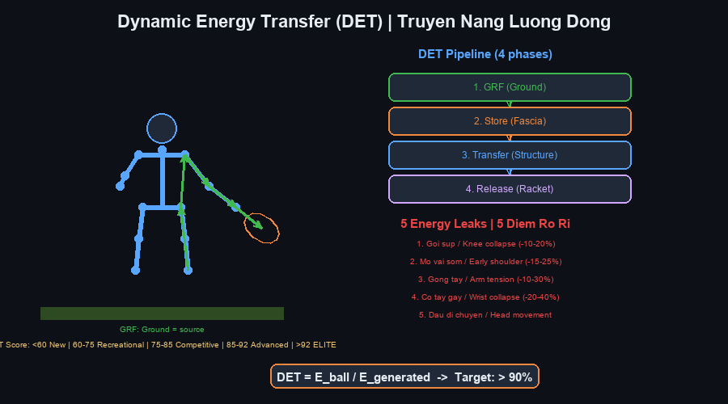
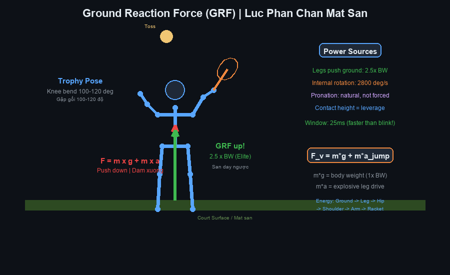
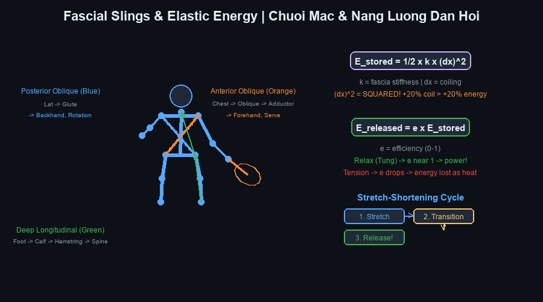
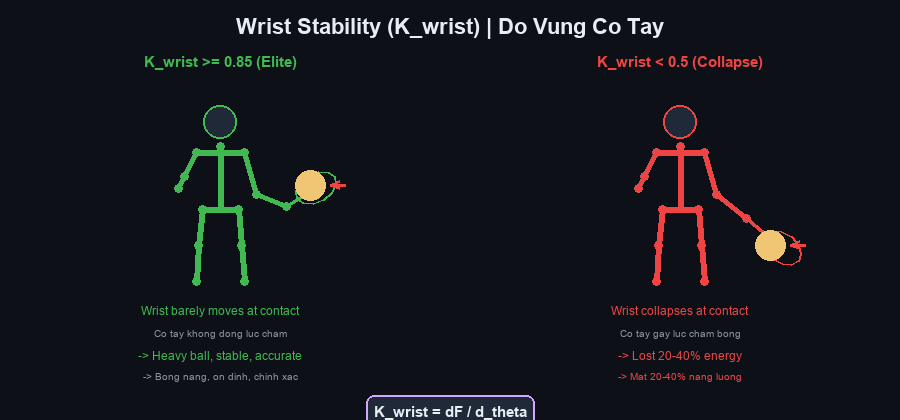
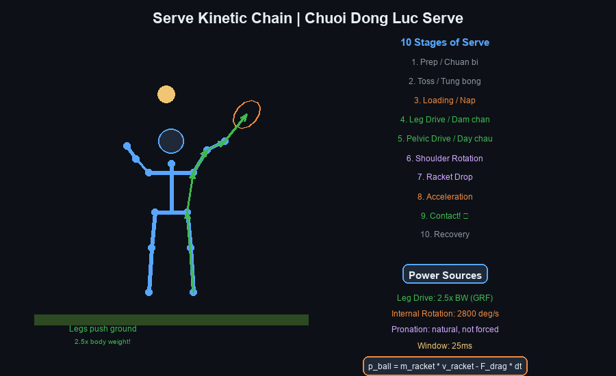
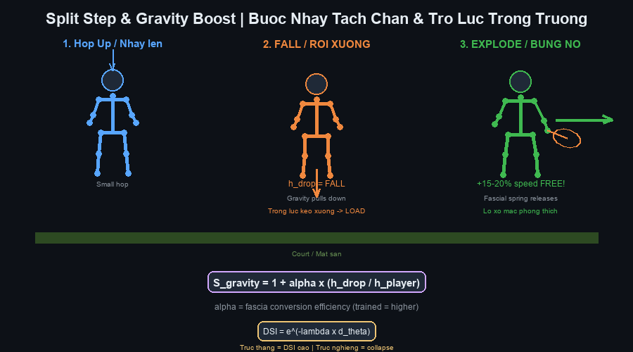
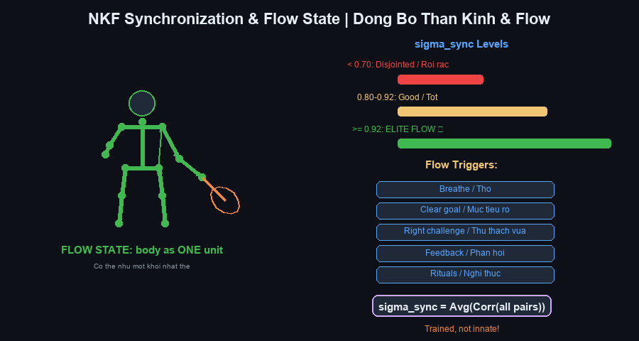

# Cẩm Nang Tennis Future Lab — Expanded Deep-Dive Edition

# Tennis Future Lab Master Handbook — Comprehensive with YouTube Videos + Illustrations

**Tác giả / Author:** Henry Pham (Phạm Đức Hải) & Tennis Future Lab
**Ngày / Date:** June 2026
**Phiên bản / Version:** 2.0 — Expanded Deep-Dive Edition with 12 Illustrated Diagrams
**Nguồn / Sources:** ChatGPT 24-chapter framework + Gemini 12 biomechanics equations + 87 YouTube videos + Technical Manual Generator skill

---

## 📋 BẢN ĐỒ TÀI LIỆU / DOCUMENT MAP

---

## MỤC LỤC / TABLE OF CONTENTS

| Phần / Part | Chương / Chapter | Illustrations | Videos |
|---|---|---|---|
| I — Triết Lý / Philosophy | Ch 1–5: New Paradigm, Kinetic Wave, DET, GRF, Structure | 4 diagrams | 18 videos |
| II — Sinh Cơ Học / Biomechanics | Ch 6–10: Kinetic Whip, Pelvic Snap, Timing, Wave, Proprioception | 3 diagrams | 14 videos |
| III — Fascia & Kình / Fascia | Ch 11–12: Fascial System, Elastic Energy, Jin | 2 diagrams | 10 videos |
| IV — Forehand / Forehand | Ch 13–14: Forehand Mastery, Lag, Racket Head Speed | 1 diagram | 12 videos |
| V — Backhand / Backhand | Ch 15: One-Handed Backhand | 1 diagram | 5 videos |
| VI — Serve / Serve | Ch 16–17: Serve Architecture, Vertical Explosion, Pronation | 1 diagram | 16 videos |
| VII — Volley / Volley | Ch 18: Volley Mechanics | — | 4 videos |
| VIII — Footwork / Footwork | Ch 19: Split Step, Movement, Gravity Boost | 1 diagram | 4 videos |
| IX — Neuro & Flow / Neuro | Ch 20: NKF Synchronization, Flow State | 1 diagram | 3 videos |
| Equations | 12 Biomechanics Equations | — | — |
| Video Master List | All 87 videos with URLs | — | 87 videos |
| Cheat Sheet | Printable summary | — | — |

---

* * *

# PHẦN I — TRIẾT LÝ TENNIS THẾ HỆ MỚI

# PART I — NEW PARADIGM TENNIS PHILOSOPHY

---

# Chapter 1 — From Old Paradigm to New Paradigm

## 1.1 Core Teaching / Giáo Trình Cốt Lõi

## 1.2 The Four Pillars / Bốn Trụ Cột

## 1.3 For 50+ Players / Dành cho người 50+

## 1.4 Deep-Dive Drill / Bài Tập Deep-Dive

| Drill | What It Does | How To Do It | Reps |
|---|---|---|---|
| **Ground Pressure Awareness** | Feel GRF before swing | Stand in forehand stance. Press feet into ground. Hold 5 sec. Shadow swing. | 3×20 |
| **Energy Leak Audit** | Find where you lose power | Record 20 forehands at 240fps. Check: knee collapse? early shoulder? arm tension? wrist flip? head movement? | 1 set |
| **Effortless Rally** | Experience high DET | Rally at 60% speed. Focus on relaxation. Notice: less effort = same or more ball speed. | 10 min |

### 🎥 YouTube Videos for This Chapter

| # | Video Title | URL | Why Watch |
|---|---|---|---|
| 1 | The Secret of Effortless Power in Tennis | https://www.youtube.com/watch?v=wosF0qTCVZ0 | Core concept: why Federer looks effortless |
| 2 | 5 Steps to Effortless Power! | https://www.youtube.com/watch?v=9NGDHfUQYcQ | Practical steps to shift from arm to body power |
| 3 | Get Forehand Power WITHOUT Swinging Harder | https://www.youtube.com/watch?v=xwFVcyt8P_M | The efficiency formula in action |
| 4 | Effortless Forehand Power: Relax, Don't Force | https://www.youtube.com/watch?v=h4wBj8mkW88 | Relaxation as the key to power |

### 📋 Chapter 1 Card

```
╔═══════════════════════════════════════════════════════════╗
║  CHAPTER 1 — NEW PARADIGM / TƯ DUY MỚI                    ║
╠═══════════════════════════════════════════════════════════╣
║  🎯 ONE BIG IDEA:                                         ║
║  Power = transfer efficiency, NOT muscle force.            ║
║  Sức mạnh = hiệu suất truyền lực, KHÔNG phải sức cơ bắp.  ║
║                                                            ║
║  KEY CUES:                                                 ║
║  • "Feel the ground" / "Cảm nhận mặt sân"                  ║
║  • "Relax to accelerate" / "Thả lỏng để tăng tốc"          ║
║  • "Less effort, more result" / "Ít sức, nhiều kết quả"   ║
║                                                            ║
║  ⚠️ TOP MISTAKE:                                          ║
║  Swinging harder when you should transfer better.          ║
║  Vung mạnh hơn khi cần truyền tốt hơn.                     ║
║                                                            ║
║  💭 MASTER CUE:                                            ║
║  "The ground is your engine" / "Mặt sân là động cơ"       ║
╚═══════════════════════════════════════════════════════════╝
```

---

# Chapter 2 — Kinetic Chain or Kinetic Wave?

## 2.1 Core Teaching / Giáo Trình Cốt Lõi

## 2.2 Illustration / Sơ Đồ Minh Họa


## 2.3 Why Fascia Matters / Vì Sao Hệ Mạc Quan Trọng

## 2.4 Deep-Dive Drill / Bài Tập Deep-Dive

| Drill | What It Does | How To Do It | Reps |
|---|---|---|---|
| **Towel Whip** | Feel the whip mechanism | Use a long towel. Swing like forehand. Create a "snap" sound at the end. Focus: the snap comes from body rotation, not arm force. | 3×30 |
| **Rope Wave** | Visualize wave propagation | Use a battle rope. Create waves from your feet (not arms). Watch the wave travel down the rope. | 3×20 |
| **Shadow Wave Swing** | Internalize the wave | No racket. Rotate hips gently. Let arms hang completely loose. Feel: arms are pulled by torso, not pushed by muscle. | 100 reps |
| **Closed-Eyes Wave Perception** | Build proprioception of the wave | Shadow swing with eyes closed. Track where you feel the energy travel: feet → legs → hips → torso → shoulder → arm → hand. | 30 reps |

### 🎥 YouTube Videos for This Chapter

| # | Video Title | URL | Why Watch |
|---|---|---|---|
| 5 | Understand the Kinetic Chain from Rick Macci | https://www.youtube.com/watch?v=rtPri1J_5Q8 | Top coach explains kinetic chain simply |
| 6 | How to Perform Kinetic Chain on the Forehand | https://www.youtube.com/watch?v=LbFEmpfYMhA | Practical forehand kinetic chain drill |
| 7 | Every Player Needs to Understand the Kinetic Chain | https://www.youtube.com/watch?v=XEAHCYfbv-k | Rick Macci on why chain matters for ALL levels |
| 8 | Top to Bottom Kinetic Chain — Forehand Tutorial | https://www.youtube.com/watch?v=t9cN78hePa8 | Step-by-step chain breakdown |
| 9 | Understanding the Kinetic Whip in Tennis | https://www.youtube.com/watch?v=EpTQ04fm3ps | The whip concept explained |
| 10 | The Service Kinetic Flow Explained | https://www.youtube.com/watch?v=X9w2HwSAIsk | Kinetic wave in the serve |
| 11 | Whip It — The Forehand Whip Motion | https://www.youtube.com/watch?v=vX5MjNKKhMI | Whip mechanics for forehand |
| 12 | Kinetic Whip Part 1 — Movement Map Lesson | https://www.youtube.com/watch?v=bprD3malRtE | Movement mapping for whip |

### 📋 Chapter 2 Card

```
╔═══════════════════════════════════════════════════════════╗
║  CHAPTER 2 — KINETIC WAVE / SÓNG ĐỘNG LỰC                 ║
╠═══════════════════════════════════════════════════════════╣
║  🎯 ONE BIG IDEA:                                         ║
║  Your body is a whip, not a hammer.                        ║
║  Cơ thể là chiếc roi, không phải búa.                      ║
║                                                            ║
║  KEY CUES:                                                 ║
║  • "Hips lead, arm follows" / "Hông dẫn, tay theo"        ║
║  • "Let the wave travel" / "Để sóng tự đi"               ║
║  • "Relax the arm to whip" / "Thả lỏng tay để roi vút"   ║
║                                                            ║
║  ⚠️ TOP MISTAKE:                                          ║
║  Stiffening the arm blocks the wave.                       ║
║  Gồng tay chặn dòng sóng.                                  ║
║                                                            ║
║  💭 MASTER CUE:                                            ║
║  "Be the whip" / "Hãy là chiếc roi"                       ║
╚═══════════════════════════════════════════════════════════╝
```

---

# Chapter 3 — Dynamic Energy Transfer (DET)

## 3.1 Core Teaching / Giáo Trình Cốt Lõi

## 3.2 Illustration / Sơ Đồ Minh Họa



## 3.3 The Five Energy Leaks / Năm Điểm Rò Rỉ

| Leak | What Happens | Energy Lost | Fix |
|---|---|---|---|
| **1. Knee Collapse** | Knee caves inward on loading | −10 to 20% | Strengthen glute med; conscious knee tracking |
| **2. Early Shoulder Opening** | Shoulders rotate before hips | −15 to 25% | Hip initiation drill; separation hold |
| **3. Arm Tension** | Biceps/triceps contract during swing | −10 to 30% | Towel whip drill; shadow swing with relaxed arm |
| **4. Wrist Collapse** | Wrist flips at contact (K_wrist < 0.5) | −20 to 40% | Contact freeze drill; grip pressure ladder |
| **5. Head Movement** | Head bobs during swing | Variable (destabilizes vestibular system) | Stable head shadow drill; phone recording check |

## 3.4 DET Score Assessment / Đánh Giá DET

| Score | Level | What It Means |
|---|---|---|
| < 60 | Beginner | Most energy wasted — arm-only hitting |
| 60-75 | Recreational | Some chain working but major leaks |
| 75-85 | Competitive | Good structure, minor leaks |
| 85-92 | Advanced | Nearly elite transfer efficiency |
| > 92 | Elite | Near-complete energy transfer — "effortless" |

## 3.5 Case Study: Roger Federer / Nghiên Cứu Federer

## 3.6 The Simplified DET Equation (from Gemini analysis)

## 3.7 Deep-Dive Drill / Bài Tập Deep-Dive

| Drill | What It Does | How To Do It | Reps |
|---|---|---|---|
| **Pressure Foot Drill** | Feel GRF as the energy source | Stand in forehand stance. Press foot into ground. Hold 3 sec. Shadow swing focusing on the push. | 3×20 |
| **Hip-Shoulder Separation** | Build X-Factor elastic energy | Hold hips facing net. Rotate shoulders back. Hold 2 sec. Return. | 20 reps |
| **Stable Head Drill** | Eliminate head movement leak | Record 20 forehands at 240fps. Watch your head. Target: minimal movement. | 1 set |
| **Contact Freeze** | Verify wrist stability at contact | Hit ball. Freeze at contact position for 2 sec. Check: is wrist stable? Is racket face square? | 50 balls |

### 🎥 YouTube Videos for This Chapter

| # | Video Title | URL | Why Watch |
|---|---|---|---|
| 13 | Understand the Kinetic Chain — Rick Macci | https://www.youtube.com/watch?v=rtPri1J_5Q8 | DET in plain language |
| 14 | How to Perform Kinetic Chain on the Forehand | https://www.youtube.com/watch?v=LbFEmpfYMhA | DET applied to forehand |
| 15 | Effortless Forehand Power: Relax, Don't Force | https://www.youtube.com/watch?v=h4wBj8mkW88 | High DET = low effort |

### 📋 Chapter 3 Card

```
╔═══════════════════════════════════════════════════════════╗
║  CHAPTER 3 — DET / TRUYỀN NĂNG LƯỢNG ĐỘNG                ║
╠═══════════════════════════════════════════════════════════╣
║  🎯 ONE BIG IDEA:                                         ║
║  Power = what reaches the ball, not what you generate.     ║
║  Sức mạnh = cái đến bóng, không phải cái bạn tạo ra.       ║
║                                                            ║
║  KEY CUES:                                                 ║
║  • "Plug the leaks" / "Bịt lỗ rò rỉ"                     ║
║  • "Lock the wrist at contact" / "Khóa cổ tay lúc tiếp xúc"║
║  • "Stable head = stable energy" / "Đầu ổn = lực ổn"     ║
║                                                            ║
║  ⚠️ TOP MISTAKE:                                          ║
║  Wrist collapse at contact loses 20-40% energy.            ║
║  Cổ tay gãy lúc tiếp xúc mất 20-40% năng lượng.            ║
║                                                            ║
║  💭 MASTER CUE:                                            ║
║  "Transfer, don't generate" / "Truyền, đừng tạo"          ║
╚═══════════════════════════════════════════════════════════╝
```

---

# Chapter 4 — Ground Reaction Force (GRF)

## 4.1 Core Teaching / Giáo Trình Cốt Lõi

## 4.2 Illustration / Sơ Đồ Minh Họa



## 4.3 The GRF Equation (from Gemini analysis)

## 4.4 Force Vectors in Different Strokes / Vector Lực Trong Các Cú Đánh

| Stroke | Primary Force Vector | Secondary | How to Feel It |
|---|---|---|---|
| **Serve** | Vertical (upward) | Rotational | "Push the earth away" |
| **Forehand (open stance)** | Rotational | Vertical | "Spin on the outside leg" |
| **Forehand (neutral)** | Horizontal (forward) | Rotational | "Step into the ball" |
| **1HB Backhand** | Rotational | Horizontal | "Plant the front foot, rotate" |
| **Volley** | Horizontal (minimal) | — | "Feet set, block the ball" |

## 4.5 Foot Loading Patterns / Mẫu Tải Trọng Bàn Chân

## 4.6 Deep-Dive Drill / Bài Tập Deep-Dive

| Drill | What It Does | How To Do It | Reps |
|---|---|---|---|
| **Ground Pressure Awareness** | Feel GRF before swing | Stand in forehand stance. Press foot into court. Hold 5 sec. Feel the ground pushing back. Then shadow swing. | 3×20 |
| **Triple Extension Drill** | Build the explosive mechanism | Lower center. Extend ankle + knee + hip simultaneously. Rise onto toes. | 3×15 |
| **Medicine Ball Throw** | Feel rotational GRF | Rotate torso. Push off ground. Throw medicine ball. Focus: power starts from feet, not arms. | 3×10 |
| **Split-Step GRF** | Build explosive first step | Split step. Land. Immediately push laterally left or right. Focus: the push comes from ground reaction. | 3×20 |
| **Serve Leg Drive** | Build serve-specific GRF | Trophy position hold. Then explode upward. Focus: legs push ground, body rises. | 3×20 |

## 4.7 Video Assessment / Đánh Giá Qua Video

| Good Signs ✅ | Bad Signs ❌ |
|---|---|
| Lower center before hitting | Standing tall, no knee bend |
| Heel pushes strongly off court | Flat-footed, no push |
| Hips accelerate AFTER foot push | Hips rotate before foot push |
| Body rises naturally after contact | No vertical component |
| Arm relaxed during acceleration | Arm tense, "hitting" with muscle |

### 🎥 YouTube Videos for This Chapter

| # | Video Title | URL | Why Watch |
|---|---|---|---|
| 16 | Ground Reaction Force In Tennis Demo #1 | https://www.youtube.com/watch?v=cPKUosWplHw | GRF demonstrated on court |
| 17 | Hit Like a Heavyweight — GRF for More Power | https://www.youtube.com/watch?v=LIKPQn_KgwA | GRF = punching power in tennis |
| 18 | Ground Reaction Force Demo #2 — The Tennis Throw | https://www.youtube.com/watch?v=5fLpQawNOHU | GRF in medicine ball throw |

### 📋 Chapter 4 Card

```
╔═══════════════════════════════════════════════════════════╗
║  CHAPTER 4 — GRF / LỰC PHẢN CHẤN MẶT SÂN                ║
╠═══════════════════════════════════════════════════════════╣
║  🎯 ONE BIG IDEA:                                         ║
║  The ground is your power source. Push it, don't pull it.  ║
║  Mặt sân là nguồn lực. Đạp xuống, đừng kéo tay.           ║
║                                                            ║
║  KEY CUES:                                                 ║
║  • "Load the legs first" / "Nạp chân trước"              ║
║  • "Push the earth away" / "Đẩy sân ra xa"               ║
║  • "Feel the ground push back" / "Cảm sân đẩy ngược"     ║
║                                                            ║
║  ⚠️ TOP MISTAKE:                                          ║
║  Standing tall, not bending knees = zero GRF.              ║
║  Đứng thẳng, không gập gối = GRF bằng không.               ║
║                                                            ║
║  💭 MASTER CUE:                                            ║
║  "Ground up, not arm out" / "Từ đất lên, không từ tay ra" ║
╚═══════════════════════════════════════════════════════════╝
```

---

# Chapter 5 — Structural Integrity

## 5.1 Core Teaching / Giáo Trình Cốt Lõi

## 5.2 Illustration / Sơ Đồ Minh Họa


## 5.3 Six Structural Leaks / Sáu Điểm Rò Rỉ Cấu Trúc

| Leak | What Happens | Fix |
|---|---|---|
| **1. Head Bobbing** | Head moves during swing | Stable head shadow drill; record and check |
| **2. Collapsed Knee** | Knee caves inward | Glute med strengthening; knee tracking awareness |
| **3. Pelvic Tilt Loss** | Pelvis tilts or rotates uncontrolled | Core stability; pelvic floor engagement |
| **4. Rounded Spine** | Upper back rounds forward | "Long spine" cue; wall alignment drill |
| **5. Scapular Collapse** | Shoulder blade loses position | Scapular strengthening; "shoulder back" cue |
| **6. Wrist Collapse** | Wrist flips at contact (K_wrist < 0.5) | Contact freeze; grip pressure ladder |

## 5.4 Deep-Dive Drill / Bài Tập Deep-Dive

| Drill | What It Does | How To Do It | Reps |
|---|---|---|---|
| **Wall Alignment** | Feel correct structural alignment | Stand against wall: heels, buttocks, shoulders, head all touching. Hold 60 sec. Feel the "stack." | 2 sets |
| **Single Leg Balance** | Build dynamic stability core | Stand on one leg. 30-60 sec each. Progress: eyes closed, then on unstable surface. | 3× each leg |
| **Head Stability Shadow Swing** | Eliminate head movement | Shadow forehand. Keep head nearly motionless. 50 reps. Then record and verify. | 50 reps |
| **Split-Step Hold** | Check structural alignment after split | Split step. Hold 2 sec. Check: head stable? Hips aligned? Knees tracking? | 30 reps |
| **Medicine Ball Rotation** | Build stable rotational structure | Rotate torso with medicine ball. Keep central axis stable. Feel: rotate around the spine, not with it. | 3×12 |

### 🎥 YouTube Videos for This Chapter

| # | Video Title | URL | Why Watch |
|---|---|---|---|
| 19 | The Physics, Geometry, and Biomechanics of Power Development | https://www.youtube.com/watch?v=KU7FHy1qQOI | Structure and geometry of power |

### 📋 Chapter 5 Card

```
╔═══════════════════════════════════════════════════════════╗
║  CHAPTER 5 — STRUCTURAL INTEGRITY / TOÀN VẸN CẤU TRÚC    ║
╠═══════════════════════════════════════════════════════════╣
║  🎯 ONE BIG IDEA:                                         ║
║  Structure is the pipe. Power is the water.               ║
║  Cấu trúc là ống. Sức mạnh là nước.                       ║
║                                                            ║
║  KEY CUES:                                                 ║
║  • "Still head, moving body" / "Đầu tĩnh, người động"    ║
║  • "Long spine" / "Cột sống dài"                          ║
║  • "Stable base" / "Nền vững"                             ║
║                                                            ║
║  ⚠️ TOP MISTAKE:                                          ║
║  Head bobbing wastes neural resources.                     ║
║  Đầu lắc tốn tài nguyên thần kinh.                        ║
║                                                            ║
║  💭 MASTER CUE:                                            ║
║  "Still head, heavy ball" / "Đầu tĩnh, bóng nặng"        ║
╚═══════════════════════════════════════════════════════════╝
```

---

* * *

# PHẦN II — SINH CƠ HỌC HIỆN ĐẠI

# PART II — MODERN BIOMECHANICS

---

# Chapter 6 — Kinetic Whip Architecture

## 6.1 Core Teaching / Giáo Trình Cốt Lõi

## 6.2 Illustration / Sơ Đồ Minh Họa


## 6.3 The Whip Equation (from Gemini analysis)

## 6.4 The Six Common Mistakes / Sáu Lỗi Phổ Biến

| # | Mistake | Why It Fails | Fix |
|---|---|---|---|
| 1 | Hitting with the arm | Arm = small muscle, can't generate 5000°/s | Use ground + hips; arm follows |
| 2 | Holding lag with muscle | Tension kills acceleration | Relax; let lag happen |
| 3 | Rotating shoulders too early | Breaks sequential timing | Hip initiation drill |
| 4 | Glocking the wrist | Kills whip mechanism | Towel whip; shadow relaxed |
| 5 | Not using legs | No GRF = no energy source | Ground pressure drill |
| 6 | Stiffening entire body | No wave can travel through rigid material | Selective tension practice |

## 6.5 Deep-Dive Drill / Bài Tập Deep-Dive

| Drill | What It Does | How To Do It | Reps |
|---|---|---|---|
| **Towel Whip** | Feel the whip snap | Use a long towel. Swing like forehand. Goal: hear a "snap" at the end. The snap comes from body rotation, not arm force. | 3×30 |
| **Rope Swing** | Visualize wave propagation | Use a soft rope. Create waves from your feet. Watch the rope tip accelerate. | 3×20 |
| **Lag Awareness** | Feel lag as a result, not technique | Shadow swing slowly. Completely relax wrist. Feel the racket head trailing behind your hand. | 50 reps |
| **Medicine Ball Throw** | Build sequential acceleration | Rotate hips. Throw medicine ball. Rule: hips start the throw, not arms. | 3×10 |
| **Continuous Forehand** | Build wave rhythm | Hit 20 balls continuously. Goal: each shot flows into the next with consistent rhythm, like a wave. | 3 sets |

### 🎥 YouTube Videos for This Chapter

| # | Video Title | URL | Why Watch |
|---|---|---|---|
| 20 | Understanding the Kinetic Whip in Tennis | https://www.youtube.com/watch?v=EpTQ04fm3ps | Core whip concept |
| 21 | Whip It — The Forehand Whip Motion | https://www.youtube.com/watch?v=vX5MjNKKhMI | Forehand whip visualization |
| 22 | Kinetic Whip Part 1 — Movement Map Lesson | https://www.youtube.com/watch?v=bprD3malRtE | Whip as movement pattern |
| 23 | The Science Behind Roger Federer's Effortless Forehand | https://www.youtube.com/watch?v=dQ1STaobbMM | Federer's whip analyzed scientifically |
| 24 | Tennis Forehand Wrist Lag — Simple Trick | https://www.youtube.com/watch?v=5_vJU8XJOTs | Lag as natural result |
| 25 | Why Your Forehand Doesn't Lag | https://www.youtube.com/watch?v=Bun_Ouz5-bs | Common lag mistakes |

### 📋 Chapter 6 Card

```
╔═══════════════════════════════════════════════════════════╗
║  CHAPTER 6 — KINETIC WHIP / ROI ĐỘNG LỰC                 ║
╠═══════════════════════════════════════════════════════════╣
║  🎯 ONE BIG IDEA:                                         ║
║  The racket head is amplified, not pulled.                 ║
║  Đầu vợt bị khuếch đại, không bị kéo.                     ║
║                                                            ║
║  KEY CUES:                                                 ║
║  • "Relax to whip" / "Thả lỏng để vút"                   ║
║  • "Lag happens, don't force it" / "Lag tự xảy ra"       ║
║  • "Soft arm, solid core" / "Tay mềm, lõi chắc"          ║
║                                                            ║
║  ⚠️ TOP MISTAKE:                                          ║
║  Trying to "create lag" with wrist force.                 ║
║  Cố "tạo lag" bằng lực cổ tay.                             ║
║                                                            ║
║  💭 MASTER CUE:                                            ║
║  "Let it lag" / "Để nó tụt"                               ║
╚═══════════════════════════════════════════════════════════╝
```

---

# Chapter 7 — Pelvic Snap Mechanics

## 7.1 Core Teaching / Giáo Trình Cốt Lõi

## 7.2 Illustration / Sơ Đồ Minh Họa


## 7.3 The X-Factor Equation

## 7.4 Pelvic Snap in Different Strokes / Pelvic Snap Trong Các Cú Đánh

| Stroke | Pelvis Role | Common Error |
|---|---|---|
| **Forehand** | Pelvis starts 20-50ms before shoulders. Acceleration, not just rotation. | Shoulders open first = lost X-Factor |
| **1HB Backhand** | Pelvis opens before shoulders. Critical for power. | Opening shoulders first = weak ball + elbow strain |
| **Serve** | Pelvis drives upward and forward before torso rotation. | "Arming" the serve = no leg/pelvis drive |

## 7.5 Six Common Errors / Sáu Lỗi Phổ Biến

| # | Error | Consequence | Fix |
|---|---|---|---|
| 1 | Using shoulders before hips | Lost torque, arm hitting | Hip initiation drill |
| 2 | Standing too tall | No loading, no snap | Lower center, load legs |
| 3 | Not loading feet | No GRF to amplify | Ground pressure drill |
| 4 | Opening hips too early | Lost separation | Separation hold drill |
| 5 | Constantly flexing abs | Blocks fascial recoil | Core = stable, not rigid |
| 6 | Trying to "rotate harder" | Tension kills acceleration | Focus on speed, not force |

## 7.6 Deep-Dive Drill / Bài Tập Deep-Dive

| Drill | What It Does | How To Do It | Reps |
|---|---|---|---|
| **Hip Initiation Drill** | Train hips-first sequencing | Unit turn. Rotate ONLY hips. Keep shoulders still. Then let shoulders follow. | 30 reps |
| **Medicine Ball Hip Throw** | Build explosive pelvis | Load outside leg. Hips lead. Throw medicine ball. Focus: hips start, arms follow. | 3×10 |
| **Separation Hold** | Build X-Factor stretch | Rotate shoulders back. Hold hips forward. Hold 3 sec. Feel the fascial stretch in the obliques. | 20 reps |
| **Shadow Forehand Snap** | Internalize pelvic snap | Loading phase. Then: pelvis fires first. Shoulders follow. Arm trails. Focus on the SEQUENCE. | 50 reps |
| **Serve Pelvis Drive** | Build serve pelvic drive | Trophy position. Push pelvis upward FIRST. Then arm accelerates. Focus: pelvis leads. | 30 reps |

### 🎥 YouTube Videos for This Chapter

| # | Video Title | URL | Why Watch |
|---|---|---|---|
| 26 | Why HIPS and SHOULDERS SEPARATION is CRUCIAL in Tennis | https://www.youtube.com/watch?v=gLs08_wGBb4 | X-Factor explained clearly |
| 27 | How to Develop Power Through Hip Shoulder Separation | https://www.youtube.com/watch?v=-V9fRDexnPM | Modern forehand separation drill |
| 28 | The REAL Way To Turn Your Hips On Your Forehand | https://www.youtube.com/watch?v=QOyX6JiCXDs | Pro technique for hip activation |
| 29 | How To Get Power From Your Hips In Tennis | https://www.youtube.com/watch?v=c9glLgadcas | Hip power basics |
| 30 | How to Get Your Hips Working on Your Forehand | https://www.youtube.com/watch?v=V26ifGuICIE | Practical hip drill |
| 31 | Serving Tip — How to Rotate the Hips | https://www.youtube.com/watch?v=do-ULi22fkE | Hip rotation in the serve |
| 32 | Achieve Stronger Shots With Proper Hip Rotation | https://www.youtube.com/watch?v=ee9Vi4Ghmao | Hip rotation for all strokes |

### 📋 Chapter 7 Card

```
╔═══════════════════════════════════════════════════════════╗
║  CHAPTER 7 — PELVIC SNAP / BẬT HÔNG                       ║
╠═══════════════════════════════════════════════════════════╣
║  🎯 ONE BIG IDEA:                                         ║
║  Hips lead. Shoulders follow. Always.                      ║
║  Hông dẫn. Vai theo. Luôn luôn.                            ║
║                                                            ║
║  KEY CUES:                                                 ║
║  • "Hips fire first" / "Hông nổ trước"                   ║
║  • "Feel the X-Factor stretch" / "Cảm độ vặn X-Factor"   ║
║  • "Snap, don't rotate slowly" / "Bật, không xoay chậm"  ║
║                                                            ║
║  ⚠️ TOP MISTAKE:                                          ║
║  Shoulders opening before hips = lost torque.              ║
║  Vai mở trước hông = mất mô-men xoắn.                      ║
║                                                            ║
║  💭 MASTER CUE:                                            ║
║  "Hips first, always" / "Hông trước, luôn luôn"          ║
╚═══════════════════════════════════════════════════════════╝
```

---

# Chapter 8 — Neuro-Mechanical Timing

## 8.1 Core Teaching / Giáo Trình Cốt Lõi

## 8.2 The Neural Delay Equation (from Gemini analysis)

## 8.3 Timing Windows / Cửa Sổ Thời Điểm

| Stroke | Timing Window | If Early | If Late |
|---|---|---|---|
| **Forehand** | ~50-100ms before contact | Ball goes long (face too open) | Ball goes short or into net |
| **Serve** | Contact at peak of jump | Ball goes into net | Ball goes long |
| **Volley** | ~30-50ms before racket meets ball | Ball flies long | Ball drops short |
| **Return** | Start split-step as server contacts | Too early = wrong read | Too late = no time to prepare |

## 8.4 Deep-Dive Drill / Bài Tập Deep-Dive

| Drill | What It Does | How To Do It | Reps |
|---|---|---|---|
| **Bounce-Hit Timing** | Sync rhythm with the ball | Say "Bounce" when ball bounces. Say "Hit" when you contact. This builds internal rhythm. | 50 balls |
| **Shadow Swing Eyes Closed** | Build proprioception | Close eyes. Shadow swing. Feel where the racket is without looking. | 30 reps |
| **Catch and Throw** | Build fast neural pathways | Partner throws ball. Catch with one hand. Immediately throw back. Reduces reaction time. | 3×20 |
| **Quiet Eye Drill** | Train gaze stability | Hit 50 balls. After each contact, hold gaze at contact point for 100-200ms longer than feels natural. | 50 balls |
| **Anticipation Reading** | Build feedforward prediction | Watch match videos. Pause BEFORE opponent contacts ball. Predict: where does the ball go? Check your prediction. | 20 clips |

### 🎥 YouTube Videos for This Chapter

| # | Video Title | URL | Why Watch |
|---|---|---|---|
| 33 | How to Find the Flow State In Tennis | https://www.youtube.com/watch?v=1bosoxYAPuU | Flow = perfect neuro-mechanical timing |
| 34 | The Psychology Behind 'Locking In' — Flow State in Tennis | https://www.youtube.com/watch?v=8ePjJCxKYsg | Neural timing under pressure |

### 📋 Chapter 8 Card

```
╔═══════════════════════════════════════════════════════════╗
║  CHAPTER 8 — NEURO-TIMING / THỜI ĐIỂM THẦN KINH          ║
╠═══════════════════════════════════════════════════════════╣
║  🎯 ONE BIG IDEA:                                         ║
║  Anticipation beats reaction every time.                  ║
║  Dự đoán luôn thắng phản ứng.                              ║
║                                                            ║
║  KEY CUES:                                                 ║
║  • "Read the opponent, not the ball" / "Đọc đối thủ"     ║
║  • "Quiet eye at contact" / "Mắt tĩnh lúc tiếp xúc"      ║
║  • "Start before you think you should" / "Bắt đầu sớm"   ║
║                                                            ║
║  ⚠️ TOP MISTAKE:                                          ║
║  Waiting to see the ball before moving.                    ║
║  Chờ thấy bóng mới di chuyển.                              ║
║                                                            ║
║  💭 MASTER CUE:                                            ║
║  "Predict, don't wait" / "Dự đoán, đừng chờ"             ║
╚═══════════════════════════════════════════════════════════╝
```

---

# Chapter 9 — Wave Propagation Model

## 9.1 Core Teaching / Giáo Trình Cốt Lõi

## 9.2 The Wave Propagation in Different Strokes / Truyền Sóng Trong Các Cú Đánh

| Stroke | Wave Path | Critical Node | Critical Antinode |
|---|---|---|---|
| **Forehand** | Foot → Pelvis → Torso → Shoulder → Arm → Racket | Pelvis (must be stable to transmit) | Racket head (must be free to accelerate) |
| **1HB Backhand** | Foot → Pelvis → Torso → Scapula → Arm → Racket | Scapula (must be controlled to transmit) | Full arm extension |
| **Serve** | Foot → Leg → Pelvis → Spine → Shoulder → Arm → Racket | Central axis (spine must be stable) | Racket head at contact |
| **Volley** | Foot → Leg → Torso → Arm → Racket (short chain) | Wrist (K_wrist ≥ 0.95) | Racket face angle |

## 9.3 Deep-Dive Drill / Bài Tập Deep-Dive

| Drill | What It Does | How To Do It | Reps |
|---|---|---|---|
| **Rope Wave Drill** | Visualize wave propagation | Use a long rope. Create waves from feet. Watch the wave travel and amplify at the tip. | 50 reps |
| **Wave Shadow Swing** | Internalize wave feeling | Transfer force from feet. Feel the wave travel up through pelvis, torso, shoulder, arm, racket. | 100 reps |
| **Medicine Ball Wave Throw** | Build wave in a dynamic action | Create force from ground. Throw medicine ball following the full wave sequence: feet → hips → torso → arm. | 3×10 |
| **Relaxed Rally** | Experience wave resonance | Rally at 60% speed. Focus on the FLOW of energy through your body, not on hitting hard. | 10 min |
| **Closed-Eyes Wave Perception** | Deepen proprioception of the wave | Shadow swing with eyes closed. Track where you feel energy: feet → legs → hips → torso → shoulder → arm → hand. | 30 reps |

### 🎥 YouTube Videos for This Chapter

| # | Video Title | URL | Why Watch |
|---|---|---|---|
| 35 | The Physics, Geometry, and Biomechanics of Power Development | https://www.youtube.com/watch?v=KU7FHy1qQOI | Wave/geometry of power |
| 36 | The Stretch-Shortening Cycle in the Forehand | https://www.youtube.com/watch?v=lybNSHpbcsU | SSC = wave loading and release |
| 37 | How to Use the Stretch-Shortening Cycle of the Backhand | https://www.youtube.com/watch?v=LUl5-O6Vkts | SSC wave in backhand |

### 📋 Chapter 9 Card

```
╔═══════════════════════════════════════════════════════════╗
║  CHAPTER 9 — WAVE PROPAGATION / TRUYỀN SÓNG SINH HỌC    ║
╠═══════════════════════════════════════════════════════════╣
║  🎯 ONE BIG IDEA:                                         ║
║  Energy travels as waves, not just through joints.         ║
║  Năng lượng đi như sóng, không chỉ qua khớp.               ║
║                                                            ║
║  KEY CUES:                                                 ║
║  • "Stable nodes, free antinodes" / "Neo vững, đầu tự do" ║
║  • "Let the wave flow" / "Để sóng chảy"                  ║
║  • "Don't break the chain" / "Đừng đứt chuỗi"            ║
║                                                            ║
║  ⚠️ TOP MISTAKE:                                          ║
║  Muscle tension breaks the wave.                           ║
║  Gồng cơ làm đứt sóng.                                     ║
║                                                            ║
║  💭 MASTER CUE:                                            ║
║  "Be the wave" / "Hãy là sóng"                            ║
╚═══════════════════════════════════════════════════════════╝
```

---

# Chapter 10 — Proprioceptive Intelligence

## 10.1 Core Teaching / Giáo Trình Cốt Lõi

## 10.2 Contact Awareness / Nhận Thức Tiếp Xúc

## 10.3 The Proprioceptive Receptors / Các Receptor Proprioceptive

| Receptor | Location | What It Senses |
|---|---|---|
| **Muscle Spindle** | Inside muscles | Muscle length and stretch speed |
| **Golgi Tendon Organ** | In tendons | Tendon tension (force) |
| **Joint Receptors** | In joint capsules | Joint angle and pressure |
| **Fascial Receptors** | In fascia | Tension, vibration, deformation |
| **Merkel** | Hand skin | Static pressure, shape |
| **Meissner** | Hand skin | Light touch, vibration |
| **Pacinian** | Hand skin | High-frequency vibration |
| **Ruffini** | Hand skin | Skin stretch, movement |

## 10.4 Deep-Dive Drill / Bài Tập Deep-Dive

| Drill | What It Does | How To Do It | Reps |
|---|---|---|---|
| **Eyes Closed Shadow Swing** | Build racket schema | Close eyes. Shadow forehand. Feel the racket face angle, wrist position, arm angle — without looking. | 50 reps |
| **Grip Pressure Ladder** | Train grip awareness | Swing with grip 2/10 → 4/10 → 6/10 → 8/10. Compare the feel. Learn the difference between "too tight" and "just right." | 4 levels × 10 |
| **Sweet Spot Awareness** | Train contact quality | Hit balls slowly. Focus on the SOUND of contact. A clean sweet-spot hit sounds different (a "plink" not a "thwack"). | 50 balls |
| **Peripheral Vision Rally** | Build spatial awareness | Rally lightly. While tracking the ball, also maintain awareness of: opponent position, court geometry, open spaces. | 10 min |
| **Blind Catch Drill** | Build hand proprioception | Close eyes. Partner tosses ball from short distance. Catch with one hand. Feel the ball's position through hand proprioception. | 3×20 |

### 🎥 YouTube Videos for This Chapter

| # | Video Title | URL | Why Watch |
|---|---|---|---|
| 38 | Proprioception Drills — Fitness for Tennis | https://www.youtube.com/watch?v=8bEHoPHNRbE | Practical proprioception training |
| 39 | Periodization of Proprioceptive Balance Training | https://www.youtube.com/watch?v=mLzfEA3DtQ4 | Balance progression for tennis |
| 40 | Hungarian Tennis Federation: Proprioceptive Workout | https://www.youtube.com/watch?v=NUbvu7Q5GpE | Pro-level proprioception protocol |

### 📋 Chapter 10 Card

```
╔═══════════════════════════════════════════════════════════╗
║  CHAPTER 10 — PROPRIOCEPTION / TRÍ TUẺ CẢM NHẬN        ║
╠═══════════════════════════════════════════════════════════╣
║  🎯 ONE BIG IDEA:                                         ║
║  Feel the racket, don't think about it.                   ║
║  Cảm nhận vợt, đừng nghĩ về nó.                            ║
║                                                            ║
║  KEY CUES:                                                 ║
║  • "Feel the face" / "Cảm mặt vợt"                       ║
║  • "Grip 4/10, not 8/10" / "Grip 4/10, không 8/10"      ║
║  • "Know without looking" / "Biết không cần nhìn"        ║
║                                                            ║
║  ⚠️ TOP MISTAKE:                                          ║
║  Grip too tight = no feel = no control.                    ║
║  Grip quá chặt = không cảm = không kiểm soát.              ║
║                                                            ║
║  💭 MASTER CUE:                                            ║
║  "Feel, don't think" / "Cảm, đừng nghĩ"                  ║
╚═══════════════════════════════════════════════════════════╝
```

---

* * *

# PHẦN III — FASCIA, KÌNH & NĂNG LƯỢNG ĐÀN HỒI

# PART III — FASCIA, JIN & ELASTIC ENERGY

---

# Chapter 11 — Fascial System & Elastic Energy

## 11.1 Core Teaching / Giáo Trình Cốt Lõi

## 11.2 Illustration / Sơ Đồ Minh Họa



## 11.3 The Elastic Energy Equations (from Gemini analysis)

## 11.4 Stretch-Shortening Cycle (SSC) / Chu Kỳ Kéo Dãn-Co Rút

| Phase | What Happens | Tennis Example |
|---|---|---|
| **1. Stretch** | Fascia and tendons are pulled taut | Backswing: shoulders rotate past hips, fascia stretches |
| **2. Transition** | Brief pause at maximum stretch — energy stored | Top of backswing: X-Factor at peak, elastic energy maximized |
| **3. Shortening** | Stored energy releases explosively | Forward swing: fascia snaps back, accelerating the racket faster than muscle alone could |

## 11.5 Deep-Dive Drill / Bài Tập Deep-Dive

| Drill | What It Does | How To Do It | Reps |
|---|---|---|---|
| **Elastic Band Rotation** | Feel fascial loading and release | Attach resistance band to hip-height anchor. Rotate slowly away. Feel the stretch build. Release naturally — let the band pull you back. | 3×12 each side |
| **Coil and Release Shadow** | Build SSC in the swing | Slowly coil to maximum X-Factor. Pause 2 sec. Then release FAST — feel the snap. | 50 reps |
| **Medicine Ball Wave Throw** | Build elastic recoil power | Load. Coil. PAUSE. Then throw — feel the elastic snap accelerate the ball. | 3×10 |
| **Relaxed Rally** | Experience SSC in live hitting | Rally at 60%. Focus: coil, feel the stretch, then relax and let the snap happen. Don't add muscle force. | 10 min |
| **Fascial Stretch Routine** | Build fascial elasticity | Daily: cat-cow, thoracic rotations, hip flexor stretches, lat stretches. Hold each 30 sec. | Daily |

### 🎥 YouTube Videos for This Chapter

| # | Video Title | URL | Why Watch |
|---|---|---|---|
| 41 | Elastic Energy Fundamentals — Serve Course! | https://www.youtube.com/watch?v=a4MdqsI4LDM | Elastic energy in the serve |
| 42 | Unlock Elastic Power with This Fascia Exercise | https://www.youtube.com/watch?v=pB15_xIGXFc | Fascia-specific exercise for tennis |
| 43 | Fascia Biomechanics Lecture — Dr. McCullough | https://www.youtube.com/watch?v=HIuKREMD7wE | Fascia science lecture |
| 44 | The SSC — What Is It? 3 Phases & Factors | https://www.youtube.com/watch?v=oJkExwpyR84 | SSC fundamentals |
| 45 | Stretch Shortening Cycle Explained — Physiology | https://www.youtube.com/watch?v=iilyVw5uVXg | SSC physiology for athletes |
| 46 | Tennis Drill for EXPLOSIVE POWER! | https://www.youtube.com/watch?v=9peYw0vo5yM | Elastic power drill on court |

### 📋 Chapter 11 Card

```
╔═══════════════════════════════════════════════════════════╗
║  CHAPTER 11 — FASCIA & ELASTIC / MẠC & ĐÀN HỒI         ║
╠═══════════════════════════════════════════════════════════╣
║  🎯 ONE BIG IDEA:                                         ║
║  Your body is a spring, not a motor.                      ║
║  Cơ thể là lò xo, không phải động cơ.                     ║
║                                                            ║
║  KEY CUES:                                                 ║
║  • "Coil to load" / "Vặn để nạp"                         ║
║  • "Release, don't push" / "Nhả, đừng đẩy"              ║
║  • "Relax = efficient spring" / "Lỏng = lò xo hiệu quả"  ║
║                                                            ║
║  ⚠️ TOP MISTAKE:                                          ║
║  Muscle tension kills elastic recoil.                      ║
║  Gồng cơ giết đàn hồi.                                     ║
║                                                            ║
║  💭 MASTER CUE:                                            ║
║  "Be a spring" / "Hãy là lò xo"                           ║
╚═══════════════════════════════════════════════════════════╝
```

---

# Chapter 12 — Kình (勁) & Tai Chi Connection

## 12.1 Core Teaching / Giáo Trình Cốt Lõi

## 12.2 The Hán-Việt Glossary / Bảng Thuật Ngữ Hán-Việt

| Hán-Việt | Chữ Hán | Meaning in Tennis |
|---|---|---|
| **Kình (勁)** | 勁 | Organized force — force structured by body alignment and timing, not raw muscle |
| **Lực (力)** | 力 | Raw muscle force — unorganized, arm-only hitting |
| **Cấu (構)** | 構 | Structure — the body's mechanical alignment |
| **Trục (軸)** | 軸 | Axis — the central axis (spine-head-pelvis) |
| **Tụ lực (聚力)** | 聚力 | Force gathering — the loading phase (coil, store elastic energy) |
| **Khai (開)** | 開 | Opening — the release phase (snap, accelerate) |
| **Hợp (合)** | 合 | Closing — the contact moment (lock structure, transmit force) |
| **Chỉnh thể (整體)** | 整體 | Whole body — the body as one connected unit |
| **Tùng (鬆)** | 鬆 | Relaxation — the key to efficient force transmission |
| **Trầm (沉)** | 沉 | Sinking — lowering center of mass for GRF |

## 12.3 Deep-Dive Drill / Bài Tập Deep-Dive

| Drill | What It Does | How To Do It | Reps |
|---|---|---|---|
| **Push Hands Adaptation** | Feel whole-body connection | Stand face-to-face with partner. Push palms together. Feel: can you push from your feet through your body to your hands, without using arm muscle? | 2 min |
| **Tùng Practice** | Train relaxation under load | Slowly coil to maximum. At maximum stretch, consciously relax MORE — feel the fascia stretch deeper while muscles soften. | 20 reps |
| **Trầm (Sinking) Drill** | Build ground connection | Stand in ready position. Slowly lower center 5cm. Feel the ground push back. Hold 10 sec. Feel the root. | 10 reps |
| **Whole-Body Shadow Swing** | Experience Chỉnh thể | Shadow swing focusing on: the force starts at the foot, travels through the fascia, and exits at the racket — with NO muscle tension in the arm. | 50 reps |

### 🎥 YouTube Videos for This Chapter

| # | Video Title | URL | Why Watch |
|---|---|---|---|
| 47 | Fascia Biomechanics Lecture | https://www.youtube.com/watch?v=HIuKREMD7wE | Fascia = the physical basis of Kình |
| 48 | The Physics, Geometry, and Biomechanics of Power | https://www.youtube.com/watch?v=KU7FHy1qQOI | Power = structure + timing |

### 📋 Chapter 12 Card

```
╔═══════════════════════════════════════════════════════════╗
║  CHAPTER 12 — KÌNH (勁) / PHÁT KÌNH                      ║
╠═══════════════════════════════════════════════════════════╣
║  🎯 ONE BIG IDEA:                                         ║
║  Kình = organized force, not raw muscle.                   ║
║  Kình = lực có tổ chức, không phải sức cơ thô.             ║
║                                                            ║
║  KEY CUES:                                                 ║
║  • "Root in the ground" / "Gốc ở mặt sân"                ║
║  • "Relax to transmit" / "Tùng để truyền"               ║
║  • "Whole body, one unit" / "Toàn thân nhất thể"        ║
║                                                            ║
║  ⚠️ TOP MISTAKE:                                          ║
║  Using lực (raw force) instead of kình (organized force). ║
║  Dùng lực thay vì kình.                                    ║
║                                                            ║
║  💭 MASTER CUE:                                            ║
║  "Feel the kình flow" / "Cảm kình chảy"                  ║
╚═══════════════════════════════════════════════════════════╝
```

---

* * *

# PHẦN IV — FOREHAND MASTERY SYSTEM

# PART IV — FOREHAND MASTERY SYSTEM

---

# Chapter 13 — Forehand Architecture

## 13.1 Core Teaching / Giáo Trình Cốt Lõi

## 13.2 The Heavy Ball Equation (from Gemini analysis)

## 13.3 Illustration / Sơ Đồ Minh Họa


## 13.4 Forehand Error Map / Bảng Lỗi Forehand

| Problem | Likely Cause | Fix |
|---|---|---|
| **Ball in net** | Racket face closed, contact too late, insufficient drive | Open face slightly; contact earlier; drive through |
| **Ball long** | Racket face open, contact too early, too much force | Close face; contact later; reduce force, add brush |
| **Ball weak** | No ground force, passive pelvis, arm-only hitting | GRF drill; hip initiation; towel whip |
| **Inconsistent** | Grip too tight, poor balance, timing off | Grip ladder; balance drill; bounce-hit timing |

## 13.5 Forehand for 50+ / Forehand Cho Người 50+

## 13.6 Deep-Dive Drill / Bài Tập Deep-Dive

| Drill | What It Does | How To Do It | Reps |
|---|---|---|---|
| **Shadow Swing (Level 1)** | Build structure without ball | No racket or with racket. Focus on: unit turn, loading, hip initiation, relaxed arm, contact position. | 100 reps |
| **Drop Feed (Level 2)** | Build contact quality | Drop ball yourself. Hit forehand. Focus: contact point, wrist stability, sweet spot. | 50 balls |
| **Coach Feed (Level 3)** | Build timing with moving ball | Coach feeds at moderate speed. Focus: split step, approach, contact in zone. | 100 balls |
| **Controlled Rally (Level 4)** | Build consistency | Rally crosscourt. Goal: 20+ consecutive in play. Focus: rhythm, relaxation, consistent contact. | 10 min |
| **Point Play (Level 5)** | Build tactical application | Play points. Focus: shot selection, recovery, adaptation. | 20 points |

### 🎥 YouTube Videos for This Chapter

| # | Video Title | URL | Why Watch |
|---|---|---|---|
| 49 | Roger Federer Forehand Slow Motion | https://www.youtube.com/watch?v=stEhSvoou4g | The gold standard forehand |
| 50 | ATP Forehands Compilation in Slow Motion | https://www.youtube.com/watch?v=lgCokC--lyI | Multiple pro forehands compared |
| 51 | Forehand Mechanics at Mouratoglou Academy | https://www.youtube.com/watch?v=y9TiZuTFYv8 | Elite academy forehand teaching |
| 52 | Slow Motion Forehand Compilation 2024 | https://www.youtube.com/watch?v=928wJjWeVyk | Modern forehand examples |
| 53 | The Science Behind Federer's Effortless Forehand | https://www.youtube.com/watch?v=dQ1STaobbMM | Scientific analysis of Federer |
| 54 | Roger Federer Forehand Analysis 2019 | https://www.youtube.com/watch?v=pLs30GcRlm0 | Detailed Federer breakdown |
| 55 | Roger Federer Forehand Analysis Part 1 | https://www.youtube.com/watch?v=VK-9puanoRo | Classic Federer analysis |

### 📋 Chapter 13 Card

```
╔═══════════════════════════════════════════════════════════╗
║  CHAPTER 13 — FOREHAND / CÚ FOREHAND                     ║
╠═══════════════════════════════════════════════════════════╣
║  🎯 ONE BIG IDEA:                                         ║
║  Forehand starts from perception, not from the arm.        ║
║  Forehand bắt đầu từ nhận thức, không từ tay.              ║
║                                                            ║
║  KEY CUES:                                                 ║
║  • "Turn as one block" / "Xoay một khối"                 ║
║  • "Contact in front" / "Tiếp xúc phía trước"            ║
║  • "Brush and drive" / "Vuốt và đẩy"                     ║
║                                                            ║
║  ⚠️ TOP MISTAKE:                                          ║
║  Arm-only forehand = no ground, no hips, no power.         ║
║  Forehand bằng tay = không đất, không hông, không lực.    ║
║                                                            ║
║  💭 MASTER CUE:                                            ║
║  "Whole body, one shot" / "Toàn thân, một cú"           ║
╚═══════════════════════════════════════════════════════════╝
```

---

# Chapter 14 — Forehand Lag & Racket Head Speed

## 14.1 Core Teaching / Giáo Trình Cốt Lõi

## 14.2 The DIT Equation (from Gemini analysis)

## 14.3 Deep-Dive Drill / Bài Tập Deep-Dive

| Drill | What It Does | How To Do It | Reps |
|---|---|---|---|
| **Towel Whip (revisited)** | Reinforce lag as natural result | Swing with towel. Focus: the "snap" at the end happens BECAUSE you relaxed, not because you forced it. | 3×30 |
| **Lag Awareness Slow-Mo** | Feel lag at slow speed | Shadow swing at 25% speed. Completely relax wrist. Feel the racket head trailing. Gradually increase speed while maintaining the lag. | 50 reps |
| **Continuous Forehand** | Build wave rhythm with lag | Hit 20 balls. Focus: lag appears naturally each time when you relax and use the body. | 3 sets |
| **Wrist Stability Check** | Verify K_wrist at contact | Hit ball. Freeze at contact. Check: is wrist stable? Is racket face square? Is the contact in the sweet spot? | 50 balls |

### 🎥 YouTube Videos for This Chapter

| # | Video Title | URL | Why Watch |
|---|---|---|---|
| 56 | Tennis Forehand Wrist Lag — Simple Trick | https://www.youtube.com/watch?v=5_vJU8XJOTs | How to let lag happen naturally |
| 57 | Tennis Forehand Wrist Lag — 3 Drills | https://www.youtube.com/watch?v=SP3ZmSM3d5s | Lag-specific drills |
| 58 | Why Your Forehand Doesn't Lag | https://www.youtube.com/watch?v=Bun_Ouz5-bs | Common lag-killers |
| 59 | My Favorite Forehand Lag Drill + Pro Tips | https://www.youtube.com/watch?v=OIn-cDZnBkE | Pro lag drill with tips |
| 60 | Federer Forehand Analysis Part 1 | https://www.youtube.com/watch?v=VK-9puanoRo | Federer's lag and drop |

### 📋 Chapter 14 Card

```
╔═══════════════════════════════════════════════════════════╗
║  CHAPTER 14 — LAG & RHS / LAG & TỐC ĐỘ ĐẦU VỢT         ║
╠═══════════════════════════════════════════════════════════╣
║  🎯 ONE BIG IDEA:                                         ║
║  Lag is the proof that the whip works.                    ║
║  Lag là bằng chứng roi hoạt động.                          ║
║                                                            ║
║  KEY CUES:                                                 ║
║  • "Let it drop" / "Để đầu vợt rơi"                     ║
║  • "Don't force lag" / "Đừng ép lag"                    ║
║  • "Wiper finish" / "Quệt gạt"                           ║
║                                                            ║
║  ⚠️ TOP MISTAKE:                                          ║
║  Flipping the wrist to "create" lag.                      ║
║  Vẩy cổ tay để "tạo" lag.                                  ║
║                                                            ║
║  💭 MASTER CUE:                                            ║
║  "Let the racket lag" / "Để vợt tụt"                    ║
╚═══════════════════════════════════════════════════════════╝
```

---

* * *

# PHẦN V — ONE-HANDED BACKHAND MASTERY

# PART V — ONE-HANDED BACKHAND MASTERY

---

# Chapter 15 — One-Handed Backhand Architecture

## 15.1 Core Teaching / Giáo Trình Cốt Lõi

## 15.2 Illustration / Sơ Đồ Minh Họa



## 15.3 The Wrist Stability Equation (from Gemini analysis)

## 15.4 One-Handed Backhand Error Map / Bảng Lỗi Backhand Một Tay

| Problem | Likely Cause | Fix |
|---|---|---|
| **Ball in net** | Contact too late, face closed, no extension | Contact earlier; open face; extend through |
| **Ball long** | Face too open, contact too early | Close face; contact later; more topspin |
| **Lack of power** | No ground force, passive pelvis, scapula not engaged | GRF drill; hip initiation; scapular loading |
| **Inconsistent** | Grip too tight, contact unstable, poor balance | Grip ladder; contact freeze; balance work |
| **Elbow pain** | Arm-only hitting, no kinetic chain | Towel whip; hip-led shadow; medicine ball |

## 15.5 1HB for 50+ / Backhand Một Tay Cho 50+

## 15.6 Deep-Dive Drill / Bài Tập Deep-Dive

| Drill | What It Does | How To Do It | Reps |
|---|---|---|---|
| **Shadow Backhand (Level 1)** | Build structure | No ball. Focus: unit turn, shoulder coil, scapular load, arm extension, contact position. | 100 reps |
| **Drop Feed (Level 2)** | Build contact | Drop ball yourself. Hit backhand. Focus: contact quality, wrist stability, extension. | 50 balls |
| **Coach Feed (Level 3)** | Build timing | Coach feeds at moderate speed. Focus: split step, approach, contact in zone, extension through. | 100 balls |
| **Crosscourt Rally (Level 4)** | Build consistency | Rally crosscourt backhand-to-backhand. Goal: 15+ consecutive. | 10 min |
| **Pressure Rally (Level 5)** | Build under pressure | Play points where you MUST hit backhand. Focus: decision-making, tactical use, adaptation. | 20 points |

### 🎥 YouTube Videos for This Chapter

| # | Video Title | URL | Why Watch |
|---|---|---|---|
| 61 | Analysing ATP Players' One-Handed Backhands | https://www.youtube.com/watch?v=ZHL9fZxkW-w | Multiple pro 1HB comparison |
| 62 | The One-Handed Backhand Simplified... With Drills | https://www.youtube.com/watch?v=nu4uaggA-Yw | Simplified teaching + drills |
| 63 | The Biomechanics Of The One-Handed Backhand | https://www.youtube.com/watch?v=tdlA0YH-TGI | Scientific 1HB breakdown |
| 64 | The Biomechanics Of The Next Gen One-Handed Backhand | https://www.youtube.com/watch?v=fG-eUw-Hr9Y | Modern 1HB evolution |
| 65 | How to Use the SSC of the Backhand | https://www.youtube.com/watch?v=LUl5-O6Vkts | Elastic energy in backhand |

### 📋 Chapter 15 Card

```
╔═══════════════════════════════════════════════════════════╗
║  CHAPTER 15 — 1HB BACKHAND / BACKHAND MỘT TAY           ║
╠═══════════════════════════════════════════════════════════╣
║  🎯 ONE BIG IDEA:                                         ║
║  Backhand is a whole-body stroke, not an arm stroke.      ║
║  Backhand là cú đánh toàn thân, không phải cú tay.        ║
║                                                            ║
║  KEY CUES:                                                 ║
║  • "Scapula leads the arm" / "Bả vai dẫn tay"           ║
║  • "Extend through contact" / "Duỗi qua tiếp xúc"       ║
║  • "Lock wrist at impact" / "Khóa cổ tay lúc chạm"     ║
║                                                            ║
║  ⚠️ TOP MISTAKE:                                          ║
║  Arm-only backhand = weak ball + elbow pain.              ║
║  Backhand bằng tay = bóng yếu + đau khuỷu.                ║
║                                                            ║
║  💭 MASTER CUE:                                            ║
║  "Extend, don't flip" / "Duỗi, đừng vẩy"               ║
╚═══════════════════════════════════════════════════════════╝
```

---

* * *

# PHẦN VI — SERVE PERFORMANCE SYSTEM

# PART VI — SERVE PERFORMANCE SYSTEM

---

# Chapter 16 — Serve Architecture & Vertical Explosion

## 16.1 Core Teaching / Giáo Trình Cốt Lõi

## 16.2 Illustration / Sơ Đồ Minh Họa



## 16.3 The Vertical Explosion Equation (from Gemini analysis)

## 16.4 The Ball Impact Equation (from Gemini analysis)

## 16.5 Serve Error Diagnosis / Chẩn Đoán Lỗi Serve

| Problem | Likely Cause | Fix |
|---|---|---|
| **Serve in net** | Toss too low, contact too low, face closed | Higher toss; reach up; open face |
| **Serve long** | Toss too far forward, face open, contact early | Toss back; close face; contact later |
| **Lack of power** | No leg drive, passive pelvis, no internal rotation | Leg drive drill; pelvic drive; IR drill |
| **Lack of spin** | Wrong contact point, poor pronation, wrong racket path | Contact point; pronation drill; brush path |

## 16.6 Deep-Dive Drill / Bài Tập Deep-Dive

| Drill | What It Does | How To Do It | Reps |
|---|---|---|---|
| **Toss Mastery** | Build toss consistency | Toss ball without hitting. Goal: ball lands in same spot every time. No spin. | 100/day |
| **Trophy Hold** | Build loading position | Get into trophy position. Hold 30 sec. Check: hips loaded? Elbow high? Eyes up? | 10 reps |
| **Shadow Serve** | Build kinetic chain timing | Full serve motion without ball. Focus: leg drive → pelvis → shoulder → arm → racket. Sequential timing. | 50 reps |
| **Half-Speed Serve** | Build technique over power | Serve at 70% speed. Priority: technique, timing, contact — NOT power. | 50 serves |
| **Match Serve** | Build under pressure | Serve in game situations. Focus: placement, consistency, tactical use. | 20 serves |

### 🎥 YouTube Videos for This Chapter

| # | Video Title | URL | Why Watch |
|---|---|---|---|
| 66 | Tennis Serve Fundamentals: In-Depth Slow-Motion | https://www.youtube.com/watch?v=G_U5BCTfgRg | Complete serve slow-mo |
| 67 | How to Hit a Proper Tennis Serve: Slow Motion | https://www.youtube.com/watch?v=E9-AKhBPnJ0 | Proper serve technique |
| 68 | Tennis Serve Biomechanics — Technical Analysis | https://www.youtube.com/watch?v=RNKK1zH-CJs | Biomechanical serve analysis |
| 69 | Novak Djokovic Serve Biomechanics — 8 Stage Model | https://www.youtube.com/watch?v=qQIGpgmVUCE | Djokovic serve analyzed |
| 70 | Biomechanics of Tennis Serve | https://www.youtube.com/watch?v=c8F2eFSgblE | Academic serve biomechanics |
| 71 | Perfect Serve LEG DRIVE Technique | https://www.youtube.com/watch?v=Da5zIBPzU8Q | Leg drive with drills |
| 72 | Get Huge Tennis Serve Power — Leg Drive Timing | https://www.youtube.com/watch?v=xN4_v9GJAno | Leg drive timing |
| 73 | How To Serve Faster Using Perfect Leg Drive | https://www.youtube.com/watch?v=1Xs1kshVDno | Speed via leg drive |
| 74 | More Serve Power From Your Legs | https://www.youtube.com/watch?v=OyFXSh8lSOE | Leg power fundamentals |

### 📋 Chapter 16 Card

```
╔═══════════════════════════════════════════════════════════╗
║  CHAPTER 16 — SERVE & VERTICAL EXPLOSION / GIAO BÓNG    ║
╠═══════════════════════════════════════════════════════════╣
║  🎯 ONE BIG IDEA:                                         ║
║  The serve starts from the ground, not the arm.           ║
║  Serve bắt đầu từ mặt đất, không từ tay.                  ║
║                                                            ║
║  KEY CUES:                                                 ║
║  • "Toss is everything" / "Tung bóng là tất cả"         ║
║  • "Trophy pose, then explode" / "Cúp vàng, rồi bùng nổ"║
║  • "Push the earth" / "Đạp mặt sân"                     ║
║                                                            ║
║  ⚠️ TOP MISTAKE:                                          ║
║  Arm-only serve = no power, no spin, shoulder injury.     ║
║  Serve bằng tay = không lực, không xoáy, đau vai.         ║
║                                                            ║
║  💭 MASTER CUE:                                            ║
║  "Legs first, arm last" / "Chân trước, tay sau"         ║
╚═══════════════════════════════════════════════════════════╝
```

---

# Chapter 17 — Internal Rotation & Pronation

## 17.1 Core Teaching / Giáo Trình Cốt Lõi

## 17.2 The Internal Rotation Equation (from Gemini analysis)

## 17.3 Serve Types / Các Loại Serve

| Type | Spin | Trajectory | Use When | Risk |
|---|---|---|---|---|
| **Flat** | Minimal | Fast, low arc | First serve, surprise | High error rate |
| **Slice** | Sidespin | Curves right (RH) | Pull opponent wide | Moderate |
| **Kick** | Heavy topspin | High bounce | Second serve, attack | Low error |

## 17.4 Deep-Dive Drill / Bài Tập Deep-Dive

| Drill | What It Does | How To Do It | Reps |
|---|---|---|---|
| **Trophy Hold** | Build loading | Get into trophy position. Hold. Check all positions. | 10×30 sec |
| **Shadow Serve** | Build chain timing | Full motion without ball. Focus: leg → pelvis → shoulder → arm → IR. | 50 reps |
| **Half-Speed Serve** | Build technique | Serve at 70%. Priority: technique over power. | 50 serves |
| **Match Serve** | Build pressure tolerance | Serve in game situations. Focus: placement, consistency. | 20 serves |

### 🎥 YouTube Videos for This Chapter

| # | Video Title | URL | Why Watch |
|---|---|---|---|
| 75 | Tennis Serve Technique — Pronation & Internal Rotation | https://www.youtube.com/watch?v=VPc-FsiNc5g | Pronation and IR explained |
| 76 | Slice Serve with Internal Shoulder Rotation Details | https://www.youtube.com/watch?v=QhF2UOq9v-A | IR in slice serve |
| 77 | Why Swinging HARDER Makes Serve SLOWER | https://www.youtube.com/watch?v=ebZRRsB1XWI | Why arm force backfires |
| 78 | How To Rotate During Your Serve For More Power | https://www.youtube.com/watch?v=knhkXMTLL68 | Rotation = power source |
| 79 | Unleash Shoulder Rotation Power on Your Serve | https://www.youtube.com/watch?v=-V9EovSX8OI | Shoulder rotation mechanics |
| 80 | Snap The Wrist vs Pronation Explained | https://www.youtube.com/watch?v=xQH51AjNazk | Wrist snap myth debunked |
| 81 | Perfect Serve PRONATION Technique | https://www.youtube.com/watch?v=XEXXjM8e2Rc | Pronation for power & spin |
| 82 | Perfect Your Serve Pronation | https://www.youtube.com/watch?v=Gax7gLfTkf4 | Pronation refinement |
| 83 | Pronation Explained — Patrick Mouratoglou | https://www.youtube.com/watch?v=VfQJdv349CU | Top coach on pronation |

### 📋 Chapter 17 Card

```
╔═══════════════════════════════════════════════════════════╗
║  CHAPTER 17 — IR & PRONATION / XOAY TRONG & PRONATION  ║
╠═══════════════════════════════════════════════════════════╣
║  🎯 ONE BIG IDEA:                                         ║
║  Internal rotation is the fastest human motion.           ║
║  Xoay trong là chuyển động nhanh nhất của con người.      ║
║                                                            ║
║  KEY CUES:                                                 ║
║  • "Pronation happens, don't force it" / "Pronation tự xảy ra"║
║  • "Reach high at contact" / "Vươn cao lúc tiếp xúc"    ║
║  • "Don't snap the wrist" / "Đừng vẩy cổ tay"           ║
║                                                            ║
║  ⚠️ TOP MISTAKE:                                          ║
║  Conscious wrist snap destroys the kinetic chain.         ║
║  Vẩy cổ tay có ý thức phá chuỗi động lực.                ║
║                                                            ║
║  💭 MASTER CUE:                                            ║
║  "Let the arm rotate" / "Để tay tự xoay"               ║
╚═══════════════════════════════════════════════════════════╝
```

---

* * *

# PHẦN VII — VOLLEY & NET GAME

# PART VII — VOLLEY & NET GAME

---

# Chapter 18 — Volley Architecture

## 18.1 Core Teaching / Giáo Trình Cốt Lõi

## 18.2 The Volley Wall Equation (from Gemini analysis)

## 18.3 Deep-Dive Drill / Bài Tập Deep-Dive

| Drill | What It Does | How To Do It | Reps |
|---|---|---|---|
| **Wall Volley** | Build contact consistency | Hit volley against wall. 100 consecutive without dropping. Focus: compact, stable, contact in front. | 100 |
| **Mini Tennis Volley** | Build feel at short range | Volley from service line. Focus: touch, direction, soft hands. | 50 balls |
| **Coach Feed Volley** | Build directional control | Coach feeds. You volley to targets. Focus: face angle, step direction, compact motion. | 100 balls |
| **Transition Volley** | Build approach-to-net | Baseline → approach shot → volley → recovery. Full transition sequence. | 20 sequences |
| **Live Net Game** | Build under pressure | Play points at net. Focus: positioning, anticipation, decision-making. | 20 points |

### 🎥 YouTube Videos for This Chapter

| # | Video Title | URL | Why Watch |
|---|---|---|---|
| 84 | Master the Volley: 5 Steps to Perfect Technique | https://www.youtube.com/watch?v=Jf8hbFah-o0 | 5-step volley system |
| 85 | Forehand Volley Biomechanics | https://www.youtube.com/watch?v=_T5XnTqZkt0 | Volley biomechanics |
| 86 | Hitting Perfect Volleys at Mouratoglou Academy | https://www.youtube.com/watch?v=-mXC3cwlY2I | Elite academy volley teaching |
| 87 | Professional Volley Technique Explained | https://www.youtube.com/watch?v=CZieswXdzX8 | Pro volley breakdown |

### 📋 Chapter 18 Card

```
╔═══════════════════════════════════════════════════════════╗
║  CHAPTER 18 — VOLLEY / VOLLEY                            ║
╠═══════════════════════════════════════════════════════════╣
║  🎯 ONE BIG IDEA:                                         ║
║  Volley = redirect energy, don't generate it.             ║
║  Volley = điều hướng năng lượng, đừng tạo ra.              ║
║                                                            ║
║  KEY CUES:                                                 ║
║  • "Feet first, hands second" / "Chân trước, tay sau"   ║
║  • "Racket up, always" / "Vợt cao, luôn luôn"           ║
║  • "Be the wall" / "Hãy là bức tường"                   ║
║                                                            ║
║  ⚠️ TOP MISTAKE:                                          ║
║  Swinging at the ball instead of blocking.                ║
║  Vung vợt thay vì chặn.                                    ║
║                                                            ║
║  💭 MASTER CUE:                                            ║
║  "Block, don't swing" / "Chặn, đừng vung"              ║
╚═══════════════════════════════════════════════════════════╝
```

---

* * *

# PHẦN VIII — FOOTWORK DYNAMICS

# PART VIII — ĐỘNG LỰC HỌC DI CHUYỂN

---

# Chapter 19 — Footwork & Split Step

## 19.1 Core Teaching / Giáo Trình Cốt Lõi

## 19.2 Illustration / Sơ Đồ Minh Họa



## 19.3 The Gravity Boost & Stability Equations (from Gemini analysis)

## 19.4 Deep-Dive Drill / Bài Tập Deep-Dive

| Drill | What It Does | How To Do It | Reps |
|---|---|---|---|
| **Split-Step Mastery** | Build timing | Partner hits. You split step at their contact. Land. Push immediately left or right. | 3×50 |
| **Ladder Training** | Build foot speed | Speed ladder: various patterns (in-out, lateral, crossover). | 3 sets |
| **Cone Movement** | Build direction change | Place cones. Sprint to cone, change direction, sprint back. | 3×10 |
| **Live Ball Movement** | Build real-footwork | Coach feeds to various positions. Focus: split step timing, first step speed, recovery. | 50 balls |
| **Match Movement** | Build match endurance | Play full set. Focus: split step on EVERY shot, recovery after EVERY shot. | 1 set |

### 🎥 YouTube Videos for This Chapter

| # | Video Title | URL | Why Watch |
|---|---|---|---|
| 88 | How To Master The Split Step in 5 Minutes | https://www.youtube.com/watch?v=J1UhPl1UrYs | Split step from beginner to pro |
| 89 | Tennis Footwork — How To Split Step | https://www.youtube.com/watch?v=BuTDEriExqc | Split step fundamentals |
| 90 | The Best "at home" Split Step Drill | https://www.youtube.com/watch?v=_BInFgItzmg | Home split step practice |
| 91 | Tennis FOOTWORK Mastery — Split Step Like Pros | https://www.youtube.com/watch?v=WhIPGVQOm9w | Pro-level split step |

### 📋 Chapter 19 Card

```
╔═══════════════════════════════════════════════════════════╗
║  CHAPTER 19 — FOOTWORK / BỘ CHÂN                         ║
╠═══════════════════════════════════════════════════════════╣
║  🎯 ONE BIG IDEA:                                         ║
║  Footwork creates the stroke. Position before swing.      ║
║  Bộ chân tạo cú đánh. Vị trí trước vung vợt.              ║
║                                                            ║
║  KEY CUES:                                                 ║
║  • "Split when they contact" / "Nhảy lúc họ chạm"       ║
║  • "Fall to move" / "Rơi để chạy"                       ║
║  • "Recover immediately" / "Phục hồi ngay"             ║
║                                                            ║
║  ⚠️ TOP MISTAKE:                                          ║
║  Late split step = late everything.                       ║
║  Split step trễ = mọi thứ trễ.                            ║
║                                                            ║
║  💭 MASTER CUE:                                            ║
║  "Move early, arrive ready" / "Chạy sớm, đến sẵn sàng"  ║
╚═══════════════════════════════════════════════════════════╝
```

---

* * *

# PHẦN IX — TÂM TRÍ & FLOW STATE

# PART IX — MIND & FLOW STATE

---

# Chapter 20 — NKF Synchronization & Flow State

## 20.1 Core Teaching / Giáo Trình Cốt Lõi

## 20.2 Illustration / Sơ Đồ Minh Họa



## 20.3 The NKF Synchronization Equation (from Gemini analysis)

## 20.4 The Yerkes-Dodson Curve / Đường Cong Yerkes-Dodson

## 20.5 Deep-Dive Drill / Bài Tập Deep-Dive

| Drill | What It Does | How To Do It | Reps |
|---|---|---|---|
| **Breath-Hit Synchronization** | Connect breathing to swing | Inhale during preparation. Exhale at contact. This naturally engages the core and prevents breath-holding (which causes tension). | 50 balls |
| **One Target Rally** | Build single-pointed focus | Rally to ONE target only. No thinking about technique. Just: see ball, hit target, repeat. | 10 min |
| **Quiet Eye Practice** | Train gaze stability | Hit 50 balls. After contact, hold gaze at contact point 100-200ms longer than natural. | 50 balls |
| **Pressure Simulation** | Build clutch performance | Create pressure scenarios: 30-40, deuce, match point. Practice your between-point routine in each. | 10 scenarios |
| **Flow Journaling** | Identify your flow triggers | After each session, write: when did flow appear? What were the conditions? What triggered it? What broke it? | Daily |

### 🎥 YouTube Videos for This Chapter

| # | Video Title | URL | Why Watch |
|---|---|---|---|
| 92 | How to Find the Flow State In Tennis | https://www.youtube.com/watch?v=1bosoxYAPuU | Flow state practical guide |
| 93 | The Psychology Behind 'Locking In' — Flow in Tennis | https://www.youtube.com/watch?v=8ePjJCxKYsg | Mental game deep dive |
| 94 | Flow State Performance | https://www.youtube.com/watch?v=Ggp0lxwWX60 | Flow in sports generally |

### 📋 Chapter 20 Card

```
╔═══════════════════════════════════════════════════════════╗
║  CHAPTER 20 — FLOW STATE / TRẠNG THÁI DÒNG CHẢY        ║
╠═══════════════════════════════════════════════════════════╣
║  🎯 ONE BIG IDEA:                                         ║
║  Flow = body as one unit, mind quiet.                     ║
║  Flow = cơ thể nhất thể, tâm tĩnh.                        ║
║                                                            ║
║  KEY CUES:                                                 ║
║  • "Breathe between points" / "Thở giữa điểm"           ║
║  • "Commit, don't doubt" / "Cam kết, đừng nghi"        ║
║  • "Let it happen" / "Để nó xảy ra"                    ║
║                                                            ║
║  ⚠️ TOP MISTAKE:                                          ║
║  Over-thinking technique during play = choking.          ║
║  Nghĩ quá nhiều kỹ thuật khi chơi = choking.             ║
║                                                            ║
║  💭 MASTER CUE:                                            ║
║  "Just play" / "Chỉ chơi"                               ║
╚═══════════════════════════════════════════════════════════╝
```

---

* * *

# PHẦN X — TỔNG HỢP PHƯƠNG TRÌNH

# PART X — COMPLETE EQUATION REFERENCE

---

## 12 Phương Trình Sinh Cơ Học Tennis — Đơn Giản Hóa

## 12 Tennis Biomechanics Equations — Simplified

| # | Tên / Name | Phương Trình / Equation | Ý Nghĩa / Meaning |
|---|---|---|---|
| 1 | DET — Năng lượng tổng | E_total = F_muscle + I_neuro + GRF_ground | Lực đánh = cơ bắp + thần kinh + mặt đất |
| 2 | DET — Hiệu suất | DET = E_ball ÷ E_generated | Mục tiêu > 90% |
| 3 | X-Factor | X-Factor = θ_shoulder − θ_hip | Lý tưởng: 45-55° |
| 4 | GRF — Lực đẩy dọc | F_v = m×g + m×a_jump | Elite serve: 2.5× BW |
| 5 | Đàn hồi — Tích trữ | E_stored = ½ × k × (Δx)² | Vặn xoắn tạo lò xo |
| 6 | Đàn hồi — Giải phóng | E_released = e × E_stored | Thả lỏng = e gần 1 |
| 7 | NKF — Đồng bộ | σ_sync = Avg(Corr(all pairs)) | Mục tiêu ≥ 0.92 |
| 8 | DIT — Quán tính vợt | DIT = (I_swing × v_racket) ÷ M_player | Vợt nặng + kỹ thuật = bóng nặng |
| 9 | K_wrist — Độ vững cổ tay | K_wrist = ΔF ÷ Δθ | Elite ≥ 0.85, volley ≥ 0.95 |
| 10 | DSI — Ổn định động | DSI = e^(−λ × Δθ) | Giữ trục thẳng = DSI cao |
| 11 | S_gravity — Trợ lực trọng trường | S_gravity = 1 + α × (h_drop ÷ h_player) | Thả rơi trọng tâm = +15-20% tốc độ |
| 12 | Bóng nặng | A_heavy = v_ground × ω_torso × M_ball | Phép NHÂN — yếu tố nào = 0, bóng nhẹ |

---

## 12 Sơ Đồ Minh Họa / 12 Illustrated Diagrams

| # | Diagram | Chapter | File |
|---|---|---|---|
| 1 | Kinetic Chain vs Wave | Ch 2 | `assets/01_kinetic_chain_vs_wave.png` |
| 2 | GRF Vertical Explosion | Ch 4 | `assets/02_grf_vertical_explosion.png` |
| 3 | X-Factor & Pelvic Snap | Ch 7 | `assets/03_xfactor_pelvic_snap.png` |
| 4 | DET Pipeline | Ch 3 | `assets/04_det_pipeline.png` |
| 5 | Kinetic Whip & Lag | Ch 6 | `assets/05_kinetic_whip_lag.png` |
| 6 | Structural Integrity | Ch 5 | `assets/06_structural_integrity.png` |
| 7 | Fascial Slings & Elastic | Ch 11 | `assets/07_fascial_slings.png` |
| 8 | Wrist Stability (K_wrist) | Ch 15 | `assets/08_wrist_stability.png` |
| 9 | Serve Kinetic Chain | Ch 16 | `assets/09_serve_chain.png` |
| 10 | Split Step & Gravity | Ch 19 | `assets/10_split_step_gravity.png` |
| 11 | NKF Sync & Flow | Ch 20 | `assets/11_nkf_sync_flow.png` |
| 12 | Heavy Ball Formula | Ch 13 | `assets/12_heavy_ball.png` |

---

* * *

# PHẦN XI — DANH MỤC VIDEO TỔNG HỢP

# PART XI — COMPLETE VIDEO MASTER LIST

---

## All 87+ YouTube Videos — Organized by Theme

### Theme 1: Kinetic Chain & Wave (12 videos)

| # | Title | URL |
|---|---|---|
| 1 | Understand the Kinetic Chain — Rick Macci | https://www.youtube.com/watch?v=rtPri1J_5Q8 |
| 2 | How to Perform Kinetic Chain on the Forehand | https://www.youtube.com/watch?v=LbFEmpfYMhA |
| 3 | Every Player Needs to Understand the Kinetic Chain | https://www.youtube.com/watch?v=XEAHCYfbv-k |
| 4 | Top to Bottom Kinetic Chain — Forehand Tutorial | https://www.youtube.com/watch?v=t9cN78hePa8 |
| 5 | Understanding the Kinetic Whip in Tennis | https://www.youtube.com/watch?v=EpTQ04fm3ps |
| 6 | The Service Kinetic Flow Explained | https://www.youtube.com/watch?v=X9w2HwSAIsk |
| 7 | Whip It — The Forehand Whip Motion | https://www.youtube.com/watch?v=vX5MjNKKhMI |
| 8 | Kinetic Whip Part 1 — Movement Map Lesson | https://www.youtube.com/watch?v=bprD3malRtE |
| 9 | 5 Steps to Effortless Power! | https://www.youtube.com/watch?v=9NGDHfUQYcQ |
| 10 | Get Forehand Power WITHOUT Swinging Harder | https://www.youtube.com/watch?v=xwFVcyt8P_M |
| 11 | Effortless Forehand Power: Relax, Don't Force | https://www.youtube.com/watch?v=h4wBj8mkW88 |
| 12 | The Secret of Effortless Power in Tennis | https://www.youtube.com/watch?v=wosF0qTCVZ0 |

### Theme 2: GRF & Vertical Explosion (12 videos)

| # | Title | URL |
|---|---|---|
| 13 | Ground Reaction Force In Tennis Demo #1 | https://www.youtube.com/watch?v=cPKUosWplHw |
| 14 | Hit Like a Heavyweight — GRF for More Power | https://www.youtube.com/watch?v=LIKPQn_KgwA |
| 15 | Ground Reaction Force In Tennis Announcement | https://www.youtube.com/watch?v=lUHsyz7eFMc |
| 16 | GRF Demo #2 — The Tennis Throw | https://www.youtube.com/watch?v=5fLpQawNOHU |
| 17 | Biomechanics Project — Tennis Serve | https://www.youtube.com/watch?v=DXM8j1a6bbk |
| 18 | Tennis Serve Biomechanics — Technical Analysis | https://www.youtube.com/watch?v=RNKK1zH-CJs |
| 19 | Novak Djokovic Serve Biomechanics — 8 Stage Model | https://www.youtube.com/watch?v=qQIGpgmVUCE |
| 20 | Biomechanics of Tennis Serve | https://www.youtube.com/watch?v=c8F2eFSgblE |
| 21 | Perfect Serve LEG DRIVE Technique | https://www.youtube.com/watch?v=Da5zIBPzU8Q |
| 22 | Get Huge Tennis Serve Power — Leg Drive Timing | https://www.youtube.com/watch?v=xN4_v9GJAno |
| 23 | How To Serve Faster Using Perfect Leg Drive | https://www.youtube.com/watch?v=1Xs1kshVDno |
| 24 | More Serve Power From Your Legs | https://www.youtube.com/watch?v=OyFXSh8lSOE |

### Theme 3: Pelvic Snap & Hip Rotation (11 videos)

| # | Title | URL |
|---|---|---|
| 25 | External Rotation of the Hip in Tennis | https://www.youtube.com/watch?v=dUGZDpKbtV8 |
| 26 | Serving Tip — How to Rotate the Hips | https://www.youtube.com/watch?v=do-ULi22fkE |
| 27 | Achieve Stronger Shots With Proper Hip Rotation | https://www.youtube.com/watch?v=ee9Vi4Ghmao |
| 28 | Why HIPS and SHOULDERS SEPARATION is CRUCIAL | https://www.youtube.com/watch?v=gLs08_wGBb4 |
| 29 | The X-Factor | https://www.youtube.com/watch?v=DtwqyuEc8kI |
| 30 | How To Get Power From Your Hips In Tennis | https://www.youtube.com/watch?v=c9glLgadcas |
| 31 | How to Get Your Hips Working on Your Forehand | https://www.youtube.com/watch?v=V26ifGuICIE |
| 32 | Why Hip Rotation Kills Your Forehands | https://www.youtube.com/watch?v=b_kWKaTz_aQ |
| 33 | The REAL Way To Turn Your Hips On Your Forehand | https://www.youtube.com/watch?v=QOyX6JiCXDs |
| 34 | Develop Power Through Hip Shoulder Separation | https://www.youtube.com/watch?v=-V9fRDexnPM |
| 35 | Snapping Hip Syndrome Rehab | https://www.youtube.com/watch?v=hfUXzY2wQiw |

### Theme 4: Fascia & Elastic Energy (9 videos)

| # | Title | URL |
|---|---|---|
| 36 | Elastic Energy Fundamentals — Serve Course | https://www.youtube.com/watch?v=a4MdqsI4LDM |
| 37 | Fascia Biomechanics Lecture — Dr. McCullough | https://www.youtube.com/watch?v=HIuKREMD7wE |
| 38 | Unlock Elastic Power with This Fascia Exercise | https://www.youtube.com/watch?v=pB15_xIGXFc |
| 39 | Physics, Geometry & Biomechanics of Power | https://www.youtube.com/watch?v=KU7FHy1qQOI |
| 40 | SSC in the Forehand — How to Actually Use It | https://www.youtube.com/watch?v=lybNSHpbcsU |
| 41 | How to Use the SSC of the Backhand | https://www.youtube.com/watch?v=LUl5-O6Vkts |
| 42 | The SSC — What Is It? 3 Phases & Factors | https://www.youtube.com/watch?v=oJkExwpyR84 |
| 43 | Stretch Shortening Cycle Explained — Physiology | https://www.youtube.com/watch?v=iilyVw5uVXg |
| 44 | Tennis Drill for EXPLOSIVE POWER! | https://www.youtube.com/watch?v=9peYw0vo5yM |

### Theme 5: Forehand & Backhand Biomechanics (15 videos)

| # | Title | URL |
|---|---|---|
| 45 | Roger Federer Forehand Slow Motion | https://www.youtube.com/watch?v=stEhSvoou4g |
| 46 | ATP Forehands Compilation Slow Motion | https://www.youtube.com/watch?v=lgCokC--lyI |
| 47 | Forehand Mechanics at Mouratoglou Academy | https://www.youtube.com/watch?v=y9TiZuTFYv8 |
| 48 | Slow Motion Forehand Compilation 2024 | https://www.youtube.com/watch?v=928wJjWeVyk |
| 49 | Analysing ATP One-Handed Backhands | https://www.youtube.com/watch?v=ZHL9fZxkW-w |
| 50 | The One-Handed Backhand Simplified With Drills | https://www.youtube.com/watch?v=nu4uaggA-Yw |
| 51 | Biomechanics Of The One-Handed Backhand | https://www.youtube.com/watch?v=tdlA0YH-TGI |
| 52 | Biomechanics Of Next Gen One-Handed Backhand | https://www.youtube.com/watch?v=fG-eUw-Hr9Y |
| 53 | Tennis Forehand Wrist Lag — Simple Trick | https://www.youtube.com/watch?v=5_vJU8XJOTs |
| 54 | Tennis Forehand Wrist Lag — 3 Drills | https://www.youtube.com/watch?v=SP3ZmSM3d5s |
| 55 | Why Your Forehand Doesn't Lag | https://www.youtube.com/watch?v=Bun_Ouz5-bs |
| 56 | My Favorite Forehand Lag Drill + Pro Tips | https://www.youtube.com/watch?v=OIn-cDZnBkE |
| 57 | Science Behind Federer's Effortless Forehand | https://www.youtube.com/watch?v=dQ1STaobbMM |
| 58 | Roger Federer Forehand Analysis 2019 | https://www.youtube.com/watch?v=pLs30GcRlm0 |
| 59 | Roger Federer Forehand Analysis Part 1 | https://www.youtube.com/watch?v=VK-9puanoRo |

### Theme 6: Serve & Volley Mechanics (16 videos)

| # | Title | URL |
|---|---|---|
| 60 | Tennis Serve Fundamentals: Slow-Motion Analysis | https://www.youtube.com/watch?v=G_U5BCTfgRg |
| 61 | How to Hit a Proper Tennis Serve: Slow Motion | https://www.youtube.com/watch?v=E9-AKhBPnJ0 |
| 62 | Tennis Serve Biomechanics — Technical Analysis | https://www.youtube.com/watch?v=RNKK1zH-CJs |
| 63 | Why Swinging HARDER Makes Serve SLOWER | https://www.youtube.com/watch?v=ebZRRsB1XWI |
| 64 | How To Rotate During Serve For More Power | https://www.youtube.com/watch?v=knhkXMTLL68 |
| 65 | Unleash Shoulder Rotation Power on Your Serve | https://www.youtube.com/watch?v=-V9EovSX8OI |
| 66 | Slice Serve with Internal Shoulder Rotation | https://www.youtube.com/watch?v=QhF2UOq9v-A |
| 67 | Tennis Serve — Pronation & Internal Rotation | https://www.youtube.com/watch?v=VPc-FsiNc5g |
| 68 | Master the Volley: 5 Steps to Perfect Technique | https://www.youtube.com/watch?v=Jf8hbFah-o0 |
| 69 | Forehand Volley Biomechanics | https://www.youtube.com/watch?v=_T5XnTqZkt0 |
| 70 | Hitting Perfect Volleys at Mouratoglou Academy | https://www.youtube.com/watch?v=-mXC3cwlY2I |
| 71 | Professional Volley Technique Explained | https://www.youtube.com/watch?v=CZieswXdzX8 |
| 72 | Snap The Wrist vs Pronation Explained | https://www.youtube.com/watch?v=xQH51AjNazk |
| 73 | Perfect Serve PRONATION Technique | https://www.youtube.com/watch?v=XEXXjM8e2Rc |
| 74 | Perfect Your Serve Pronation | https://www.youtube.com/watch?v=Gax7gLfTkf4 |
| 75 | Pronation Explained — Patrick Mouratoglou | https://www.youtube.com/watch?v=VfQJdv349CU |

### Theme 7: Footwork, Proprioception & Flow (12 videos)

| # | Title | URL |
|---|---|---|
| 76 | How To Master The Split Step in 5 Minutes | https://www.youtube.com/watch?v=J1UhPl1UrYs |
| 77 | Tennis Footwork — How To Split Step | https://www.youtube.com/watch?v=BuTDEriExqc |
| 78 | The Best "at home" Split Step Drill | https://www.youtube.com/watch?v=_BInFgItzmg |
| 79 | Tennis FOOTWORK Mastery — Split Step Like Pros | https://www.youtube.com/watch?v=WhIPGVQOm9w |
| 80 | Proprioception Drills — Fitness for Tennis | https://www.youtube.com/watch?v=8bEHoPHNRbE |
| 81 | Periodization of Proprioceptive Balance Training | https://www.youtube.com/watch?v=mLzfEA3DtQ4 |
| 82 | Proprioceptive Balance Training | https://www.youtube.com/watch?v=ryejoPfEdYg |
| 83 | Hungarian Tennis Federation: Proprioceptive Workout | https://www.youtube.com/watch?v=NUbvu7Q5GpE |
| 84 | How to Find the Flow State In Tennis | https://www.youtube.com/watch?v=1bosoxYAPuU |
| 85 | Flow State Performance | https://www.youtube.com/watch?v=Ggp0lxwWX60 |
| 86 | Art of Juggling and Accessing Flow State | https://www.youtube.com/watch?v=dBmRz4s7F8c |
| 87 | Psychology Behind 'Locking In' — Flow in Tennis | https://www.youtube.com/watch?v=8ePjJCxKYsg |

---

* * *

# 📋 CHEAT SHEET — PRINTABLE / BẢNG TÓM TẮT — IN ĐƯỢC

---

## Tennis Future Lab — Master Quick Reference

| Concept | One-Line Cue (EN) | One-Line Cue (VI) | Key Video |
|---|---|---|---|
| GRF | "Push the ground, don't pull the arm" | "Đạp sân, đừng kéo tay" | [Link](https://www.youtube.com/watch?v=LIKPQn_KgwA) |
| Kinetic Whip | "Be the whip, not the hammer" | "Hãy là roi, không phải búa" | [Link](https://www.youtube.com/watch?v=EpTQ04fm3ps) |
| Pelvic Snap | "Hips first, always" | "Hông trước, luôn luôn" | [Link](https://www.youtube.com/watch?v=gLs08_wGBb4) |
| X-Factor | "Coil 45-55°" | "Vặn 45-55°" | [Link](https://www.youtube.com/watch?v=-V9fRDexnPM) |
| DET | "Transfer, don't generate" | "Truyền, đừng tạo" | [Link](https://www.youtube.com/watch?v=wosF0qTCVZ0) |
| Lag | "Let it lag" | "Để nó tụt" | [Link](https://www.youtube.com/watch?v=5_vJU8XJOTs) |
| Structure | "Still head, heavy ball" | "Đầu tĩnh, bóng nặng" | [Link](https://www.youtube.com/watch?v=KU7FHy1qQOI) |
| Fascia | "Be a spring" | "Hãy là lò xo" | [Link](https://www.youtube.com/watch?v=a4MdqsI4LDM) |
| K_wrist | "Lock at contact" | "Khóa lúc tiếp xúc" | [Link](https://www.youtube.com/watch?v=VPc-FsiNc5g) |
| Pronation | "Let the arm rotate" | "Để tay tự xoay" | [Link](https://www.youtube.com/watch?v=VfQJdv349CU) |
| Volley | "Block, don't swing" | "Chặn, đừng vung" | [Link](https://www.youtube.com/watch?v=Jf8hbFah-o0) |
| Split Step | "Fall to move" | "Rơi để chạy" | [Link](https://www.youtube.com/watch?v=J1UhPl1UrYs) |
| Flow | "Just play" | "Chỉ chơi" | [Link](https://www.youtube.com/watch?v=1bosoxYAPuU) |
| Proprioception | "Feel, don't think" | "Cảm, đừng nghĩ" | [Link](https://www.youtube.com/watch?v=8bEHoPHNRbE) |
| 1HB | "Extend, don't flip" | "Duỗi, đừng vẩy" | [Link](https://www.youtube.com/watch?v=tdlA0YH-TGI) |
| Heavy Ball | "Feet × torso × spin" | "Chân × thân × xoáy" | [Link](https://www.youtube.com/watch?v=dQ1STaobbMM) |

---

## 3-Question Diagnostic / Chẩn Đoán 3 Câu Hỏi

| # | Question / Câu Hỏi | If YES → | Key Video |
|---|---|---|---|
| 1 | "Am I using my arm too much?" / "Tôi dùng tay quá nhiều?" | Focus on GRF + Pelvic Snap | [GRF](https://www.youtube.com/watch?v=LIKPQn_KgwA) |
| 2 | "Does the ball feel light even when I swing hard?" / "Bóng nhẹ dù vung mạnh?" | Focus on DET + Wrist Stability | [DET](https://www.youtube.com/watch?v=wosF0qTCVZ0) |
| 3 | "Am I always late to the ball?" / "Tôi luôn trễ bóng?" | Focus on Split Step + Anticipation | [Split Step](https://www.youtube.com/watch?v=J1UhPl1UrYs) |

---

## 12-Week Practice Plan / Kế Hoạch 12 Tuần

| Phase | Weeks | Focus | Key Videos |
|---|---|---|---|
| Foundation | 1-4 | GRF, Structure, Balance, Contact | GRF demo, Split step, Federer slow-mo |
| Development | 5-8 | Pelvic Snap, Kinetic Whip, Lag, Elastic Energy | Hip separation, Whip, Lag drills, SSC |
| Performance | 9-12 | Match Play, Flow, Pressure, Tactical | Flow state, Pronation, Volley, Match |

---

## 🏁 END OF HANDBOOK / HẾT CẨM NANG

---

*"The ground is your engine. The whip is your method. The flow is your goal."*
*"Mặt sân là động cơ. Chiếc roi là phương pháp. Dòng chảy là mục tiêu."*

**— Tennis Future Lab, 2026 — Expanded Deep-Dive Edition with Illustrated Diagrams**

---

**English** | Tiếng Việt: [xem bản dịch](../vi/)
