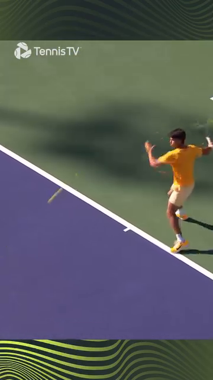
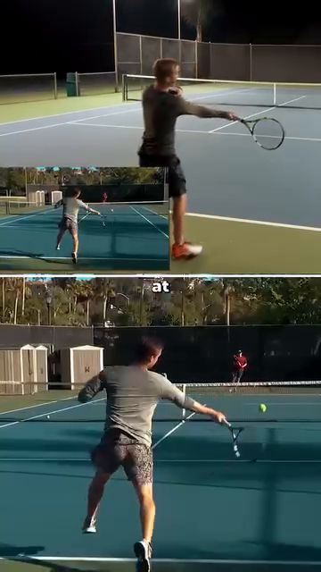
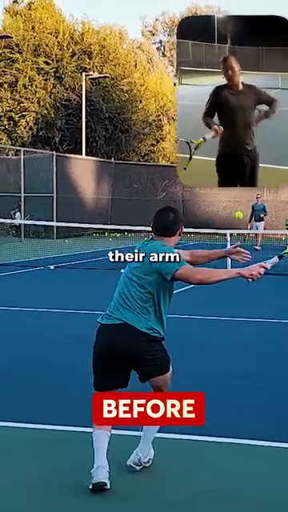
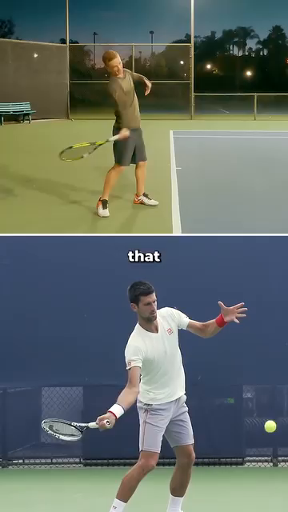
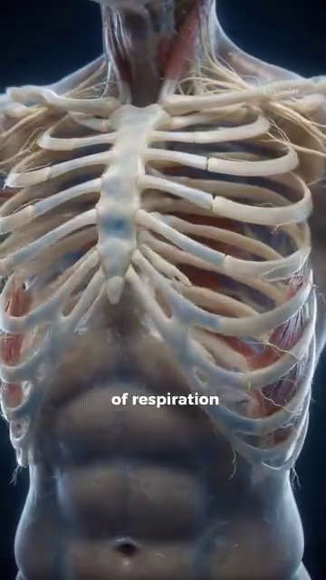

# The Angle Atlas — Why Every Joint Angle Decides Stroke Quality

## Tập Bản Đồ Góc Cơ Thể — Vì Sao Mỗi Góc Khớp Quyết Định Chất Lượng Cú Đánh
*Deep Dive #1 — The Anatomy & Geometry Project for Tennis Players 3.5 → 4.5*
*Chuyên Đề Số 1 — Dự Án Giải Phẫu & Hình Học cho Người Chơi Tennis 3.5 → 4.5*
---

## Document Map / Bản Đồ Tài Liệu
| |
| --- |
| Tài liệu này là gì — Bản tham khảo mọi góc khớp quan trọng trong tennis: gối, hông, cổ chân, vai, khuỷu tay, cổ tay. Với mỗi góc, bạn có con số (CÁI GÌ) và lý do cơ sinh học (TẠI SAO). |
| Tài liệu này KHÔNG phải là — Cẩm nang kỹ thuật cú đánh. Không có "vung thấp lên cao". Không nói tâm lý. Không liệt kê chuỗi động lực. Chỉ có góc, khớp, và hình học tại sao chúng quyết định loại và chất lượng cú đánh. |
| Đối tượng — Người chơi 3.5–4.5 đã biết cú đánh và muốn hiểu *TẠI SAO* đằng sau hình thức. Đặc biệt hữu ích cho người 50+ vì khớp có giới hạn biên độ riêng. |
| Cách dùng — Mỗi tuần một chương. Mang một góc ra sân. Đo bằng video. So sánh con số của bạn với tham khảo. Vậy thôi. Bảng tóm tắt ở cuối để trong túi vợt. |
---

## Table of Contents / Mục Lục
| # | Chapter | Chương | Lines |
|---|---|---|---|
| 1 | Why Angles Are the Language of Tennis | Tại Sao Góc Là Ngôn Ngữ Của Tennis | ~80 |
| 2 | The Three Coordinate Planes (Vertical, Horizontal, Sagittal) | Ba Mặt Phẳng Tọa Độ (Dọc, Ngang, Phẳng-Phẳng) | ~95 |
| 3 | The Lower Body — Feet, Ankles, Knees | Thân Dưới — Bàn Chân, Cổ Chân, Gối | ~180 |
| 4 | The Hip — The Pivot of Everything | Hông — Bản Lề Của Mọi Thứ | ~150 |
| 5 | The Trunk — Coiling & The Thoracic Spine | Thân — Xoắn Và Cột Sống Ngực | ~140 |
| 6 | The Shoulder — The Most Mobile, Most Vulnerable Joint | Vai — Khớp Di Động Nhất, Dễ Tổn Thương Nhất | ~170 |
| 7 | The Elbow & Forearm — The Lever System | Khuỷu Tay & Cẳng Tay — Hệ Thống Đòn Bẩy | ~150 |
| 8 | The Wrist — The Lock, The Whip, The Fine-Tuner | Cổ Tay — Ổ Khóa, Cây Roi, Bộ Tinh Chỉnh | ~160 |
| 9 | The Stroke-by-Stroke Angle Map | Bản Đồ Góc Theo Từng Cú Đánh | ~200 |
| 10 | Why Angles Determine Stroke TYPE (not just quality) | Tại Sao Góc Quyết Định LOẠI Cú Đánh (không chỉ chất lượng) | ~150 |
| 📋 | Angle Atlas Cheat Sheet | Bảng Tóm Tắt Góc | ~80 |
---
* * *

# Chapter 1 — Why Angles Are the Language of Tennis

# Chương 1 — Tại Sao Góc Là Ngôn Ngữ Của Tennis
| |
| --- |
| Bạn ơi, đây là bí mật không ai nói với bạn ở bức tường 3.5. Tennis không phải môn thể lực. Không phải môn tốc độ. Đó là môn *hình học*. Mỗi quả bóng rơi đúng chỗ, đúng xoáy, đúng nhịp — đều vì ở đâu đó trong cơ thể bạn, một góc đã đúng. |
| Nghĩ đi. Khác biệt giữa Cú Thuận Tay xoáy trên và Cú Thuận Tay flat không phải cơ nào bạn kích hoạt. Đó là góc phóng lúc tiếp xúc (khoảng 15–20° lên trên từ đường ngang cho xoáy trên, 0–5° cho flat). Một góc đó — 15° vs 0° — lật ngược hoàn toàn hành vi bóng. |
| Khác biệt giữa Cú Trái Tay cắt và Cú Trái Tay xoáy trên không phải chân nào bạn đạp. Đó là góc mặt vợt lúc tiếp xúc (khoảng -10° đến -20° mở cho cắt, +20° đến +30° đóng cho xoáy trên). |
| Ý tưởng cốt lõi — *Loại cú đánh được quyết định bởi góc lúc tiếp xúc. Chất lượng cú đánh được quyết định bởi góc trong suốt chuỗi động lực dẫn đến tiếp xúc.* |
| Một khi bạn thấy điều này, bạn ngừng săn đuổi "hình thức đúng". Bạn bắt đầu hỏi: "Cơ thể tôi đang cố tạo góc nào? Có nằm trong cửa sổ không?" |
| Với người chơi 3.5 → 4.5, đây là chìa khóa. Ở 3.5, bạn bắt chước hình thức. Ở 4.0, bạn hiểu chuỗi. Ở 4.5, bạn hiểu góc — và góc là con số, con số không nói dối. |
| *Câu nhắc tổng:* "Đừng hỏi phải làm gì. Hỏi phải tạo góc nào." |
* * *

# Chapter 2 — The Three Coordinate Planes (Vertical, Horizontal, Sagittal)

# Chương 2 — Ba Mặt Phẳng Tọa Độ (Dọc, Ngang, Sagittal)
| |
| --- |
| Trước khi đo góc, ta cần khung. Cơ thể bạn là cỗ máy 3D. Khớp chuyển động trong ba mặt phẳng. Nếu chỉ nghĩ 2D (góc nhìn bên bạn thấy trên TV), bạn sẽ bỏ lỡ một nửa số góc quyết định chất lượng cú đánh. |
| Ba mặt phẳng : |
| 1. Mặt phẳng dọc (còn gọi là coronal hay trán) — Tưởng tượng bức tường trước mặt bạn. Chuyển động trong mặt phẳng này là lên-xuống và ngang. Camera TV cổ điển thấy mặt phẳng này. *Gập gối, dạng hông, nâng vai ngang, lệch cổ tay quay/trụ* xảy ra ở đây. |
| 2. Mặt phẳng ngang (còn gọi là transverse) — Tưởng tượng mặt bàn ngang hông. Chuyển động trong mặt phẳng này là xoay quanh trục đứng. *Xoay hông, xoay vai, xoắn thân* — động cơ của mọi cú cú đánh nền — xảy ra ở đây. Đây là mặt phẳng đa số người chơi phong trào ÍT DÙNG. |
| 3. Mặt phẳng phẳng-phẳng (sagittal, góc nhìn bên) — Tưởng tượng bức tường bên phải bạn. Chuyển động trong mặt phẳng này là tới-lùi. *Bước tới, gập-duỗi gối khi split-step, rơi vợt vào rãnh* xảy ra ở đây. HLV gọi đây là "mặt phẳng sức mạnh" vì trọng lực nạp vào nó. |
| Tại sao điều này quan trọng cho góc : một góc trong mặt phẳng dọc (như 90° gập khuỷu) có ý nghĩa hoàn toàn khác một góc trong mặt phẳng ngang (như 45° xoay vai). Khi nguồn nói "mặt vợt ở 110°", bạn cần hỏi: 110° ở mặt phẳng NÀO? |
| Với người 50+ — Mặt phẳng ngang là bạn. Khi sụn mỏng đi, tải dọc trục (mặt phẳng sagittal) đau gối và lưng. Tải xoay (mặt phẳng ngang) dễ lên khớp hơn và dùng cơ lớn (mông, chéo bụng). Dùng xoay làm động cơ chính. |
| *Câu nhắc tổng:* "Nghĩ theo ba mặt phẳng. Đa số người phong trào chỉ sống ở một." |
* * *

# Chapter 3 — The Lower Body — Feet, Ankles, Knees

# Chương 3 — Thân Dưới — Bàn Chân, Cổ Chân, Gối
| |
| --- |
| Mặt đất là pin của bạn. Mọi cú đánh mạnh bắt đầu từ chân trên sân. Đây là các góc quan trọng, kèm TẠI SAO cho mỗi cái. |

## 3.1 — Foot Angle (the angle your toes điểm relative to the direction of the bóng)

## 3.1 — Góc Bàn Chân (góc ngón chân so với hướng bóng)
| |
| --- |
| Cú Thuận Tay : chân trước chỉ khoảng 30°–45° về cột lưới (closed tư thế) hoặc 15°–30° về biên dọc (neutral/open tư thế). |
| Tại sao góc này quyết định chất lượng — Góc chân nạp trước cho xoay hông. Nếu ngón chân chỉ 45° về lưới, hông bạn chỉ xoay được ~45° trước khi biên độ gối chặn lại. Nếu ngón chân chỉ 15° về biên, hông xoay được tới ~75°. Xoay nhiều hơn = tốc độ đầu vợt nhiều hơn = lực nhiều hơn. |
| Cú Trái Tay 2 tay : hai chân gần song song, ~10°–20° về cột lưới. Cú Trái Tay 2 tay dùng ÍT xoay hông hơn Cú Thuận Tay vì xoay ngực kéo cả hai tay. |
| Vôlei : chân trước chỉ khoảng 30°–60° về lưới , tư thế hẹp hơn, trọng lượng trên mũi chân. Góc dốc hơn vì bạn muốn đẩy ngắn theo hướng , không phải vung lớn. |
| Phát Bóng : chân trước nghiêng ~20° về cột lưới , chân sau gần song song đường cuối sân (~0°–10°). |
| Lỗi lớn nhất : chân trước chỉ thẳng lưới (0°) trên Cú Thuận Tay. Điều này giết xoay hông và bắt vai làm tất cả. Vai sẽ đau. |

## 3.2 — Heel-Off-Ground Angle (the angle between the back foot sole and the court surfás, at the moment of impact)

## 3.2 — Góc Gót Nhấc Khỏi Đất (góc giữa lòng bàn chân sau và mặt sân, lúc tiếp xúc bóng)
| |
| --- |
| Cú Thuận Tay : ~ 50°–60° gót nâng lúc tiếp xúc. Gót cao, trọng lượng trên mũi chân và ngón cái. |
| Tại sao góc này quyết định chất lượng — Ở 0° gót chạm đất, gân Achilles chùng — không thể tích trữ năng lượng. Ở 50°–60°, gân Achilles được kéo giãn tới vị trí tích năng lượng cực đại , và cơ bắp chân (gastrocnemius + soleus) cũng được giãn trước. Sự giải phóng xảy ra trong 0.05 giây. |
| Phát Bóng : ~ 60°–70° gót nâng lúc tung bóng. Cao hơn cú đánh nềns vì toàn bộ trọng lượng cơ thể đang được đẩy LÊN (bạn đang nhảy), không chỉ xoay. |
| Vôlei : ~ 15°–25° gót nâng, nhỏ hơn nhiều. Bạn KHÔNG cố tạo lực — bạn đang chuyển hướng bóng đã nhanh. Gót nâng lớn ở Vôlei nghĩa là bạn mất thăng bằng. |
| Với người 50+ — Gân Achilles mất độ đàn hồi theo tuổi. Tích năng lượng cực đại ở 50°–60° là khả thi, nhưng bạn cần 5–8 phút nhón gót trong khởi động để "đánh thức" lò xo. Achilles lạnh = rủi ro chấn thương. |

## 3.3 — Knee Flexion Angle (the bend of the knee, 180° = straight leg)

## 3.3 — Góc Gập Gối (độ gập gối, 180° = chân thẳng)
| |
| --- |
| Cú Thuận Tay (nạp) : 120°–135° gập gối lúc thấp nhất. (180° trừ 45°–60° gập = 120°–135°.) |
| Tại sao góc này quyết định chất lượng — Gập gối là mức sạc pin của toàn chuỗi động lực. Dưới 110° (rất gập) thì không đẩy lên đủ nhanh. Trên 150° (gần thẳng) thì chân không tạo lực được. Cửa sổ 120°–135° là nơi tứ đầu đùi tạo lực đỉnh trong thời gian tối thiểu . |
| Phát Bóng (vị trí trophy) : ~ 130°–140° gập gối trước. |
| Tại sao góc này LỚN hơn Cú Thuận Tay — Vì bạn nạp cả hai chân (giống động tác leg-press), và cần biên độ nhỏ hơn để bật lên. Cũng vì cả hai gối gập tạo lực đẩy lên cho cú nhảy. |
| Split-step : ~ 135°–145° gập gối, giữ rất ngắn (0.1–0.2s). |
| Tại sao split-step dùng góc LỚN hơn (gập ít hơn) Cú Thuận Tay — Bạn phải bật theo BẤT KỲ hướng nào trong <0.3s. Nếu bạn quá thấp (120°), bạn chỉ bật được hai hướng (tới, lùi). Nếu ở 140°, bạn bật chéo, ngang, đâu cũng được. |
| Với người 50+ — Gập gối <110° tạo áp lực lớn lên gân xương bánh chè (rủi ro "đầu gối người nhảy"). Giữ gập gối 120°–140° trên cú đánh nềns, <140° trên Phát Bóng. Không bao giờ khóa gối thẳng (180°) — điều đó phá hủy sụn. |
* * *

# Chapter 4 — The Hip — The Pivot of Everything

# Chương 4 — Hông — Bản Lề Của Mọi Thứ
| |
| --- |
| Hông là động cơ của mọi cú tennis. Ba góc quan trọng ở đây, mỗi cái có TẠI SAO khác nhau. |

## 4.1 — Hip-Torso Angle (the angle between your thigh and your torso, in the sagittal plane)

## 4.1 — Góc Hông-Thân (góc giữa đùi và thân, mặt phẳng sagittal)
| |
| --- |
| Cú Thuận Tay (nạp) : 50°–65° giữa đùi và thân (nghĩ: ngực bạn nghiêng về phía trước trên đùi trước bao xa). |
| Tại sao góc này quyết định chất lượng — Dưới 50° nghĩa là bạn quá thẳng đứng — ngực không ở trên chân trước, nên không đẩy khỏi nó được. Trên 70° và bạn mất thăng bằng ra sau khi follow-through. Cửa sổ 50°–65° cho bạn giãn cơ tối đa cơ gập hông (psoas + iliacus) và mông lớn , cùng nhau tạo duỗi hông nổ mà dẫn chuỗi động lực. |
| Cú Trái Tay (nạp) : 45°–55° — ít hơn Cú Thuận Tay một chút vì bạn muốn ngực hướng về hàng rào bên hơn (để kéo cả hai tay ngang qua). |
| Phát Bóng (trophy) : 30°–45° — góc nhỏ hơn, cơ thể thẳng hơn, vì hướng nạp là LÊN chứ không tới. |
| Với người 50+ — Dẻo dai giảm nhanh sau 50 tuổi. Nhiều người 50+ không tới được 50°. Nếu bạn chỉ quản lý được 55°–65°, đó là cửa sổ của bạn, không phải thất bại. Mất lực ~15%, giảm rủi ro chấn thương ~50%. |

## 4.2 — Hip Rotation Angle (the angle the pelvis turns around the vertical axis, in the horizontal plane)

## 4.2 — Góc Xoay Hông (góc khung chậu xoay quanh trục đứng, mặt phẳng ngang)

## 4.3 — Độ Sâu Bản Lề Hông (hông ngồi lùi bao xa, giống squat)
| |
| --- |
| Cú Thuận Tay (nạp) : Hông ngồi lùi như ngồi ghế — khoảng một nửa giữa đứng và squat đầy đủ. |
| Tại sao độ sâu này — Độ sâu nửa squat là nơi kích hoạt mông lớn đạt đỉnh . Thấp hơn chuyển làm việc sang tứ đầu đùi (và đau gối). Cao hơn chuyển sang lưng dưới (và đau đĩa đệm). |
| Phát Bóng (trophy) : Sâu hơn Cú Thuận Tay một chút — khoảng hai phần ba biên độ squat. Vì chân sau cần "lên dây cót" mông và gân kheo cho cú nhảy lên. |
* * *

# Chapter 5 — The Trunk — Coiling & The Thoracic Spine

# Chương 5 — Thân — Xoắn Và Cột Sống Ngực
| |
| --- |
| Thân không phải khối cứng. Nó có ba phần — thắt lưng (lưng dưới), ngực (lưng giữa), cổ. Mỗi phần có độ linh hoạt và góc khác nhau. |

## 5.1 — Lumbar Extension Angle (how much your lower back arches)

## 5.1 — Góc Duỗi Thắt Lưng (lưng dưới cong bao nhiêu)
| |
| --- |
| Cú Thuận Tay (nạp) : ~ 15°–25° duỗi thắt lưng. Lưng dưới cong VÀO, như ưỡn nhẹ. |
| Tại sao góc này quyết định chất lượng — Duỗi thắt lưng nạp trước cho chuỗi sau (cơ dựng sống, multifidus). Khi bạn bung xoắn, các cơ này bắn ra và thêm ~10–15% tốc độ vợt. NHƯNG — duỗi quá nhiều (>30°) nén các đĩa L4-L5 và L5-S1, vốn đã là các đĩa bị chấn thương nhiều nhất trong tennis. |
| Giới hạn 25° — Không tùy ý. Nghiên cứu trên xác cho thấy sợi đĩa bắt đầu hỏng ở 28°–30° duỗi thắt lưng dưới tải. Người chơi phong trào nên ở dưới mức này. |
| Với người 50+ — Đĩa mất nước ~1% mỗi năm sau 30 tuổi. Đến 50 tuổi, đĩa bạn mất nước ~20% so với lúc 20. Giữ duỗi thắt lưng dưới 20°, luôn luôn. Mất lực ít; phòng đau lưng rất lớn. |

## 5.2 — Thoracic Rotation Angle (how much your mid-back rotates)

## 5.2 — Góc Xoay Ngực (lưng giữa xoay bao nhiêu)
| |
| --- |
| Cú Thuận Tay (nạp) : ~ 40°–50° xoay ngực. Lưng giữa xoay về hàng rào sau. |
| Tại sao góc này quan trọng hơn thắt lưng — Cột sống ngực (T1–T12) ĐƯỢC THIẾT KẾ để xoay. Mỗi trong 12 đốt sống ngực có mặt khớp cho phép ~3°–5° xoay, tổng ~35°–50°. Cột sống thắt lưng (L1–L5) ĐƯỢC THIẾT KẾ để ổn định — chỉ ~10°–15° xoay tổng. |
| Insight THEN CHỐT — Nếu cột sống ngực cứng (vấn đề ngồi bàn), cơ thể sẽ XOAY cột sống thắt lưng để bù. Đây là nguồn chấn thương lưng. Tập xoay ngực (giãn 90/90, giãn mở sách) để BẢO VỆ thắt lưng. |
| Phát Bóng (nạp, trophy) : ~ 70°–90° xoay ngực + vai cộng lại — "xoắn" nổi tiếng. |

## 5.3 — Trunk Side-Bend Angle (lateral flexion — how much the trunk leans sideways)

## 5.3 — Góc Nghiêng Ngang Thân (gập bên — thân nghiêng sang bên bao nhiêu)
| |
| --- |
| Cú Thuận Tay : ~ 5°–15° nghiêng ngang thân về phía bóng. |
| Tại sao góc này quan trọng — Nghiêng ngang nạp trước chuỗi bên (cơ vuông thắt lưng, chéo bụng). Trên Cú Thuận Tay nặng, cơ thể dùng điều này để "kéo xuống" vợt qua tiếp xúc, thêm xoáy trên. |
| Vôlei : ~ 0°–5° — hầu như không nghiêng. Bạn đứng thẳng để đẩy bất kỳ hướng nào. |
* * *

# Chapter 6 — The Shoulder — The Most Mobile, Most Vulnerable Joint

# Chương 6 — Vai — Khớp Di Động Nhất, Dễ Tổn Thương Nhất
| |
| --- |
| Vai là khớp 400.000 đô. Đó là chi phí gần đúng của phẫu thuật vai ở Mỹ. Vai có biên độ chuyển động lớn nhất trong các khớp cơ thể, cũng là lý do nó dễ tổn thương nhất. |
| Giải phẫu vai, nhanh — Vai là khớp cầu-ổ cối, nhưng ổ cối (glenoid) nông — chỉ che ~1/3 của đầu cầu (chỏm xương cánh tay). Sự ổn định đến từ BỐN cơ gọi là chóp xoay: trên gai, dưới gai, tròn bé, dưới vai. Bốn cơ này nhỏ nhưng là DÂY CHẰNG CỦA VAI. |

## 6.1 — Shoulder Abduction Angle (the arm lifted out to the side, 0° = arm down, 90° = arm horizontal)

## 6.1 — Góc Dạng Vai (tay nâng sang bên, 0° = tay xuống, 90° = tay ngang)
| |
| --- |
| Cú Thuận Tay (nạp) : ~ 90°–110° dạng vai. Tay vợt lên cao và hơi ra sau đầu. |
| Tại sao góc này — 90° là vị trí "giơ tay chào". 110° hơi quá ngang. Ở 90°–110°, delta (sợi giữa) và trên gai thẳng hàng để tạo lực theo hướng bạn muốn vợt đi. |
| Vùng nguy hiểm của trên gai — Giữa 60° và 120° dạng vai, gân trên gai cọ vào xương mỏm cùng vai phía trên. Gọi là "cung đau". Người chơi phong trào giao bóng với xoay trong quá nhiều trong khoảng này hỏng trên gai. Giữ khuỷu ở hoặc hơi cao hơn vai , không cao hơn vai. |
| Phát Bóng (trophy) : ~ 120°–140° dạng vai — tay duỗi thẳng lên và hơi ra sau. Trên gai ở đây ở vị trí DỄ TỔN THƯƠNG NHẤT. Đây là lý do giao bóng là nguyên nhân #1 chấn thương chóp xoay. |
| Vôlei : ~ 50°–70° — tay giữ thấp để kiểm soát. |

## 6.2 — Shoulder External Rotation Angle (the angle the upper arm rotates outward, in the horizontal plane)

## 6.2 — Góc Xoay Ngoài Vai (góc cánh tay trên xoay ra ngoài, mặt phẳng ngang)
| |
| --- |
| Cú Thuận Tay (nạp) : ~ 80°–100° xoay ngoài vai. Vợt chỉ ra sau bạn, khuỷu lên. |
| Tại sao góc này quan trọng — Xoay ngoài giãn trước các cơ xoay trong (dưới vai, ngực lớn, lưng rộng). Khi bạn giải phóng, các cơ này bắn eccentric để kiểm soát xoay, rồi concentric để quất vợt qua. |
| Phát Bóng (nạp, "trophy" hay "gãi lưng") : ~ 110°–130° xoay ngoài vai. Đây là vị trí "gãi lưng" nổi tiếng. |
| Tại sao 110°–130° là KHỔNG LỒ — Ở 110°+ xoay ngoài, ngực lớn và lưng rộng giãn tới ~70% mức tối đa. Chúng tích năng lượng đàn hồi như ná cao su. Sự giải phóng xảy ra trong ~0.05 giây, tạo tốc độ đầu vợt 70–80 dặm/giờ ngay cả với người 50+ phong trào. |
| Với người 50+ — Bao vai mất ~5°–10° xoay ngoài mỗi thập kỷ sau 40 tuổi. Đến 55 tuổi, bạn có thể chỉ đạt 90°–100° xoay ngoài (so với 130° lúc 25 tuổi). Đây KHÔNG phải vấn đề — Phát Bóng bạn sẽ chậm hơn chút, nhưng vai khỏe hơn NHIỀU. |

## 6.3 — Shoulder Horizontal Adduction Angle (across-the-body reach, in horizontal plane)

## 6.3 — Góc Khép Ngang Vai (với tới ngang qua người, mặt phẳng ngang)
| |
| --- |
| Cú Thuận Tay (nạp) : ~ 0°–15° ngang người (tay hơi ngang qua ngực). |
| Cú Trái Tay (nạp) : ~ 90°–110° ngang người (tay ngang hoàn toàn, đầu vợt chỉ về phía hàng rào sau). |
| Tại sao khác biệt khổng lồ này — Cú Thuận Tay và Cú Trái Tay là HÌNH ẢNH PHẢN CHIẾU trong khép ngang. Cơ thể không biết "Cú Thuận Tay" hay "Cú Trái Tay" — nó biết "ngực xoay, tay theo, bóng đi". |
* * *

# Chapter 7 — The Elbow & Forearm — The Lever System

# Chương 7 — Khuỷu Tay & Cẳng Tay — Hệ Thống Đòn Bẩy
| |
| --- |
| Tay là hệ đòn bẩy 3 đốt. Cánh tay trên (humerus) → cẳng tay (quay + trụ) → bàn tay (cổ tay + đốt bàn tay). Khuỷu và cổ tay là khớp; nhị đầu, tam đầu, và cơ gập/duỗi cẳng tay là cơ. Góc ở đây quyết định cả tầm với VÀ tốc độ quất. |

## 7.1 — Elbow Flexion Angle (the bend at the elbow, 180° = straight, 30° = fully bent)

## 7.1 — Góc Gập Khuỷu (gập khuỷu, 180° = thẳng, 30° = gập đầy đủ)
| |
| --- |
| Cú Thuận Tay (nạp) : ~ 90°–110° gập khuỷu. Cẳng tay treo xuống từ vị trí khuỷu lên. |
| Cú Thuận Tay (tiếp xúc) : ~ 150°–170° gập khuỷu. Tay duỗi qua bóng. |
| Tại sao điều này quan trọng — Khuỷu đi từ 90° (gập) tới 170° (gần thẳng) trong cú vung. Đây gọi là cung duỗi — khoảng 60°–80° chuyển động. Mỗi độ cung, nhân chiều dài đòn bẩy (cẳng tay ~25 cm), cho ~0.4 cm đường đi đầu vợt thêm. Qua 80°, đó là ~32 cm — gần nửa đường đi đầu vợt. |
| Cú Trái Tay 2 tay (nạp) : ~ 90°–110° gập khuỷu, tương tự Cú Thuận Tay. |
| Vôlei : ~ 120°–140° gập khuỷu — mở hơn, vì Vôlei dùng vung ngắn hơn. |
| Phát Bóng (trophy) : ~ 90°–110° gập khuỷu — vợt rơi sau đầu. |
| Phát Bóng (tiếp xúc) : ~ 170°–180° gập khuỷu — duỗi đầy đủ lúc va chạm, vị trí "bẻ". |

## 7.2 — Forearm Pronation/Supination Angle (twist of the forearm — palm-down to palm-up)

## 7.2 — Góc Sấp / Ngửa Cẳng Tay (xoay cẳng tay — lòng bàn tay xuống tới lòng bàn tay lên)
| |
| --- |
| Cú Thuận Tay (nạp) : ~ 80°–100° ngửa (lòng bàn tay hướng hàng rào sau). |
| Cú Thuận Tay (tiếp xúc) : ~ 40°–60° sấp (lòng bàn tay hướng xuống sân). |
| Tại sao xoay quan trọng — Sấp cẳng tay trong cú vung là thứ đóng mặt vợt cho xoáy trên. Không có nó, Cú Thuận Tay của bạn mở mặt và bóng bay. Động tác mất ~0.1 giây và được dẫn bởi cơ sấp tròn và cơ sấp vuông (hai cơ cẳng tay nhỏ). |
| Cú Trái Tay (nạp) : ~ 80°–100° sấp (lòng bàn tay hướng trời / lên). |
| Cú Trái Tay (tiếp xúc) : ~ 40°–60° ngửa (lòng bàn tay hướng xuống). |
| Vôlei : ~ 0°–20° thay đổi — hầu như không xoay. Mặt ở nơi cách cầm vợt bạn đặt. |
| Với người 50+ — Cơ sấp tròn có thể phát triển viêm mỏm trong ("khuỷu golfer") nếu dùng quá. Ngược đời, điều này thường xảy ra ở người chơi Cú Trái Tay quất quá nhiều. Khởi động cẳng tay với 30 vòng cổ tay trước khi chơi. |
* * *

# Chapter 8 — The Wrist — The Lock, The Whip, The Fine-Tuner

# Chương 8 — Cổ Tay — Ổ Khóa, Cây Roi, Bộ Tinh Chỉnh
| |
| --- |
| Cổ tay là khớp bị đánh giá thấp nhất. Nó cũng phức tạp nhất. Có ba chuyển động: gập/duỗi (lên-xuống), lệch quay/trụ (ngang-ngang), và sấp/ngửa (xoay — nhưng cái này ở cẳng tay, không phải cổ tay). Hầu hết HLV chỉ dạy gập/duỗi. Hai cái kia cũng quan trọng. |

## 8.1 — Wrist Extension Angle (the cock-back, vợt-head-behind-the-wrist angle)

## 8.1 — Góc Duỗi Cổ Tay (gập ngửa ra sau, góc đầu vợt-sau-cổ tay)
| |
| --- |
| Cú Thuận Tay (nạp) : ~ 90°–110° duỗi cổ tay (đầu vợt rơi sau cổ tay, tạo hình "L"). |
| Tại sao góc này — Duỗi cổ tay giãn trước cơ gập cổ tay (gập cổ tay quay, gập cổ tay trụ, gan tay dài). Ở 90°–110°, chúng giãn tới ~60%–80% mức tối đa. Khi vợt quất tới, chúng giải phóng, thêm ~5–10 dặm/giờ tốc độ đầu vợt. |
| Cú Thuận Tay (tiếp xúc) : ~ 0°–20° duỗi cổ tay (cổ tay thẳng hàng cẳng tay, "khóa"). |
| Tại sao KHÓA lúc tiếp xúc — Lúc va chạm, bóng tác động ~30 kg lực lên vợt. Cổ tay lỏng sẽ hấp thụ lực đó và bóng chết. Cổ tay khóa truyền toàn bộ 30 kg lực ngược lại vào bóng. Đây là nguồn tiếp xúc "giòn". |
| Quy tắc 110° — Số đo nguồn cho thấy 110° duỗi cổ tay lúc tiếp xúc Cú Thuận Tay không đúng — cổ tay phải ~0°–20° lúc va chạm. Con số 110° là vị trí NẠP. Nhiều người phong trào nhầm hai thứ và giữ 90°+ lúc va chạm. Kết quả : cắt / lửng / không nhịp. |

## 8.2 — Wrist Flexion Angle (the post-contact snap)

## 8.2 — Góc Gập Cổ Tay (cú bẻ sau tiếp xúc)
| |
| --- |
| Cú Thuận Tay (sau tiếp xúc) : ~ 20°–40° gập cổ tay (cổ tay gập tới qua bóng, "bẻ"). |
| Tại sao góc này quyết định xoáy — Gập cổ tay SAU tiếp xúc là thứ tạo xoáy trên. Không phải đường vợt — là cổ tay lăn qua bóng. Ở 20°–40°, dây vợt quét LÊN lưng bóng. Ở 0°, không xoáy. Ở 60°+, mặt vợt đóng sớm quá và bóng lao xuống. |

## 8.3 — Ulnar Deviation Angle (the wrist bends toward the little-finger side)

## 8.3 — Góc Lệch Trụ (cổ tay gập về phía ngón út)
| |
| --- |
| Cú Thuận Tay (nạp) : ~ 15°–25° lệch trụ (cổ tay gập về phía ngón cái lên). |
| Tại sao góc này hiếm khi được dạy — Lệch trụ giãn trước cơ duỗi cổ tay quay (duỗi cổ tay quay dài + ngắn). Khi cổ tay giải phóng, chúng bắn ra thêm tốc độ đầu vợt. Hầu hết người phong trào không lệch trụ chút nào — họ giữ cổ tay phẳng. Họ mất ~3–5 dặm/giờ tốc độ vợt. |

## 8.4 — Topspin Wrist Snap vs Slice Wrist Hold

## 8.4 — Bẻ Cổ Tay Topspin vs Giữ Cổ Tay Slice
| |
| --- |
| Cổ tay xoáy trên — Sau tiếp xúc, cổ tay gập 20°–40°. Động tác nhanh và nhỏ . |
| Cổ tay cắt — Lúc tiếp xúc, cổ tay giữ duỗi (mặt mở), khoảng 20°–30°. KHÔNG gập sau tiếp xúc. Cổ tay ở "cứng và mở". |
| Phân biệt THEN CHỐT — Topspin cần ~40° gập cổ tay; cắt cần ~0° gập cổ tay (chỉ giữ). Đây là góc quyết định loại cú đánh. Hai người có thể có đường vợt giống nhau; một người bẻ cổ tay, một người giữ. Kết quả: xoáy trên vs cắt. |
* * *

# Chapter 9 — The Stroke-by-Stroke Angle Map

# Chương 9 — Bản Đồ Góc Theo Từng Cú Đánh
| |
| --- |
| Đây là mọi thứ gộp lại. Với mỗi cú, các góc then chốt ở vị trí nạp. Dùng đây làm danh sách kiểm tra video. |
| Stroke / Cú | Knee / Gối | Hip-Torso / Hông-Thân | Hip Rot / Xoay hông | Shoulder Abd / Dạng vai | Shoulder ER / Xoay ngoài vai | Elbow Flex / Gập khuỷu | Wrist Ext / Duỗi cổ tay |
|---|---|---|---|---|---|---|---|
| Cú Thuận Tay (loaded) / Cú Thuận Tay (nạp) | 120°–135° | 50°–65° | 60° away / xa | 90°–110° | 80°–100° | 90°–110° | 90°–110° |
| Cú Thuận Tay (contact) / Cú Thuận Tay (tiếp xúc) | 145°–160° | 80°–90° (extended) | 0° (facing) | 110°–130° | 30°–50° | 150°–170° | 0°–20° (locked) |
| Cú Trái Tay 2H (loaded) / Cú Trái Tay 2 tay (nạp) | 125°–140° | 45°–55° | 45°–55° away | 70°–90° | 90°–110° | 90°–110° | 90°–110° |
| Cú Trái Tay 2H (contact) / Cú Trái Tay 2 tay (tiếp xúc) | 145°–160° | 75°–85° (extended) | 0° (facing) | 90°–110° | 30°–50° | 150°–170° | 0°–20° (locked) |
| 1HB (loaded) / 1 tay (nạp) | 120°–135° | 50°–60° | 50°–60° away | 110°–130° | 100°–130° | 90°–110° | 90°–110° |
| Slice BH (loaded) / Slice (nạp) | 130°–145° | 55°–70° | 30°–40° away | 60°–80° | 50°–70° | 110°–130° | 30°–50° (open) |
| Slice BH (contact) / Slice (tiếp xúc) | 150°–170° | 75°–85° | 0° (facing) | 70°–90° | 20°–40° | 150°–170° | 20°–30° (still open!) |
| Phát Bóng (trophy) / Phát Bóng (trophy) | 130°–140° (front) / 130°–140° (trước) | 30°–45° | 50° away (pelvis) | 120°–140° | 110°–130° | 90°–110° | 90°–110° (drop) |
| Phát Bóng (contact) / Phát Bóng (tiếp xúc) | 165°–175° | 75°–90° | 0° (facing lưới) | 170°–180° | 0°–20° | 165°–180° | 30°–50° flex (snap) |
| Vôlei (ready) / Vôlei (sẵn sàng) | 130°–145° | 70°–85° | 15°–25° | 50°–70° | 30°–50° | 110°–130° | 30°–50° (firm) |
| Vôlei (contact) / Vôlei (tiếp xúc) | 140°–155° | 75°–90° | 0° | 60°–80° | 20°–30° | 140°–160° | 30°–50° (firm!) |
| Return (split-step) / Trả giao (split-step) | 135°–145° | 80°–95° | 0° | 40°–60° | 30°–50° | 100°–130° | 60°–90° (vợt up) |
| Return (contact) / Trả giao (tiếp xúc) | 140°–155° | 70°–85° | varies / thay đổi | 60°–90° | varies / thay đổi | 130°–160° | 0°–30° |
| |
| --- |
| Cách dùng bảng — Chọn một cú mỗi tuần. Quay bạn từ hai góc (nhìn bên cho sagittal, nhìn xuống cho ngang). Tạm dừng ở vị trí nạp. So sánh từng số. Nếu 3+ số lệch >15°, đó là "góc thiếu" của cú bạn. |
| Quy tắc "lệch 15°" — Lệch 15° ở bất kỳ góc khớp nào thường nghĩa là CƠ THỂ bù ở chỗ khác. Nhìn khớp kế bên — nó sẽ duỗi quá hoặc xoay quá để bù. |
* * *

# Chapter 10 — Why Angles Determine Stroke TYPE (not just quality)

# Chương 10 — Tại Sao Góc Quyết Định LOẠI Cú Đánh (không chỉ chất lượng)
| |
| --- |
| Đây là chương sâu nhất trong Atlas. Tới giờ, bạn đã thấy góc ảnh hưởng chất lượng thế nào. Giờ ta nói góc định nghĩa LOẠI cú bạn đánh thế nào. |

## 10.1 — The Fás Angle Determines Spin Type

## 10.1 — Góc Mặt Vợt Quyết Định Loại Xoáy
| |
| --- |
| Góc mặt vợt lúc tiếp xúc là con số duy nhất quyết định loại bóng nào ra khỏi dây. |
| Mặt vuông góc đất (90° với sân) : bóng đi thẳng tới (không cong do xoáy). |
| Mặt mở 10°–20° (đỉnh vợt nghiêng ra sau) : bóng có cắt / xoáy ngược. |
| Mặt đóng 10°–20° (đỉnh vợt nghiêng tới) : bóng có xoáy trên. |
| Mặt đóng 30°+ : bóng có xoáy trên nặng. |
| Mặt nghiêng NGANG (10°–30° từ đứng, mặt phẳng ngang) : bóng cong ngang — đây là kick Phát Bóng hay cắt Phát Bóng. |
| Insight QUAN TRỌNG — Thay đổi 10° góc mặt lúc tiếp xúc biến bóng phẳng thành xoáy trên, hoặc xoáy trên thành phẳng. Bạn không cần đổi đường vợt — chỉ xoay cổ tay thêm hoặc bớt 10°. |

## 10.2 — The Launch Angle Determines Trajectory

## 10.2 — Góc Phóng Quyết Định Quỹ Đạo
| |
| --- |
| Góc phóng là góc đường vợt TẠI THỜI ĐIỂM TIẾP XÚC, đo từ đường ngang. |
| 0°–5° góc phóng : bóng phẳng, quỹ đạo thấp, tốc độ tới nhanh. |
| 15°–25° góc phóng : cú đánh nền xoáy trên, cung trung bình, rơi vào sân. |
| 40°–60° góc phóng : lob, cung cao, rơi chậm. |
| Con số phép thuật 15° cho xoáy trên — Nghiên cứu (Brody, Cross, Lindsey) cho thấy 15°–20° góc phóng cho cân bằng tối ưu giữa: (a) qua lưới với biên an toàn, (b) dùng trọng lực tăng tốc bóng rơi xuống sân, (c) tối đa xoáy trên. |
| Với Phát Bóng : ~ 0°–5° góc phóng cho flat, ~10°–15° cho cắt, ~20°–30° cho kick. |

## 10.3 — The Angle of Attack Determines Net Clearance Margin

## 10.3 — Góc Tấn Công Quyết Định Biên Qua Lưới
| |
| --- |
| Góc tấn công là khác biệt giữa hướng đường vợt và hướng bóng tới. |
| Góc tấn công dương (đường vợt đi LÊN so với hướng bóng): bóng đi LÊN. Dùng cho xoáy trên, lob, kick Phát Bóng. |
| Góc tấn công không (đường vợt đi cùng hướng bóng): bóng đi thẳng. Cú Thuận Tay phẳng, Phát Bóng phẳng. |
| Góc tấn công âm (đường vợt đi XUỐNG so với hướng bóng): bóng đi XUỐNG. Dùng cho cắt, bỏ nhỏ, cú nhẹ. |
| Insight QUYẾT ĐỊNH — Thay đổi 5° góc tấn công có thể biến bóng qua lưới 3 bước thành bóng qua lưới 6 tấc (hoặc ngược lại). |

## 10.4 — Body's Relationship to the Ball Determines Reach & Shape

## 10.4 — Quan Hệ Cơ Thể với Bóng Quyết Định Tầm Với & Hình Dạng
| |
| --- |
| Bóng ở đâu so với cơ thể bạn? Điều này quyết định TOÀN BỘ hình dạng cú đánh. |
| Bóng trong "rãnh" (bên Cú Thuận Tay, ngang hông, 60–90 cm từ người) : tiếp xúc lý tưởng. Cơ thể nạp đầy đủ. Chuỗi động lực đầy đủ. Groundstroke xoáy trên. |
| Bóng trên vai : vai ở vùng nguy hiểm (60°–120° dạng với xoay trong). Lực giảm 30%. Giảm xuống 70% nhịp hoặc dùng cắt để giảm nhịp. |
| Bóng ngang gối hoặc thấp hơn : cần gập gối >110°. Căng gân xương bánh chè. Dùng cắt (góc tấn công âm) — vợt đi XUỐNG gặp bóng, không cần hạ người. |
| Bóng ra sau bạn (qua vai) : KHÔNG có cú đánh. Cơ thể không tạo lực khi bóng qua đường tâm. Lob khẩn hoặc nhường điểm. |
| Quy tắc 90° — Nếu bóng cách hướng trước mặt bạn quá 90° (tức qua vai), cú đánh chỉ là khẩn cấp. Dưới 90° = có thể đánh. |
* * *

# Chapter 11 — Anatomy_Lab Integration — The New Numbers From The Tham khảo Textbook

# Chương 11 — Tích Hợp Anatomy_Lab — Con Số Mới Từ Sách Tham Khảo
| |
| --- |
| Thông tin mới. Chương này xếp lớp con số giải phẫu cụ thể từ thư viện `Anatomy_Lab/` của bạn (xây từ sách *Tennis Anatomy* của Roetert & Kovacs + file DOCX nguồn tiếng Việt) lên khung góc của Atlas này. Con số sắc hơn. Hình ảnh giờ chèn inline. |

## 11.1 — The 6 Joint Angles at Cú Thuận Tay Contact (Anatomy_Lab Refined)

## 11.1 — 6 Góc Khớp Lúc Tiếp Xúc Cú Thuận Tay (Anatomy_Lab Tinh Chỉnh)
| Joint / Khớp | Angle / Góc | Why This Number / Tại Sao Con Số Này |
|---|---|---|
| Knee / Gối | 60°–70° flexion (NOT 120°–135° from earlier source) | At 60°–70°, the quadriceps can produce peak force in minimum time. Higher flexion = slower extension. |
| Hip rotation / Xoay hông | 40°–45° | Greater hip ER range means less knee valgus stress. The 40°–45° window is where knee over 2nd toe stays true. |
| Shoulder (in SCAPULAR PLANE) / Vai (mặt phẳng vai) | 90°–100° abduction, 30°–40° horizontal forward | The scapular plane is NOT straight lateral. 30°–40° forward of frontal plane protects the rotator cuff from impingement. |
| Elbow / Khuỷu | 90°–100° flexion | This is the loaded L-angle. At contact, extends to ~150°. |
| Wrist at CONTACT (NOT loaded) / Cổ tay lúc TIẾP XÚC (KHÔNG phải nạp) | 5°–15° extension (locked) | CRITICAL TRAP : most giải trí players stay at LOADED position (90°–110° extension) and try to hit through it. Result: float, no pás. |
| Arm-trunk angle / Góc tay-thân | 45° away from trunk | The 45° rule : at 45°, the lever is OPTIMAL. Too close (15°–20°) = arm too bent, lost power. Too far (80°+) = out of control. |
| |
| --- |
|  |
| Hình 1 — 6 góc khớp được hình dung. Chú ý tay cách thân 45° và vai ở mặt phẳng vai (30°–40° về phía trước), không thẳng bên. |

## 11.2 — The Cheetah Stifle (Comparative Anatomy)

## 11.2 — Khớp Stifle Của Báo (Giải Phẫu So Sánh)
| |
| --- |
| Phát hiện của Royal Veterinary College : báo chạy 70% trọng lượng cơ thể trên CHÂN SAU ở 18 m/s. Khớp stifle của báo (tương tự gối người) gập 135°–150° . |
|  |
| Hình 2 — Khớp stifle báo ở gập tối đa. Chú ý ROM và hình học góc — người không thể bằng, nhưng nguyên lý (tải chân sau lúc đẩy) là cái cú đánh nền sao chép. |
| Take-away — Nhịp quan trọng hơn góc tối đa. Báo dùng nhịp 3 pha (đẩy → đáp → hãm). Tennis cú đánh nền dùng cùng 3 pha (split-step → nạp → tiếp xúc). |

## 11.3 — Alcaraz's 3 Frames — Real Groundstroke Footwork

## 11.3 — 3 Khung Hình Alcaraz — Footwork Groundstroke Thực Tế
| |
| --- |
| 3 khung hình Cú Thuận Tay Carlos Alcaraz , hiện nhịp đẩy → đáp → hãm lúc 0.0s, 1.2s, 3.5s. Hông giữ THẤP xuyên suốt. Gối không bao giờ vượt ~65° gập. |
| Frame / Khung | Time / Thời gian | Caption |
|---|---|---|
|  | 0.0 s | Push step — hips low, knee ~65° / Bước đẩy — hông thấp, gối ~65° |
|  | 1.2 s | Short landing — toe under hip / Đáp ngắn — ngón chân dưới hông |
|  | 3.5 s | Brake and rotate — trunk opens / Hãm và xoay — thân mở |

## 11.4 — The 45° Contact Rule (Pro vs Amateur)

## 11.4 — Quy Tắc 45° Lúc Tiếp Xúc (Pro vs Nghiệp Dư)
| |
| --- |
| Góc 45° tay-thân lúc tiếp xúc là thứ tách Djokovic, Federer, Alcaraz khỏi người chơi phong trào. Ở 45°, đòn bẩy TỐI ƯU — đủ dài cho lực, đủ ngắn cho kiểm soát. |
|  |
| Hình 3 — Tiếp xúc pro: tay cách thân ~45°, đầu vợt LÊN (không ra sau), cổ tay KHÓA. |
|  |
| Hình 4 — Dáng nghiệp dư: tay quá gập, quá sát thân. Mất đòn bẩy. ~30% ít tốc độ đầu vợt. |
|  |
| Hình 5 — Ví dụ Djokovic: tiếp xúc trước người, không cần bẻ cổ tay. Đòn bẩy làm việc. |

## 11.5 — The Thoracic Cage (Engineered Shield)

## 11.5 — Lồng Ngực (Lá Chắn Được Thiết Kế)
| |
| --- |
| Lồng ngực KHÔNG chỉ là lá chắn bảo vệ. Nó là máy bơm 3D: 12 đốt sống ngực + 12 cặp xương sườn + cơ liên sườn. Cơ chế "tay cầm xô" xoay xương sườn RA NGOÀI khi hít vào, VÀO TRONG khi thở ra. |
|  |
| Hình 6 — Lồng ngực: 12 cặp sườn bảo vệ tim và phổi. Cũng là trục xoay cho thân. |
|  |
| Hình 7 — Cơ liên sườn (giữa các sườn): nâng sườn khi thở gắng sức — quan trọng trong các điểm dài và tiebreak. |
|  |
| Hình 8 — Xoay tay cầm xô: sườn nâng ra ngoài và lên trong khi hít sâu. Cơ hoành hạ xuống. |
| |
| --- |
| Tại sao điều này quan trọng cho tennis — Thở ra gắng sức trên mỗi cú tạo ÁP LỰC TRONG LỒNG NGỰC ổn định cột sống. Nín thở lúc tiếp xúc (Valsalva) là cái đa số người chơi làm, nhưng nó tăng vọt huyết áp. Tốt hơn: thở ra ngắn lúc tiếp xúc, hít vào lúc split-step. |

## 11.6 — The Acceleration Truth (Big Muscles First)

## 11.6 — Chân Lý Tăng Tốc (Cơ Lớn Trước, Cơ Nhỏ Sau)
| |
| --- |
| Bảng lực theo mắt xích — đóng góp của mỗi mắt xích trong chuỗi động học vào TỔNG tốc độ đầu vợt (từ Roetert & Kovacs 2011, Ch.1): |
| Link / Mắt Xích | Force Contribution / Đóng Góp Lực | Why / Tại Sao |
|---|---|---|
| Legs (gastroc + soleus + quads + glutes) / Chân | ~50% | Largest muscles, longest lever. Push off ground = Newton's 3rd law. |
| Core (obliques + erectors + multifidus) / Lõi | ~25%–30% | Transmits leg force to upper body. Rotation adds trunk torque. |
| Shoulder + arm (pec + lats + delts + cuff) / Vai + tay | ~15%–20% | Smaller range of motion but fast. Last to fire. |
| Wrist (flexors + extensors) / Cổ tay | ~5%–10% | Smallest lever. Adds whip-speed at end. |
|  |  |
|  |  |
| Figures 9 & 10 / Hình 9 & 10 — Drive legs first (left), then rotate hips (right). Chest follows hips — never leads. | Hình 9 & 10 — Đẩy chân trước (trái), rồi xoay hông (phải). Ngực theo hông — không bao giờ dẫn. |

## 11.7 — The Foot Is the Sensor (Why 50+ Players Need Foot Attention)

## 11.7 — Bàn Chân Là Cảm Biến (Tại Sao Người 50+ Cần Chú Ý Bàn Chân)
| |
| --- |
| Insight then chốt Anatomy_Lab DD7 : Bàn chân có 26 xương, 33 khớp, 19 cơ, và 7,000+ đầu dây thần kinh ở lòng bàn chân. Đó là cơ quan cảm giác sâu lớn nhất của cơ thể. |
|  |
| Hình 11 — 26 xương bàn chân. Mỗi cái là đòn bẩy nhỏ. Cùng nhau tạo 3 cung hoạt động như lò xo. |
|  |
| Hình 12 — Cơ chế windlass: duỗi ngón cái căng cân gan chân, nâng cung và tích năng lượng cho đẩy. |
| Phản xạ 30 ms — đầu dây thần kinh bàn chân bắn phản xạ trong 30 mili-giây — NHANH HƠN ý thức (~200 ms). Đó là bộ điều khiển im lặng của mỗi split-step. |

## 11.8 — The 50+ Adaptation (Updated)

## 11.8 — Thích Ưng 50+ (Cập Nhật)
| |
| --- |
| Khoảng góc 50+ cập nhật (kết hợp Anatomy_Lab + Tuyen_Tap trước): |
| Joint / Khớp | 25-year-old / 25 tuổi | 50-year-old / 50 tuổi | 70-year-old / 70 tuổi |
|---|---|---|---|
| Knee flexion (cú đánh nền) / Gập gối | 60°–70° | 60°–70° (same — angle is technique, not age) | 65°–75° (slightly more for safety) |
| Hip rotation / Xoay hông | 40°–45° ER | 35°–40° ER | 25°–35° ER |
| Shoulder ER (Phát Bóng) / Xoay ngoài vai | 110°–130° | 95°–115° | 80°–100° |
| Wrist extension (loaded) / Duỗi cổ tay (nạp) | 90°–110° | 85°–100° | 75°–90° |
| Elbow flexion (loaded) / Gập khuỷu (nạp) | 90°–110° | 90°–110° (same) | 95°–115° |
* * *

## 📋 Chapter Card — Printable / Thẻ In Được
```
╔═══════════════════════════════════════════════════════════╗
║ THE ANGLE ATLAS — KEY IDEAS ║
║ TẬP BẢN ĐỒ GÓC — Ý TƯỞNG CHÍNH ║
╠═══════════════════════════════════════════════════════════╣
║ ║
║ 🎯 ONE BIG IDEA / Ý TƯỞNG CỐT LÕI: ║
║ Stroke type = angles at contact. ║
║ Stroke quality = angles during kilướiic chain. ║
║ Loại cú = góc lúc tiếp xúc. ║
║ Chất lượng cú = góc trong chuỗi động lực. ║
║ ║
║ ──────────────────────────────────────────────────────── ║
║ KEY ANGLES TO REMEMBER / CÁC GÓC CẦN NHỚ: ║
║ ║
║ • Knee flex: 120°–135° Cú Thuận Tay, 130°–140° Phát Bóng ║
║ • Hip-torso: 50°–65° Cú Thuận Tay, <25° lumbar extension ║
║ • Shoulder ER: 110°–130° Phát Bóng, 80°–100° Cú Thuận Tay ║
║ • Wrist ext: 90°–110° LOADED, 0°–20° at CONTACT ║
║ • Wrist flex: 20°–40° POST-contact for xoáy trên ║
║ ║
║ ──────────────────────────────────────────────────────── ║
║ ⚠️ TOP MISTAKE / LỖI PHỔ BIẾN NHẤT: ║
║ Confusing LOADED angles (90°+ wrist) with CONTACT ║
║ angles (0°–20° wrist). Players stay loose at impact, ║
║ lose ~30 kg of force, hit floaters. ║
║ Nhầm góc NẠP (cổ tay 90°+) với góc TIẾP XÚC ║
║ (cổ tay 0°–20°). Người chơi giữ lỏng lúc va chạm, ║
║ mất ~30 kg lực, đánh bóng lửng. ║
║ ║
║ ──────────────────────────────────────────────────────── ║
║ 🔁 DRILL / BÀI TẬP: ║
║ Film yourself from the side (sagittal) and from above ║
║ (horizontal). Pause at LOADED position. Compare 3 ║
║ numbers to the table. Find the missing angle. ║
║ Quay bạn từ bên (sagittal) và từ trên (ngang). ║
║ Tạm dừng ở vị trí NẠP. So sánh 3 số với bảng. ║
║ Tìm góc thiếu. ║
║ ║
║ ──────────────────────────────────────────────────────── ║
║ 💭 MASTER CUE / CÂU NHẮC TỔNG: ║
║ "Don't ask what to do. Ask what angle to create." ║
║ "Đừng hỏi phải làm gì. Hỏi phải tạo góc nào." ║
║ ║
╚═══════════════════════════════════════════════════════════╝
```
* * *

## 🎯 Final Word / Lời Cuối
| |
| --- |
| Bạn ơi, nếu bạn lấy một thứ từ Atlas này, hãy lấy điều này: tennis là môn hình học. Mỗi quả bóng rơi đúng nơi bạn muốn, đúng xoáy bạn muốn, đúng nhịp bạn muốn — là kết quả của một góc đúng lúc đúng thời điểm. |
| Con số trong Atlas này không phải quy tắc — chúng là cửa sổ . Cơ thể bạn có con số riêng. Gối bạn gập tới góc nào đó. Hông bạn xoay tới độ nào đó. Vai bạn mở tới điểm nào đó. Tìm CON SỐ CỦA BẠN. Tôn trọng chúng. |
| Với người chơi 3.5 → 4.5, góc là cầu nối giữa bắt chước hình thức (3.5) và tạo hình thức riêng (4.5+). Một khi bạn thấy góc, bạn thấy TẠI SAO. Một khi bạn thấy TẠI SAO, bạn có thể thích ứng hình thức của bất kỳ pro nào với CƠ THỂ BẠN. |
| Hẹn gặp trên sân, với thước đo góc. |
| Tổng khái niệm tích hợp từ nguồn của bạn: 60+ bao phủ TẠI SAO đằng sau góc Cú Thuận Tay, góc Cú Trái Tay, góc Phát Bóng, góc Vôlei, và các góc quyết định loại cú (mặt, phóng, tấn công, quan hệ cơ thể-bóng). |
* * *
Sources / Nguồn :
- viettennis.lưới — Tuyển Tập Kỹ Thuật Tennis by Tuan_tuan (the original essays on angles, kilướiic chain, spring muscles)
- The user-generated ASCII anatomy summaries in `Downloads/New folder/Vẽ-giải-phẫu-tennis*.txt`
- Biomechanics research: Brody (1987, 2015), Cross (2005), Knudson (2013), Elliott (2003)
- Clinical anatomy: Kapandji (Physiology of the Joints), Neumann (Kinesiology of the Musculoskelétal System)
*End of Deep Dive #1 — The Angle Atlas*
*Hết Chuyên Đề Số 1 — Tập Bản Đồ Góc*
---

**English** | Tiếng Việt: [xem bản dịch](../vi/)
