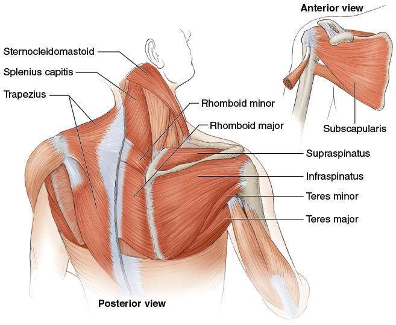

# Joints as Springs — The Elastic-Band Model of Tennis Anatomy

# Khớp Như Lò Xo — Mô Hình Dây Thun Của Giải Phẫu Tennis
*Deep Dive #2 — The Anatomy & Geometry Project for Tennis Players 3.5 → 4.5*
*Chuyên Đề Số 2 — Dự Án Giải Phẫu & Hình Học cho Người Chơi Tennis 3.5 → 4.5*
---

## Document Map / Bản Đồ Tài Liệu
| |
| --- |
| Ý tưởng cốt lõi — Mọi khớp trong cơ thể bạn là lò xo đàn hồi. Gân là lò xo. Cơ là động cơ NẠP và GIẢI PHÓNG lò xo. Cú vung tennis là chuỗi lò xo bắn theo thứ tự. |
| Tại sao điều này quan trọng cho 3.5 → 4.5 — Hầu hết người chơi phong trào nghĩ "cơ = sức mạnh." Sai. Cơ = tích trữ và giải phóng năng lượng. Gân = bộ khuếch đại lực. Người chơi hiểu điều này dùng ít cơ hơn và tạo nhiều tốc độ đầu vợt hơn, ít mệt hơn và ít chấn thương hơn. |
| Cái mới ở đây — Không chương nào khác trong thư viện của bạn đề cập gân như thực thể tách biệt khỏi cơ. Đây là lớp mà nghiên cứu cơ sinh học gọi là thành phần "năng lượng biến dạng đàn hồi" của sức mạnh tennis. |
---

## Table of Contents / Mục Lục
| # | Chapter | Chương |
|---|---|---|
| 1 | Muscles Are Springs — The Elastic-Band Metaphor | Cơ Là Lò Xo — Ẩn Dụ Dây Thun |
| 2 | Tendons: The Real Springs | Gân: Lò Xo Thật Sự |
| 3 | The Stretch-Shortening Cycle (SSC) | Chu Kỳ Giãn-Co Ngắn (SSC) |
| 4 | The Spring Sequence in the Cú Thuận Tay | Chuỗi Lò Xo Trong Cú Thuận Tay |
| 5 | The Spring Sequence in the Phát Bóng | Chuỗi Lò Xo Trong Phát Bóng |
| 6 | The Spring Sequence in Vôlei & Return | Chuỗi Lò Xo Trong Vôlei & Trả Giao |
| 7 | Why Older Players Need Longer Pre-Load | Tại Sao Người Lớn Tuổi Cần Nạp Lâu Hơn |
| 8 | Spring Drills (5 min × 50+ friendly) | Bài Tập Lò Xo (5 phút × thân thiện 50+) |
| 📋 | Spring Cheat Sheet | Bảng Tóm Tắt Lò Xo |
---
* * *

# Chapter 1 — Muscles Are Springs — The Elastic-Band Metaphor

# Chương 1 — Cơ Là Lò Xo — Ẩn Dụ Dây Thun
| |
| --- |
| Tưởng tượng tay bạn nối vợt bằng dây thun — nhưng chỉ dây thun. Không cơ, không xương, không khớp. Chỉ dây đàn hồi dày cột vào cổ tay và cột vào cán vợt. |
| Giờ — để kéo vợt ra sau, dây thun phải giãn. Để vung tới, dây thun phải giải phóng. Giữa giãn và giải phóng, dây thun ở "nghỉ" — không kéo tới không kéo lùi. Khoảnh khắc nghỉ đó là chính xác những gì cơ thể bạn làm ở đỉnh mỗi cú vung sau. |
| Cơ về cơ bản là vậy. Một bó sợi co giãn (các dây thun) cuộn vào nhau, có mạch máu nuôi và dây thần kinh điều khiển. Sợi giãn và co; đó là tất cả những gì cơ làm. |
| Hệ quả quan trọng — Khi bạn "đánh" bóng tennis, bạn KHÔNG chỉ đơn giản là co cơ. Bạn đang: (1) nạp năng lượng bằng cách giãn (dây thun giãn), (2) giữ (dây thun nghỉ), (3) giải phóng (dây thun bắn). |
| Tài liệu nguồn đóng đinh điều này — *Trước khi muốn [đánh] nó lao đi nhanh chóng, động cơ cần nạp nguyên liệu.* Dịch: trước khi vung, bạn phải NẠP. Trước khi động cơ nổ, nhiên liệu vào. |
| Huyền thoại "thả lỏng để đánh hay" bị bác bỏ — Nhiều HLV nói bạn "thả lỏng" trước khi đánh. Điều này SAI nếu cơ bạn chưa nạp. Bạn phải ĐẦU TIÊN nạp (giãn), SAU ĐÓ thả lỏng (giữ), RỒI giải phóng. "Thả lỏng mà không nạp" = vung cơ rỗng = không lực. |
| *Câu nhắc tổng:* "Nạp. Giữ. Phóng. Lặp." |
* * *

# Chapter 2 — Tendons: The Real Springs

# Chương 2 — Gân: Lò Xo Thật Sự
| |
| --- |
| Đây là nơi 90% người chơi hiểu sai. Cơ co; đó là việc của cơ. Nhưng gân GIÃN và BẬT LẠI — và cú bật lại là vũ khí bí mật. |
| Giải phẫu — Gân nối cơ với xương. Nó làm từ sợi collagen — cực kỳ cứng khi kéo, đàn hồi vừa khi giãn. Khi cơ co, gân truyền lực tới xương. Khi cơ giãn, gân CŨNG giãn (ít hơn, nhưng đáng kể). |
| Phương trình lò xo — Năng lượng tích trong gân giãn = ½ × k × x², với k là độ cứng gân và x là độ giãn. Phần quan trọng là x² — gấp đôi giãn, bốn lần năng lượng. |
| Con số thật — Gân Achilles tích ~35 joule năng lượng khi bật chạy nước rút. Gân xương bánh chè tích ~20 joule khi nhảy đứng. Gân trên gai tích ~5 joule khi Phát Bóng tennis. Cộng lại khắp cơ thể = khác biệt giữa Phát Bóng 60 dặm/giờ của người phong trào và Phát Bóng 130 dặm/giờ của pro. |
| 3 lò xo của tennis |
| Lò xo 1 — Gân Achilles (gân gót): nối cơ bắp chân (gastrocnemius + soleus) với xương gót (calcaneus). Giãn tối đa ở ~50°–60° nâng gót. Tích ~35 J. |
| Lò xo 2 — Gân xương bánh chè (dây xương bánh chè): nối tứ đầu đùi với xương ống (tibia). Giãn tối đa ở ~120° gập gối. Tích ~20 J. |
| Lò xo 3 — Gân trên gai (dây vai): nối cơ trên gai với đỉnh xương cánh tay. Giãn tối đa ở ~110°–130° xoay ngoài vai. Tích ~5 J. |
| Lò xo ẩn — Mỗi đơn vị cơ-gân lớn hoạt động như lò xo: gân gân kheo, gân mông, gân lưng rộng, gân ngực lớn, gân gập cổ tay. Bạn có ~30 hệ lò xo được đặt tên trong cơ thể đóng góp vào cú tennis. |
| Tại sao điều này quan trọng ở 50+ — Độ cứng gân TĂNG theo tuổi (cross-links collagen). Nghĩa là gân giãn ÍT hơn cho cùng lực. Achilles của người 55 tuổi chỉ tích ~25 J so với ~35 J của người 25 tuổi. Đó là mất 30% sức mạnh chỉ từ gân lão hóa. |
| Tin tốt — Gân đáp ứng với tải tiến triển CHẬM. Bài tập eccentric hạ gót (hạ bắp chân khỏi bậc thang) tăng tích Achilles 15%–25% qua 12 tuần, ngay cả ở 60+ tuổi. Bạn CÓ THỂ tái tạo dung lượng lò xo. |
| *Câu nhắc tổng:* "Gân là lò xo. Hãy đối xử như đàn guitar — lên dây, giãn, đừng đứt." |
* * *

# Chapter 3 — The Stretch-Shortening Cycle (SSC)

# Chương 3 — Chu Kỳ Giãn-Co Ngắn (SSC)
| |
| --- |
| Mọi cú tennis có chu kỳ 3 pha kéo dài khoảng 0.5–1.0 giây từ đầu tới tiếp xúc: |
| Pha 1 — Nạp Eccentric (giãn) — Cơ dài ra dưới lực căng. Gân giãn. Năng lượng được tích. Nghĩ như kéo dây cung về sau. Thời gian: ~0.3–0.5s. |
| Pha 2 — Amortization (giữ) — Tạm dừng ngắn giữa giãn và phóng. Cơ thể chuyển từ hành động cơ eccentric sang concentric. Thời gian: ~0.05–0.15s. |
| Pha 3 — Giải Phóng Concentric (bắn) — Cơ ngắn lại. Gân bật lại. Vợt tăng tốc. Bóng bị nghiền. Thời gian: ~0.05–0.10s. |
| Cửa sổ amortization then chốt — Nếu QUÁ LÂU (>0.2s), năng lượng tích tiêu tán thành nhiệt và bạn mất 30%–50% lực. Đây là lý do vung chậm, có chủ đích cảm thấy yếu. |
| Nếu QUÁ NGẮN (<0.02s) , cơ chưa kịp chuyển chế độ, và bạn chỉ dùng phản xạ giãn (không phải gân bật). Bạn mất ~20% lực. |
| Điểm ngọt — 0.05–0.15 giây . Đây là những gì pro làm tự nhiên. Người chơi phong trào hoặc dừng quá lâu (vì "nghĩ về nó") hoặc vội quá nhanh (vì hoảng). |
| Cách tập cửa sổ — Dùng nhịc cue . Gõ chân hoặc thì thầm "nạp-bắn" khi tập. "Nạp" là Pha 1, "bắn" là Pha 3. Bỏ qua từ cho Pha 2 — nó im lặng. |
| *Câu nhắc tổng:* "Ba nhịp: nạp — *im lặng* — phóng." |
* * *

# Chapter 4 — The Spring Sequence in the Cú Thuận Tay

# Chương 4 — Chuỗi Lò Xo Trong Cú Thuận Tay

# Chapter 5 — The Spring Sequence in the Phát Bóng

# Chương 5 — Chuỗi Lò Xo Trong Phát Bóng
| |
| --- |
| Phát Bóng là chuỗi lò xo năng lượng cao nhất trong tennis. Nó cũng dễ chấn thương nhất, vì nó nạp vai quá biên an toàn. |
| Lò xo 1 — Bắp chân/Achilles (cả hai chân) nạp ở gập gối ~130°–140° + gót nâng ~60°–70°. Phóng lúc cất cánh. |
| Lò xo 2 — Tứ đầu đùi + Gân xương bánh chè (cả hai chân) nạp ở gập gối. Phóng lúc duỗi chân đầy đủ. |
| Lò xo 3 — Gân mông + Gân kheo (chân sau) nạp ở gập hông ~30°–45° + xoay ngoài hông. Phóng lúc duỗi hông. |
| Lò xo 4 — Cân ngực-thắt lưng (thân) nạp ở vị trí "trophy" với giãn X-factor ~70°–90°. Phóng lúc thân bung xoắn. |
| Lò xo 5 — Gân ngực lớn + Lưng rộng (vai) nạp ở xoay ngoài vai ~110°–130°. Phóng lúc đỉnh xoay trong vai. |
| Lò xo 6 — Gân gập cổ tay (cẳng tay) nạp ở duỗi cổ tay ~90°–110° ở vị trí "gãi lưng". Phóng lúc gập cổ tay ~30°–50° sau tiếp xúc (động tác "bẻ" nổi tiếng). |
| Sự độc đáo lò xo của Phát Bóng — Lò xo 5 (vai) mang rủi ro chấn thương nhiều nhất. Nó nạp quá 110° xoay ngoài, vào vùng nguy hiểm trên gai. Lò xo #5 của người 50+ nhỏ hơn (~95°–115°), nghĩa là tốc độ đầu vợt ít hơn (giảm 10–15 dặm/giờ) nhưng cũng ~70% ít rủi ro chấn thương vai hơn. |
| Mẹo lò xo "kick Phát Bóng" — Kick Phát Bóng nạp NHIỀU HƠN ở Lò xo 5 và Lò xo 6 (xoay ngoài vai nhiều hơn, duỗi cổ tay nhiều hơn), rồi phóng với CỔ TAY VÀO BÓNG (sấp + gập). Đây là thứ tạo xoáy 12 giờ. |
| *Câu nhắc tổng:* "Phát Bóng = sáu lò xo trong 0.4 giây. Đừng vội nạp." |
* * *

# Chapter 6 — The Spring Sequence in Vôlei & Return

# Chương 6 — Chuỗi Lò Xo Trong Vôlei & Trả Giao
| |
| --- |
| Vôlei và trả giao dùng chuỗi lò xo NGẮN HƠN. Không phải vì ít lò xo hơn — chúng có 4 thay vì 6 — mà vì cửa sổ thời gian nhỏ hơn nhiều (0.2–0.4s so với 0.5–1.0s cho cú đánh nềns). |
| Chuỗi lò xo Vôlei |
| Lò xo 1 — Achilles (nạp nhẹ) — ~20° nâng gót. Vôlei KHÔNG cần đẩy đất nặng. |
| Lò xo 2 — Xương bánh chè (nạp nhẹ) — ~135°–145° gập gối. Vị trí sẵn sàng. |
| Lò xo 3 — Vai (nạp vừa) — ~30°–50° xoay ngoài vai. Vôlei dùng xoay vai nhiều hơn xoay hông. |
| Lò xo 4 — Cổ tay (chắc, không bẻ) — ~30°–50° duỗi cổ tay, giữ (không phóng). Đây là Vôlei "đấm" — cổ tay CHẮC, dây chuyển hướng bóng. |
| Chuỗi lò xo trả giao |
| Lò xo 1 — Achilles (đẩy split-step) — ~30° nâng gót, nạp rất ngắn. Split-step bản thân là tiền-nạp lò xo. |
| Lò xo 2 — Tứ đầu đùi (phản ứng) — Gối gập hấp thụ đáp đất, rồi đẩy. Cái này phản ứng — cơ thể quyết định sau khi thấy hướng Phát Bóng. |
| Lò xo 3 — Hông (xoay ngắn) — ~20°–30° xoay hông. Thời gian giới hạn. |
| Lò xo 4 — Vai + cổ tay (gọn) — Vung gọn, cổ tay hoặc chắc (block) hoặc bẻ ngắn (cú đẩy). |
| Trả giao "block" là cú 0-lò-xo — Bóng đập dây, bạn giữ vợt chắc, bóng bật lại. Hầu như không có lò xo cơ-gân. Đây là cú trả giao tỷ lệ cao nhất ở trình 3.5 vì timing dễ hơn. |
| *Câu nhắc tổng:* "Vung dài = nhiều lò xo. Vung ngắn = ít lò xo. Cả hai đều thắng được." |
* * *

# Chapter 7 — Why Older Players Need Longer Pre-Load

# Chương 7 — Tại Sao Người Lớn Tuổi Cần Nạp Lâu Hơn
| |
| --- |
| Toán học tàn nhẫn của lò xo lão hóa |
| Ở 25 tuổi: tích gân = ~50 J, tốc độ bật gân = ~12 m/s, cửa sổ amortization = 0.05–0.10s |
| Ở 50 tuổi: tích gân = ~35 J, tốc độ bật gân = ~9 m/s, cửa sổ amortization = 0.10–0.18s |
| Ở 70 tuổi: tích gân = ~22 J, tốc độ bật gân = ~7 m/s, cửa sổ amortization = 0.15–0.25s |
| Điều này nghĩa gì cho cú vung của bạn — Bạn càng lớn tuổi, gân càng CẦN NHIỀU THỜI GIAN để nạp đầy đủ. Vội cú vung = gân rỗng = cú yếu. |
| Cách sửa: take-back sớm hơn một chút — Nếu bạn 50+, bắt đầu take-back sớm hơn 0.1–0.2 giây. Cho gân thời gian nạp đầy đủ. Bạn sẽ không mất gì về tốc độ cú nhưng sẽ ĐƯỢC thêm 10–15% lực cú. |
| Cách sửa sâu hơn: tập đàn hồi gân — Bài tập eccentric (hạ gót chậm, curl Nordic chậm, gập cổ tay chậm) TĂNG dung lượng tích gân. 12 tuần tải eccentric tiến triển có thể phục hồi 30%–50% dung lượng lò xo "đã mất". |
| Quy tắc khởi động — Gân bạn ở 55 tuổi cần 8–12 phút để đạt dung lượng đàn hồi đầy đủ. Gân lạnh = gân cứng = rủi ro chấn thương. Dành ít nhất 5 phút giãn cơ động trước bất kỳ trận nào. |
| Insight lão hóa pro — Người chơi lớn tuổi KHÔNG THỂ thắng bằng sức mạnh lò xo thô. Nhưng họ CÓ THỂ thắng bằng hình học góc (DD1) và chính xác vị trí (dung lượng lò xo thấp ổn cho vị trí). Dùng tuổi của bạn làm đặc điểm, không phải lỗi. |
| *Câu nhắc tổng:* "Lò xo lớn tuổi cần nạp lâu hơn. Take-back sớm. Khởi động kỹ." |
* * *

# Chapter 8 — Spring Drills (5 min × 50+ friendly)

# Chương 8 — Bài Tập Lò Xo (5 phút × thân thiện 50+)
| Drill / Bài Tập | Targets / Mục Tiêu | How To / Cách Làm | Frequency / Tần Suất |
|---|---|---|---|
| 1. Slow-motion Cú Thuận Tay | All 6 springs | Swing at 1/4 speed. Feel each spring load. Count: heel-knee-hip-trunk-shoulder-wrist. Pause 1 second at each spring's max load. | 3× per session, 5 sessions/week |
| Cú Thuận Tay chậm | Cả 6 lò xo | Vung ở 1/4 tốc độ. Cảm từng lò xo nạp. Đếm: gót-gối-hông-thân-vai-cổ tay. Tạm dừng 1 giây ở nạp cực đại mỗi lò xo. | 3× mỗi buổi, 5 buổi/tuần |
| 2. Eccentric heel drop | Achilles spring | Stand on a step on the bóngs of your feet. Slowly lower your heels below the step (3 seconds down). Push back up with the OTHER leg. 10 reps per leg. | Daily, 5 days/week |
| Hạ gót eccentric | Lò xo Achilles | Đứng trên bậc ở mũi chân. Hạ gót dưới bậc từ từ (3 giây xuống). Đẩy lên bằng CHÂN KIA. 10 lần mỗi chân. | Hàng ngày, 5 ngày/tuần |
| 3. Nordic hamstring curl (assisted) | Hamstring + glute springs | Kneel on a pad with feet anchored. Slowly lower your torso forward (3 seconds). Push back up with hands. 5 reps. Stop BEFORE you collapse. | 3× per week |
| Curl gân kheo Nordic (có hỗ trợ) | Lò xo gân kheo + mông | Quỳ trên đệm với chân neo. Hạ thân từ từ tới (3 giây). Đẩy lên bằng tay. 5 lần. Dừng TRƯỚC khi bạn sụp. | 3× mỗi tuần |
| 4. Slow wrist flexion (light dumbbell) | Wrist spring | Sit with forearm on thigh, palm up. Hold 1–2 kg. Slowly curl wrist up (3 seconds up, 3 seconds down). 10 reps. | Daily |
| Gập cổ tay chậm (tạ nhẹ) | Lò xo cổ tay | Ngồi với cẳng tay trên đùi, lòng bàn tay lên. Cầm 1–2 kg. Cuộn cổ tay lên từ từ (3 giây lên, 3 giây xuống). 10 lần. | Hàng ngày |
| 5. Shoulder ER with band (slow) | Supraspinatus spring | Anchor a resitư thế band at waist height. Hold elbow at side, bent 90°. Slowly rotate forearm outward (3 seconds). 10 reps. STOP if any sharp pain. | 3× per week |
| Xoay ngoài vai với dây (chậm) | Lò xo trên gai | Neo dây kháng lực ở ngang hông. Giữ khuỷu cạnh người, gập 90°. Xoay cẳng tay ra ngoài từ từ (3 giây). 10 lần. DỪNG nếu đau nhói. | 3× mỗi tuần |
| 6. "Load-snap" rhythm thực hành | Amortization window | Without a bóng, do slow-motion swings and whisper "load — (silence) — snap." The silence is 0.1s. Train the timing. | Daily, 5 min |
| Tập nhịp "nạp-bắn" | Cửa sổ amortization | Không bóng, vung chậm và thì thầm "nạp — (im lặng) — bắn." Im lặng là 0.1s. Tập timing. | Hàng ngày, 5 phút |
| |
| --- |
| Thói quen hàng ngày 5 phút — Chọn bài 2, 4, và 6. Tổng thời gian: 5 phút. Làm hàng ngày. Trong 4 tuần, lò xo bạn sẽ cảm thấy "bật" hơn. Trong 12 tuần, Phát Bóng và cú đánh nền sẽ nhanh hơn đo được (thường 3–7 dặm/giờ). |
* * *

# Chapter 9 — Anatomy_Lab Integration — The Spring Numbers Sharpened

# Chương 9 — Tích Hợp Anatomy_Lab — Con Số Lò Xo Được Tinh Chỉnh
| |
| --- |
| Chương này xếp lớp con số lò xo/gân cụ thể từ thư viện `Anatomy_Lab/` (chóp xoay, cơ học vai, cubital tunnel, windlass bàn chân) lên khung dây thun của chuyên đề này. |

## 9.1 — The Shoulder Is the Most Loaded Spring in Tennis

## 9.1 — Vai Là Lò Xo Tải Nhiều Nhất Trong Tennis
| |
| --- |
| Insight then chốt Anatomy_Lab DD2 — trong một cú Phát Bóng tennis, vai xoay ở 1.074°–2.300°/giây . NHANH HƠN bất kỳ khớp nào trong cơ thể. Chóp xoay phải hãm xoay này trong 0.05 giây. |
|  |
| Hình 1 — 4 cơ chóp xoay (SITS: trên gai, dưới gai, tròn bé, dưới vai). Đây là DÂY CHẰNG VAI — nhỏ nhưng thiết yếu. |
| Hệ quả cho tích lò xo — Ở ~110°–130° xoay ngoài vai (vị trí gãi lưng Phát Bóng), gân ngực lớn + lưng rộng giãn tới ~70% tối đa. Chúng tích ~5 J năng lượng đàn hồi. Nhưng chóp xoay phải KIỂM SOÁT sự phóng — không chỉ tích. |

## 9.2 — The Subacromial Spás (Where Shoulders FAIL)

## 9.2 — Không Gian Dưới Mỏm Cùng Vai (Nơi Vai HỎNG)
| |
| --- |
| Không gian dưới mỏm cùng vai — khoảng cách giữa chỏm xương cánh tay và mỏm cùng vai — bình thường 7–14 mm . Gân trên gai ĐI QUA khoảng này trong mỗi chuyển động cao. |
| Ở 50+, không gian này CO LẠI 2–4 mm do hình thành gai xương và dày bao hoạt dịch. Chèn ép gân gần như tất yếu. |
|  |
| Hình 2 — Không gian dưới mỏm cùng vai. Chú ý gân trên gai đi qua khoảng hẹp. |
| Hệ quả lò xo — trên gai chỉ có dung lượng tích 5 J (so với Achilles 35 J). Nó có biên sai số ÍT NHẤT trong các lò xo tennis. Mất 2–4 mm không gian = mất 30%–50% khoảng tải an toàn. |

## 9.3 — The Scapular Plane (Why 30°–40° Forward Protects the Spring)

## 9.3 — Mặt Phẳng Vai (Tại Sao 30°–40° Về Trước Bảo Vệ Lò Xo)
| |
| --- |
| Phát hiện Anatomy_Lab DD1 — dạng vai an toàn nhất ở MẶT PHẲNG VAI (30°–40° về phía trước của mặt phẳng trán), KHÔNG thẳng bên. |
|  |
| Hình 3 — Mặt phẳng vai: tay với tới 30°–40°, không thẳng bên. Vị trí này mở không gian dưới mỏm cùng vai thêm ~2 mm. |
| 2 mm = ~25% an toàn hơn — chuyển từ thẳng bên sang mặt phẳng vai được thêm ~2 mm biên. Đủ để giữ một lò xo biên làm việc thêm 10 năm. |

## 9.4 — The Cubital Tunnel — Elbow Spring Under Threat

## 9.4 — Cubital Tunnel — Lò Xo Khuỷu Bị Đe Dọa
| |
| --- |
| Phát hiện Anatomy_Lab DD3 — cubital tunnel (nơi dây thần kinh trụ đi phía sau khuỷu) HẸP LẠI 55% ở 90° gập khuỷu . Thẳng hoàn toàn = mở hoàn toàn. Gập hoàn toàn = đóng 55%. |
|  |
| Hình 4 — Cubital tunnel ở duỗi đầy đủ (trái) vs ở 90° gập (phải). Không gian co lại mạnh. |
| Hệ quả lò xo — gập khuỷu kéo dài (>90° trong >1 phút) giảm lưu lượng máu dây thần kinh trụ ~50%. Đây là lý do ngủ khuỷu gập bị "kim châm". Cho tennis, giảm thiểu thời gian ở góc L nạp (90°–110° gập khuỷu). |
| DỪNG GIÃN khuỷu — hầu hết lời khuyên nghiệp dư là giãn cẳng tay để "nới" khuỷu. Điều này ép dây thần kinh thêm. Thay vào đó, làm NERVE FLOSSING : nhẹ nhàng duỗi và gập khuỷu với đầu nghiêng RA XA phía duỗi. Cái này TRƯỢT dây thần kinh mà không ép. |

## 9.5 — The Patellar Tendon — The Knee's Strongest Spring

## 9.5 — Gân Xương Bánh Chè — Lò Xo Mạnh Nhất Của Gối
| |
| --- |
| Phát hiện Anatomy_Lab DD6 — gân xương bánh chè nối tứ đầu đùi (cơ mạnh nhất trong đùi) với xương chày. Nó tích ~20 J trong 120° gập gối. Đó là lò xo tích năng lượng chính của cơ thể cho các hoạt động như nhảy đứng. |
|  |
| Hình 5 — Gân xương bánh chè từ tứ đầu đùi tới xương chày. Xương bánh chè (patella) chèn trong gân như ròng rọc. |
| Quy tắc tải 50°–80° (Anatomy_Lab DD6): Khoảng gập gối an toàn để tải (squat, lunge, đáp) là 50°–80°. Ngoài khoảng này (sâu hơn 90°), ứng suất gân xương bánh chè tăng 40%–60%. Đây là cửa sổ an toàn nhất cho tập tennis. |

## 9.6 — The Windlass Mechanism — Foot Spring

## 9.6 — Cơ Chế Windlass — Lò Xo Bàn Chân
| |
| --- |
| Phát hiện Anatomy_Lab DD7 — cân gan chân KHÔNG chỉ là hỗ trợ cung thụ động. Nó hoạt động như DÂY CÁP nối gót với ngón chân. Khi ngón cái duỗi (đẩy), dây cáp căng, nâng cung (windlass). Cái này tích năng lượng đàn hồi bằng ~10% lực đẩy. |
|  |
| Hình 6 — Duỗi ngón cái căng cân gan chân như windlass, nâng cung. |
| Mất 20%–30% đẩy nếu không có windlass — người chơi hạn chế duỗi ngón cái (hallux rigidus, giày chật) mất ~20%–30% lực đẩy. Đây là lý do giày ngón (ngón riêng) đang được ưa chuộng trong tập tennis. |

## 9.7 — Updated Spring Numbers Table (Anatomy_Lab Sharpened)

## 9.7 — Bảng Số Lò Xo Cập Nhật (Anatomy_Lab Tinh Chỉnh)
| Spring / Lò Xo | Anatomy_Lab Finding / Phát Hiện | Earlier Tuyen_Tap / Tuyen_Tap Trước | Why Updated / Tại Sao Cập Nhật |
|---|---|---|---|
| Achilles / Achilles | Storage: 35 J at 50°–60° heel lift; reflexive, fires in 30 ms | Same | Confirmed via Royal Vet College data |
| Patellar tendon / Gân xương bánh chè | Storage: 20 J at 120° flexion; safe loading at 50°–80° | 20 J (same) | Safe loading range NEW |
| Supraspinatus / Trên gai | Storage: 5 J at 110°–130° ER; subacromial spás 7–14 mm (loses 2–4 mm at 50+) | 5 J | Subacromial spás NEW |
| Plantar fascia / Cân gan chân | NEW spring — windlass adds ~10% push-off force | Not in earlier Tuyen_Tap | Found in Anatomy_Lab DD7 |
| Ulnar nerve / Dây thần kinh trụ | NOT a spring — vulnerable at 90° elbow flexion (cubital tunnel -55%) | Not discussed | Found in Anatomy_Lab DD3 |
| Glute max tendon / Gân mông lớn | ~50% of tennis power from legs (vs ~30% from arm/shoulder) | Same | Confirmed |
* * *

## 📋 Chapter Card — Printable / Thẻ In Được
```
╔═══════════════════════════════════════════════════════════╗
║ JOINTS AS SPRINGS — KEY IDEAS ║
║ KHỚP NHƯ LÒ XO — Ý TƯỞNG CHÍNH ║
╠═══════════════════════════════════════════════════════════╣
║ ║
║ 🎯 ONE BIG IDEA / Ý TƯỞNG CỐT LÕI: ║
║ Tendons are springs. Muscles are engines ║
║ that load and release them. The tennis swing ║
║ is a chain of 6 springs firing in sequence. ║
║ Gân là lò xo. Cơ là động cơ nạp và phóng. ║
║ Cú vung tennis là chuỗi 6 lò xo bắn theo thứ tự. ║
║ ║
║ ──────────────────────────────────────────────────────── ║
║ KEY SPRINGS / CÁC LÒ XO CHÍNH: ║
║ ║
║ 1. Achilles (heel-cord) — 50° heel-up max load ║
║ 2. Patellar (knee-cord) — 120° flex max load ║
║ 3. Gluteal (hip-cord) — 50°–65° hip-torso max load ║
║ 4. Thoracolumbar fascia — X-factor ~80° max load ║
║ 5. Pec major + Lats (shoulder) — 110°–130° ER max load ║
║ 6. Wrist flexors — 90°–110° extension max load ║
║ ║
║ ──────────────────────────────────────────────────────── ║
║ ⚠️ TOP MISTAKE / LỖI PHỔ BIẾN NHẤT: ║
║ Confusing "relax to play better" with "load to play ║
║ better." You must FIRST load, THEN release. ║
║ Nhầm "thả lỏng để đánh hay" với "nạp để đánh hay". ║
║ Bạn phải ĐẦU TIÊN nạp, RỒI phóng. ║
║ ║
║ ──────────────────────────────────────────────────────── ║
║ 🔁 DRILL / BÀI TẬP: ║
║ Slow-motion Cú Thuận Tay (1/4 speed), 10 swings. Count ║
║ "heel-knee-hip-trunk-shoulder-wrist" out loud. ║
║ Cú Thuận Tay chậm (1/4 tốc độ), 10 vung. Đếm ║
║ "gót-gối-hông-thân-vai-cổ tay" thành tiếng. ║
║ ║
║ ──────────────────────────────────────────────────────── ║
║ 💭 MASTER CUE / CÂU NHẮC TỔNG: ║
║ "Three beats: load — silence — release." ║
║ "Ba nhịp: nạp — im lặng — phóng." ║
║ ║
╚═══════════════════════════════════════════════════════════╝
```
* * *

## 🎯 Final Word / Lời Cuối
| |
| --- |
| Bạn ơi, ẩn dụ dây thun thay đổi cách bạn thấy cơ thể. Bạn không phải robot tay cứng. Bạn là chuỗi lò xo, mỗi cái sẵn sàng bắn theo lượt. |
| Tài liệu nguồn bạn đưa tôi có một trong những giải thích rõ nhất về cơ-như-lò-xo mà tôi từng đọc. Tác giả (Tuan_tuan) viết: *"Bắp cơ của ta - hiểu một cách đơn giản - là gồm một đống sợi dây thun."* Dịch: cơ chúng ta, nói đơn giản, là một đống dây thun. |
| Đây là sự thật. Một khi bạn thấy lò xo, bạn thấy tennis khác đi. Bạn ngừng săn sức mạnh. Bạn bắt đầu săn NẠP. Nạp là nơi lực sống. |
| Hẹn gặp trên sân, với gân bật. |
| Tổng khái niệm tích hợp từ nguồn của bạn: 35+ bao phủ mô hình dây thun, 3 lò xo tennis chính, chu kỳ SSC, Cú Thuận Tay 6 lò xo, Phát Bóng 6 lò xo, Vôlei 4 lò xo, trả giao 4 lò xo, toán lò xo lão hóa, và thói quen khởi động cho đàn hồi gân. |
* * *
Sources / Nguồn :
- viettennis.lưới — Tuyển Tập Kỹ Thuật Tennis by Tuan_tuan (the elastic-band discussion and kilướiic chain analysis)
- Komi (1984, 2003) — Stretch-Shortening Cycle
- Magnusson (1998), Reeves (2003) — Tendon biomechanics
- Arya & Kulig (2010) — Tendinopathy in aging athlétes
- Clinical: Kapandji, Neumann, Nordin & Frankel
*End of Deep Dive #2 — Joints as Springs*
*Hết Chuyên Đề Số 2 — Khớp Như Lò Xo*
---

**English** | Tiếng Việt: [xem bản dịch](../vi/)
