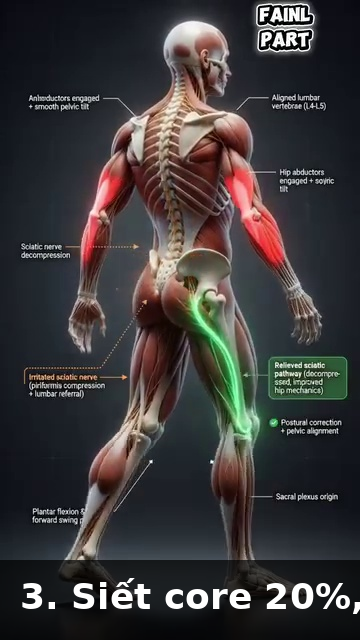

# Muscle Hierarchy — Which Muscles Fire When, Segment by Segment

# Hệ Thống Cơ Bậc — Cơ Nào Bắn Khi Nào, Theo Từng Đoạn Cơ Thể
*Deep Dive #4 — The Anatomy & Geometry Project for Tennis Players 3.5 → 4.5*
*Chuyên Đề Số 4 — Dự Án Giải Phẫu & Hình Học cho Người Chơi Tennis 3.5 → 4.5*
---

## Document Map / Bản Đồ Tài Liệu
| |
| --- |
| Chuyên đề này bao phủ — Hành trình theo từng đoạn của mọi cơ quan trọng trong tennis. Với mỗi cơ, bạn có: tên, vị trí, khi nào bắn trong mỗi cú, tại sao bắn, chuyện gì xảy ra nếu không bắn, và ghi chú 50+. |
| Tài liệu này KHÔNG phải là — Không phải cẩm nang kỹ thuật cú. Không phải sách giải phẫu. Không phải hướng dẫn tập. Đây là lớp giữa GÓC (DD1) và LÒ XO (DD2) — các cơ thực sự di chuyển các góc và nạp các lò xo. |
| Tại sao điều này quan trọng ở 3.5 → 4.5 — Hầu hết người chơi biết "dùng chân". Ít người biết rằng mông lớn bắn 0.1s TRƯỚC tứ đầu đùi trong Cú Thuận Tay. Biết cơ nào bắn theo thứ tự nào là khác biệt giữa "cố gắng" và "bắn chính xác". |
---

## Table of Contents / Mục Lục
| # | Chapter | Chương |
|---|---|---|
| 1 | The Source's Big Insight — Muscle Strength ≠ Muscle Order | Insight Lớn Của Nguồn — Sức Cơ ≠ Thứ Tự Cơ |
| 2 | The Lower-Body Segment — Hip, Knee, Ankle | Đoạn Thân Dưới — Hông, Gối, Cổ Chân |
| 3 | The Trunk Segment — Core Muscles | Đoạn Thân — Cơ Lõi |
| 4 | The Shoulder Segment — Rotator Cuff & Deltoids | Đoạn Vai — Chóp Xoay & Delta |
| 5 | The Arm Segment — Biceps, Triceps, Forearm | Đoạn Tay — Nhị Đầu, Tam Đầu, Cẳng Tay |
| 6 | The Wrist & Hand Segment | Đoạn Cổ Tay & Bàn Tay |
| 7 | The Stroke-by-Stroke Muscle Sequence | Chuỗi Cơ Theo Từng Cú |
| 8 | Why Muscles Fail in Different Ways at 50+ | Tại Sao Cơ Hỏng Theo Cách Khác Nhau Ở 50+ |
| 📋 | Muscle Map Cheat Sheet | Bảng Tóm Tắt Cơ |
---
* * *

# Chapter 1 — The Source's Big Insight — Muscle Strength ≠ Muscle Order

# Chương 1 — Insight Lớn Của Nguồn — Sức Cơ ≠ Thứ Tự Cơ
| |
| --- |
| Tài liệu nguồn có một insight mạnh mà hầu như không HLV tennis nào dạy: sức cơ không phải yếu tố quan trọng nhất — THỨ TỰ kích hoạt cơ mới là. |
| Nguồn nói (diễn giải): *"Cấu trúc cơ thể phân bố các cơ mạnh yếu không đều nhau, và các nhóm cơ này cũng không tham gia bằng nhau khi đánh bóng. Mỗi khi động tác chúng ta đi tới vùng giới hạn nào đó của cơ thể, nhóm lực mạnh ban đầu lại trở nên yếu đi, và sẽ có nhóm cơ tiếp quản nguồn lực mạnh này (nếu ta biết cách sử dụng)."* |
| Dịch — Cơ thể có hệ thống phân cấp cơ. Cơ mạnh bắt đầu chuyển động. Khi chúng tới giới hạn biên, cơ yếu-hơn-nhưng-nhanh-hơn tiếp quản. Cú vung tennis là cuộc đua tiếp sức — mạnh-sang-nhanh, đoạn theo đoạn. |
| Chuỗi tiếp sức trong tennis |
| Chân thứ nhất — Mạnh, chậm (mông lớn, tứ đầu đùi, lưng rộng, ngực lớn). Cơ lớn, bắn chậm (~0.10–0.15s trễ), nhưng tạo lực nhiều nhất. |
| Chân thứ hai — Trung bình, trung bình (delta, bụng, gân kheo). Cỡ trung, tốc độ trung (~0.05–0.10s trễ). |
| Chân thứ ba — Nhỏ, nhanh (chóp xoay, gập/duỗi cổ tay, cơ bàn tay nội tại). Nhỏ, nhanh (~0.02–0.05s trễ), tạo điều chỉnh tinh tế. |
| Lỗi "cơ mạnh ở vị trí sai" — Nhiều người phong trào cố dùng cơ MẠNH (delta, nhị đầu) để ĐÁNH bóng. Nhưng delta chỉ có ~70° xoay hữu ích. Qua 70°, delta yếu cơ học. Đó là nơi cơ NHỎ NHANH tiếp quản — chóp xoay. |
| Hệ quả cho tập luyện — Đừng chỉ tập cơ MẠNH. Tập CUỘC TIẾP SỨC — sự tuần tự. Nâng nặng chậm (squat, bench press) tập cơ mạnh. Bài phối hợp nhanh (ném bóng y tế, lắc vợt) tập timing tiếp sức. |
| *Câu nhắc tổng:* "Mạnh sang nhanh, đoạn theo đoạn. Đừng để một cơ làm cả cuộc tiếp sức." |
* * *

# Chapter 2 — The Lower-Body Segment — Hip, Knee, Ankle

# Chương 2 — Đoạn Thân Dưới — Hông, Gối, Cổ Chân
| |
| --- |
| Cơ hông (động cơ của mọi cú) |
| Mông lớn — Cơ lớn nhất, mạnh nhất trong cơ thể. DUỖI hông chính (di chuyển đùi ra sau). Bắn khi nạp Cú Thuận Tay (giãn) và tiếp xúc (co nổ). Kích hoạt: ~30%–50% tối đa trong Cú Thuận Tay, ~50%–70% trong Phát Bóng. |
| Mông nhỡ — Bên hông. DẠNG hông (di chuyển đùi ra ngoài). Quan trọng cho ổn định ngang khi split-step và bước ngang. Kích hoạt: ~40%–60% khi split-step, ~30%–40% trong Cú Thuận Tay. |
| Psoas lớn + Iliacus — Cơ GẬP hông (di chuyển đùi tới). Bắn trong hồi (sau tiếp xúc) để mang chân về. Cũng bắn trong NẠP Cú Trái Tay (giãn hông vào duỗi). Kích hoạt: ~20%–30% trong Cú Thuận Tay, ~50%–70% trong hồi sprint. |
| 6 cơ xoay hông sâu (piriformis, gemellus trên, gemellus dưới, obturator trong, obturator ngoài, quadratus femoris). Xoay đùi RA NGOÀI. Quan trọng cho xoay hông trong nạp Cú Thuận Tay (~60°). Cơ nhỏ, nhưng thiết yếu. |
| Cơ gối (hệ truyền lực) |
| Tứ đầu đùi (4 cơ: thẳng đùi, rộng ngoài, rộng trong, rộng giữa). DUỖI gối. Bắn nửa sau của duỗi gối (pha đẩy). Kích hoạt: ~30%–50% trong nhảy Phát Bóng, ~50%–80% trong đáp split-step. |
| Gân kheo (3 cơ: nhị đầu đùi, bán gân, bán màng). GẬP gối và DUỖI hông. Bắn khi gập gối split-step VÀ khi duỗi hông cú đánh nền. Kích hoạt: ~40%–60% split-step, ~30%–50% Cú Thuận Tay. |
| Cơ cổ chân + bàn chân |
| Gastrocnemius + Soleus — Cơ bắp chân. GẬP LÒNG (chỉ ngón chân xuống). Bắn khi gót nâng (nạp) và khi đẩy khởi hành (phóng). Kích hoạt: ~50%–80% cất cánh Phát Bóng, ~40%–60% split-step. |
| Chày trước — Phía trước xương chày. GẬP LƯNG (kéo ngón chân lên). Bắn khi chân cần đáp mềm. Kích hoạt: ~30%–50% khi đáp split-step hoặc nhảy. |
| Cơ bàn chân nội tại — 20+ cơ nhỏ trong chính bàn chân. Chúng tạo CUNG, phân phối trọng lượng, và cung cấp thăng bằng tinh tế. Kích hoạt: ~10%–30% liên tục, cao hơn nhiều trong các cú thử thách thăng bằng. |
* * *

# Chapter 3 — The Trunk Segment — Core Muscles

# Chương 3 — Đoạn Thân — Cơ Lõi
| |
| --- |
| "Lõi" không phải một cơ . Nó ít nhất 12 cơ làm việc cùng nhau. Việc của lõi trong tennis là TRUYỀN lực từ chân tới tay. Nếu lõi hỏng, chuỗi động lực đứt. |
| 4 cơ bụng |
| Bụng thẳng — "Sáu múi." GẬP thân (gập thân tới). Bắn nửa sau của Cú Thuận Tay (follow-through). Kích hoạt: ~20%–40% Cú Thuận Tay, ~40%–60% Phát Bóng. |
| Chéo ngoài — Bên bụng. XOAY thân (xoắn thân) và gập bên. Cơ xoay thân chính trong tennis. Kích hoạt: ~40%–60% Cú Thuận Tay, ~50%–70% Phát Bóng. |
| Chéo trong — Sâu hơn chéo ngoài, chạy hướng chéo NGƯỢC. Làm việc VỚI chéo ngoài để xoay thân. Kích hoạt: ~40%–60% Cú Thuận Tay. |
| Bụng ngang — Bụng sâu nhất. Hoạt động như CORSET quanh thân. Ổn định cột sống trong mọi chuyển động xoay. Bắn trước bất kỳ chuyển động chi nào — đó là cơ "tiền-kích hoạt". Kích hoạt: ~10%–30% liên tục, ~30%–50% Phát Bóng. |
| Cơ lưng |
| Dựng sống (3 cột: chậu-sườn, dài nhất, gai). Chạy dọc cột sống. DUỖI thân (giữ thân thẳng) và XOAY (ở cột sống ngực). Bắn khi NẠP Cú Thuận Tay để giữ thân thẳng, và khi phóng để tạo lực thân tới. Kích hoạt: ~30%–50% Cú Thuận Tay, ~50%–70% Phát Bóng. |
| Multifidus — Cơ lưng sâu. Ổn định PHÂN ĐOẠN cột sống. Mỗi multifidus điều khiển 1–2 đốt sống. Quan trọng cho ngăn chấn thương lưng khi xoay. Kích hoạt: mức thấp liên tục, ~20%–40% khi xoay. |
| Vuông thắt lưng — Bên lưng dưới. GẬP BÊN (nghiêng thân ngang). Bắn trong Cú Thuận Tay nghiêng ngang để thêm xoáy trên. Kích hoạt: ~30%–50% Cú Thuận Tay, ~40%–60% Phát Bóng. |
| Cơ nối hông-thân |
| Lưng rộng — "Lat." Chạy từ lưng dưới tới cánh tay trên. Nối thân với tay. Vừa cơ thân VỪA cơ tay . Bắn trong Cú Trái Tay để kéo tay ngang người. Kích hoạt: ~40%–60% Cú Trái Tay, ~50%–70% Phát Bóng. |
* * *

# Chapter 4 — The Shoulder Segment — Rotator Cuff & Deltoids

# Chương 4 — Đoạn Vai — Chóp Xoay & Delta
| |
| --- |
| Vai là khớp phức tạp nhất trong cơ thể, với 9 cơ bắt qua. Mỗi cơ có vai trò cụ thể. |
| 4 cơ chóp xoay (DÂY CHẰNG CỦA VAI) |
| Trên gai — Đỉnh vai. Khởi tạo DẠNG tay (15°–30° đầu tiên của nâng). Cũng ỔN ĐỊNH chỏm xương cánh tay trong ổ cối. Cơ hay chấn thương nhất tennis. Kích hoạt: ~30%–50% Cú Thuận Tay, ~50%–70% Phát Bóng. |
| Dưới gai — Sau vai. XOAY NGOÀI (xoay tay ra ngoài). Bắn khi NẠP Cú Thuận Tay (chuẩn bị xoay ngoài) và khi Phát Bóng vị trí gãi lưng. Kích hoạt: ~40%–60% nạp Cú Thuận Tay, ~60%–80% nạp Phát Bóng. |
| Tròn bé — Dưới-sau vai. Hỗ trợ dưới gai xoay ngoài. Nhỏ hơn, ít lực hơn. Kích hoạt: ~20%–40% khi xoay ngoài. |
| Dưới vai — Trước vai (không thấy từ ngoài). XOAY TRONG (xoay tay vào trong). Bắn khi TIẾP XÚC Cú Thuận Tay để quất vợt qua. Kích hoạt: ~50%–70% tiếp xúc Cú Thuận Tay, ~60%–80% tiếp xúc Phát Bóng. |
| 3 phần delta |
| Delta trước — Trước vai. GẬP TAY TỚI (nâng tay tới). Cơ chính cho Vôlei. Kích hoạt: ~50%–70% Vôlei, ~30%–50% Cú Thuận Tay. |
| Delta giữa — Bên vai. DẠNG TAY (nâng tay ngang). Cơ chính cho chiều cao vai. Kích hoạt: ~40%–60% Cú Thuận Tay, ~50%–70% Phát Bóng. |
| Delta sau — Sau vai. DUỖI TAY (kéo tay ra sau). Bắn khi nạp Phát Bóng gãi lưng để đặt vợt sau đầu. Kích hoạt: ~30%–50% nạp Phát Bóng. |
| Cơ di chuyển lớn quanh vai |
| Ngực lớn — Ngực. KHÉP NGANG TAY (kéo tay ngang người). Cơ chính của roi Cú Trái Tay và Phát Bóng. Kích hoạt: ~60%–80% Cú Trái Tay, ~70%–90% Phát Bóng. |
| Lưng rộng (đếm ở thân nữa). "Lat." DUỖI + KHÉP + XOAY TRONG tay. Làm việc với ngực lớn để quất tay. Kích hoạt: ~50%–70% Cú Trái Tay, ~60%–80% Phát Bóng. |
| Cảnh báo vai 50+ — Gân trên gai có MÁU cung cấp KÉM. Sau 50 tuổi, nó thoái hóa ~1% mỗi năm ngay cả không chấn thương. Cộng với chuyển động giao bóng lặp lại, đó là lý do chấn thương vai liên quan Phát Bóng tăng vọt sau 50. Cách sửa : khởi động chóp xoay cụ thể (bài tập dây, tối thiểu 5 phút). |
* * *

# Chapter 5 — The Arm Segment — Biceps, Triceps, Forearm

# Chương 5 — Đoạn Tay — Nhị Đầu, Tam Đầu, Cẳng Tay
| |
| --- |
| Nhị đầu cánh tay — Trước cánh tay trên. GẬP KHUỶU (gập khuỷu) + NGỬA CẲNG TAY (xoay lòng bàn tay lên). Bắn trong takeback để gập khuỷu. Kích hoạt: ~20%–30% nạp Cú Thuận Tay, ~10%–20% tiếp xúc. |
| Ghi chú quan trọng của nguồn — Nhị đầu KHÔNG phải cơ lực chính trong tennis. Nó gập khuỷu, nhưng khuỷu chủ yếu đang duỗi (tam đầu) trong cú vung. Dùng nhị đầu trong takeback; thả nó trước tiếp xúc. |
| Cơ cánh tay — Sâu dưới nhị đầu. Cơ gập khuỷu "thuần". Dùng khi lòng bàn tay ở vị trí trung tính. Kích hoạt tương tự nhị đầu nhưng cao hơn một chút khi vung với cách cầm vợt trung tính. |
| Tam đầu cánh tay — Sau cánh tay trên. DUỖI KHUỶU (thẳng khuỷu). Cơ chính của chính cú vung. Bắn từ giữa vung tới tiếp xúc, duỗi thẳng tay qua bóng. Kích hoạt: ~30%–50% tiếp xúc Cú Thuận Tay, ~50%–70% tiếp xúc Phát Bóng. |
| Tam đầu = cơ VUNG. Nhị đầu = cơ CHUẨN BỊ. Đó là tóm tắt đơn giản. |
| Cơ cẳng tay (đòn bẩy và bộ tinh chỉnh) |
| Cơ cánh tay quay — Trên cẳng tay (phía ngón cái). Gập khuỷu khi cẳng tay ở vị trí trung tính. Hỗ trợ trong pha vung đầu. Kích hoạt: ~20%–30% takeback, ~10%–20% tiếp xúc. |
| Sấp tròn + Sấp vuông — Trước cẳng tay. SẤP cẳng tay (xoay lòng bàn tay xuống). Bắn trong downswing Cú Thuận Tay để đóng mặt vợt. Kích hoạt: ~30%–50% tiếp xúc Cú Thuận Tay. |
| Ngửa — Sâu trong cẳng tay. NGỬA cẳng tay (xoay lòng bàn tay lên). Bắn trong Cú Trái Tay để mở mặt. Kích hoạt: ~30%–50% tiếp xúc Cú Trái Tay. |
* * *

# Chapter 6 — The Wrist & Hand Segment

# Chương 6 — Đoạn Cổ Tay & Bàn Tay
| |
| --- |
| Cổ tay có ~15 cơ nhỏ bắt qua . Chúng là những cơ CUỐI CÙNG bắn trong chuỗi. Chúng tinh chỉnh góc mặt vợt lúc tiếp xúc. |
| Nhóm gập cổ tay (5 cơ phía lòng bàn tay) |
| Gập cổ tay quay — GẬP + LỆCH QUAY cổ tay. Cơ chính BẺ cổ tay qua tiếp xúc cho xoáy trên. Kích hoạt: ~50%–70% sau tiếp xúc Cú Thuận Tay xoáy trên. |
| Gập cổ tay trụ — GẬP + LỆCH TRỤ cổ tay. Làm việc với gập cổ tay quay trong cú bẻ cổ tay. |
| Gan tay dài — GẬP cổ tay + căng da. Hỗ trợ cầm nắm. Khoảng 11% người không có cơ này (biến thể giải phẫu — không sao). |
| Gập nông + sâu các ngón — GẬP NGÓN (gập ngón tay). Bắn trong duy trì cầm. Quan trọng cho không làm rơi vợt trong cú vung. Kích hoạt: ~30%–50% cầm liên tục, ~50%–70% tiếp xúc. |
| Nhóm duỗi cổ tay (4–5 cơ phía sau cẳng tay) |
| Duỗi cổ tay quay dài + ngắn — DUỖI + LỆCH QUAY cổ tay. Cơ chính GẬP NGỬA cổ tay trong takeback. Kích hoạt: ~50%–70% takeback. |
| Duỗi cổ tay trụ — DUỖI + LỆCH TRỤ cổ tay. Hỗ trợ gập ngửa cổ tay takeback. |
| Duỗi các ngón — DUỖI NGÓN (thẳng ngón tay). Bắn khi bạn thả cách cầm vợt giữa các cú. Giúp tay hồi. |
| Cơ bàn tay nội tại (20+ cơ tí hon trong chính bàn tay) |
| Cơ thenar (3 cơ ở gốc ngón cái). Điều khiển áp lực NGÓN CÁI trên cách cầm vợt. |
| Cơ hypothenar (3 cơ ở gốc ngón út). Điều khiển áp lực NGÓN ÚT. |
| Lumbricals + Interossei (10+ cơ giữa các đốt bàn tay). Điều khiển tinh tế vị trí ngón trên cách cầm vợt. |
| Cảnh báo tay 50+ — Cơ bàn tay nội tại mất ~15% khối lượng sau 60 tuổi. Đây là lý do sức mạnh cầm giảm. Nó cũng giảm điều khiển tinh tế góc mặt vợt. Tập với dụng cụ tăng cường cách cầm vợt + xô gạo để duy trì. |
* * *

# Chapter 7 — The Stroke-by-Stroke Muscle Sequence

# Chương 7 — Chuỗi Cơ Theo Từng Cú
| |
| --- |
| Đây là chuỗi cơ cho mỗi cú , từ nạp qua tiếp xúc tới follow-through. Đây là bản đồ tổng gắn DD1 (góc), DD2 (lò xo), và DD4 (cơ) lại với nhau. |
| Phase / Pha | Cú Thuận Tay (xoáy trên) | Cú Trái Tay 2H | Phát Bóng | Vôlei | Return |
|---|---|---|---|---|---|
| Load (eccentric, ~0.3–0.5s) | Glute max (stretch), Quadriceps (stretch), Erector spinae (hold), Supraspinatus (load), Infraspinatus (load), Flexor carpi radialis (stretch), Tibialis anterior (controlled) | Glute max (stretch), Hamstring (stretch), Erector spinae (hold), Latissimus dorsi (load), Pectoralis major (load), Flexor carpi radialis (stretch) | Gastrocnemius + Soleus (load), Quadriceps (load), Glute max (load), Erector spinae (hold), Latissimus dorsi (load), Pectoralis major (load), Infraspinatus (load), Supraspinatus (load) | Tibialis anterior (controlled), Gastrocnemius (light load), Quadriceps (light load), Anterior deltoid (hold), Biceps (light load) | Gastrocnemius + Soleus (push), Quadriceps (absorb landing), Psoas + Iliacus (reactive), Glute medius (lateral stability), Anterior deltoid (rack position) |
| Release (concentric, ~0.05–0.10s) | Glute max (fire), Quadriceps (fire), External oblique (fire), Internal oblique (fire), Multifidus (fire), Subscapularis (fire), Pectoralis major (fire), Triceps (fire), Pronator teres (fire), Flexor carpi radialis (snap) | Glute max (fire), Hamstring (fire), External oblique (fire), Latissimus dorsi (fire), Pectoralis major (fire), Triceps (fire), Pronator quadratus (fire, opposite), Flexor carpi radialis (snap) | Gastrocnemius + Soleus (push), Quadriceps (extend), Glute max (extend), External oblique (rotate), Multifidus (rotate), Subscapularis (fire), Pectoralis major (fire), Triceps (extend), Pronator teres (snap) | Anterior deltoid (fire), Pectoralis major (light), Biceps (isometric hold), Triceps (extend, small) | Glute max (fire), External oblique (fire), Latissimus dorsi OR Pectoralis major (depends), Triceps (fire), Flexor digitorum (cách cầm vợt firm) |
| Follow-through | External oblique (continue), Latissimus dorsi (decelerate arm), Flexor carpi ulnaris (decelerate wrist), Multifidus (decelerate trunk) | Latissimus dorsi (continue), Pectoralis major (decelerate), Quadratus lumborum (lateral stabilize) | External oblique (continue), Rectus abdominis (continue), Multifidus (decelerate) | Anterior deltoid (hold), Wrist flexors (firm cách cầm vợt) | Triceps (decelerate), External oblique (decelerate) |
| |
| --- |
| Cách đọc bảng — Mỗi hàng là một pha. Mỗi cột là một cú. Mỗi ô liệt kê các cơ chính bắn trong pha đó . |
| Quy tắc "cơ lớn trước" — Trong mọi cú, cơ đầu tiên bắn là cơ LỚN, CHẬM (mông, tứ đầu, ngực, lưng rộng). Cơ cuối cùng bắn là cơ NHỎ, NHANH (gập cổ tay, cơ bàn tay nội tại). Không bao giờ đảo ngược thứ tự này. Cơ lớn tới trước để nạp; cơ nhỏ tới sau để tinh chỉnh. |
| Kiểm tra "cơ thiếu" — Nếu một cơ trong bảng trên không bắn khi bạn đánh một cú, bạn có lỗ hổng trong chuỗi động lực. Bạn sẽ mất lực bằng đóng góp của cơ đó. Thiếu mông lớn = mất 30% lực. Thiếu ngực lớn trong Cú Trái Tay = mất 50% lực. |
* * *

# Chapter 8 — Why Muscles Fail in Different Ways at 50+

# Chương 8 — Tại Sao Cơ Hỏng Theo Cách Khác Nhau Ở 50+
| |
| --- |
| Mất cơ theo tuổi (sarcopenia) — Sau 30 tuổi, bạn mất ~3%–8% khối lượng cơ mỗi thập kỷ. Đến 50 tuổi, bạn đã mất ~10%–15% cơ so với lúc 30 tuổi. Đến 70 tuổi, ~30%–40%. Đây là lý do chính tennis phong trào chậm lại ở 50+. |
| NHƯNG — không phải mọi cơ mất đều |
| Cơ Type I (co chậm) mất ÍT HƠN — Đây là cơ bền (soleus, cơ tư thế). Chúng giữ ~85%–90% khối lượng ở 70 tuổi. Đây là lý do đứng và đi của bạn vẫn mạnh. |
| Cơ Type II (co nhanh) mất NHIỀU HƠN — Đây là cơ lực (mông lớn, gastrocnemius, ngực lớn). Chúng mất ~30%–50% đến 70 tuổi. Đây là lý do Phát Bóng mất nhịp và sprint của bạn chậm. |
| Hệ quả — Tỷ lệ BỀN-LỰC của bạn thay đổi theo tuổi. Bạn trở thành "người chạy marathon hơn, ít người chạy nước rút." Tập cơ co nhanh cụ thể (nhảy, sprint, plyometric — thích ứng cho 50+). |
| Tại sao cơ lớn tuổi mất lâu kích hoạt hơn — Sợi Type II lớn tuổi có phóng thích calcium chậm hơn và chu kỳ cross-bridge chậm hơn. Thời gian kích hoạt đi từ 0.05s lúc 25 tuổi tới 0.10–0.15s lúc 60. Đây là cảm giác "tôi luôn trễ". |
| Mẹo "bắn cơ dự đoán trước" — Người chơi lớn tuổi có thể bù kích hoạt chậm bằng bắn cơ tiếp theo sớm hơn một chút. Đây là kỹ năng học được. Tập với bài bóng ngẫu nhiên nơi bạn dự đoán cú tiếp theo. |
| Thay đổi mô liên kết — Gân, dây chằng, và bao khớp đều CỨNG hơn theo tuổi (cross-links collagen tăng). Gân cứng hơn = tích đàn hồi ít hơn = ít lực lò xo hơn. Đã bao phủ trong DD2. |
| Nguyên tắc tập cơ 50+ — Dùng tải nhẹ, nhiều lần, tempo chậm để tập sợi co chậm bạn vẫn có, trong khi NHẸ NHÀNG duy trì co nhanh. Nâng nặng (trên 80% 1RM) có rủi ro cho người 50+ chưa tập. |
| *Câu nhắc tổng:* "Type I (chậm) giữ bạn chơi. Type II (nhanh) giữ bạn thắng. Tập cả hai, khác nhau." |
* * *

# Chapter 9 — Anatomy_Lab Integration — The Segment-by-Segment Muscle Numbers

# Chương 9 — Tích Hợp Anatomy_Lab — Số Cơ Theo Từng Đoạn
| |
| --- |
| Chương này xếp lớp con số cơ theo đoạn cụ thể từ thư viện `Anatomy_Lab/` (mông lớn, 6 cơ xoay sâu, hip CARs, dây thần kinh trụ, cơ bàn tay nội tại) lên khung hệ cơ của chuyên đề này. |

## 9.1 — Gluteus Maximus — The Largest Muscle (50% of Tennis Power)

## 9.1 — Mông Lớn — Cơ Lớn Nhất (50% Lực Tennis)
| |
| --- |
| Phát hiện Anatomy_Lab DD5 — mông lớn là cơ lớn nhất trong cơ thể người . Nó có thể tạo ~30 kg lực tiềm năng. Khoảng 50% sức mạnh tennis đến từ chân , và mông lớn là cơ chân chiếm ưu thế. |
|  |
| Hình 1 — Mông lớn từ góc nhìn sau. Cơ lớn nhất cơ thể. |
| Biến đổi tư thế rộng — Tư thế tennis tiêu chuẩn (chân ~rộng vai) tải phần lớn TỨ ĐẦU ĐÙI. Tư thế rộng hơn (1.5× rộng vai) tải MÔNG LỚN thêm ~30%–40%. Đây là insight Anatomy_Lab: tư thế rộng = mông nhiều hơn = lực nhiều hơn + ít stress gối. |

## 9.2 — The 6 Deep Hip Rotators (The "Hip Centering" System)

## 9.2 — 6 Cơ Xoay Hông Sâu (Hệ "Tâm Hông")
| |
| --- |
| Phát hiện Anatomy_Lab DD5 — có 6 cơ xoay ngoài sâu của hông (piriformis, gemellus trên, gemellus dưới, obturator trong, obturator ngoài, quadratus femoris). Việc của chúng KHÔNG phải tạo lực — chúng TÂM chỏm xương đùi trong ổ cối. |
|  |
| Hình 2 — 6 cơ xoay hông sâu nhìn từ phía sau. Chúng bao quanh cổ xương đùi. |
| Hệ quả — "Hông cứng" thường KHÔNG phải vấn đề dẻo dai. Đó là vấn đề KIỂM SOÁT — 6 cơ xoay không bắn đúng trình tự để tâm hông. Hip CARs (Xoay Khớp Có Kiểm Soát) phục hồi kiểm soát với 12–18° tăng xoay trong trong 2–3 tuần. |

## 9.3 — Hip CARs (The Activation Drill, Not a Stretch)

## 9.3 — Hip CARs (Bài Tập Kích Hoạt, Không Phải Giãn)
| |
| --- |
| Phác đồ Anatomy_Lab DD5 — Hip CARs là câu trả lời KÍCH HOẠT cho hông cứng. Không phải giãn. |
|  |
| Hình 3 — Hip CARs: xoay chậm khớp hông qua TOÀN BỘ biên khả dụng, có kiểm soát, cả hai hướng. Vị trí biên cuối quan trọng nhất — đó là nơi cơ xoay bắn mạnh nhất. |
| Phác đồ — 5 lần × 2 hướng × 2 hiệp × hàng ngày. Sau 2–3 tuần, xoay trong hông tăng 12°–18° KHÔNG CẦN giãn tĩnh nào. Đây là ý nghĩa "kích hoạt, không giãn". |

## 9.4 — The Back: 3 Layers (40+ Muscles)

## 9.4 — Lưng: 3 Lớp (40+ Cơ)
| |
| --- |
| Phát hiện Anatomy_Lab DD4 — lưng KHÔNG phải một cơ. Nó có 3 lớp tổng cộng 40+ cơ : |
| Layer / Lớp | Muscles / Cơ | Function / Chức Năng |
|---|---|---|
| Superficial / Nông | Latissimus dorsi, trapezius (upper) | Big movement, connects to arms |
| Intermediate / Trung gian | Erector spinae (3 columns), rhomboids, levator scapulae | Posture, rotation, gross movement |
| Deep / Sâu | Multifidus (segmental stabilizers), rotatores, interspinales | THE stability layer. Each multifidus controls 1–2 vertebrae. |
|  |  |
|  |  |
| Figures 4 & 5 / Hình 4 & 5 — The 3 layers of the back (left) and the deep multifidus (right). | Hình 4 & 5 — 3 lớp của lưng (trái) và multifidus sâu (phải). |
| |
| --- |
| Quy tắc multifidus — Multifidus teo 10% chỉ trong 24 giờ sau đau lưng cấp. Não "quên" cách kích hoạt nó. Bạn không cần tập chung — bạn cần TÁI KÍCH HOẠT CỤ THỂ multifidus. Đây là lý do đau lưng thành mạn: bộ ổn định tắt, nhưng đa số trị liệu nhắm cơ lớn. |
| Bài "Bird Dog" là tái kích hoạt multifidus chuẩn: duỗi tay đối diện + chân đối diện, giữ 5 giây, lặp 10 lần mỗi bên. Hàng ngày. |

## 9.5 — The Quadriceps (4 Muscles, 50–80° Loading Rule)

## 9.5 — Tứ Đầu Đùi (4 Cơ, Quy Tắc Tải 50°–80°)
| |
| --- |
| Phát hiện Anatomy_Lab DD6 — tứ đầu đùi thực ra là 4 cơ (thẳng đùi, rộng ngoài, rộng trong, rộng giữa). Thẳng đùi là cơ duy nhất bắt qua CẢ hông và gối (nó có thể gập hông VÀ duỗi gối). |
|  |
| Hình 6 — Tứ đầu đùi: thẳng đùi (giữa) + 3 cơ rộng. |
| Quy tắc tải an toàn 50°–80° — ứng suất gân xương bánh chè TỐI THIỂU ở 50°–80° gập gối. Dưới 50° (chân quá thẳng): gân xương bánh chè chùng, không lực. Trên 80°: ứng suất tăng nhanh. Trên 90°: ứng suất tăng 40%–60% và rủi ro viêm gân xương bánh chè tăng vọt. |

## 9.6 — Eccentric Squats Fix Patellar Tendonitis (Not Rest!)

## 9.6 — Squat Eccentric Chữa Viêm Gân Xương Bánh Chè (Không Phải Nghỉ!)

## 9.7 — Bàn Tay: 27 Xương, 8 Cổ Tay, 9 Gân
| |
| --- |
| Phát hiện Anatomy_Lab DD3 — bàn tay có 27 xương (8 cổ tay + 5 đốt bàn tay + 14 đốt ngón). Ống cổ tay có diện tích mặt cắt chỉ ~2 cm² nhưng chứa 9 gân gập + 1 dây thần kinh giữa . |
|  |
| Hình 8 — 27 xương bàn tay. 8 cổ tay trong 2 hàng, 5 đốt bàn tay, 14 đốt ngón. |
|  |
| Hình 9 — Mặt cắt ống cổ tay: 9 gân + 1 dây thần kinh giữa nhồi vào 2 cm². |
| Quy tắc áp lực cầm — 3/10 lúc nghỉ → 7/10 lúc tiếp xúc → 3/10 lúc follow-through. Đa số người chơi phong trào cầm 8/10 liên tục. Kết quả là mỏi cẳng tay và mất kiểm soát mặt vợt tinh tế. |
* * *

## 📋 Chapter Card — Printable / Thẻ In Được
```
╔═══════════════════════════════════════════════════════════╗
║ MUSCLE HIERARCHY — KEY IDEAS ║
║ HỆ THỐNG CƠ BẬC — Ý TƯỞNG CHÍNH ║
╠═══════════════════════════════════════════════════════════╣
║ ║
║ 🎯 ONE BIG IDEA / Ý TƯỞNG CỐT LÕI: ║
║ Strong muscles fire FIRST, fast muscles fire LAST. ║
║ The tennis swing is a RELAY: slow-strong → fast-small. ║
║ Cơ mạnh bắn ĐẦU, cơ nhanh bắn SAU. ║
║ Cú vung tennis là TIẾP SỨC: chậm-mạnh → nhanh-nhỏ. ║
║ ║
║ ──────────────────────────────────────────────────────── ║
║ KEY MUSCLES PER STROKE / CƠ CHÍNH THEO CÚ: ║
║ ║
║ Cú Thuận Tay: Glute max, External oblique, Pectoralis major, ║
║ Triceps, Flexor carpi radialis ║
║ Cú Trái Tay: Pectoralis major, Latissimus dorsi, External ║
║ oblique, Triceps, Flexor carpi radialis ║
║ Phát Bóng: Gastrocnemius, Quadriceps, Pectoralis major, ║
║ Lat dorsi, Triceps, Flexor carpi radialis ║
║ Vôlei: Anterior deltoid, Biceps (hold), Triceps ║
║ ║
║ ──────────────────────────────────────────────────────── ║
║ ⚠️ TOP MISTAKE / LỖI PHỔ BIẾN NHẤT: ║
║ Trying to use ARM muscles for cú đánh nền power. ║
║ Arms are 3rd-leg muscles (small/fast). Legs and core ║
║ are 1st-leg (big/strong). Use the relay. ║
║ Cố dùng cơ TAY để tạo lực cú đánh nền. ║
║ Tay là cơ chân thứ 3 (nhỏ/nhanh). Chân và lõi là ║
║ chân thứ nhất (lớn/mạnh). Dùng tiếp sức. ║
║ ║
║ ──────────────────────────────────────────────────────── ║
║ 🔁 DRILL / BÀI TẬP: ║
║ Slow-motion Cú Thuận Tay with audio cue. Say muscle ║
║ names out loud as you swing: "glute, oblique, pec, ║
║ triceps, wrist." 20 reps daily. ║
║ Cú Thuận Tay chậm với cue âm thanh. Nói tên cơ thành ║
║ tiếng khi vung: "mông, chéo, ngực, tam đầu, cổ tay." ║
║ 20 lần hàng ngày. ║
║ ║
║ ──────────────────────────────────────────────────────── ║
║ 💭 MASTER CUE / CÂU NHẮC TỔNG: ║
║ "Strong to fast, segment by segment." ║
║ "Mạnh sang nhanh, đoạn theo đoạn." ║
║ ║
╚═══════════════════════════════════════════════════════════╝
```
* * *

## 🎯 Final Word / Lời Cuối
| |
| --- |
| Bạn ơi, cơ thể bạn có ~640 cơ được đặt tên. Tennis dùng khoảng 80 cơ một cách có ý nghĩa . Biết 80 cơ nào — và bắn theo thứ tự nào — biến "tập thể dục" thành "tennis". |
| Nguồn nói hay nhất: cơ thể có hệ thống phân cấp cơ, và chúng không tham gia ngang nhau. Cơ mạnh bắt đầu, cơ yếu kết thúc. Cú vung tennis là tiếp sức — và tiếp sức có thứ tự. Biết thứ tự. |
| Hẹn gặp trên sân, với các cơ đúng bắn theo thứ tự đúng. |
| Tổng khái niệm tích hợp từ nguồn và tài liệu cơ/giải phẫu rộng hơn: 50+ bao phủ nguyên tắc tiếp sức, cơ đoạn thân dưới, cơ đoạn thân, cơ đoạn vai, cơ đoạn tay, cơ đoạn cổ tay/bàn tay, chuỗi cơ theo cú, và thực tế sarcopenia 50+. |
* * *
Sources / Nguồn :
- viettennis.lưới — Tuyển Tập Kỹ Thuật Tennis by Tuan_tuan (muscle strength hierarchy insight, kilướiic chain muscle sequence)
- Behnke (2006) — Kilướiic Anatomy
- Calais-Germain (2012) — Anatomy of Movement
- Knudson (2013) — Biomechanics of Tennis
- Lieber (2009) — Skelétal Muscle Structure and Function
- Faulkner et al. (2007) — Aging and skelétal muscle
*End of Deep Dive #4 — Muscle Hierarchy*
*Hết Chuyên Đề Số 4 — Hệ Thống Cơ Bậc*
---

**English** | Tiếng Việt: [xem bản dịch](../vi/)
