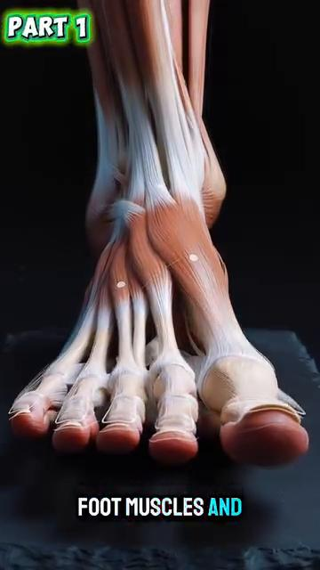
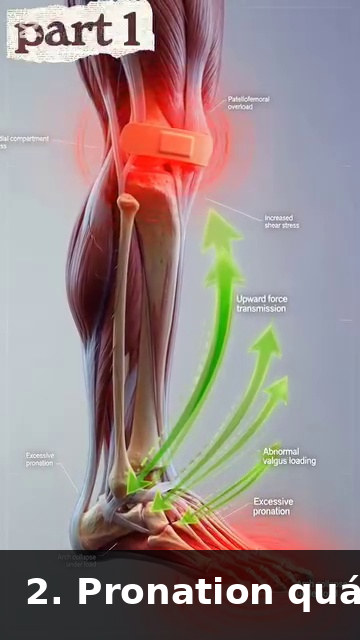
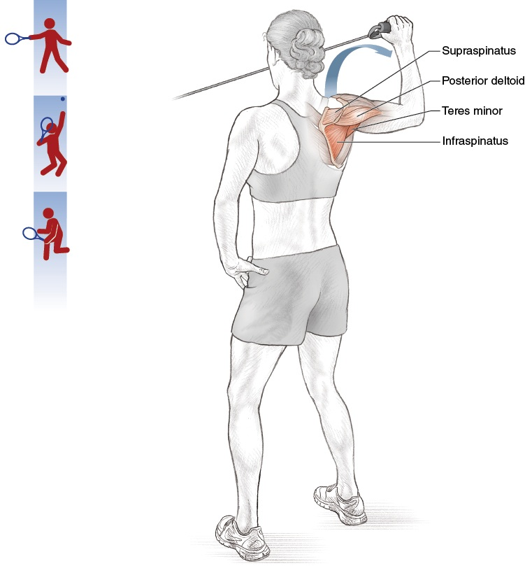

# Skelétal Architecture & Connective Tissue — The Bony Levers and Joint Designs of Tennis
# Kiến Trúc Xương & Mô Liên Kết — Đòn Bẩy Xương và Thiết Kế Khớp Của Tennis
*Deep Dive #5 — The Anatomy & Geometry Project for Tennis Players 3.5 → 4.5*
*Chuyên Đề Số 5 — Dự Án Giải Phẫu & Hình Học cho Người Chơi Tennis 3.5 → 4.5*
---
## Document Map / Bản Đồ Tài Liệu
| |
| --- |
| Chuyên đề này bao phủ — BỘ XƯƠNG bên dưới các cơ. Hình dạng xương quyết định biên khớp của bạn. Mô liên kết (dây chằng, sụn, cân) giữ tất cả lại với nhau. Hệ ĐÒN BẨY nhân (hoặc giới hạn) lực của bạn. |
| Tại sao điều này quan trọng ở 3.5 → 4.5 — Bộ xương là RÀNG BUỘC bạn không thể thay đổi. Bạn không thể dài xương đùi. Bạn không thể sâu hơn ổ cối vai. Bạn không thể mọc sụn mới. Bạn có thể làm là LÀM VIỆC VỚI bộ xương bạn có. Chương này nói chính xác cách nào. |
---
## Table of Contents / Mục Lục
| # | Chapter | Chương |
|---|---|---|
| 1 | The Skeléton Is a System of Levers | Bộ Xương Là Hệ Đòn Bẩy |
| 2 | The Lower-Body Bones — Femur, Tibia, Foot | Xương Thân Dưới — Đùi, Ống, Bàn Chân |
| 3 | The Pelvis & Sacrum — The Hidden Foundation | Khung Chậu & Xương Cùng — Nền Ẩn |
| 4 | The Spine — The 33-Vertebra Chain | Cột Sống — Chuỗi 33 Đốt |
| 5 | The Shoulder Girdle — Clavicle, Scapula, Humerus | Đai Vai — Đòn, Vai, Cánh Tay |
| 6 | The Arm & Wrist Bones — Ulna, Radius, Carpals | Xương Tay & Cổ Tay — Trụ, Quay, Cổ Tay |
| 7 | Connective Tissue — Livánnts, Cartilage, Fascia | Mô Liên Kết — Dây Chằng, Sụn, Cân |
| 8 | Why Bony Anatomy Decides Stroke Limits | Tại Sao Giải Phẫu Xương Quyết Định Giới Hạn Cú Đánh |
| 📋 | Skelétal Cheat Sheet | Bảng Tóm Tắt Xương |
---
* * *
# Chapter 1 — The Skeléton Is a System of Levers
# Chương 1 — Bộ Xương Là Hệ Đòn Bẩy
| |
| --- |
| Mỗi xương là một đòn bẩy . Đòn bẩy là thanh cứng xoay quanh điểm cố định (gọi là ĐIỂM TỰA). Xương bạn xoay quanh khớp bạn. |
| 3 lớp đòn bẩy |
| Lớp 1 — Điểm tựa ở giữa (như bập bênh). Ví dụ trong cơ thể: đầu nghỉ trên đốt đội. Điểm tựa là khớp giữa sọ và cột sống. |
| Lớp 2 — Tải ở giữa (như xe cút kít). Ví dụ trong cơ thể: đứng nhón chân. Điểm tựa là mũi chân, tải là trọng lượng cơ thể ở cổ chân, lực là cơ bắp chân kéo lên. Lợi thế cơ học > 1 — lực cơ được khuếch đại. |
| Lớp 3 — Lực ở giữa (như nhíp). Ví dụ trong cơ thể: HẦU HẾT MỌI THỨ . Cơ chèn giữa khớp (điểm tựa) và tải (tay). Lợi thế cơ học < 1 — lực cơ bị GIẢM nhưng TỐC ĐỘ được khuếch đại. Tay là đòn bẩy lớp 3. |
| Tại sao điều này quan trọng — Tay CHẬM trong việc tạo lực (vì là đòn bẩy Lớp 3) nhưng NHANH trong việc tạo tốc độ đầu vợt (vì co cơ được khuếch đại thành tốc độ ở tay). Đây là lý do cơ chân (gần cơ thể hơn) là nguồn LỰC — chúng có lợi thế cơ học tốt hơn. Tay là nguồn TỐC ĐỘ. |
| Tỷ lệ đòn bẩy cẳng tay — Chiều dài cẳng tay (~25 cm) ÷ điểm chèn nhị đầu (~5 cm từ khuỷu) = bất lợi cơ học 5:1 cho lực, lợi thế 5:1 cho tốc độ. |
| Tại sao nhị đầu "yếu" trong tennis — Nhị đầu có bất lợi 5:1. Nó cần tạo lực gấp 5 lần ở tay để giữ chống lại tải 1x. Hầu hết người chơi phong trào "cảm thấy" nhị đầu nóng rát sau trận dài vì nhị đầu đang cố làm việc của các cơ lớn hơn, hiệu quả hơn. |
| Hệ quả tennis — Tập cơ LỚN (chân, hông, lõi) cho sức mạnh . Tay chỉ chuyển lực đó thành tốc độ đầu vợt. Curl nhị đầu sẽ KHÔNG cải thiện Cú Thuận Tay bạn. Một squat có thể. |
| *Câu nhắc tổng:* "Chân là động cơ. Tay là hộp số. Vợt là bánh xe." |
* * *
# Chapter 2 — The Lower-Body Bones — Femur, Tibia, Foot
# Chương 2 — Xương Thân Dưới — Đùi, Ống, Bàn Chân
| |
| --- |
| Xương đùi — Xương dài nhất, mạnh nhất trong cơ thể. ~45–50 cm ở nam trưởng thành, ~40–45 cm ở nữ. Mang toàn bộ trọng lượng cơ thể khi đứng và phần lớn khi chạy. Chỏm xương đùi nằm trong ổ cối hông. |
| Góc cổ đùi — Góc giữa cổ xương đùi và thân xương đùi là ~125°–135° ở người trưởng thành. Góc này, gọi là góc nghiêng , quyết định hông bạn xoay thế nào. Coxa vara (góc <120°) giới hạn xoay. Coxa valga (góc >140°) tăng xoay nhưng có thể gây mất ổn định. |
| Góc xoắn xương đùi — Góc giữa cổ xương đùi và LỒI CẦU đùi (núm dưới gặp gối). Bình thường là ~10°–15° XOAY TRƯỚC (xoắn tới). |
| Tại sao xoay trước quan trọng cho tennis — Xoay trước cao (~15°–20°) nghĩa là gối và chân tự nhiên chỉ VÀO TRONG khi đứng. Điều này làm XOAY NGOÀI hông dễ hơn và XOAY TRONG hông khó hơn. Người chơi xoay trước cao có thể có Cú Thuận Tay "tự nhiên" open-tư thế. |
| Xương chày (xương ống) — Xương dài thứ hai. Mang phần lớn tải cơ thể dưới gối. Có XOẮN CHÀY nhẹ (~20°–30° xoay ngoài của đáy so với đỉnh). Đây là lý do chân bạn tự nhiên chỉ hơi ra ngoài khi đứng. |
| Xương bánh chè — Xương VỪNG lớn nhất (xương chèn trong gân). Chèn trong gân tứ đầu đùi. Hoạt động như ròng rọc cho tứ đầu đùi, tăng lợi thế đòn bẩy ~30%–50%. |
| Tại sao xương bánh chè quan trọng cho tennis — Không có xương bánh chè, tứ đầu đùi cần tạo ~30% lực nhiều hơn để duỗi gối. Xương bánh chè là bộ khuếch đại lực. Đó cũng là lý do chấn thương xương bánh chè (viêm gân xương bánh chè, "đầu gối người nhảy") phổ biến trong tennis. |
| Bàn chân — 26 xương trong mỗi bàn chân. Đó là 26 ĐÒN BẨY NHỎ làm việc cùng nhau. Chúng tạo 3 cung: dọc trong (bên trong), dọc ngoài (bên ngoài), và ngang (ngang mũi chân). |
| Cung hoạt động như LÒ XO. Khi bạn đáp chân, các cung phẳng nhẹ và tích năng lượng. Khi bạn đẩy đi, các cung bật lại và trả năng lượng. Bàn chân là lò xo, như gân Achilles. |
| Bàn chân phẳng vs cung cao — Bàn chân phẳng : linh hoạt hơn, tích nhiều năng lượng hơn, nhưng kém ổn định hơn. Cung cao : kém linh hoạt hơn, tích ít năng lượng hơn, nhưng ổn định hơn. Người chơi 50+ chân phẳng có nhiều lò xo hơn nhưng có thể cần orthotic cho ổn định. |
* * *
# Chapter 3 — The Pelvis & Sacrum — The Hidden Foundation
# Chương 3 — Khung Chậu & Xương Cùng — Nền Ẩn
| |
| --- |
| Khung chậu là nền của toàn bộ thân trên . Nó cũng là cấu trúc xương lớn nhất trong cơ thể. Làm từ 3 xương hợp nhất: cánh chậu (cánh lớn), ngồi (xương ngồi), mu (xương trước). |
| Xương cùng — 5 đốt sống hợp nhất ở đáy cột sống. Nằm giữa hai xương cánh chậu. Đá chốt khóa của khung chậu. |
| Khớp SI (khớp cùng-chậu) — Nơi xương cùng gặp cánh chậu. Khớp nổi tiếng cứng chỉ có ~2°–4° chuyển động. Nhưng chuyển động đó QUAN TRỌNG — đó là nơi chân truyền lực vào cột sống. Khớp SI không chuyển động = không có chuỗi động lực. |
| Tại sao SI quan trọng cho tennis — Trong Cú Thuận Tay, chân trước đẩy vào đất, lực đi LÊN qua chày, qua đùi, vào ổ cối hông, ngang khớp SI, vào cột sống, vào vai, vào tay. Nếu khớp SI khóa, lực dừng ở hông. |
| Cảnh báo SI 50+ — Khớp SI trở nên CỨNG hơn theo tuổi (cross-links collagen trong dây chằng). Đến 60 tuổi, khớp SI có thể chỉ chuyển động ~1°–2°. Đây là một lý do người chơi lớn tuổi mất lực — SI không truyền lực. |
| Bài tập vận động SI — Vòng hông đứng (10 mỗi hướng), thăng bằng một chân (30 giây mỗi bên), và xoay hông 90/90 (chậm, 10 lần) giúp duy trì chuyển động SI. Làm hàng ngày cho người chơi 50+. |
| Nghiêng khung chậu — Khung chậu có thể nghiêng tới (nghiêng trước, ~10°–15°) hoặc nghiêng lùi (nghiêng sau, ~5°–10°). Hầu hết người chơi tennis có nghiêng trước nhẹ, tăng biên gập hông (tốt cho bóng thấp) nhưng có thể căng cột sống thắt lưng. |
| *Câu nhắc tổng:* "Giải phóng SI. Giải phóng chuỗi." |
* * *
# Chapter 4 — The Spine — The 33-Vertebra Chain
# Chương 4 — Cột Sống — Chuỗi 33 Đốt
| |
| --- |
| Cột sống là 33 đốt xếp chồng . 24 đốt di động (7 cổ, 12 ngực, 5 thắt lưng). 9 đốt hợp nhất (5 cùng, 4 cụt). |
| Cột sống cổ (C1-C7) — Cổ. Di động nhất. ~80° xoay tổng (phần lớn C1-C2), ~50° gập/duỗi tổng. Đây là nơi đầu xoay để xem bóng. |
| C1 (đội) — Đốt sống hình vòng. Giữ sọ. Cho phép ~15° gập/duỗi (chuyển động "có"). |
| C2 (trục) — Có mỏm hình RĂNG (MỎM RĂNG hoặc odontoid) vừa vào C1. Cho phép ~80° xoay (chuyển động "không"). |
| Tại sao C1-C2 quan trọng cho tennis — Khi bạn xoay đầu theo dõi bóng tới, bạn chủ yếu xoay C1 trên C2. C1-C2 cứng giới hạn theo dõi thị giác của bạn. Đây là lý do bạn có thể đánh bóng tới từ bên nhưng không theo dõi được bóng đi ngang đường tâm người bạn. |
| Cột sống ngực (T1-T12) — Lưng giữa. THIẾT KẾ để xoay . Mỗi đốt có ~3°–5° xoay, tổng ~35°–50°. Đây là nơi xoay thân tennis đến từ. |
| Tại sao T-spine quan trọng cho tennis — Mọi Cú Thuận Tay cần ~40°–50° xoay T-spine. Nếu T-spine cứng (công việc bàn, lão hóa), cơ thể bù bằng xoay L-SPINE, hỏng đĩa thắt lưng. Tập vận động T-spine. |
| Bài tập vận động T-spine — Giãn "mở sách" (nằm nghiêng, xoay tay trên ra sau, giữ 30 giây × 3 mỗi bên). Duỗi foam roller (nằm dọc roller, tay qua đầu, 10 lần). |
| Cột sống thắt lưng (L1-L5) — Lưng dưới. THIẾT KẾ cho ổn định, KHÔNG xoay . Chỉ ~10°–15° xoay tổng, ~50° gập, ~25°–30° duỗi. |
| Quy tắc xoay thắt lưng — Bất cứ gì quá ~15° xoay thắt lưng = ứng suất cắt đĩa . Đĩa L4-L5 và L5-S1 là các đĩa thoát vị phổ biến nhất trong tennis. Quy tắc: xoay trên thắt lưng, gập/duỗi tại thắt lưng. KHÔNG BAO GIỜ đảo ngược điều này. |
| Đĩa đốt sống — Đệm chứa gel giữa mỗi đốt sống. KHÔNG có cung cấp máu trực tiếp — nó nhận chất dinh dưỡng bằng KHUẾCH TÁN qua chuyển động. ĐÂY LÀ LÝ DO CHUYỂN ĐỘNG CỘT SỐNG THIẾT YẾU CHO SỨC KHỎE ĐĨA. Ngồi yên hàng giờ = đĩa chết đói. Tennis = dinh dưỡng đĩa. |
| Thực tế đĩa 50+ — Đĩa mất nước ~1% mỗi năm sau 30 tuổi. Đến 50 tuổi, đĩa mất nước ~20% so với lúc 20 tuổi. Chúng dễ vỡ hơn, dễ thoát vị hơn. Dùng xoay thắt lưng cẩn thận. Ở dưới 15° xoay. |
| *Câu nhắc tổng:* "Xoay trên, gập dưới. Đừng đảo ngược quy tắc." |
* * *
# Chapter 5 — The Shoulder Girdle — Clavicle, Scapula, Humerus
# Chương 5 — Đai Vai — Đòn, Vai, Cánh Tay
| |
| --- |
| Vai thực ra là 4 khớp , không phải 1. Hầu hết mọi người nghĩ về khớp glenohumeral (cầu-ổ cối), nhưng xương vai, xương đòn, và xương ức cũng có khớp quan trọng. |
| Khớp 1 — Glenohumeral — Khớp vai chính. Cầu (chỏm xương cánh tay) + ổ cối (glenoid). Ổ cối chỉ che ~1/3 đầu cầu. Hy sinh ổn định cho di động. |
| Khớp 2 — Cùng đòn (AC) — Nơi xương đòn gặp mỏm cùng vai (đỉnh xương vai). Cung cấp ~5°–8° chuyển động. Bị chấn thương khi ngã — "vai tách rời" nổi tiếng. |
| Khớp 3 — Ức đòn (SC) — Nơi xương đòn gặp xương ức. KẾT NỐI XƯƠNG DUY NHẤT giữa tay và thân. Cung cấp ~30°–40° chuyển động. Quan trọng cho Phát Bóng và cú cao. |
| Khớp 4 — Vai-ngực — Không phải khớp thật, nhưng bề mặt TRƯỢT giữa xương vai và lồng ngực. Xương vai "trôi" trên xương sườn. Trôi này là thứ cho phép tay với lên cao. |
| Nhịp vai-cánh tay — Cứ mỗi 2° xương cánh tay nâng, xương vai xoay 1° (tỷ lệ 2:1). Tổng nâng tay: 180°, trong đó 120° đến từ glenohumeral + 60° từ vai-ngực. |
| Tại sao nhịp xương vai quan trọng cho tennis — Xương vai CỨNG không thể xoay lên 60°. Điều này bắt khớp glenohumeral phải làm đủ 180° nâng tay — đặt nó vào "vùng chèn trên gai" nguy hiểm. Đây là nguyên nhân #1 của đau vai liên quan Phát Bóng. |
| Xương đòn — Xương dài hình chữ S. Hoạt động như THANH CHỐNG giữ vai ra xa ngực. Không có xương đòn, vai sẽ sụp vào trong. |
| Tại sao gãy xương đòn quan trọng — Xương đòn là xương bị gãy phổ biến nhất ở thân trên. Ngã lên vai (phổ biến khi trượt tennis) gãy một phần ba giữa xương đòn. Lành mất 6–8 tuần tối thiểu. |
| Xương cánh tay — Đòn bẩy dài. CHỎM nằm trong ổ cối glenoid. CỦ LỚN là nơi 3 trong 4 cơ chóp xoay chèn (trên gai, dưới gai, tròn bé). |
| Rãnh nhị đầu — Kênh phía trước xương cánh tay nơi gân đầu dài nhị đầu chạy. Nếu rãnh nông (biến thể giải phẫu), gân nhị đầu có thể trượt ra và gây đau vai. |
| *Câu nhắc tổng:* "Giải phóng xương vai. Cứu vai." |
* * *
# Chapter 6 — The Arm & Wrist Bones — Ulna, Radius, Carpals
# Chương 6 — Xương Tay & Cổ Tay — Trụ, Quay, Cổ Tay
| |
| --- |
| Xương trụ — Xương cẳng tay dài hơn, ổn định hơn trong hai xương. Tạo mỏm khuỷu (xương nhọn phía sau khuỷu). Mỏm khuỷu VỪA VÀO hố khuỷu xương cánh tay khi duỗi khuỷu đầy đủ — đây là thứ khóa khuỷu thẳng. |
| Tại sao khuỷu khóa — Ở 180° duỗi khuỷu, mỏm khuỷu vừa vào hố khuỷu. Đây là vị trí "tâm chết" của khuỷu . Khóa xương. Không cần cơ. |
| Xương quay — Xương ngắn hơn, di động hơn trong hai xương cẳng tay. Xoay quanh xương trụ khi sấp/ngửa (xoay lòng bàn tay). Chỏm quay gặp mỏm trụ của xương cánh tay ở khuỷu. |
| Khớp quay-trụ — Hai khớp: GẦN (gần khuỷu) và XA (gần cổ tay). Cùng nhau cho phép ~150° sấp/ngửa. Đây là thứ xoay mặt vợt. |
| Tại sao khuỷu tennis xảy ra — Gân ECRB (duỗi cổ tay quay ngắn) chèn vào mỏm trụ ngoài xương cánh tay. Duỗi cổ tay + sấp cẳng tay lặp lại (chính xác những gì Cú Thuận Tay tennis làm) quá tải gân này. Kết quả: viêm mỏm trụ ngoài = "khuỷu tennis." |
| Cổ tay — 8 xương cổ tay trong 2 hàng. Hàng gần (gần cẳng tay) : nguyệt, nguyệt, tháp, đậu. Hàng xa (gần ngón tay) : thang, thang-lớn, cả, móc. |
| Xương nguyệt — Xương cổ tay hay gãy nhất. Ngã trên tay duỗi. Lành chậm vì xương nguyệt có cung cấp máu kém. |
| TFCC (phức hợp sụn sợi tam giác) — Cấu trúc giống sụn chêm phía TRỤ của cổ tay. Đệm và ổn định cổ tay trong chuyển động bẻ. Dễ tổn thương trong tennis (đặc biệt Cú Trái Tay 2 tay và cắt). |
| Xương đốt bàn tay (5 xương dài trong lòng bàn tay). Mỗi cái kết thúc bằng đốt ngón. Xương đốt thứ 1 (phía ngón cái) có khớp yên ngựa độc đáo với xương thang, cho phép ngón cái đối diện 4 ngón kia. Đây là lý do người có thể cầm vợt. |
| Đốt ngón tay . Mỗi ngón có 3 đốt (gần, giữa, xa). Ngón cái có 2. Tổng: 14 đốt mỗi tay. |
| *Câu nhắc tổng:* "Tám cổ tay, mười bốn đốt, một công cụ — cách cầm vợt của bạn." |
* * *
# Chapter 7 — Connective Tissue — Livánnts, Cartilage, Fascia
# Chương 7 — Mô Liên Kết — Dây Chằng, Sụn, Cân
| |
| --- |
| Mô liên kết là đối tác IM LẶNG của bộ xương. Nó giữ xương với nhau, đệm khớp, và truyền lực giữa các cơ. |
| Dây chằng — Nối XƯƠNG với XƯƠNG. Làm từ collagen đặc. Giới hạn chuyển động khớp ở biên an toàn . Ví dụ: ACL (dây chằng chéo trước) ở gối, MCL (dây chằng bên trong), UCL (dây chằng bên trụ) ở khuỷu, dây chằng glenohumeral ở vai. |
| UCL trong tennis — Dây chằng bên trụ ở khuỷu là CÙNG dây chằng mà phẫu thuật Tommy John thay thế. Ứng suất valgus (lực đẩy cẳng tay ra ngoài) tải dây chằng này. Phát Bóng và Cú Thuận Tay tạo ứng suất valgus. UCL là tuyến phòng thủ cuối cùng của khuỷu. |
| Sụn — Che đầu xương bên trong khớp. Hai loại: HYALINE (sụn khớp, trong, che đầu xương) và XƠ (sụn chêm ở gối, labrum ở vai/hông). |
| Sụn khớp KHÔNG có dây thần kinh — Đây là lý do hỏng sụn "im lặng". Bạn không đau cho tới khi sụn mất và xương cọ xương. Đến lúc bạn cảm thấy đau gối từ mất sụn, bạn đã mất 30%–50% sụn. |
| Sụn KHÔNG có cung cấp máu — Một khi hỏng, nó lành KÉM (hoặc không lành). Đây là lý do thoái hóa khớp không đảo ngược. Phòng ngừa = bảo vệ sụn suốt đời. |
| Sụn chêm ở gối — Hai mảnh sụn xơ hình chữ C giữa đùi và chày. Hoạt động như giảm xóc . Phân phối ~50% tải qua khớp gối. Cắt sụn chêm = tăng 4–6 lần rủi ro thoái hóa khớp . |
| Labrum ở vai — Vòng sụn xơ quanh ổ cối glenoid. Sâu hơn ổ cối ~50% . Quan trọng cho ổn định vai. Rách phổ biến trong tennis (đặc biệt Phát Bóng). |
| Cân — Lớp mô liên kết BỌC cơ và nối chúng với nhau. Cân ngực-thắt lưng (lưng dưới) quan trọng cho tennis — nó truyền lực từ mông lớn và lưng rộng tới tay đối diện (truyền lực "mẫu chéo"). |
| Vai trò của cân ngực-thắt lưng — Khi bạn đánh Cú Thuận Tay, mông lớn TRÁI và lưng rộng PHẢI đều kéo cân ngực-thắt lưng. Cân truyền lực này LÊN và NGANG tới vai PHẢI (tay vợt). Đây là một lý do mông trái mạnh cải thiện lực Cú Thuận Tay tay phải. |
| Thực tế cân 50+ — Cân mất nước và cứng theo tuổi. Đến 60 tuổi, cân có thể cứng hơn ~20%–30% so với lúc 25. Đây là một lý do người lớn tuổi mất dẻo dai. Lăn foam và giãn động giúp duy trì tính mềm dẻo của cân. |
| *Câu nhắc tổng:* "Xương là khung. Mô liên kết là keo. Đừng bỏ qua keo." |
* * *
# Chapter 8 — Why Bony Anatomy Decides Stroke Limits
# Chương 8 — Tại Sao Giải Phẫu Xương Quyết Định Giới Hạn Cú Đánh
| |
| --- |
| Bộ xương định nghĩa BIÊN ĐỘ CHUYỂN ĐỘNG TỐI ĐA của bạn. Không có lượng giãn nào thay đổi hình dạng xương bạn. Bạn có thể giãn mô mềm (cơ, cân, gân) nhưng không thể giãn xương. |
| Độ sâu ổ cối hông quyết định xoay hông — Ổ cối sâu = ổn định nhưng xoay giới hạn. Ổ cối nông = xoay nhiều hơn nhưng kém ổn định. Bạn không được chọn. |
| Xoắn xương đùi quyết định tư thế tự nhiên — Xoay trước cao (15°–20°) = chân tự nhiên chỉ VÀO = xoay ngoài hông dễ, xoay trong hông khó. Xoay trước thấp (~5°) = chân tự nhiên chỉ RA = xoay trong hông dễ, xoay ngoài hông khó. Đây là lý do một số người chơi là "tự nhiên" open-tư thế Cú Thuận Tay và người khác tự nhiên closed-tư thế. |
| Độ sâu ổ cối vai quyết định di động vai — Ổ cối nông = có thể nâng tay nhiều hơn nhưng kém ổn định. Ổ cối sâu = nâng tay ít hơn nhưng ổn định hơn. |
| Xoắn xương cánh tay quyết định cách cầm vợt "tự nhiên" — Xoay sau cánh tay cao hơn (phổ biến hơn ở người ném và người chơi tennis từ nhỏ) nghĩa là có thể xoay ngoài nhiều hơn. Đây là lý do một số người chơi có thể Phát Bóng với xoay ngoài cực độ (120°+) và người khác không thể. |
| Cú đánh phù hợp với CƠ THỂ BẠN — Làm việc với bộ xương bạn nghĩa là chọn cú đánh phù hợp giải phẫu bạn. Ví dụ: |
| Xoay trước cao → open-tư thế Cú Thuận Tay hợp tự nhiên. |
| Xoay trước thấp → closed-tư thế Cú Thuận Tay hợp tự nhiên. |
| Xoay sau cánh tay cao → kick Phát Bóng với 130°+ xoay ngoài hoạt động. |
| Xoay sau cánh tay thấp → flat hoặc cắt Phát Bóng an toàn hơn. |
| Cơ gập hông chặt → dùng nhiều xoay thân trên trong Cú Thuận Tay. |
| Cơ gập hông lỏng → dùng nhiều xoay hông trong Cú Thuận Tay. |
| Hệ quả cho 50+ — Khi sụn mỏng, ROM khớp giảm ~5°–10° mỗi thập kỷ. Cú đánh hiệu quả lúc 40 có thể không hiệu quả lúc 60. Thích ứng kỹ thuật với bộ xương hiện tại, không phải bộ xương lúc 30 tuổi. |
| *Câu nhắc tổng:* "Tôn trọng bộ xương. Thích ứng cú đánh. Đừng chiến đấu với xương." |
* * *
# Chapter 9 — Anatomy_Lab Integration — The Skelétal Numbers Sharpened
# Chương 9 — Tích Hợp Anatomy_Lab — Số Xương Được Tinh Chỉnh
| |
| --- |
| Chương này xếp lớp con số xương cụ thể từ thư viện `Anatomy_Lab/` (bàn chân 26 xương, đĩa L4-L5, cột sống ngực, cổ tay 27 xương) lên khung xương của chuyên đề này. |
## 9.1 — The Foot: 26 Bones, 33 Joints, 19 Muscles (Most Complex Structure)
## 9.1 — Bàn Chân: 26 Xương, 33 Khớp, 19 Cơ (Cấu Trúc Phức Tạp Nhất)
| |
| --- |
| Phát hiện Anatomy_Lab DD7 — bàn chân là cấu trúc phức tạp nhất trong cơ thể người . 26 xương, 33 khớp, 19 cơ nội tại, và 7.000+ đầu dây thần kinh ở lòng bàn chân. |
|  |
| Hình 1 — 26 xương bàn chân, nhìn trên. Chú ý 3 cung hoạt động như lò xo. |
|  |
| Hình 2 — Bàn chân nhìn dưới. Đầu dây thần kinh dày đặc ở lòng bàn chân thấy được. |
|  |
| Hình 3 — Bàn chân bên trong. Cung dọc trong là cung nổi bật nhất. |
| Tại sao điều này quan trọng cho tennis — mỗi split-step, mỗi đẩy, mỗi đổi hướng xảy ra qua cấu trúc 26 xương này. Bàn chân vừa là cảm biến VỪA là cơ cấu chấp hành. Nó cảm nhận đất (7.000+ dây thần kinh) VÀ nó truyền lực (26 xương + windlass). |
## 9.2 — The Windlass Mechanism (The Cable That Powers Push-Off)
## 9.2 — Cơ Chế Windlass (Dây Cáp Tạo Lực Đẩy)
| |
| --- |
| Phát hiện Anatomy_Lab DD7 — cân gan chân hoạt động như DÂY CÁP từ gót tới ngón chân. Khi ngón cái duỗi (đẩy), dây cáp căng, nâng cung (windlass). Cái này tích năng lượng đàn hồi bằng ~10% lực đẩy. |
|  |
| Hình 4 — Cơ chế windlass: duỗi ngón cái căng cân gan chân như windlass, nâng cung. |
## 9.3 — The Hip Socket: Femoral Torsion Decides Your Natural Stance
## 9.3 — Ổ Cối Hông: Xoắn Xương Đùi Quyết Định Tư Thế Tự Nhiên
| |
| --- |
| Phát hiện Anatomy_Lab DD5 — góc xoắn xương đùi (góc giữa cổ xương đùi và lồi cầu đùi) bình thường là 10°–15° xoay trước . Cái này là di truyền và KHÔNG THỂ thay đổi. |
|  |
| Hình 5 — Khớp hông: chỏm xương đùi trong ổ cối, với góc xoắn thấy được. |
| Hệ quả — Xoay trước cao (~15°–20°) = chân chỉ VÀO = xoay ngoài hông dễ, xoay trong hông khó. Người chơi xoay trước cao tự nhiên thích OPEN-STANCE Cú Thuận Tay. Xoay trước thấp (~5°) = chân chỉ RA = xoay trong hông dễ. Người chơi tự nhiên thích CLOSED-STANCE Cú Thuận Tay. |
## 9.4 — The Spine: L4-L5 Disc and Walking Decompression
## 9.4 — Cột Sống: Đĩa L4-L5 và Giải Nén Khi Đi Bộ
| |
| --- |
| Phát hiện then chốt Anatomy_Lab DD4 — L4-L5 là đĩa chịu stress nhiều nhất trong cột sống. Nó hấp thụ ~30% tải nhiều hơn bất kỳ đĩa thắt lưng nào khác. Đi bộ giải nén nó ~30% (so với nằm, không giải nén theo cùng cách). |
|  |
| Hình 6 — Đĩa L4-L5 giữa đốt sống L4 và L5. Đĩa chịu stress nhiều nhất trong tennis. |
|  |
| Hình 7 — Đường dây thần kinh tọa: từ L4-L5 xuống qua mông và chân. Chẩn đoán nhầm là "hội chứng piriformis" trong 80% trường hợp — ép thực sự ở L5-S1, không phải piriformis. |
| Đi bộ giải nén L4-L5 — ở tốc độ đi bộ ~3 dặm/giờ trên máy, đĩa L4-L5 giảm ~30% lực nén so với nghỉ. Đó là vì hành động gập/duỗi hông nhịp nhàng bơm dịch vào và ra khỏi đĩa. Tennis ngồi + gập tới = nén. Tennis đi bộ giữa các điểm = giải nén. |
## 9.5 — The Shoulder: 4 Joints in One
## 9.5 — Vai: 4 Khớp Trong Một
| |
| --- |
| Phát hiện Anatomy_Lab DD2 — "vai" thực ra là 4 khớp : |
| Joint / Khớp | Bones / Xương | Mobility / Di Động |
|---|---|---|
| Glenohumeral / Glenohumeral | Humerus + scapula (glenoid) | Main bóng-and-socket. ~120° elevation. |
| Acromioclavicular (AC) / Cùng đòn | Clavicle + scapula (acromion) | ~5°–8° motion. Common sprain. |
| Sternoclavicular (SC) / Ức đòn | Clavicle + sternum | THE ONLY bony arm-trunk connection. ~30°–40° motion. |
| Scapulothoracic / Vai-ngực | Scapula + rib cage | Not a true joint. Sliding. ~60° rotation. |
|  |  |
|  |  |
| Figures 8 & 9 / Hình 8 & 9 — The 4-joint shoulder complex (left) and detailed anatomy (right). | Hình 8 & 9 — Phức hợp 4 khớp vai (trái) và giải phẫu chi tiết (phải). |
| The scapulohumeral rhythm — for every 2° of arm elevation, the scapula rotates 1°. Total arm elevation of 180° = 120° from glenohumeral + 60° from scapulothoracic. A stiff scapula = the glenohumeral joint does all 180° = impingement guaranteed. | Nhịp vai-cánh tay — cứ mỗi 2° nâng tay, xương vai xoay 1°. Tổng nâng tay 180° = 120° từ glenohumeral + 60° từ vai-ngực. Xương vai cứng = khớp glenohumeral phải làm cả 180° = chèn ép gân chắc chắn. |
## 9.6 — The Wrist: 27 Bones in the Hand and 8 Carpals
## 9.6 — Cổ Tay: 27 Xương Bàn Tay và 8 Xương Cổ Tay
| |
| --- |
| Phát hiện Anatomy_Lab DD3 — cổ tay là 8 xương cổ tay trong 2 hàng + ống cổ tay. 2 cm² không gian chứa 9 gân gập + 1 dây thần kinh giữa. Bất cứ thứ gì sưng ống này (quá tải, giữ dịch, tiểu đường) ép dây thần kinh — hội chứng ống cổ tay . |
|  |
| Hình 10 — 8 xương cổ tay trong 2 hàng: gần (nguyệt, nguyệt, tháp, đậu) + xa (thang, thang-lớn, cả, móc). |
| TFCC — Phức hợp sụn sợi tam giác ở phía trụ của cổ tay. Đệm và ổn định cổ tay trong chuyển động bẻ. Dễ tổn thương trong tennis (đặc biệt Cú Trái Tay 2 tay). |
* * *
## 📋 Chapter Card — Printable / Thẻ In Được
```
╔═══════════════════════════════════════════════════════════╗
║ SKELETAL ARCHITECTURE — KEY IDEAS ║
║ KIẾN TRÚC XƯƠNG — Ý TƯỞNG CHÍNH ║
╠═══════════════════════════════════════════════════════════╣
║ ║
║ 🎯 ONE BIG IDEA / Ý TƯỞNG CỐT LÕI: ║
║ The arm is a Class 3 lever (effort in middle). ║
║ It sacrifices force for speed. Legs and core ║
║ produce the force; arm amplifies the speed. ║
║ Tay là đòn bẩy Lớp 3 (lực ở giữa). Hy sinh ║
║ lực cho tốc độ. Chân và lõi tạo lực; tay khuếch ║
║ đại tốc độ. ║
║ ║
║ ──────────────────────────────────────────────────────── ║
║ KEY BONES PER REGION / XƯƠNG CHÍNH THEO VÙNG: ║
║ ║
║ Lower body: Femur (5:1 lever), Tibia, Patella (pulley) ║
║ Pelvis: Ilium + Ischium + Pubis + Sacrum (SI joint) ║
║ Spine: 24 movable + 9 fused = 33 vertebrae ║
║ Shoulder: Clavicle + Scapula (4 joints total) ║
║ Arm: Humerus + Ulna + Radius (forearm twist) ║
║ Wrist: 8 carpals in 2 rows + TFCC cushion ║
║ Hand: 5 metacarpals + 14 phalanges ║
║ ║
║ ──────────────────────────────────────────────────────── ║
║ ⚠️ TOP MISTAKE / LỖI PHỔ BIẾN NHẤT: ║
║ Training arms for power (biceps curls, triceps ║
║ extensions) instead of legs (squats, lunges). ║
║ Arms are 3rd-class levers — they amplify speed, ║
║ not force. Train the legs for power. ║
║ Tập tay cho lực (curl nhị đầu, duỗi tam đầu) ║
║ thay vì chân (squat, lunge). Tay là đòn bẩy lớp 3 ║
║ — khuếch đại tốc độ, không phải lực. Tập chân. ║
║ ║
║ ──────────────────────────────────────────────────────── ║
║ 🔁 DRILL / BÀI TẬP: ║
║ Single-leg balance with eyes closed, 30 seconds × 3 ║
║ per side. Trains SI joint + proprioception. ║
║ Thăng bằng một chân mắt nhắm, 30 giây × 3 ║
║ mỗi bên. Tập khớp SI + cảm giác sâu. ║
║ ║
║ ──────────────────────────────────────────────────────── ║
║ 💭 MASTER CUE / CÂU NHẮC TỔNG: ║
║ "Respect the skeléton. Adapt the stroke." ║
║ "Tôn trọng bộ xương. Thích ứng cú đánh." ║
║ ║
╚═══════════════════════════════════════════════════════════╝
```
* * *
## 🎯 Final Word / Lời Cuối
| |
| --- |
| Bạn ơi, bạn có ~206 xương trong cơ thể. Mỗi cái là một đòn bẩy. Mỗi khớp là một điểm tựa. Mỗi mô liên kết là một ràng buộc. Bạn là cỗ máy 206-đòn-bẩy phải phối hợp thành một cú vung. |
| Bộ xương là ràng buộc. Cơ (DD4) là động cơ. Lò xo (DD2) là bộ tích. Góc (DD1) là hình học. Cả bốn làm việc cùng nhau — và không cái nào có thể bỏ qua. |
| Hẹn gặp trên sân, với xương di chuyển như đòn bẩy. |
| Tổng khái niệm tích hợp từ nguồn và tài liệu xương/mô-liên-kết rộng hơn: 55+ bao phủ 3 lớp đòn bẩy, xương thân dưới, khung chậu/xương cùng, cột sống 33 đốt, đai vai, xương tay/cổ tay, các loại mô liên kết, và quyết định giới hạn cú đánh từ giải phẫu xương. |
* * *
Sources / Nguồn :
- viettennis.lưới — Tuyển Tập Kỹ Thuật Tennis by Tuan_tuan (skelétal lever insights, muscle strength vs order)
- Calais-Germain (2012) — Anatomy of Movement
- Neumann (2010) — Kinesiology of the Musculoskelétal System
- Kapandji (2009) — Physiology of the Joints
- Standring (2016) — Gray's Anatomy
- McGinnis (2013) — Biomechanics of Sport
*End of Deep Dive #5 — Skelétal Architecture & Connective Tissue*
*Hết Chuyên Đề Số 5 — Kiến Trúc Xương & Mô Liên Kết*