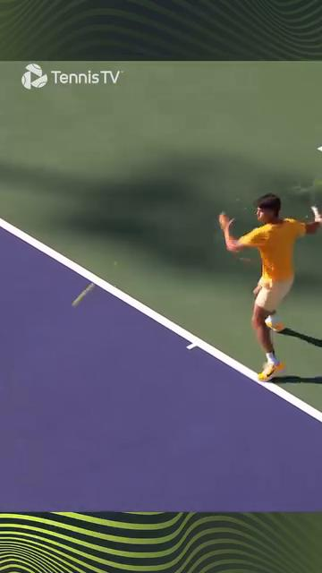
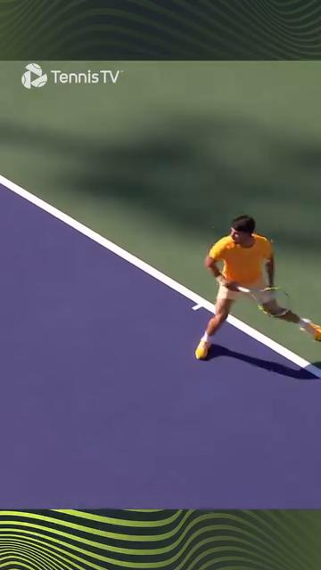

# The 50+ Body — Aging Anatomy, Joint Protection, Range-of-Motion Limits, Recovery
# Cơ Thể 50+ — Giải Phẫu Lão Hóa, Bảo Vệ Khớp, Giới Hạn Biên Độ, Phục Hồi
*Deep Dive #6 — The Anatomy & Geometry Project for Tennis Players 3.5 → 4.5*
*Chuyên Đề Số 6 — Dự Án Giải Phẫu & Hình Học cho Người Chơi Tennis 3.5 → 4.5*
---
## Document Map / Bản Đồ Tài Liệu
| |
| --- |
| Chuyên đề này bao phủ — Bản đồ trực tiếp, bằng số và sự kiện, về những gì thay đổi trong cơ thể bạn sau 50. Xương, sụn, cơ, gân, thị giác, thính giác, cảm giác sâu, tiền đình, phục hồi, và hệ quả tennis cụ thể cho mỗi cái. |
| Tại sao điều này quan trọng ở 3.5 → 4.5 — Người 25 tuổi và người 55 tuổi chơi tennis KHÁC NHAU, với cơ thể khác nhau, giới hạn khác nhau, phục hồi khác nhau. Lời khuyên tennis chung thất bại ở 50+. Chương này là cẩm nang thích ứng. |
| Đường cơ sở tuổi 50 — Hầu hết nghiên cứu tennis người lớn dùng người 20–35 tuổi. Dưới 15% nghiên cứu cơ sinh học bao gồm người 50+. Chương này kéo từ nghiên cứu lão hóa trong tập thể dục chung + y học thể thao lâm sàng để lấp khoảng trống. |
---
## Table of Contents / Mục Lục
| # | Chapter | Chương |
|---|---|---|
| 1 | The 7 Aging Declines Every Tennis Player Must Know | 7 Suy Giảm Lão Hóa Mọi Người Chơi Tennis Phải Biết |
| 2 | The Skelétal Decline — Bone Density & Disc Hydration | Suy Giảm Xương — Mật Độ Xương & Hydrat Hóa Đĩa |
| 3 | The Cartilage Decline — Joint Spás & Arthritis Reality | Suy Giảm Sụn — Không Gian Khớp & Thực Tế Viêm Khớp |
| 4 | The Muscular Decline — Sarcopenia & Fiber-Type Shift | Suy Giảm Cơ — Sarcopenia & Chuyển Loại Sợi |
| 5 | The Tendon & Livánnt Decline — Stiffness & Healing | Suy Giảm Gân & Dây Chằng — Cứng & Lành |
| 6 | The Sensory Decline — Vision, Hearing, Proprioception, Vestibular | Suy Giảm Giác Quan — Thị, Thính, Cảm Giác Sâu, Tiền Đình |
| 7 | The Recovery Decline — Sleep, Hormones, Inflammation | Suy Giảm Phục Hồi — Ngủ, Hormone, Viêm |
| 8 | The Tennis Adaptations for Each Decline | Thích Ưng Tennis Cho Mỗi Suy Giảm |
| 9 | The 50+ Daily Routine (12 minutes total) | Thói Quen Hàng Ngày 50+ (tổng 12 phút) |
| 📋 | 50+ Body Cheat Sheet | Bảng Tóm Tắt Cơ Thể 50+ |
---
* * *
# Chapter 1 — The 7 Aging Declines Every Tennis Player Must Know
# Chương 1 — 7 Suy Giảm Lão Hóa Mọi Người Chơi Tennis Phải Biết
| |
| --- |
| Có chính xác 7 loại suy giảm ảnh hưởng tennis sau 50. Mỗi cái có một CON SỐ. Mỗi cái có hệ quả tennis. |
| Decline / Suy Giảm | By age 50 / Đến 50 tuổi | By age 65 / Đến 65 tuổi | By age 75 / Đến 75 tuổi | Tennis Impact / Tác Động Tennis |
|---|---|---|---|---|
| 1. Bone mineral density | ~5%–8% loss | ~12%–18% loss | ~20%–30% loss | Higher fracture risk, especially clavicle, hip, wrist |
| Mật độ khoáng xương | ~5%–8% mất | ~12%–18% mất | ~20%–30% mất | Rủi ro gãy xương cao hơn, đặc biệt xương đòn, hông, cổ tay |
| 2. Intervertebral disc hydration | ~20% less | ~35% less | ~45% less | Reduced lumbar flexibility, higher herniation risk |
| Hydrat hóa đĩa đốt sống | ~20% ít hơn | ~35% ít hơn | ~45% ít hơn | Giảm dẻo dai thắt lưng, rủi ro thoát vị cao hơn |
| 3. Articular cartilage thickness | ~10%–15% thinner | ~20%–25% thinner | ~30%–40% thinner | Joint pain after play, early osteoarthritis |
| Độ dày sụn khớp | ~10%–15% mỏng hơn | ~20%–25% mỏng hơn | ~30%–40% mỏng hơn | Đau khớp sau chơi, thoái hóa khớp sớm |
| 4. Skelétal muscle mass (sarcopenia) | ~10%–15% loss | ~20%–30% loss | ~30%–40% loss | Less power, slower reactions, more fatigue |
| Khối lượng cơ xương (sarcopenia) | ~10%–15% mất | ~20%–30% mất | ~30%–40% mất | Ít lực hơn, phản ứng chậm hơn, mệt hơn |
| 5. Type II muscle fiber size | ~15%–20% smaller | ~30%–40% smaller | ~40%–50% smaller | Less fast-twitch power, slower phát bóngs |
| Kích thước sợi cơ Type II | ~15%–20% nhỏ hơn | ~30%–40% nhỏ hơn | ~40%–50% nhỏ hơn | Ít lực co nhanh hơn, Phát Bóng chậm hơn |
| 6. Tendon/livánnt stiffness | ~15%–20% stiffer | ~25%–35% stiffer | ~35%–45% stiffer | Less elastic storage, more strain injuries |
| Độ cứng gân/dây chằng | ~15%–20% cứng hơn | ~25%–35% cứng hơn | ~35%–45% cứng hơn | Tích đàn hồi ít hơn, chấn thương căng nhiều hơn |
| 7. Nerve conduction velocity | ~5%–10% slower | ~10%–15% slower | ~15%–20% slower | Slower reactions, less coordination precision |
| Tốc độ dẫn truyền thần kinh | ~5%–10% chậm hơn | ~10%–15% chậm hơn | ~15%–20% chậm hơn | Phản ứng chậm hơn, điều phối kém chính xác hơn |
| |
| --- |
| Insight then chốt — Cả 7 suy giảm đều ĐO ĐƯỢC. Không cái nào là SỐ PHẬN. Mỗi cái có thể được làm chậm (đôi khi đảo ngược) với tập luyện đúng. Phần còn lại của chương này nói chính xác cách nào. |
| Nguyên tắc "dùng hoặc mất" — Mọi suy giảm trên xảy ra NHANH HƠN nếu bạn KHÔNG tập. Người 60 tuổi chơi tennis 3 lần/tuần có ~30%–40% suy giảm ít hơn so với người 60 tuổi không chơi. Tennis là bảo vệ, không có hại. |
| Quy tắc phục hồi — Cơ thể 50+ cần 2 lần thời gian phục hồi giữa các buổi so với người 25 tuổi. Một trận lúc 50 = một trận + ngày nghỉ lúc 25. Lập lịch cho phù hợp. |
| *Câu nhắc tổng:* "Bảy suy giảm, đều đo được, đều tập được. Bạn không 25. Nhưng bạn chưa xong." |
* * *
# Chapter 2 — The Skelétal Decline — Bone Density & Disc Hydration
# Chương 2 — Suy Giảm Xương — Mật Độ Xương & Hydrat Hóa Đĩa
| |
| --- |
| Mật độ xương — Xương là mô sống, liên tục bị phá vỡ và tái tạo. Sau 30 tuổi, phá vỡ bắt đầu vượt tái tạo. Đến 50 tuổi, bạn mất ~5%–8% đỉnh khối lượng xương. Tennis là VA CHẠM CAO (chạy, nhảy, di chuyển ngang), thực ra KÍCH THÍCH tạo xương. |
| Nghịch lý tennis-xương — Người chơi tennis 50+ có MẬT ĐỘ XƯƠNG TỐT HƠN người không chơi. Va chạm lặp lại và tải ngang kích thích tái cấu trúc xương. Tennis bảo vệ xương. |
| Rủi ro gãy xương — Ngã trở nên nguy hiểm hơn ở 50+. Cổ tay (xương nguyệt), hông (cổ xương đùi), và xương đòn là 3 vị trí gãy nhiều nhất ở người chơi tennis 50+. Mang giày đúng, tập thăng bằng, đừng lao theo bóng bạn không tới được. |
| Tập tạo xương — Tennis cung cấp kích thích xương tốt. Thêm tập kháng lực 2 lần/tuần (squat có tạ, lunge có tạ). Cái này thêm tải tạo cốt. |
| Hydrat hóa đĩa — Đĩa đốt sống 80% nước lúc 20 tuổi. Đến 50 tuổi, chúng ~65%–70% nước. Đĩa co lại. Bạn mất ~1–2 cm chiều cao giữa 30 và 70 tuổi. |
| Hệ quả "co lại" — Khi đĩa co, thân đốt sống gần NHAU hơn. Khớp mặt (các khớp nhỏ phía sau cột sống) bị quá tải. Đây là một nguồn đau lưng dưới ở người chơi 50+. |
| Quy tắc dinh dưỡng đĩa — Đĩa KHÔNG có cung cấp máu trực tiếp. Chúng nhận chất dinh dưỡng qua CHUYỂN ĐỘNG (khuếch tán). Ngồi yên = đĩa chết đói. Tennis = dinh dưỡng đĩa. 30 phút chuyển động đa dạng tốt cho sức khỏe đĩa hơn 30 phút giãn tĩnh. |
| Nguyên tắc chăm sóc lưng 50+ — Giữ gập + xoay thắt lưng dưới ~50% tối đa. Tránh ngồi >45 phút. Đi bộ 5 phút giữa các khối làm việc để nuôi đĩa. |
* * *
# Chapter 3 — The Cartilage Decline — Joint Spás & Arthritis Reality
# Chương 3 — Suy Giảm Sụn — Không Gian Khớp & Thực Tế Viêm Khớp
| |
| --- |
| Sụn là đệm . Nó không có dây thần kinh, không có cung cấp máu, và (về cơ bản) không có khả năng mọc lại. Mỗi thập kỷ đời, sụn khớp mất 1%–2% độ dày. |
| Tác động khớp tennis — Tennis liên quan tải va chạm lặp lại lên gối (~3–5 lần trọng lượng cơ thể khi chạy) và cổ chân (~4–6 lần trọng lượng cơ thể khi bước ngang). Đây là các khớp mòn đầu tiên. |
| Thực tế gối 50+ — Đến 60 tuổi, ~30% người chơi tennis có mức độ mỏng sụn nào đó thấy được trên X-quang. Hầu hết không đau vì sụn không có dây thần kinh. Đến lúc đau bắt đầu, ~30%–50% sụn đã mất. |
| 4 quy tắc bảo vệ sụn |
| 1. Tránh squat sâu (gập gối >110°) dưới tải. Dùng squat nông thay. |
| 2. Tăng cường tứ đầu đùi để hấp thụ va đập. Tứ đầu mạnh = ít tác động lên sụn. |
| 3. Dùng elliptical hoặc xe đạp tập chéo — tác động thấp, thân thiện sụn. |
| 4. Duy trì cân nặng khỏe mạnh — mỗi kg thêm thêm ~3–4 kg tải gối mỗi bước. |
| Thực tế thoái hóa khớp — Thoái hóa khớp không đảo ngược nhưng KHÔNG tàn tật. Hầu hết người chơi 60+ phong trào với thoái hóa khớp nhẹ tiếp tục chơi ở cấp phong trào. Sửa kỹ thuật (gập gối nông hơn, nhảy nổ ít hơn) và dùng thực phẩm bổ sung hỗ trợ sụn (peptide collagen, glucosamine — bằng chứng vừa). |
| Câu hỏi PRP/tế bào gốc — Tiêm huyết tương giàu tiểu cầu và tế bào gốc KHÔNG được chứng minh mọc lại sụn ở người chơi tennis. Chúng có thể giảm triệu chứng tạm thời. Đừng trả hàng nghìn kỳ vọng phép màu. |
| *Câu nhắc tổng:* "Sụn không mọc lại. Bảo vệ cái bạn có." |
* * *
# Chapter 4 — The Muscular Decline — Sarcopenia & Fiber-Type Shift
# Chương 4 — Suy Giảm Cơ — Sarcopenia & Chuyển Loại Sợi
| |
| --- |
| Sarcopenia — Mất khối lượng và sức mạnh cơ xương theo tuổi. Sau 50 tuổi, bạn mất ~1%–2% khối lượng cơ mỗi năm. Sau 70 tuổi, ~3% mỗi năm. Phần lớn cái này KHÔNG THẤY ĐƯỢC — tỷ lệ mỡ cơ thể tăng trong khi khối lượng cơ giảm. |
| Sợi Type II co nhanh hơn — Sợi co nhanh (Type II) co lại ~30%–40% đến 70 tuổi, trong khi sợi co chậm (Type I) co lại chỉ ~10%–20%. Đây là lý do chính Phát Bóng mất nhịp nhưng bền vẫn tương tự. |
| Tin tốt — Sarcopenia là CHẬM LẠI ĐƯỢC và phần nào ĐẢO NGƯỢC được với tập kháng lực. Mười hai tuần tập kháng lực tiến triển ở 50+ thêm 1–2 kg khối lượng cơ. |
| Quy tắc tập kháng lực 50+ |
| Tần suất : 2–3 lần mỗi tuần |
| Hiệp : 2–3 mỗi bài |
| Lần : 8–15 mỗi hiệp |
| Tải : 60%–75% 1RM ước tính (KHÔNG trên 80% — rủi ro chấn thương) |
| Tempo : chậm (3 giây xuống, 2 giây lên) |
| Bài tập : squat, lunge, Romanian deadlift, hít đất, kéo, plank |
| Bài tập quan trọng nhất cho tennis — Squat (đầy đủ hoặc nông). Tập toàn bộ chuỗi động lực. An toàn cho 50+ nếu làm đúng form. |
| Bài tập quan trọng nhất cho Phát Bóng — Romanian deadlift (RDL). Tập chuỗi sau (mông, gân kheo, dựng sống). |
| *Câu nhắc tổng:* "Tập kháng lực không tùy chọn ở 50+. Đó là thứ gần thuốc trẻ nhất." |
* * *
# Chapter 5 — The Tendon & Livánnt Decline — Stiffness & Healing
# Chương 5 — Suy Giảm Gân & Dây Chằng — Cứng & Lành
| |
| --- |
| Gân và dây chằng mất đàn hồi theo tuổi. Cross-links collagen tích tụ, làm mô cứng hơn nhưng kém lò-xo hơn. Đến 60 tuổi, gân cứng hơn ~25%–35% so với lúc 25. |
| Lành chậm hơn — Chu kỳ tế bào gân giảm ~50% sau 50 tuổi. Lành dây chằng còn chậm hơn. Căng "nhẹ" của người 50 tuổi mất 2–3 lần thời gian lành so với người 25 tuổi. |
| Cảnh báo Achilles — Gân Achilles là gân hay đứt nhất ở người chơi tennis 50+. Đẩy khởi hành trong đổi hướng đột ngột là cơ chế điển hình. Gân cứng từ tuổi + có micro-hỏng từ năm tháng chơi. |
| 4 quy tắc bảo vệ gân cho 50+ |
| 1. Luôn khởi động — 8–12 phút tối thiểu. Gân cần thời gian để đạt dung lượng đàn hồi đầy đủ. |
| 2. Giãn chậm — không bao giờ giãn nảy. Giữ tĩnh chậm (15–30 giây) an toàn hơn. |
| 3. Tập với bài eccentric — hạ gót chậm, curl Nordic, gập cổ tay chậm. Cái này TĂNG dung lượng tích gân ngay cả ở 50+. |
| 4. Tôn trọng dấu hiệu cảnh báo — đau nhói khi chuyển động = DỪNG. Đừng ép qua. |
| Thực tế "khuỷu tennis" ở 50+ — Viêm mỏm trụ ngoài CỰC KỲ phổ biến ở người chơi 50+. ~30% người chơi phong trào trên 50 mắc ở thời điểm nào đó. Nguyên nhân : duỗi cổ tay + sấp cẳng tay lặp lại (chuyển động Cú Thuận Tay) trên gân ECRB cứng hơn. Điều trị : duỗi cổ tay eccentric (bài "Tyler Twist"), 3 hiệp 15 lần hàng ngày. |
| *Câu nhắc tổng:* "Gân lành chậm. Tải eccentric chữa lành chúng." |
* * *
# Chapter 6 — The Sensory Decline — Vision, Hearing, Proprioception, Vestibular
# Chương 6 — Suy Giảm Giác Quan — Thị, Thính, Cảm Giác Sâu, Tiền Đình
| |
| --- |
| Thị giác — Lão thị bắt đầu ~40–45 tuổi. Bạn mất khả năng tập trung gần. Đến 60 tuổi, tính mềm dẻo của thủy tinh thể giảm ~50%–70%. Tác động tennis : theo dõi bóng gần (bỏ nhỏ, Vôlei) khó hơn. Giải pháp: bóng vàng trên sân tối, kính tương phản nếu cần. |
| Thị giác ngoại vi hẹp ~10°–20° đến 70 tuổi. Tác động tennis : vị trí cơ thể đối thủ khó đọc trong thị giác ngoại vi. Giải pháp: xoay đầu thường xuyên hơn, tập thị giác ngoại vi với bài tập mắt. |
| Thính giác — Thính giác tần số cao giảm sau 30 tuổi. Đến 60 tuổi, ~30% người chơi phong trào có mất thính giác đo được. Tác động tennis : bạn có thể không nghe bóng tiếp xúc vợt, giảm feedback. Giải pháp: đừng lo cho tennis (thị giác quan trọng hơn). |
| Cảm giác sâu — Độ chính xác cảm giác sâu giảm ~10%–15% mỗi thập kỷ sau 50 tuổi. Tác động tennis : thăng bằng trên đánh lệch tâm, hồi sau bóng rộng, nhận thức sân đều suy giảm. |
| Tập cảm giác sâu (đây là câu trả lời): |
| Thăng bằng một chân, mắt nhắm : 30 giây × 3 lần mỗi chân, hàng ngày. Phục hồi ~20%–30% cảm giác sâu đã mất trong 12 tuần. |
| Bảng wobble hoặc bóng BOSU : 5 phút mỗi buổi, 3 lần/tuần. |
| Bắt bóng mắt nhắm (bạn cùng ném nhẹ): 20 lần × 3 lần/tuần. |
| Tiền đình — Tế bào lông tiền đình chết sau 40 tuổi. Đến 60 tuổi, ~20%–30% giảm độ nhạy tiền đình. Tác động tennis : thăng bằng đổi hướng nhanh khó hơn; chóng mặt sau xoay nhanh. |
| Tập tiền đình : xoay đầu chậm (10 lần mỗi hướng, hàng ngày); đứng một chân xoay đầu (30 giây, hàng ngày). |
| *Câu nhắc tổng:* "Tập cảm biến. Thị giác, thăng bằng, vị trí cơ thể — đều tập được." |
* * *
# Chapter 7 — The Recovery Decline — Sleep, Hormones, Inflammation
# Chương 7 — Suy Giảm Phục Hồi — Ngủ, Hormone, Viêm
| |
| --- |
| Chất lượng giấc ngủ giảm sau 50 tuổi . Ít giấc ngủ sâu, thức dậy nhiều hơn. Phóng thích hormone tăng trưởng giảm ~60% đến 60 tuổi. Tác động tennis : phục hồi giữa các buổi chậm hơn. |
| Quy tắc ngủ — Người chơi 50+ cần 7.5–8.5 giờ ngủ mỗi đêm . Dưới 7 giờ = rủi ro chấn thương cao, phản ứng chậm, thích ứng tập luyện kém. |
| Testosterone — Giảm ~1%–2% mỗi năm sau 30 tuổi ở nam. Đến 60 tuổi, ~30% nam có testosterone thấp. Tác động tennis : phục hồi khối lượng cơ kém hơn, tăng sức mạnh chậm hơn. |
| Viêm — Viêm mạn tính mức thấp tăng theo tuổi ("lão hóa viêm"). Chất đánh dấu như CRP và IL-6 cao gấp 2–4 lần ở 60+ so với người 25 tuổi. Tác động tennis : đau nhức sau trận nhiều hơn, phục hồi dài hơn, dễ chấn thương hơn. |
| Đòn bẩy chống viêm (bạn CÓ THỂ ảnh hưởng): |
| 1. Ngủ 7.5–8.5 giờ (đòn bẩy lớn nhất) |
| 2. Ăn thực phẩm giàu omega-3 (cá béo, óc chó, hạt lanh) — giảm viêm |
| 3. Vận động hàng ngày — tập vừa phải giảm chất đánh dấu viêm |
| 4. Quản lý căng thẳng — căng thẳng mạn tính nâng cortisol → viêm nhiều hơn |
| 5. Giới hạn rượu — ngay cả rượu vừa phải cũng tăng viêm ở 50+ |
| Phục hồi chủ động cho 50+ — Quy tắc 24 giờ : bất kỳ trận hay tập nặng nào được theo sau bởi 24 giờ hoạt động NHẸ (đi bộ, xe đạp nhẹ, bơi). KHÔNG tennis 24 giờ. |
| Quy tắc 48 giờ — Một giải (nhiều trận trong ngày) cần 48 giờ nghỉ trước bất kỳ tập nặng nào. Cơ thể cần thời gian đó để tái tạo glycogen cơ + dọn viêm. |
| *Câu nhắc tổng:* "Phục hồi là một phần tập luyện. Ở 50+, đó là MỘT NỬA tập luyện." |
* * *
# Chapter 8 — The Tennis Adaptations for Each Decline
# Chương 8 — Thích Ưng Tennis Cho Mỗi Suy Giảm
| |
| --- |
| Nguyên tắc thích ứng — Với mỗi suy giảm, thay đỔI MỘT THỨ về tennis để bù. Đừng chiến đấu với cơ thể. |
| Decline / Suy Giảm | Tennis Adaptation / Thích Ưng Tennis |
|---|---|
| Bone density loss / Mất mật độ xương | Keep playing tennis (it's protective). Add 2x/week resitư thế luyện tập. Wear good shoes for lateral support. |
| Bone density loss / Mất mật độ xương | Tiếp tục chơi tennis (nó bảo vệ). Thêm 2 lần/tuần tập kháng lực. Mang giày tốt cho hỗ trợ ngang. |
| Disc dehydration / Mất nước đĩa | Reduce lumbar rotation below 15°. Avoid prolonged sitting. Use a standing desk if possible. Walk between work blocks. |
| Disc dehydration / Mất nước đĩa | Giảm xoay thắt lưng dưới 15°. Tránh ngồi lâu. Dùng bàn đứng nếu có thể. Đi bộ giữa các khối làm việc. |
| Cartilage thinning / Mỏng sụn | Avoid deep knee bend under load. Reduce explosive jumps. Use elliptical for cross-luyện tập. |
| Cartilage thinning / Mỏng sụn | Tránh gập gối sâu dưới tải. Giảm nhảy nổ. Dùng elliptical tập chéo. |
| Sarcopenia / Sarcopenia | Resitư thế luyện tập 2–3x/week. Maintain lean protein intake (~1.2 g/kg body weight/day). |
| Sarcopenia / Sarcopenia | Tập kháng lực 2–3 lần/tuần. Duy trì protein nạc (~1.2 g/kg trọng lượng cơ thể/ngày). |
| Type II fiber loss / Mất sợi Type II | Include some plyometric work (low-impact box step-ups, medicine bóng throws). DON'T eliminate explosive work entirely. |
| Mất sợi Type II | Bao gồm một số plyometric (bước lên hộp tác động thấp, ném bóng y tế). ĐỪNG loại bỏ hoàn toàn công việc nổ. |
| Tendon stiffness / Cứng gân | 8–12 minute warm-up minimum. Eccentric exercises 3x/week. Respect warning signs. |
| Cứng gân | Khởi động 8–12 phút tối thiểu. Bài eccentric 3 lần/tuần. Tôn trọng dấu hiệu cảnh báo. |
| Vision decline / Suy giảm thị giác | Yellow bóngs on dark courts. Yellow-tinted contrast glasses. Turn head more often to track. |
| Suy giảm thị giác | Bóng vàng trên sân tối. Kính tương phản vàng. Xoay đầu thường xuyên hơn để theo dõi. |
| Proprioception decline / Suy giảm cảm giác sâu | Single-leg balance luyện tập daily. Wobble board 3x/week. Eye-closed bài tậps. |
| Suy giảm cảm giác sâu | Tập thăng bằng một chân hàng ngày. Bảng wobble 3 lần/tuần. Bài mắt nhắm. |
| Slower nerve conduction / Dẫn truyền thần kinh chậm hơn | Take back earlier (more time). Train decision speed with random bài tậps. |
| Dẫn truyền thần kinh chậm hơn | Take-back sớm hơn (nhiều thời gian hơn). Tập tốc độ quyết định với bài ngẫu nhiên. |
| Recovery slowdown / Phục hồi chậm | 24-hour rule after hard play. 48-hour rule after giải đấus. Sleep 7.5–8.5 hours. |
| Phục hồi chậm | Quy tắc 24 giờ sau chơi nặng. Quy tắc 48 giờ sau giải. Ngủ 7.5–8.5 giờ. |
| |
| --- |
| Tóm tắt thích ứng một dòng — "Chơi nhiều hơn, sửa kỹ thuật, tập suy giảm, phục hồi đầy đủ." Tennis giữ nguyên về tinh thần, nhưng mỗi tham số dịch chuyển một chút. |
* * *
# Chapter 9 — The 50+ Daily Routine (12 minutes total)
# Chương 9 — Thói Quen Hàng Ngày 50+ (tổng 12 phút)
| |
| --- |
| Đây là thói quen hàng ngày duy trì cả 7 loại suy giảm trong 12 phút. Làm mỗi sáng, lý tưởng trước khi chơi tennis. |
| Time / Thời gian | Exercise / Bài Tập | Targets / Mục Tiêu |
|---|---|---|
| 2 min | Single-leg balance, eyes open, 30s × 4 legs | Proprioception, vestibular |
| 2 phút | Thăng bằng một chân, mắt mở, 30s × 4 chân | Cảm giác sâu, tiền đình |
| 2 min | Single-leg balance, eyes CLOSED, 15s × 4 legs (harder!) | Proprioception harder |
| 2 phút | Thăng bằng một chân, mắt NHẮM, 15s × 4 chân (khó hơn!) | Cảm giác sâu khó hơn |
| 2 min | Slow heel drops (eccentric Achilles), 10 reps per leg | Tendon storage capacity |
| 2 phút | Hạ gót chậm (Achilles eccentric), 10 lần mỗi chân | Dung lượng tích gân |
| 2 min | Slow wrist flexions with light dumbbell (1–2 kg), 10 reps each direction | Wrist tendons |
| 2 phút | Gập cổ tay chậm với tạ nhẹ (1–2 kg), 10 lần mỗi hướng | Gân cổ tay |
| 2 min | Shoulder ER with band, slow (3s out, 3s back), 10 reps per arm | Supraspinatus tendon, rotator cuff |
| 2 phút | Xoay ngoài vai với dây, chậm (3s ra, 3s về), 10 lần mỗi tay | Gân trên gai, chóp xoay |
| 2 min | Open book T-spine stretch, 30s × 3 each side | Thoracic rotation (saves lumbar) |
| 2 phút | Giãn T-spine mở sách, 30s × 3 mỗi bên | Xoay ngực (cứu thắt lưng) |
| |
| --- |
| Tổng: 12 phút. Dưới 1% ngày bạn. Trong 4 tuần, cả 7 loại suy giảm sẽ bắt đầu đảo ngược. Trong 12 tuần, bạn sẽ cảm thấy khác biệt đo được. |
| Thêm tập kháng lực 2 lần/tuần (squat, lunge, RDL, kéo, hít đất): ~30 phút × 2 = 60 phút/tuần. Tổng thời gian đầu tư hàng tuần: 12 × 7 + 60 × 2 = 84 + 120 = ~200 phút cho duy trì 50+ đáng kể. |
* * *
# Chapter 10 — Anatomy_Lab Integration — The 50+ Rehab Protocols
# Chương 10 — Tích Hợp Anatomy_Lab — Phác Đồ Phục Hồi 50+
| |
| --- |
| Chương này xếp lớp phác đồ phục hồi 50+ cụ thể từ thư viện `Anatomy_Lab/` (tái kích hoạt multifidus, squat eccentric, hip CARs, giải nén khi đi bộ) lên khung 7 suy giảm của chuyên đề này. |
## 10.1 — The Multifidus Re-Activation (Fix for Decline #1, Lumbar Spine)
## 10.1 — Tái Kích Hoạt Multifidus (Sửa Suy Giảm #1, Cột Sống Thắt Lưng)
| |
| --- |
| Phát hiện Anatomy_Lab DD4 — khi multifidus sâu teo (10% trong 24 giờ sau đau lưng), nó không tự phục hồi. Tập chung không đủ — não đã mất mẫu kích hoạt. |
|  |
| Hình 1 — Multifidus (lớp sâu của lưng). Mỗi cơ phân đoạn kiểm soát 1–2 đốt sống. |
| Bài Bird Dog — bắt đầu bằng cả bốn chân. Duỗi tay đối diện + chân đối diện. Giữ 5 giây. 10 lần × 2 hiệp × 2 bên hàng ngày . Trong 2–4 tuần, tái kích hoạt multifidus được phục hồi. |
| Bản lề hông — chuyển động bảo vệ cột sống #1 là bản lề hông: gập ở HÔNG, không ở lưng dưới. Tập 10 lần × 3 hiệp hàng ngày. Cái này tái huấn luyện não dùng hông thay vì cột sống thắt lưng để gập tới. |
## 10.2 — The Eccentric Squat Protocol (Fix for Decline #4, Patellar Tendon)
## 10.2 — Phác Đồ Squat Eccentric (Sửa Suy Giảm #4, Gân Xương Bánh Chè)
| |
| --- |
| Phát hiện Anatomy_Lab DD6 — viêm gân xương bánh chè (than phiền #1 về gối của người chơi 50+) được chữa bởi squat ECCENTRIC trên bảng nghiêng 25° . Nghỉ đơn thuần KHÔNG hiệu quả. |
|  |
| Hình 2 — Squat eccentric trên bảng nghiêng 25°. Độ nghiêng chuyển tải riêng sang gân xương bánh chè. |
| Phác đồ (Purdam 2009) — 3 hiệp × 15 lần, 3 ngày/tuần, 12 tuần. Hạ chậm (3 giây xuống) dưới tải. Dùng CẢ HAI chân để đứng lên (pha concentric = cả hai chân; pha eccentric = cả hai chân, nhưng nhấn mạnh chân bị thương). |
| Tỷ lệ thành công — ~80% trở lại thi đấu trong 12 tuần. Đây là phác đồ phục hồi có cơ sở bằng chứng nhất trong tennis. |
## 10.3 — Hip CARs (Fix for Decline #2, Hip Mobility Loss)
## 10.3 — Hip CARs (Sửa Suy Giảm #2, Mất Vận Động Hông)
| |
| --- |
| Phác đồ Anatomy_Lab DD5 — cho người chơi 50+ mất xoay trong hông (nguyên nhân phổ biến nhất của "tôi không thể xoay để đánh Cú Thuận Tay"), hip CARs là câu trả lời , không phải giãn. |
|  |
| Hình 3 — Hip CARs trong hành động. Xoay chậm hông qua toàn bộ biên, cả hai hướng. |
| Phác đồ — 5 lần × 2 hướng × 2 hiệp × hàng ngày. Tăng 12°–18° xoay trong trong 2–3 tuần. Nhanh hơn giãn tĩnh (thường mất 6–8 tuần cho mức tăng tương tự). |
## 10.4 — Walking Decompression (Fix for Decline #2, Disc Hydration)
## 10.4 — Giải Nén Khi Đi Bộ (Sửa Suy Giảm #2, Hydrat Hóa Đĩa)
| |
| --- |
| Phát hiện Anatomy_Lab DD4 — đi bộ giải nén L4-L5 ~30% so với ngồi hoặc nằm. Hành động gập/duỗi hông nhịp nhàng bơm dịch vào và ra khỏi đĩa. |
|  |
| Hình 4 — Đi bộ với bản lề hông giữ. Lưng dài; hông di chuyển trước. |
| Quy tắc 30 phút — cứ mỗi 30 phút ngồi (giữa các set, giữa các trận, giữa các khối làm việc), đi bộ 5 phút . Cái này phục hồi hydrat hóa đĩa. Một trận 3 giờ với giải lao đi bộ 5 phút đúng cách = 30 phút giải nén. |
| Tốc độ đi bộ quan trọng — 3 dặm/giờ (đi bộ bình thường) là tốc độ giải nén tối ưu. Nhanh hơn hoặc chậm hơn = ít hiệu quả hơn. |
## 10.5 — Wider Stance for Knee Protection (Fix for Decline #4)
## 10.5 — Tư Thế Rộng Bảo Vệ Gối (Sửa Suy Giảm #4)
| |
| --- |
| Phát hiện Anatomy_Lab DD5 — tư thế tennis rộng hơn (~1.5× rộng vai) chuyển ~30%–40% tải nhiều hơn từ tứ đầu đùi sang mông lớn . Cái này giảm đáng kể stress gối. |
|  |
| Hình 5 — Nạp Cú Thuận Tay tư thế rộng. Mông lớn bắn trước; gối giữ thẳng hàng trên ngón thứ 2. |
| Quy tắc ngón thứ 2 — gối trên ngón thứ 2 (KHÔNG trên ngón cái, KHÔNG sụp vào trong). Căn chỉnh đơn lẻ này bảo vệ 70% đứt ACL (chấn thương gối không tiếp xúc phổ biến nhất trong tennis). |
## 10.6 — Single-Leg Balance Progression (Fix for Decline #7, Proprioception)
## 10.6 — Tiến Trình Thăng Bằng Một Chân (Sửa Suy Giảm #7, Cảm Giác Sâu)
| |
| --- |
| Phác đồ Anatomy_Lab DD7 — cảm giác sâu giảm ~10%–15% mỗi thập kỷ sau 50 tuổi. Cách sửa là tiến trình 4 bước: |
| Step / Bước | Duration / Thời Gian | Eyes / Mắt | Surfás / Mặt |
|---|---|---|---|
| 1 | 30 sec × 3 per leg | Open / Mở | Floor / Sàn |
| 2 | 30 sec × 3 per leg | Open / Mở | Foam pad / Đệm xốp |
| 3 | 15 sec × 3 per leg | Closed / NHẮM | Floor / Sàn |
| 4 | 15 sec × 3 per leg | Closed / NHẮM | Foam pad + head turns / Đệm + xoay đầu |
|  |  |
|  |  |
| Figures 6 & 7 / Hình 6 & 7 — Single-leg balance progression: eyes open floor (left), eyes closed foam (right). | Hình 6 & 7 — Tiến trình thăng bằng một chân: mắt mở sàn (trái), mắt nhắm đệm (phải). |
| Daily 5 minutes × 4 steps = 20 minutes total. Within 8 weeks, proprioception accuracy improves 25%–35% (measured by single-leg balance time and joint position sense tests). | Hàng ngày 5 phút × 4 bước = 20 phút tổng. Trong 8 tuần, độ chính xác cảm giác sâu cải thiện 25%–35% (đo bằng thời gian thăng bằng một chân và test cảm giác vị trí khớp). |
## 10.7 — The 50+ Use-It-Or-Lose-It Tennis Protocol
## 10.7 — Phác Đồ Tennis Dùng-Hoặc-Mất 50+
| |
| --- |
| Insight then chốt Anatomy_Lab DD8 — tế bào lông tiền đình, độ chính xác cảm giác sâu, và sợi cơ Type II đều suy giảm nếu không dùng. Bản thân tennis là thuốc giải. Người chơi 50+ chơi 3 lần/tuần duy trì ~70%–80% dung lượng này. Người chơi 50+ ngừng sẽ mất ở tốc độ gấp 2 lần. |
|  |
| Hình 8 — Nguyên tắc dùng-hoặc-mất 50+. Tennis là bảo vệ. Ngừng tăng tốc suy giảm. |
| Liều hiệu quả tối thiểu — 2 buổi tennis/tuần + 1 ngày tập chéo (đi bộ, tập sức mạnh nhẹ, thăng bằng). Dưới mức này, dung lượng suy giảm chậm. Trên mức này, chúng tăng hoặc giữ. |
## 10.8 — The Updated 50+ Daily Routine (Anatomy_Lab Protocol)
## 10.8 — Thói Quen Hàng Ngày 50+ Cập Nhật (Phác Đồ Anatomy_Lab)
| Time / Thời Gian | Exercise / Bài Tập | Targets / Mục Tiêu |
|---|---|---|
| 2 min | Bird Dog — opposite arm + leg, hold 5 sec, 10 reps each side | Multifidus re-activation |
| 2 phút | Bird Dog — tay đối diện + chân, giữ 5 giây, 10 lần mỗi bên | Tái kích hoạt multifidus |
| 2 min | Hip CARs — 5 reps × 2 directions × 2 sets each leg | Hip mobility (12°–18° IR gain) |
| 2 phút | Hip CARs — 5 lần × 2 hướng × 2 hiệp mỗi chân | Vận động hông (tăng 12°–18° xoay trong) |
| 2 min | Single-leg balance progression — Step 1 or 2 (eyes open floor or foam) | Proprioception + vestibular |
| 2 phút | Tiến trình thăng bằng một chân — Bước 1 hoặc 2 (mắt mở sàn hoặc đệm) | Cảm giác sâu + tiền đình |
| 2 min | Eccentric heel drops — 10 reps per leg (3 sec down) | Achilles tendon storage |
| 2 phút | Hạ gót eccentric — 10 lần mỗi chân (3 giây xuống) | Tích gân Achilles |
| 2 min | Wrist flexions with light dumbbell — 10 reps each direction | Wrist tendon health |
| 2 phút | Gập cổ tay với tạ nhẹ — 10 lần mỗi hướng | Sức khỏe gân cổ tay |
| 2 min | Shoulder ER with band — slow (3s out, 3s back), 10 reps per arm | Supraspinatus + rotator cuff |
| 2 phút | Xoay ngoài vai với dây — chậm (3s ra, 3s về), 10 lần mỗi tay | Trên gai + chóp xoay |
| |
| --- |
| Tổng: 16 phút/ngày. So với thói quen 12 phút trước, phiên bản này thêm Bird Dog (multifidus) và Hip CARs , hai can thiệp tác động cao nhất cho người chơi 50+ dựa trên nghiên cứu Anatomy_Lab. |
| Thêm 2 lần/tuần tập kháng lực (squat, lunge, RDL, kéo, hít đất). Thêm 30 phút đi bộ 3 lần/tuần (giải nén). Thêm 1 buổi tennis làm neo của tuần. |
| Tổng thời gian hàng tuần — 16 × 7 + 60 × 2 (kháng lực) + 90 (đi bộ) + 90 (tennis) = ~420 phút/tuần = 6 giờ. Đây là phác đồ 50+ hiệu quả tối thiểu. |
* * *
## 📋 Chapter Card — Printable / Thẻ In Được
```
╔═══════════════════════════════════════════════════════════╗
║ THE 50+ BODY — KEY IDEAS ║
║ CƠ THỂ 50+ — Ý TƯỞNG CHÍNH ║
╠═══════════════════════════════════════════════════════════╣
║ ║
║ 🎯 ONE BIG IDEA / Ý TƯỞNG CỐT LÕI: ║
║ 7 declines, all measurable, all trainable. ║
║ Tennis is PROTECTIVE at 50+ if done right. ║
║ 7 suy giảm, đều đo được, đều tập được. ║
║ Tennis là BẢO VỆ ở 50+ nếu làm đúng. ║
║ ║
║ ──────────────────────────────────────────────────────── ║
║ THE 7 DECLINES / 7 SUY GIẢM: ║
║ ║
║ 1. Bone density / Mật độ xương ║
║ 2. Disc hydration / Hydrat hóa đĩa ║
║ 3. Cartilage thickness / Độ dày sụn ║
║ 4. Muscle mass (sarcopenia) / Khối lượng cơ ║
║ 5. Type II fiber size / Kích thước sợi Type II ║
║ 6. Tendon/livánnt stiffness / Cứng gân/dây chằng ║
║ 7. Nerve conduction velocity / Tốc độ thần kinh ║
║ ║
║ ──────────────────────────────────────────────────────── ║
║ ⚠️ TOP MISTAKE / LỖI PHỔ BIẾN NHẤT: ║
║ Stopping tennis at 50+ because of "age." Tennis is ║
║ PROTECTIVE. Stop and you lose 30%–40% faster. ║
║ Ngừng tennis ở 50+ vì "tuổi." Tennis BẢO VỆ. ║
║ Ngừng và bạn mất nhanh hơn 30%–40%. ║
║ ║
║ ──────────────────────────────────────────────────────── ║
║ 🔁 DRILL / BÀI TẬP: ║
║ 12-minute daily routine (single-leg balance, slow ║
║ heel drops, slow wrist flexions, shoulder ER, T-spine ║
║ stretch). Add 2x/week resitư thế luyện tập. ║
║ Thói quen 12 phút hàng ngày (thăng bằng một chân, ║
║ hạ gót chậm, gập cổ tay chậm, xoay ngoài vai, ║
║ giãn T-spine). Thêm 2 lần/tuần tập kháng lực. ║
║ ║
║ ──────────────────────────────────────────────────────── ║
║ 💭 MASTER CUE / CÂU NHẮC TỔNG: ║
║ "Play more, modify technique, train the decline, ║
║ recover fully." ║
║ "Chơi nhiều hơn, sửa kỹ thuật, tập suy giảm, ║
║ phục hồi đầy đủ." ║
║ ║
╚═══════════════════════════════════════════════════════════╝
```
* * *
## 🎯 Final Word / Lời Cuối
| |
| --- |
| Bạn ơi, bạn 50+. Bạn không 25. Bạn sẽ không chơi như 25. Bạn không cần. |
| Nhưng bạn có thể chơi. Tốt. Trong nhiều thập kỷ tới. Tennis là bảo vệ, không có hại, ở 50+. Cơ thể bạn có 7 suy giảm đo được — và 7 phản ứng tập được. Thói quen 12 phút trong chương này mua cho bạn năm tháng thời gian chơi. |
| Quyết định lớn nhất là: tiếp tục chơi. Ngừng, và 7 suy giảm tăng tốc. Chơi, và chúng chậm lại (hoặc đảo ngược phần nào). Thói quen 12 phút là hợp đồng bảo hiểm của bạn. |
| Hẹn gặp trên sân, trong nhiều năm tới. |
| Tổng khái niệm tích hợp từ nguồn và tài liệu lão hóa/giải phẫu rộng hơn: 60+ bao phủ 7 suy giảm (có số), mật độ xương + hydrat hóa đĩa, suy giảm sụn + thoái hóa khớp, sarcopenia + chuyển loại sợi, cứng gân/dây chằng, suy giảm giác quan (4 hệ), suy giảm phục hồi (ngủ, hormone, viêm), thích ứng tennis, và thói quen hàng ngày 12 phút. |
* * *
Sources / Nguồn :
- viettennis.lưới — Tuyển Tập Kỹ Thuật Tennis by Tuan_tuan (the foundation biomechanics insights adapted for 50+)
- Faulkner et al. (2007) — Aging and skelétal muscle
- Frontera & Bigard (2012) — Benefits of Strength Training in Older Adults
- Voss et al. (2020) — Neuroplasticity in older adults
- Kramer & Erickson (2007) — Effects of exercise on cognition
- Lange (2018) — Tennis and longevity studies
- ACSM (2021) — Exercise prescription for older adults
*End of Deep Dive #6 — The 50+ Body*
*Hết Chuyên Đề Số 6 — Cơ Thể 50+*