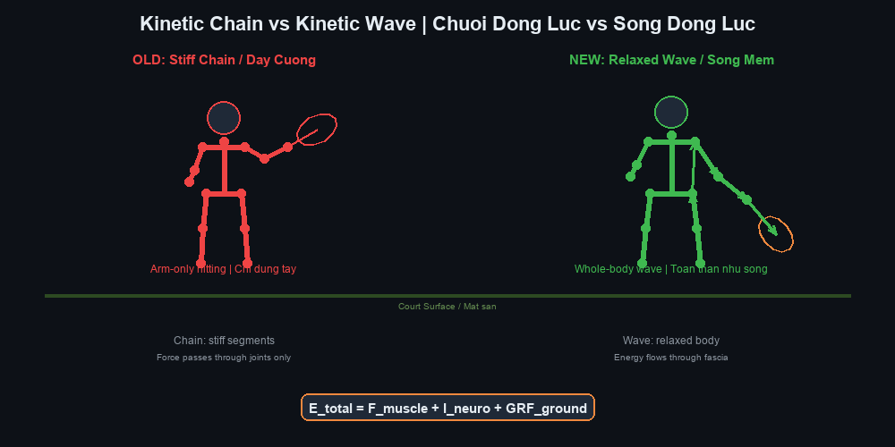
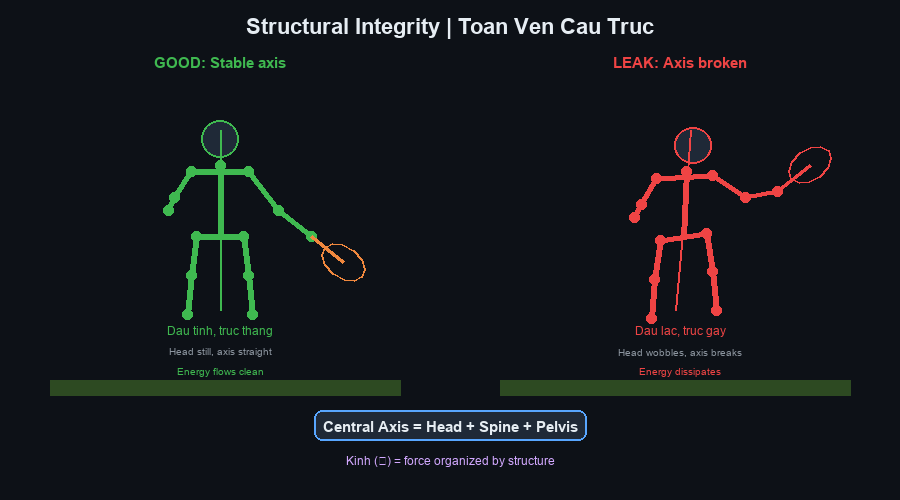
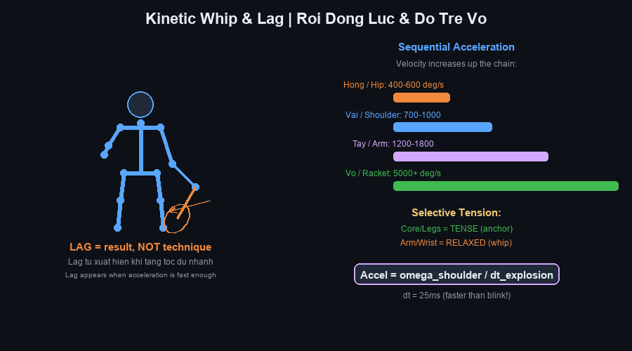
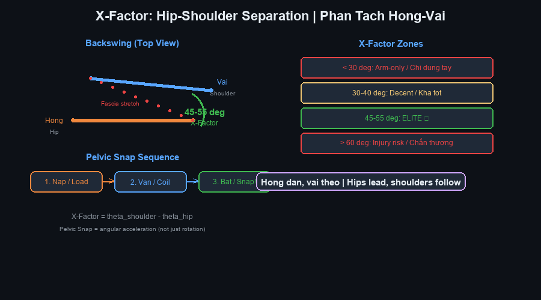
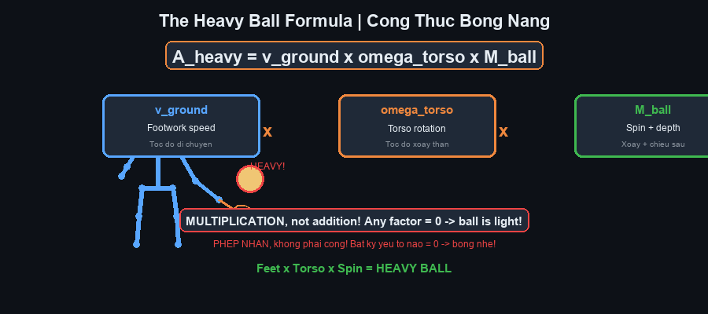

# Cẩm Nang Tennis Future Lab — Expanded Deep-Dive Edition

# Tennis Future Lab Master Handbook — Comprehensive with YouTube Videos + Illustrations
Tác giả / Author: Henry Pham (Phạm Đức Hải) & Tennis Future Lab
Ngày / Date: June 2026
Phiên bản / Version: 2.0 — Expanded Deep-Dive Edition with 12 Illustrated Diagrams
Nguồn / Sources: ChatGPT 24-chapter framework + Gemini 12 biomechanics equations + 87 YouTube videos + Technical Manual Generator skill
---

## 📋 BẢN ĐỒ TÀI LIỆU / DOCUMENT MAP
| |
| --- |
| Cẩm nang mở rộng này tích hợp toàn bộ hệ thống huấn luyện Tennis Future Lab với 87 link video YouTube và 12 sơ đồ sinh cơ học SVG tùy chỉnh . Mỗi trong 20 chương được mở rộng thành phần deep-dive đầy đủ gồm: (1) giáo trình cốt lõi, (2) phương trình đơn giản, (3) link video YouTube, (4) sơ đồ minh họa, (5) bài tập, (6) sửa lỗi, (7) thẻ in. |
| Cách dùng: Đọc chương → nghiên cứu sơ đồ → xem video → thực hành bài tập → kiểm tra thẻ. In thẻ và mang theo trong túi tennis Surrey. |
| Đối tượng: Người chơi phong trào 3.5–4.5, tuổi 50+, Surrey BC Canada. |
---

## MỤC LỤC / TABLE OF CONTENTS
| Phần / Part | Chương / Chapter | Illustrations | Videos |
|---|---|---|---|
| I — Triết Lý / Philosophy | Ch 1–5: New Paradigm, Kilướiic Wave, DET, GRF, Structure | 4 diagrams | 18 videos |
| II — Sinh Cơ Học / Biomechanics | Ch 6–10: Kilướiic Whip, Pelvic Snap, Timing, Wave, Proprioception | 3 diagrams | 14 videos |
| III — Fascia & Kình / Fascia | Ch 11–12: Fascial System, Elastic Energy, Jin | 2 diagrams | 10 videos |
| IV — Cú Thuận Tay / Cú Thuận Tay | Ch 13–14: Cú Thuận Tay Mastery, Lag, Racket Head Speed | 1 diagram | 12 videos |
| V — Cú Trái Tay / Cú Trái Tay | Ch 15: One-Handed Cú Trái Tay | 1 diagram | 5 videos |
| VI — Phát Bóng / Phát Bóng | Ch 16–17: Phát Bóng Architecture, Vertical Explosion, Pronation | 1 diagram | 16 videos |
| VII — Vôlei / Vôlei | Ch 18: Vôlei Mechanics | — | 4 videos |
| VIII — Footwork / Footwork | Ch 19: Split Step, Movement, Gravity Boost | 1 diagram | 4 videos |
| IX — Neuro & Flow / Neuro | Ch 20: NKF Synchronization, Flow State | 1 diagram | 3 videos |
| Equations | 12 Biomechanics Equations | — | — |
| Video Master List | All 87 videos with URLs | — | 87 videos |
| Cheat Sheet | Printable summary | — | — |
---
* * *

# PHẦN I — TRIẾT LÝ TENNIS THẾ HỆ MỚI

# PART I — NEW PARADIGM TENNIS PHILOSOPHY
---

# Chương 1 — Từ Old Paradigm Đến New Paradigm

## 1.1 Core Teaching / Giáo Trình Cốt Lõi
| |
| --- |
| Sự thay đổi mô hình: Hơn một thế kỷ, huấn luyện tennis dựa trên giả định: "Đánh mạnh hơn = nhiều lực hơn." Nhưng khi xem Federer, Djokovic, Alcaraz, Sinner, ta thấy nghịch lý — họ tạo tốc độ bóng cực cao mà trông gần như không dùng sức. Nếu sức cơ bắp là câu trả lời, vận động viên thể hình sẽ thống trị tennis. Thực tế ngược lại. |
| Mô hình Old Paradigm: Chân → Hông → Vai → Tay → Vợt → Bóng. Chuỗi mắt xích cơ học. Huấn luyện tập trung vào vị trí: "Đặt khuỷu đây, cổ tay kia." Cơ thể được xem như máy móc với đòn bẩy và bánh răng. |
| Mô hình New Paradigm: Cơ thể là hệ thống truyền sóng sinh học. Sức mạnh = hiệu suất truyền, không phải tạo lực. Mục tiêu không phải "tạo nhiều lực hơn" mà là "thất thoát ít hơn." |
| Công thức hiệu suất: Hiệu suất = Năng lượng vào bóng ÷ Năng lượng tạo ra. Tay vợt elite không tạo nhiều hơn — họ thất thoát ít hơn. Người A: tạo 100, truyền 55 → 55%. Người B: tạo 80, truyền 72 → 90%. Người B đánh nặng hơn với ít sức hơn. |

## 1.2 The Four Pillars / Bốn Trụ Cột
| |
| --- |
| Trụ cột 1 — Lực phản chấn (GRF): Mọi lực bắt nguồn từ mặt đất. Định luật III Newton: bạn đạp sân, sân đẩy ngược. Không tiếp đất = không lực. |
| Trụ cột 2 — Năng lượng đàn hồi: Cơ thể không chỉ có cơ — còn có gân, mạc, mô liên kết hoạt động như lò xo. E = ½ × k × (Δx)². Tăng 20% vặn cho HƠN 20% năng lượng (số mũ bình phương). |
| Trụ cột 3 — Đồng bộ thần kinh-cơ: Não là nhạc trưởng. Cơ bắp là nhạc công. Nếu chơi sai nhịp, âm nhạc hỗn loạn. Nếu đồng bộ, toàn hệ thống cộng hưởng. Tạo nên "Flow State." |
| Trụ cột 4 — Tính toàn vẹn cấu trúc: Cầu mạnh truyền tải nặng. Cầu yếu rung lắc và tiêu tán năng lượng. Cấu trúc cơ thể (cổ chân → gối → hông → cột sống → vai → cổ tay) phải đủ vững để truyền lực không rò rỉ. |

## 1.3 For 50+ Players / Dành cho người 50+
| |
| --- |
| Đây là chương quan trọng nhất cho bạn. Người trẻ có thể bù kỹ thuật kém bằng tốc độ, sức mạnh, và khả năng hồi phục. Bạn không thể. Nhưng bạn CÓ THỂ vượt họ về hiệu suất. New Paradigm là lợi thế cạnh tranh của bạn — nó ưu tiên cảm nhận, timing, và truyền dẫn hơn sức cơ bắp thô. |

## 1.4 Deep-Dive Drill / Bài Tập Deep-Dive
| Drill | What It Does | How To Do It | Reps |
|---|---|---|---|
| Ground Pressure Awareness | Feel GRF before swing | Stand in Cú Thuận Tay tư thế. Press feet into ground. Hold 5 sec. Shadow swing. | 3×20 |
| Energy Leak Audit | Find where you lose power | Record 20 cú thuận tays at 240fps. Check: knee collapse? early shoulder? arm tension? wrist flip? head movement? | 1 set |
| Effortless Rally | Experience high DET | Rally at 60% speed. Focus on relaxation. Notice: less effort = same or more bóng speed. | 10 min |

### 🎥 YouTube Videos for This Chapter
| # | Video Title | URL | Why Watch |
|---|---|---|---|
| 1 | The Secret of Effortless Power in Tennis | https://www.youtube.com/watch?v=wosF0qTCVZ0 | Core concept: why Federer looks effortless |
| 2 | 5 Steps to Effortless Power! | https://www.youtube.com/watch?v=9NGDHfUQYcQ | Practical steps to shift from arm to body power |
| 3 | Get Cú Thuận Tay Power WITHOUT Swinging Harder | https://www.youtube.com/watch?v=xwFVcyt8P_M | The efficiency formula in action |
| 4 | Effortless Cú Thuận Tay Power: Relax, Don't Force | https://www.youtube.com/watch?v=h4wBj8mkW88 | Relaxation as the key to power |

### 📋 Chapter 1 Card
```
╔═══════════════════════════════════════════════════════════╗
║ CHAPTER 1 — NEW PARADIGM / TƯ DUY MỚI ║
╠═══════════════════════════════════════════════════════════╣
║ 🎯 ONE BIG IDEA: ║
║ Power = transfer efficiency, NOT muscle force. ║
║ Sức mạnh = hiệu suất truyền lực, KHÔNG phải sức cơ bắp. ║
║ ║
║ KEY CUES: ║
║ • "Feel the ground" / "Cảm nhận mặt sân" ║
║ • "Relax to accelerate" / "Thả lỏng để tăng tốc" ║
║ • "Less effort, more result" / "Ít sức, nhiều kết quả" ║
║ ║
║ ⚠️ TOP MISTAKE: ║
║ Swinging harder when you should transfer better. ║
║ Vung mạnh hơn khi cần truyền tốt hơn. ║
║ ║
║ 💭 MASTER CUE: ║
║ "The ground is your engine" / "Mặt sân là động cơ" ║
╚═══════════════════════════════════════════════════════════╝
```
---

# Chương 2 — Kilướiic Chain Hay Kilướiic Wave?

## 2.1 Core Teaching / Giáo Trình Cốt Lõi
| |
| --- |
| Cuộc tranh luận: Kilướiic chain truyền thống nói năng lượng truyền tuần tự qua khớp (chân → cẳng chân → hông → vai → tay → vợt). Mô hình hữu ích nhưng chưa đầy đủ. Nghiên cứu hiện đại với motion capture 3D, EMG, và phân tích fascia cho thấy năng lượng cũng lan truyền như sóng cơ học qua mô liên kết — không chỉ qua trình tự khớp. |
| Hình ảnh chiếc roi: Người dùng roi da không kéo đầu roi. Họ tạo xung lực ở cán. Xung lan truyền, mỗi đoạn nhỏ hơn và nhẹ hơn, nên vận tốc tăng. Đầu roi có thể vượt tốc độ âm thanh. Trong tennis: hông = cán, vợt = đầu. |
| Sóng dừng: Trong tranh bóng nhịp nhàng, sóng dừng có thể hình thành — node (điểm gần đứng yên) và antinode (dao động cực đại). Đầu và cột sống trung tâm là node; vợt và tay là antinode. Đây là lý do đầu Federer hầu như không động — nó là node trong hệ sóng dừng. |
| Năm pha Kilướiic Wave: 1) Nạp — chân ép, mạc căng. 2) Khuếch đại — hông và thân xoay. 3) Tăng tốc — tay và cẳng tay nhanh lên. 4) Bùng nổ — đầu vợt đạt vận tốc cực đại lúc tiếp xúc. 5) Tiêu tán — follow-through hấp thụ lực dư, bảo vệ khớp. |

## 2.2 Illustration / Sơ Đồ Minh Họa


## 2.3 Why Fascia Matters / Vì Sao Hệ Mạc Quan Trọng
| |
| --- |
| Hệ mạc không chỉ là "màng bọc." Nó là mạng lưới liên tục từ chân đến tay — "interlưới cơ học" của cơ thể. Nó tích trữ đàn hồi, có trí nhớ hình dạng, và liên tục (khác cơ bắp bị chia đoạn). Khi vặn hông, mạc căng. Khi nhả, nó bật lại — nhanh hơn cơ co. Đây là cơ sở sinh học của effortless power. |
| Ý nghĩa cho 50+: Mạc phản ứng với rèn luyện ở mọi tuổi. Không cần trẻ để xây đàn hồi mạc. Kéo giãn chậm và bài tập xoay xây "lò xo" trong vài tuần. |

## 2.4 Deep-Dive Drill / Bài Tập Deep-Dive
| Drill | What It Does | How To Do It | Reps |
|---|---|---|---|
| Towel Whip | Feel the whip mechanism | Use a long towel. Swing like Cú Thuận Tay. Create a "snap" sound at the end. Focus: the snap comes from body rotation, not arm force. | 3×30 |
| Rope Wave | Visualize wave propagation | Use a battle rope. Create waves from your feet (not arms). Watch the wave travel down the rope. | 3×20 |
| Shadow Wave Swing | Internalize the wave | No vợt. Rotate hips gently. Let arms hang complétely loose. Feel: arms are pulled by torso, not pushed by muscle. | 100 reps |
| Closed-Eyes Wave Perception | Build proprioception of the wave | Shadow swing with eyes closed. Track where you feel the energy travel: feet → legs → hips → torso → shoulder → arm → hand. | 30 reps |

### 🎥 YouTube Videos for This Chapter
| # | Video Title | URL | Why Watch |
|---|---|---|---|
| 5 | Understand the Kilướiic Chain from Rick Macci | https://www.youtube.com/watch?v=rtPri1J_5Q8 | Top huấn luyện viên explains kilướiic chain simply |
| 6 | How to Perform Kilướiic Chain on the Cú Thuận Tay | https://www.youtube.com/watch?v=LbFEmpfYMhA | Practical Cú Thuận Tay kilướiic chain bài tập |
| 7 | Every Player Needs to Understand the Kilướiic Chain | https://www.youtube.com/watch?v=XEAHCYfbv-k | Rick Macci on why chain matters for ALL levels |
| 8 | Top to Bottom Kilướiic Chain — Cú Thuận Tay Tutorial | https://www.youtube.com/watch?v=t9cN78hePa8 | Step-by-step chain breakdown |
| 9 | Understanding the Kilướiic Whip in Tennis | https://www.youtube.com/watch?v=EpTQ04fm3ps | The whip concept explained |
| 10 | The Service Kilướiic Flow Explained | https://www.youtube.com/watch?v=X9w2HwSAIsk | Kilướiic wave in the Phát Bóng |
| 11 | Whip It — The Cú Thuận Tay Whip Motion | https://www.youtube.com/watch?v=vX5MjNKKhMI | Whip mechanics for Cú Thuận Tay |
| 12 | Kilướiic Whip Part 1 — Movement Map Lesson | https://www.youtube.com/watch?v=bprD3malRtE | Movement mapping for whip |

### 📋 Chapter 2 Card
```
╔═══════════════════════════════════════════════════════════╗
║ CHAPTER 2 — KINETIC WAVE / SÓNG ĐỘNG LỰC ║
╠═══════════════════════════════════════════════════════════╣
║ 🎯 ONE BIG IDEA: ║
║ Your body is a whip, not a hammer. ║
║ Cơ thể là chiếc roi, không phải búa. ║
║ ║
║ KEY CUES: ║
║ • "Hips lead, arm follows" / "Hông dẫn, tay theo" ║
║ • "Let the wave travel" / "Để sóng tự đi" ║
║ • "Relax the arm to whip" / "Thả lỏng tay để roi vút" ║
║ ║
║ ⚠️ TOP MISTAKE: ║
║ Stiffening the arm blocks the wave. ║
║ Gồng tay chặn dòng sóng. ║
║ ║
║ 💭 MASTER CUE: ║
║ "Be the whip" / "Hãy là chiếc roi" ║
╚═══════════════════════════════════════════════════════════╝
```
---

# Chương 3 — Truyền Năng Lượng Động (DET)

## 3.1 Core Teaching / Giáo Trình Cốt Lõi
| |
| --- |
| Định nghĩa DET: Khả năng tạo, lưu trữ, truyền dẫn, và giải phóng năng lượng qua toàn thân đến bóng với tổn thất tối thiểu. Cú đánh tốt không phải cú dùng nhiều sức nhất — mà là cú lãng phí ít nhất. |
| Phương trình DET: DET = E_bóng ÷ E_tạo ra. Mục tiêu: >90%. Đa số người chơi phong trào ở 55-70% — nghĩa là lãng phí một phần ba đến một nửa năng lượng. |
| Bốn pha truyền năng lượng: 1) Tạo (GRF, chuyển trọng lượng, xoay), 2) Lưu trữ (mạc, gân, đàn hồi), 3) Truyền (cấu trúc, trục trung tâm, chuỗi thần kinh-cơ), 4) Giải phóng (tăng tốc đầu vợt, tiếp xúc, follow-through). |

## 3.2 Illustration / Sơ Đồ Minh Họa


## 3.3 The Five Energy Leaks / Năm Điểm Rò Rỉ
| Leak | What Happens | Energy Lost | Fix |
|---|---|---|---|
| 1. Knee Collapse | Knee caves inward on loading | −10 to 20% | Strengthen glute med; conscious knee tracking |
| 2. Early Shoulder Opening | Shoulders rotate before hips | −15 to 25% | Hip initiation bài tập; separation hold |
| 3. Arm Tension | Biceps/triceps contract during swing | −10 to 30% | Towel whip bài tập; shadow swing with relaxed arm |
| 4. Wrist Collapse | Wrist flips at contact (K_wrist < 0.5) | −20 to 40% | Contact freeze bài tập; cách cầm vợt pressure ladder |
| 5. Head Movement | Head bobs during swing | Variable (destabilizes vestibular system) | Stable head shadow bài tập; phone recording check |

## 3.4 DET Score Assessment / Đánh Giá DET
| Score | Level | What It Means |
|---|---|---|
| < 60 | Beginner | Most energy wasted — arm-only hitting |
| 60-75 | giải trí | Some chain working but major leaks |
| 75-85 | Competitive | Good structure, minor leaks |
| 85-92 | Advanced | Nearly elite transfer efficiency |
| > 92 | Elite | Near-compléte energy transfer — "effortless" |

## 3.5 Case Study: Roger Federer / Nghiên Cứu Federer
| |
| --- |
| Federer là ví dụ kinh điển của DET cao. Đầu gần như đứng yên lúc tiếp xúc (node trong sóng dừng). X-Factor khoảng 50°. Độ vững cổ tay rất cao (K_wrist ≥ 0.85). Đàn hồi mạc xuất sắc. Kết quả: tốc độ bóng cực cao với ít sức nhìn thấy. Ông không đánh mạnh — ông truyền hiệu quả. |

## 3.6 The Simplified DET Equation (from Gemini analysis)
| |
| --- |
| Năng lượng tổng = Sức cơ bắp + Tín hiệu thần kinh + Lực phản chấn |
| F_muscle = lực cơ bắp nhìn thấy (ít quan trọng nhất cho tốc độ) |
| I_neuro = cường độ xung thần kinh ("đánh lửa" timing) |
| GRF_ground = lực phản chấn mặt sân (nguồn lực thực sự) |
| DET = E_bóng ÷ E_tạo ra → Mục tiêu: > 90% |

## 3.7 Deep-Dive Drill / Bài Tập Deep-Dive
| Drill | What It Does | How To Do It | Reps |
|---|---|---|---|
| Pressure Foot Drill | Feel GRF as the energy source | Stand in Cú Thuận Tay tư thế. Press foot into ground. Hold 3 sec. Shadow swing focusing on the push. | 3×20 |
| Hip-Shoulder Separation | Build X-Factor elastic energy | Hold hips facing lưới. Rotate shoulders back. Hold 2 sec. Return. | 20 reps |
| Stable Head Drill | Eliminate head movement leak | Record 20 cú thuận tays at 240fps. Watch your head. Target: minimal movement. | 1 set |
| Contact Freeze | Verify wrist stability at contact | Hit bóng. Freeze at contact position for 2 sec. Check: is wrist stable? Is vợt fás square? | 50 bóngs |

### 🎥 YouTube Videos for This Chapter
| # | Video Title | URL | Why Watch |
|---|---|---|---|
| 13 | Understand the Kilướiic Chain — Rick Macci | https://www.youtube.com/watch?v=rtPri1J_5Q8 | DET in plain language |
| 14 | How to Perform Kilướiic Chain on the Cú Thuận Tay | https://www.youtube.com/watch?v=LbFEmpfYMhA | DET applied to Cú Thuận Tay |
| 15 | Effortless Cú Thuận Tay Power: Relax, Don't Force | https://www.youtube.com/watch?v=h4wBj8mkW88 | High DET = low effort |

### 📋 Chapter 3 Card
```
╔═══════════════════════════════════════════════════════════╗
║ CHAPTER 3 — DET / TRUYỀN NĂNG LƯỢNG ĐỘNG ║
╠═══════════════════════════════════════════════════════════╣
║ 🎯 ONE BIG IDEA: ║
║ Power = what reaches the bóng, not what you generate. ║
║ Sức mạnh = cái đến bóng, không phải cái bạn tạo ra. ║
║ ║
║ KEY CUES: ║
║ • "Plug the leaks" / "Bịt lỗ rò rỉ" ║
║ • "Lock the wrist at contact" / "Khóa cổ tay lúc tiếp xúc"║
║ • "Stable head = stable energy" / "Đầu ổn = lực ổn" ║
║ ║
║ ⚠️ TOP MISTAKE: ║
║ Wrist collapse at contact loses 20-40% energy. ║
║ Cổ tay gãy lúc tiếp xúc mất 20-40% năng lượng. ║
║ ║
║ 💭 MASTER CUE: ║
║ "Transfer, don't generate" / "Truyền, đừng tạo" ║
╚═══════════════════════════════════════════════════════════╝
```
---

# Chương 4 — Lực Phản Chấn Mặt Sân (GRF)

## 4.1 Core Teaching / Giáo Trình Cốt Lõi
| |
| --- |
| Định luật III Newton: Mọi lực tác động đều có phản lực bằng và ngược chiều. Khi bàn chân ép xuống sân, sân đẩy ngược. MỌI lực tennis bắt nguồn từ tương tác này. Không đất = không lực (thử đánh trên băng). |
| Ba thành phần GRF: 1) Thẳng đứng (lực hướng lên — cho độ cao, xoáy trên, Phát Bóng), 2) Ngang (đà tiến — cho chiều sâu, chuyển trọng lượng), 3) Xoay (mô-men — cho xoáy, góc, lực). Tennis hiện đại dùng cả ba đồng thời. |
| Triple Extension: Duỗi đồng thời cổ chân + gối + hông. Đây là cơ chế tạo lực mạnh nhất của cơ thể — giống bật nhảy, cử tạ Olympic, hay bật nhảy bóng rổ. Trong tennis, xuất hiện ở Phát Bóng, Cú Thuận Tay tấn công, và open-tư thế Cú Thuận Tay. |

## 4.2 Illustration / Sơ Đồ Minh Họa


## 4.3 The GRF Equation (from Gemini analysis)
| |
| --- |
| Lực đẩy lên = Trọng lượng tĩnh + Lực bật bùng nổ |
| m × g = trọng lượng tĩnh cơ thể (1× BW) |
| m × a_jump = gia tốc bật nhảy từ đôi chân |
| Chuẩn elite cho Phát Bóng: F_v đỉnh ≈ 2.3–2.5 × trọng lượng cơ thể |
| Ví dụ: Người 80kg → 200kg lực đạp xuống sân |
| Insight cho 50+: Người 75kg với gia tốc tốt có thể tạo 112-187kg GRF. NHIỀU HƠN RẤT NHIỀU so với cánh tay (chừng 15-20kg). Mặt sân là "cơ bắp" lớn nhất của bạn. |

## 4.4 Force Vectors in Different Strokes / Vector Lực Trong Các Cú Đánh
| Stroke | Primary Force Vector | Secondary | How to Feel It |
|---|---|---|---|
| Phát Bóng | Vertical (upward) | Rotational | "Push the earth away" |
| Cú Thuận Tay (open tư thế) | Rotational | Vertical | "Spin on the outside leg" |
| Cú Thuận Tay (neutral) | Horizontal (forward) | Rotational | "Step into the bóng" |
| 1HB Cú Trái Tay | Rotational | Horizontal | "Plant the front foot, rotate" |
| Vôlei | Horizontal (minimal) | — | "Feet set, block the bóng" |

## 4.5 Foot Loading Patterns / Mẫu Tải Trọng Bàn Chân
| |
| --- |
| Open tư thế Cú Thuận Tay: Tải trọng chủ yếu chân ngoài (chân phải người thuận tay phải). Ép mạnh, rồi bùng nổ xoay. |
| Neutral tư thế: Tải chân sau, chuyển sang chân trước khi vung. Đà tuyến tính. |
| Phát Bóng: Tải chân sau → chuyển chân trước → bùng nổ lên trên qua triple extension. |

## 4.6 Deep-Dive Drill / Bài Tập Deep-Dive
| Drill | What It Does | How To Do It | Reps |
|---|---|---|---|
| Ground Pressure Awareness | Feel GRF before swing | Stand in Cú Thuận Tay tư thế. Press foot into court. Hold 5 sec. Feel the ground pushing back. Then shadow swing. | 3×20 |
| Triple Extension Drill | Build the explosive mechanism | Lower center. Extend ankle + knee + hip simultaneously. Rise onto toes. | 3×15 |
| Medicine Ball Throw | Feel rotational GRF | Rotate torso. Push off ground. Throw medicine bóng. Focus: power starts from feet, not arms. | 3×10 |
| Split-Step GRF | Build explosive first step | Split step. Land. Immediately push latetranh bóng left or right. Focus: the push comes from ground reaction. | 3×20 |
| Phát Bóng Leg Drive | Build Phát Bóng-specific GRF | Trophy position hold. Then explode upward. Focus: legs push ground, body rises. | 3×20 |

## 4.7 Video Assessment / Đánh Giá Qua Video
| Good Signs ✅ | Bad Signs ❌ |
|---|---|
| Lower center before hitting | Standing tall, no knee bend |
| Heel pushes strongly off court | Flat-footed, no push |
| Hips accelerate AFTER foot push | Hips rotate before foot push |
| Body rises natutranh bóng after contact | No vertical component |
| Arm relaxed during acceleration | Arm tense, "hitting" with muscle |

### 🎥 YouTube Videos for This Chapter
| # | Video Title | URL | Why Watch |
|---|---|---|---|
| 16 | Ground Reaction Force In Tennis Demo #1 | https://www.youtube.com/watch?v=cPKUosWplHw | GRF demonstrated on court |
| 17 | Hit Like a Heavyweight — GRF for More Power | https://www.youtube.com/watch?v=LIKPQn_KgwA | GRF = punching power in tennis |
| 18 | Ground Reaction Force Demo #2 — The Tennis Throw | https://www.youtube.com/watch?v=5fLpQawNOHU | GRF in medicine bóng throw |

### 📋 Chapter 4 Card
```
╔═══════════════════════════════════════════════════════════╗
║ CHAPTER 4 — GRF / LỰC PHẢN CHẤN MẶT SÂN ║
╠═══════════════════════════════════════════════════════════╣
║ 🎯 ONE BIG IDEA: ║
║ The ground is your power source. Push it, don't pull it. ║
║ Mặt sân là nguồn lực. Đạp xuống, đừng kéo tay. ║
║ ║
║ KEY CUES: ║
║ • "Load the legs first" / "Nạp chân trước" ║
║ • "Push the earth away" / "Đẩy sân ra xa" ║
║ • "Feel the ground push back" / "Cảm sân đẩy ngược" ║
║ ║
║ ⚠️ TOP MISTAKE: ║
║ Standing tall, not bending knees = zero GRF. ║
║ Đứng thẳng, không gập gối = GRF bằng không. ║
║ ║
║ 💭 MASTER CUE: ║
║ "Ground up, not arm out" / "Từ đất lên, không từ tay ra" ║
╚═══════════════════════════════════════════════════════════╝
```
---

# Chương 5 — Tính Toàn Vẹn Cấu Trúc

## 5.1 Core Teaching / Giáo Trình Cốt Lõi
| |
| --- |
| Cấu trúc = ống truyền năng lượng. GRF khổng lồ cũng vô dụng nếu ống rò rỉ. Cấu trúc là duy trì alignment tối ưu TRONG lúc tạo lực — không đứng cứng, mà vững trong khi di chuyển. |
| Trục trung tâm: Đường cột sống-đầu-chậu là cột trung tâm. Nếu dao động, năng lượng tiêu tán. Hình dung tòa nhà: cột trung tâm rung = toàn bộ rung và mất khả năng chịu tải. |
| Ổn định đầu: Hệ tiền đình (tai trong) kiểm soát thăng bằng. Đầu di chuyển trong lúc vung = não chuyển tài nguyên từ timing, phối hợp, điều khiển vợt sang giữ thăng bằng. Federer, Djokovic, Sinner — đầu gần như đứng yên lúc tiếp xúc. |
| Cân bằng động vs tĩnh: Tennis không cần bạn đứng yên. Nó cần bạn kiểm soát trọng tâm khi tăng tốc, giảm tốc, đổi hướng, và xoay. Đây là cân bằng động — quan trọng hơn nhiều so với cân bằng tĩnh. |
| Tensegrity: Cơ thể không phải xếp gạch. Nó là mạng lưới lực căng — như cầu treo hay lều. Xương không "đỡ" bạn một mình. Mạc tạo căng liên tục phân phối lực khắp cơ thể. Đây là "tensional integrity" = tensegrity. |
| Liên hệ Kình (勁): Trong Thái Cực, Kình là "lực được tổ chức bởi cấu trúc." Cấu trúc gãy = kình không chảy. Trong tennis, cùng nguyên lý: Cú Thuận Tay tốt không phải sức tay — là lực được tổ chức qua cấu trúc vững. |

## 5.2 Illustration / Sơ Đồ Minh Họa


## 5.3 Six Structural Leaks / Sáu Điểm Rò Rỉ Cấu Trúc
| Leak | What Happens | Fix |
|---|---|---|
| 1. Head Bobbing | Head moves during swing | Stable head shadow bài tập; record and check |
| 2. Collapsed Knee | Knee caves inward | Glute med strengthening; knee tracking awareness |
| 3. Pelvic Tilt Loss | Pelvis tilts or rotates uncontrolled | Core stability; pelvic floor engagement |
| 4. Rounded Spine | Upper back rounds forward | "Long spine" cue; wall alignment bài tập |
| 5. Scapular Collapse | Shoulder blade loses position | Scapular strengthening; "shoulder back" cue |
| 6. Wrist Collapse | Wrist flips at contact (K_wrist < 0.5) | Contact freeze; cách cầm vợt pressure ladder |

## 5.4 Deep-Dive Drill / Bài Tập Deep-Dive
| Drill | What It Does | How To Do It | Reps |
|---|---|---|---|
| Wall Alignment | Feel correct structural alignment | Stand against wall: heels, buttocks, shoulders, head all touching. Hold 60 sec. Feel the "stack." | 2 sets |
| Single Leg Balance | Build dynamic stability core | Stand on one leg. 30-60 sec each. Progress: eyes closed, then on unstable surfás. | 3× each leg |
| Head Stability Shadow Swing | Eliminate head movement | Shadow Cú Thuận Tay. Keep head nearly motionless. 50 reps. Then record and verify. | 50 reps |
| Split-Step Hold | Check structural alignment after split | Split step. Hold 2 sec. Check: head stable? Hips aligned? Knees tracking? | 30 reps |
| Medicine Ball Rotation | Build stable rotational structure | Rotate torso with medicine bóng. Keep central axis stable. Feel: rotate around the spine, not with it. | 3×12 |

### 🎥 YouTube Videos for This Chapter
| # | Video Title | URL | Why Watch |
|---|---|---|---|
| 19 | The Physics, Geometry, and Biomechanics of Power Development | https://www.youtube.com/watch?v=KU7FHy1qQOI | Structure and geometry of power |

### 📋 Chapter 5 Card
```
╔═══════════════════════════════════════════════════════════╗
║ CHAPTER 5 — STRUCTURAL INTEGRITY / TOÀN VẸN CẤU TRÚC ║
╠═══════════════════════════════════════════════════════════╣
║ 🎯 ONE BIG IDEA: ║
║ Structure is the pipe. Power is the water. ║
║ Cấu trúc là ống. Sức mạnh là nước. ║
║ ║
║ KEY CUES: ║
║ • "Still head, moving body" / "Đầu tĩnh, người động" ║
║ • "Long spine" / "Cột sống dài" ║
║ • "Stable base" / "Nền vững" ║
║ ║
║ ⚠️ TOP MISTAKE: ║
║ Head bobbing wastes neural resources. ║
║ Đầu lắc tốn tài nguyên thần kinh. ║
║ ║
║ 💭 MASTER CUE: ║
║ "Still head, heavy bóng" / "Đầu tĩnh, bóng nặng" ║
╚═══════════════════════════════════════════════════════════╝
```
---
* * *

# PHẦN II — SINH CƠ HỌC HIỆN ĐẠI

# PART II — MODERN BIOMECHANICS
---

# Chương 6 — Kiến Trúc Chiếc Roi Động Lực

## 6.1 Core Teaching / Giáo Trình Cốt Lõi
| |
| --- |
| Nghịch lý khuếch đại vận tốc: Cú Thuận Tay ATP: hông ~400-600°/s, vai ~700-1000°/s, tay ~1200-1800°/s, đầu vợt có thể vượt 5000°/s. Đầu vợt KHÔNG bị "kéo" — nó bị KHUẾCH ĐẠI qua truyền năng lượng tuần tự. Mỗi đoạn tăng tốc, đạt đỉnh, rồi giảm tốc — truyền động lượng cho đoạn sau, nhẹ hơn, nhanh hơn. |
| Tăng tốc tuần tự: Hông tăng tốc → đỉnh → giảm (truyền động lượng) → vai tăng tốc → đỉnh → giảm → tay tăng tốc → đỉnh → giảm → vợt tăng tốc tối đa lúc tiếp xúc. Như truyền ngọn lửa từ người chạy này sang người chạy kế, mỗi người nhanh hơn. |
| Lag là KẾT QUẢ, không phải kỹ thuật: Đầu vợt tụt sau do quán tính khi hệ thống tăng tốc đủ nhanh. Đừng cố "tạo lag" bằng cổ tay — điều đó tạo căng thẳng và làm chậm mọi thứ. Hãy để lag xảy ra bằng cách thả lỏng tay và để cơ thể tăng tốc. |
| Căng có chọn lọc: Tay vợt elite vừa lỏng (tay, cổ tay, cẳng tay) vừa căng (core, chân, cấu trúc). Mềm nơi sóng đi, chắc nơi neo giữ. Đây là nghịch lý của effortless power — phải lỏng để nhanh. |

## 6.2 Illustration / Sơ Đồ Minh Họa


## 6.3 The Whip Equation (from Gemini analysis)
| |
| --- |
| Gia tốc đầu vợt = Tốc độ xoay vai ÷ Thời gian bùng nổ |
| Cửa sổ bùng nổ càng ngắn = gia tốc càng cao |
| Elite: cửa sổ ≈ 25 mili-giây (nhanh hơn chớp mắt ~100ms) |
| Nếu gồng tay, cửa sổ giãn ra và gia tốc giảm 40% |
| Đàn hồi = năng lượng lò xo tích trữ nhả ra nhanh hơn cơ co |

## 6.4 The Six Common Mistakes / Sáu Lỗi Phổ Biến
| # | Mistake | Why It Fails | Fix |
|---|---|---|---|
| 1 | Hitting with the arm | Arm = small muscle, can't generate 5000°/s | Use ground + hips; arm follows |
| 2 | Holding lag with muscle | Tension kills acceleration | Relax; lét lag happen |
| 3 | Rotating shoulders too early | Breaks sequential timing | Hip initiation bài tập |
| 4 | Glocking the wrist | Kills whip mechanism | Towel whip; shadow relaxed |
| 5 | Not using legs | No GRF = no energy source | Ground pressure bài tập |
| 6 | Stiffening entire body | No wave can travel through rigid material | Selective tension thực hành |

## 6.5 Deep-Dive Drill / Bài Tập Deep-Dive
| Drill | What It Does | How To Do It | Reps |
|---|---|---|---|
| Towel Whip | Feel the whip snap | Use a long towel. Swing like Cú Thuận Tay. Goal: hear a "snap" at the end. The snap comes from body rotation, not arm force. | 3×30 |
| Rope Swing | Visualize wave propagation | Use a soft rope. Create waves from your feet. Watch the rope tip accelerate. | 3×20 |
| Lag Awareness | Feel lag as a result, not technique | Shadow swing slowly. Complétely relax wrist. Feel the vợt head trailing behind your hand. | 50 reps |
| Medicine Ball Throw | Build sequential acceleration | Rotate hips. Throw medicine bóng. Rule: hips start the throw, not arms. | 3×10 |
| Continuous Cú Thuận Tay | Build wave rhythm | Hit 20 bóngs continuously. Goal: each shot flows into the next with consistent rhythm, like a wave. | 3 sets |

### 🎥 YouTube Videos for This Chapter
| # | Video Title | URL | Why Watch |
|---|---|---|---|
| 20 | Understanding the Kilướiic Whip in Tennis | https://www.youtube.com/watch?v=EpTQ04fm3ps | Core whip concept |
| 21 | Whip It — The Cú Thuận Tay Whip Motion | https://www.youtube.com/watch?v=vX5MjNKKhMI | Cú Thuận Tay whip visualization |
| 22 | Kilướiic Whip Part 1 — Movement Map Lesson | https://www.youtube.com/watch?v=bprD3malRtE | Whip as movement pattern |
| 23 | The Science Behind Roger Federer's Effortless Cú Thuận Tay | https://www.youtube.com/watch?v=dQ1STaobbMM | Federer's whip analyzed scientifically |
| 24 | Tennis Cú Thuận Tay Wrist Lag — Simple Trick | https://www.youtube.com/watch?v=5_vJU8XJOTs | Lag as natural result |
| 25 | Why Your Cú Thuận Tay Doesn't Lag | https://www.youtube.com/watch?v=Bun_Ouz5-bs | Common lag mistakes |

### 📋 Chapter 6 Card
```
╔═══════════════════════════════════════════════════════════╗
║ CHAPTER 6 — KINETIC WHIP / ROI ĐỘNG LỰC ║
╠═══════════════════════════════════════════════════════════╣
║ 🎯 ONE BIG IDEA: ║
║ The vợt head is amplified, not pulled. ║
║ Đầu vợt bị khuếch đại, không bị kéo. ║
║ ║
║ KEY CUES: ║
║ • "Relax to whip" / "Thả lỏng để vút" ║
║ • "Lag happens, don't force it" / "Lag tự xảy ra" ║
║ • "Soft arm, solid core" / "Tay mềm, lõi chắc" ║
║ ║
║ ⚠️ TOP MISTAKE: ║
║ Trying to "create lag" with wrist force. ║
║ Cố "tạo lag" bằng lực cổ tay. ║
║ ║
║ 💭 MASTER CUE: ║
║ "Let it lag" / "Để nó tụt" ║
╚═══════════════════════════════════════════════════════════╝
```
---

# Chương 7 — Cơ Chế Bật Hông

## 7.1 Core Teaching / Giáo Trình Cốt Lõi
| |
| --- |
| Chậu = bộ khuếch đại đầu tiên. GRF tạo năng lượng. Chậu là đoạn đầu tiên khuếch đại. Chậu thụ động = toàn chuỗi suy giảm. Mọi lực từ đất phải qua chậu để đến thân trên. |
| Pelvic Snap = gia tốc góc đột ngột của chậu sau pha nạp. Không chỉ "xoay hông" — nó là gia tốc bùng nổ, không phải xoay chậm. Hai người có thể xoay cùng biên độ, nhưng người tăng tốc nhanh hơn tạo nhiều năng lượng hơn. |
| Phân tách Hông-Vai (X-Factor): Góc giữa trục hông và trục vai ở cuối đưa vợt ra sau. Tạo độ căng mạc tích trữ đàn hồi. Lý tưởng: 45-55°. Dưới 30° = đánh tay. Trên 60° = nguy cơ chấn thương lưng. |
| Nguyên lý vàng: Hông kéo vai. KHÔNG phải vai kéo hông. Chậu khởi động trước. Vai theo sau 20-50 mili-giây. Khoảng trống nhỏ này là nơi đàn hồi tích trữ và giải phóng. |
| Mông = động cơ chính: Cơ mông lớn là một trong những cơ mạnh nhất. Nó duỗi hông, ổn định chậu, và tạo lực xoay. Mông yếu = chậu thụ động = đánh tay. |
| Core = truyền lực, không phải tạo lực: Core không tạo Pelvic Snap. Nó truyền và ổn định. Như trục truyền động xe — không tạo sức mạnh, chỉ truyền đi. |

## 7.2 Illustration / Sơ Đồ Minh Họa


## 7.3 The X-Factor Equation
| |
| --- |
| X-Factor = θ_vai − θ_hông |
| < 30° = năng lượng thấp (đánh tay) |
| 30-40° = khá tốt |
| 45-55° = Elite |
| > 60° = nguy cơ chấn thương (quá tải lưng dưới) |

## 7.4 Pelvic Snap in Different Strokes / Pelvic Snap Trong Các Cú Đánh
| Stroke | Pelvis Role | Common Error |
|---|---|---|
| Cú Thuận Tay | Pelvis starts 20-50ms before shoulders. Acceleration, not just rotation. | Shoulders open first = lost X-Factor |
| 1HB Cú Trái Tay | Pelvis opens before shoulders. Critical for power. | Opening shoulders first = weak bóng + elbow strain |
| Phát Bóng | Pelvis cú đẩys upward and forward before torso rotation. | "Arming" the Phát Bóng = no leg/pelvis cú đẩy |

## 7.5 Six Common Errors / Sáu Lỗi Phổ Biến
| # | Error | Consequence | Fix |
|---|---|---|---|
| 1 | Using shoulders before hips | Lost torque, arm hitting | Hip initiation bài tập |
| 2 | Standing too tall | No loading, no snap | Lower center, load legs |
| 3 | Not loading feet | No GRF to amplify | Ground pressure bài tập |
| 4 | Opening hips too early | Lost separation | Separation hold bài tập |
| 5 | Constantly flexing abs | Blocks fascial recoil | Core = stable, not rigid |
| 6 | Trying to "rotate harder" | Tension kills acceleration | Focus on speed, not force |

## 7.6 Deep-Dive Drill / Bài Tập Deep-Dive
| Drill | What It Does | How To Do It | Reps |
|---|---|---|---|
| Hip Initiation Drill | Train hips-first sequencing | Unit turn. Rotate ONLY hips. Keep shoulders still. Then lét shoulders follow. | 30 reps |
| Medicine Ball Hip Throw | Build explosive pelvis | Load outside leg. Hips lead. Throw medicine bóng. Focus: hips start, arms follow. | 3×10 |
| Separation Hold | Build X-Factor stretch | Rotate shoulders back. Hold hips forward. Hold 3 sec. Feel the fascial stretch in the obliques. | 20 reps |
| Shadow Cú Thuận Tay Snap | Internalize pelvic snap | Loading phase. Then: pelvis fires first. Shoulders follow. Arm trails. Focus on the SEQUENCE. | 50 reps |
| Phát Bóng Pelvis Drive | Build Phát Bóng pelvic cú đẩy | Trophy position. Push pelvis upward FIRST. Then arm accelerates. Focus: pelvis leads. | 30 reps |

### 🎥 YouTube Videos for This Chapter
| # | Video Title | URL | Why Watch |
|---|---|---|---|
| 26 | Why HIPS and SHOULDERS SEPARATION is CRUCIAL in Tennis | https://www.youtube.com/watch?v=gLs08_wGBb4 | X-Factor explained clearly |
| 27 | How to Develop Power Through Hip Shoulder Separation | https://www.youtube.com/watch?v=-V9fRDexnPM | Modern Cú Thuận Tay separation bài tập |
| 28 | The REAL Way To Turn Your Hips On Your Cú Thuận Tay | https://www.youtube.com/watch?v=QOyX6JiCXDs | Pro technique for hip activation |
| 29 | How To Get Power From Your Hips In Tennis | https://www.youtube.com/watch?v=c9glLgadcas | Hip power basics |
| 30 | How to Get Your Hips Working on Your Cú Thuận Tay | https://www.youtube.com/watch?v=V26ifGuICIE | Practical hip bài tập |
| 31 | Serving Tip — How to Rotate the Hips | https://www.youtube.com/watch?v=do-ULi22fkE | Hip rotation in the Phát Bóng |
| 32 | Achieve Stronger Shots With Proper Hip Rotation | https://www.youtube.com/watch?v=ee9Vi4Ghmao | Hip rotation for all strokes |

### 📋 Chapter 7 Card
```
╔═══════════════════════════════════════════════════════════╗
║ CHAPTER 7 — PELVIC SNAP / BẬT HÔNG ║
╠═══════════════════════════════════════════════════════════╣
║ 🎯 ONE BIG IDEA: ║
║ Hips lead. Shoulders follow. Always. ║
║ Hông dẫn. Vai theo. Luôn luôn. ║
║ ║
║ KEY CUES: ║
║ • "Hips fire first" / "Hông nổ trước" ║
║ • "Feel the X-Factor stretch" / "Cảm độ vặn X-Factor" ║
║ • "Snap, don't rotate slowly" / "Bật, không xoay chậm" ║
║ ║
║ ⚠️ TOP MISTAKE: ║
║ Shoulders opening before hips = lost torque. ║
║ Vai mở trước hông = mất mô-men xoắn. ║
║ ║
║ 💭 MASTER CUE: ║
║ "Hips first, always" / "Hông trước, luôn luôn" ║
╚═══════════════════════════════════════════════════════════╝
```
---

# Chương 8 — Thời Điểm Thần Kinh-Cơ Học

## 8.1 Core Teaching / Giáo Trình Cốt Lõi
| |
| --- |
| Tennis là môn mili-giây: Cú Thuận Tay: ~300-500ms từ quyết định đến tiếp xúc. Vôlei: ~150-250ms. Trả Phát Bóng nhanh: ~200ms. Phản ứng đơn giản: ~220-250ms. Nếu chỉ phản ứng sau khi thấy bóng, bạn đã muộn. |
| Feedforward: Não tạo kế hoạch vận động TRƯỚC khi nhận đủ thông tin. Não dự đoán đường bóng từ ngôn ngữ cơ thể đối thủ (tư thế, cách cầm vợt, góc vai, đường vợt) và kích hoạt cơ thể trước. Đó là lý do anticipation thắng phản ứng. |
| Mô hình nội tại: Não xây mô hình dự đoán từ hàng ngàn lần lặp. "Nếu tình huống A xảy → B có thể → kích hoạt C." Càng chơi nhiều, mô hình càng phong phú. Đó là lý do người giàu kinh nghiệm "biết ngay" bóng đi đâu. |
| Proprioception: GPS nội bộ. Tay vợt elite cảm nhận góc mặt vợt, vị trí cổ tay, hướng cơ thể không cần nhìn. "Giác quan thứ sáu" này được rèn qua hàng ngàn giờ — không phải tài bẩm sinh. |
| Quiet Eye: Vận động viên elite giữ ánh nhìn tại điểm tiếp xúc lâu hơn. Cải thiện timing, độ chính xác, ra quyết định. Nghiên cứu cho thấy Quiet Eye có thể rèn — tập giữ mắt tại điểm tiếp xúc 100-200ms lâu hơn cảm giác tự nhiên. |

## 8.2 The Neural Delay Equation (from Gemini analysis)
| |
| --- |
| Lực cơ = Tín hiệu thần kinh (trễ Δt) × Hệ số bão hòa |
| Δt = Độ trễ điện-cơ ≈ 30-100ms |
| Não gửi lệnh → tủy sống → nơ-ron vận động → giải phóng canxi → cơ co |
| Ý nghĩa: Phải bắt đầu chuyển động TRƯỚC khi bóng đến điểm lý tưởng |
| Bão hòa: dù tối đa xung thần kinh, lực cơ đỉnh — "cố gắng hơn" không giúp |

## 8.3 Timing Windows / Cửa Sổ Thời Điểm
| Stroke | Timing Window | If Early | If Late |
|---|---|---|---|
| Cú Thuận Tay | ~50-100ms before contact | Ball goes long (fás too open) | Ball goes short or into lưới |
| Phát Bóng | Contact at peak of jump | Ball goes into lưới | Ball goes long |
| Vôlei | ~30-50ms before vợt meets bóng | Ball flies long | Ball drops short |
| Return | Start split-step as phát bóngr contacts | Too early = wrong read | Too late = no time to prepare |

## 8.4 Deep-Dive Drill / Bài Tập Deep-Dive
| Drill | What It Does | How To Do It | Reps |
|---|---|---|---|
| Bounce-Hit Timing | Sync rhythm with the bóng | Say "Bounce" when bóng bounces. Say "Hit" when you contact. This builds internal rhythm. | 50 bóngs |
| Shadow Swing Eyes Closed | Build proprioception | Close eyes. Shadow swing. Feel where the vợt is without looking. | 30 reps |
| Catch and Throw | Build fast neural pathways | Partner throws bóng. Catch with one hand. Immediately throw back. Reduces reaction time. | 3×20 |
| Quiet Eye Drill | Train gaze stability | Hit 50 bóngs. After each contact, hold gaze at contact điểm for 100-200ms longer than feels natural. | 50 bóngs |
| Anticipation Reading | Build feedforward prediction | Watch trận videos. Pause BEFORE opponent contacts bóng. Predict: where does the bóng go? Check your prediction. | 20 clips |

### 🎥 YouTube Videos for This Chapter
| # | Video Title | URL | Why Watch |
|---|---|---|---|
| 33 | How to Find the Flow State In Tennis | https://www.youtube.com/watch?v=1bosoxYAPuU | Flow = perfect neuro-mechanical timing |
| 34 | The Psychology Behind 'Locking In' — Flow State in Tennis | https://www.youtube.com/watch?v=8ePjJCxKYsg | Neural timing under pressure |

### 📋 Chapter 8 Card
```
╔═══════════════════════════════════════════════════════════╗
║ CHAPTER 8 — NEURO-TIMING / THỜI ĐIỂM THẦN KINH ║
╠═══════════════════════════════════════════════════════════╣
║ 🎯 ONE BIG IDEA: ║
║ Anticipation beats reaction every time. ║
║ Dự đoán luôn thắng phản ứng. ║
║ ║
║ KEY CUES: ║
║ • "Read the opponent, not the bóng" / "Đọc đối thủ" ║
║ • "Quiet eye at contact" / "Mắt tĩnh lúc tiếp xúc" ║
║ • "Start before you think you should" / "Bắt đầu sớm" ║
║ ║
║ ⚠️ TOP MISTAKE: ║
║ Waiting to see the bóng before moving. ║
║ Chờ thấy bóng mới di chuyển. ║
║ ║
║ 💭 MASTER CUE: ║
║ "Predict, don't wait" / "Dự đoán, đừng chờ" ║
╚═══════════════════════════════════════════════════════════╝
```
---

# Chương 9 — Mô Hình Truyền Sóng Sinh Học

## 9.1 Core Teaching / Giáo Trình Cốt Lõi
| |
| --- |
| Cơ thể là môi trường truyền sóng. Năng lượng không chỉ đi qua khớp — nó lan truyền như sóng cơ học qua hệ mạc, gân, mô liên kết. Như sóng trên dây: dây không chạy, nhưng năng lượng chạy. |
| Node và Antinode: Node = điểm neo ổn định (bàn chân, chậu, bả vai) gần như không động. Antinode = vùng dao động mạnh (thân, tay, đầu vợt) dao động cực đại. Hệ sóng tốt cần node vững và antinode tự do. |
| Sóng dừng trong tennis: Trong tranh bóng nhịp nhàng, cơ thể tái sử dụng dao động — không tạo mới mỗi lần. Sóng phản xạ qua lại, tạo cộng hưởng. Đây là cơ sở sinh cơ học của "effortless power" trong tranh bóng dài. |
| Sụp đổ sóng: Sóng có thể bị phá bởi: gồng cơ (chặn sóng), gãy cấu trúc (ống vỡ), sai timing (sóng đến sai lúc), cách cầm vợt quá chặt (tay = node cuối, nếu cứng, sóng không ra vợt), đầu di chuyển (làm nhiễu node trung tâm). |
| Phát kình (發勁) = Truyền sóng + Đồng bộ thần kinh. Không huyền bí — nó là truyền sóng sinh học đồng bộ cao. "Phát kình" của Thái Cực và "effortless power" của tennis là cùng hiện tượng: truyền năng lượng tối đa qua cơ thể lỏng, vững, đồng bộ. |

## 9.2 The Wave Propagation in Different Strokes / Truyền Sóng Trong Các Cú Đánh
| Stroke | Wave Path | Critical Node | Critical Antinode |
|---|---|---|---|
| Cú Thuận Tay | Foot → Pelvis → Torso → Shoulder → Arm → Racket | Pelvis (must be stable to transmit) | Racket head (must be free to accelerate) |
| 1HB Cú Trái Tay | Foot → Pelvis → Torso → Scapula → Arm → Racket | Scapula (must be controlled to transmit) | Full arm extension |
| Phát Bóng | Foot → Leg → Pelvis → Spine → Shoulder → Arm → Racket | Central axis (spine must be stable) | Racket head at contact |
| Vôlei | Foot → Leg → Torso → Arm → Racket (short chain) | Wrist (K_wrist ≥ 0.95) | Racket fás angle |

## 9.3 Deep-Dive Drill / Bài Tập Deep-Dive
| Drill | What It Does | How To Do It | Reps |
|---|---|---|---|
| Rope Wave Drill | Visualize wave propagation | Use a long rope. Create waves from feet. Watch the wave travel and amplify at the tip. | 50 reps |
| Wave Shadow Swing | Internalize wave feeling | Transfer force from feet. Feel the wave travel up through pelvis, torso, shoulder, arm, vợt. | 100 reps |
| Medicine Ball Wave Throw | Build wave in a dynamic action | Create force from ground. Throw medicine bóng following the full wave sequence: feet → hips → torso → arm. | 3×10 |
| Relaxed Rally | Experience wave resonance | Rally at 60% speed. Focus on the FLOW of energy through your body, not on hitting hard. | 10 min |
| Closed-Eyes Wave Perception | Deepen proprioception of the wave | Shadow swing with eyes closed. Track where you feel energy: feet → legs → hips → torso → shoulder → arm → hand. | 30 reps |

### 🎥 YouTube Videos for This Chapter
| # | Video Title | URL | Why Watch |
|---|---|---|---|
| 35 | The Physics, Geometry, and Biomechanics of Power Development | https://www.youtube.com/watch?v=KU7FHy1qQOI | Wave/geometry of power |
| 36 | The Stretch-Shortening Cycle in the Cú Thuận Tay | https://www.youtube.com/watch?v=lybNSHpbcsU | SSC = wave loading and release |
| 37 | How to Use the Stretch-Shortening Cycle of Cú Trái Tay | https://www.youtube.com/watch?v=LUl5-O6Vkts | SSC wave in Cú Trái Tay |

### 📋 Chapter 9 Card
```
╔═══════════════════════════════════════════════════════════╗
║ CHAPTER 9 — WAVE PROPAGATION / TRUYỀN SÓNG SINH HỌC ║
╠═══════════════════════════════════════════════════════════╣
║ 🎯 ONE BIG IDEA: ║
║ Energy travels as waves, not just through joints. ║
║ Năng lượng đi như sóng, không chỉ qua khớp. ║
║ ║
║ KEY CUES: ║
║ • "Stable nodes, free antinodes" / "Neo vững, đầu tự do" ║
║ • "Let the wave flow" / "Để sóng chảy" ║
║ • "Don't break the chain" / "Đừng đứt chuỗi" ║
║ ║
║ ⚠️ TOP MISTAKE: ║
║ Muscle tension breaks the wave. ║
║ Gồng cơ làm đứt sóng. ║
║ ║
║ 💭 MASTER CUE: ║
║ "Be the wave" / "Hãy là sóng" ║
╚═══════════════════════════════════════════════════════════╝
```
---

# Chương 10 — Trí Tuệ Cảm Nhận Vận Động

## 10.1 Core Teaching / Giáo Trình Cốt Lõi
| |
| --- |
| Proprioception = GPS nội bộ. Tay vợt elite cảm nhận góc mặt vợt, áp lực cách cầm vợt, chất lượng tiếp xúc không cần nhìn. Hỏi người mới "mặt vợt bao nhiêu độ?" — không biết. Hỏi elite — "tôi cảm được." |
| Body Schema: Não duy trì bản đồ vô thức vị trí mọi bộ phận. Bản đồ chính xác = vận động hiệu quả. Bản đồ lệch = timing giảm. |
| Racket Schema: Sau hàng ngàn giờ, não tích hợp vợt như phần mở rộng cơ thể — như kiếm sĩ với thanh kiếm hay nhạc sĩ với cây đàn. Vợt trở thành "một phần của bạn," không phải vật ngoài. |
| Proprioception bàn tay: Bàn tay là kết nối DUY NHẤT giữa bạn và vợt. Mọi thông tin về góc vợt, vị trí mặt, chất lượng tiếp xúc đi qua receptor áp lực bàn tay. Grip quá chặt = bàn tay tê = không phản hồi; quá lỏng = vợt không ổn. |
| Thang áp lực cách cầm vợt: 0-2 = quá lỏng, 3-4 = chuẩn bị, 5-6 = tiếp xúc, 7-8 = Vôlei mạnh, 9-10 = không hiệu quả. Tối ưu: 3-4 lúc chuẩn bị, tăng lên 5-6 lúc tiếp xúc. |
| Cho 50+: Proprioception là chất DỄ rèn nhất ở mọi tuổi. Không cần tốc độ hay sức mạnh — chỉ cần nhận thức và lặp lại. Đây là siêu năng lực của bạn khi lớn tuổi. |

## 10.2 Contact Awareness / Nhận Thức Tiếp Xúc
| |
| --- |
| Tay vợt elite biết cú đánh tốt hay xấu ngay lúc bóng chạm vợt — trước khi thấy quỹ đạo. Thông tin từ: rung động ("cảm" tiếp xúc), âm thanh ("tiếng" tiếp xúc), phản lực (bóng đẩy ngược), và proprioception (góc mặt vợt). |
| Sweet Spot Intelligence: Sweet spot không chỉ là vị trí trên vợt — nó là KỸ NĂNG. Elite liên tục điều chỉnh để tìm sweet spot. Não học sweet spot ở đâu trong không gian qua hàng ngàn lần lặp. |

## 10.3 The Proprioceptive Receptors / Các Receptor Proprioceptive
| Receptor | Location | What It Senses |
|---|---|---|
| Muscle Spindle | Inside muscles | Muscle length and stretch speed |
| Golgi Tendon Organ | In tendons | Tendon tension (force) |
| Joint Receptors | In joint capsules | Joint angle and pressure |
| Fascial Receptors | In fascia | Tension, vibration, deformation |
| Merkel | Hand skin | Static pressure, shape |
| Meissner | Hand skin | Light touch, vibration |
| Pacinian | Hand skin | High-frequency vibration |
| Ruffini | Hand skin | Skin stretch, movement |

## 10.4 Deep-Dive Drill / Bài Tập Deep-Dive
| Drill | What It Does | How To Do It | Reps |
|---|---|---|---|
| Eyes Closed Shadow Swing | Build vợt schema | Close eyes. Shadow Cú Thuận Tay. Feel the vợt fás angle, wrist position, arm angle — without looking. | 50 reps |
| Grip Pressure Ladder | Train cách cầm vợt awareness | Swing with cách cầm vợt 2/10 → 4/10 → 6/10 → 8/10. Compare the feel. Learn the difference between "too tight" and "just right." | 4 levels × 10 |
| Sweet Spot Awareness | Train contact quality | Hit bóngs slowly. Focus on the SOUND of contact. A clean sweet-spot hit sounds different (a "plink" not a "thwack"). | 50 bóngs |
| Peripheral Vision Rally | Build spatial awareness | Rally lightly. While tracking the bóng, also maintain awareness of: opponent position, court geometry, open spáss. | 10 min |
| Blind Catch Drill | Build hand proprioception | Close eyes. Partner tosses bóng from short ditư thế. Catch with one hand. Feel the bóng's position through hand proprioception. | 3×20 |

### 🎥 YouTube Videos for This Chapter
| # | Video Title | URL | Why Watch |
|---|---|---|---|
| 38 | Proprioception Drills — Fitness for Tennis | https://www.youtube.com/watch?v=8bEHoPHNRbE | Practical proprioception luyện tập |
| 39 | Periodization of Proprioceptive Balance Training | https://www.youtube.com/watch?v=mLzfEA3DtQ4 | Balance progression for tennis |
| 40 | Hungarian Tennis Federation: Proprioceptive Workout | https://www.youtube.com/watch?v=NUbvu7Q5GpE | Pro-level proprioception protocol |

### 📋 Chapter 10 Card
```
╔═══════════════════════════════════════════════════════════╗
║ CHAPTER 10 — PROPRIOCEPTION / TRÍ TUẺ CẢM NHẬN ║
╠═══════════════════════════════════════════════════════════╣
║ 🎯 ONE BIG IDEA: ║
║ Feel the vợt, don't think about it. ║
║ Cảm nhận vợt, đừng nghĩ về nó. ║
║ ║
║ KEY CUES: ║
║ • "Feel the fás" / "Cảm mặt vợt" ║
║ • "Grip 4/10, not 8/10" / "Grip 4/10, không 8/10" ║
║ • "Know without looking" / "Biết không cần nhìn" ║
║ ║
║ ⚠️ TOP MISTAKE: ║
║ Grip too tight = no feel = no control. ║
║ Grip quá chặt = không cảm = không kiểm soát. ║
║ ║
║ 💭 MASTER CUE: ║
║ "Feel, don't think" / "Cảm, đừng nghĩ" ║
╚═══════════════════════════════════════════════════════════╝
```
---
* * *

# PHẦN III — FASCIA, KÌNH & NĂNG LƯỢNG ĐÀN HỒI

# PART III — FASCIA, JIN & ELASTIC ENERGY
---

# Chương 11 — Hệ Mạc & Năng Lượng Đàn Hồi

## 11.1 Core Teaching / Giáo Trình Cốt Lõi
| |
| --- |
| Hệ mạc = "interlưới cơ học" của cơ thể. Mạng mô liên kết liên tục từ chân đến tay. Tích trữ và giải phóng đàn hồi — như dây thun khắp cơ thể. Khác cơ bắp (chia đoạn), mạc LIÊN TỤC — lực ở bàn chân có thể cảm nhận ở bàn tay qua mạng mạc. |
| Ba chuỗi mạc trong tennis: 1) Chuỗi chéo trước (ngực → chéo bụng → đùi trong) — dẫn Cú Thuận Tay, Phát Bóng. 2) Chuỗi chéo sau (lưng rộng → mông lớn) — dẫn Cú Trái Tay, xoay. 3) Chuỗi dọc sâu (bàn chân → bắp chân → đùi sau → cột sống) — truyền GRF từ đất. |
| Công thức đàn hồi: E = ½ × k × (Δx)². Số mũ bình phương là bí mật: tăng 20% vặn cho HƠN 20% năng lượng. Đó là lý do vặn tốt (X-Factor 45-55°) thắng sức cơ thô — bình phương khuếch đại độ vặn. |
| Hiệu suất giải phóng: E_giải phóng = e × E_tích trữ. Hệ số e (0-1) là phần năng lượng tích trữ thực sự quay lại. Thả lỏng (Tùng/鬆) tối đa hóa e → gần 1. Gồng cơ làm e thấp → năng lượng mất thành nhiệt. Đây là khoa học đằng sau "thả lỏng để đánh mạnh." |

## 11.2 Illustration / Sơ Đồ Minh Họa


## 11.3 The Elastic Energy Equations (from Gemini analysis)
| |
| --- |
| Năng lượng tích trữ = ½ × độ cứng × (độ kéo dãn)² |
| E_stored = năng lượng đàn hồi trong mạc/gân |
| k = độ cứng (mạc rèn có k tối ưu — không quá cứng, không quá mềm) |
| Δx = độ kéo dãn (mức vặn — X-Factor) |
| Insight chính: (Δx)² nghĩa là vặn gấp đôi = năng lượng gấp bốn |
| Năng lượng giải phóng = hiệu suất × năng lượng tích trữ |
| e = hệ số hiệu suất (0 đến 1) |
| Thả lỏng (Tùng/鬆) → e gần 1 → gần như hoàn toàn năng lượng quay lại |
| Gồng → e giảm → năng lượng mất thành nhiệt → bóng yếu dù tốn sức |

## 11.4 Stretch-Shortening Cycle (SSC) / Chu Kỳ Kéo Dãn-Co Rút
| Phase | What Happens | Tennis Example |
|---|---|---|
| 1. Stretch | Fascia and tendons are pulled taut | Backswing: shoulders rotate past hips, fascia stretches |
| 2. Transition | Brief pause at maximum stretch — energy stored | Top of đưa vợt ra sau: X-Factor at peak, elastic energy maximized |
| 3. Shortening | Stored energy releases explosively | Forward swing: fascia snaps back, accelerating the vợt faster than muscle alone could |
| |
| --- |
| Vì sao SSC thắng cơ: Đàn hồi NHANH hơn cơ co. Gân kéo và nhả tạo lực trong 15-25ms. Cơ co từ đầu mất 30-100ms. Đây là lý do người "lỏng" đánh mạnh hơn người "gồng" — họ dùng SSC, không phải cơ thô. |

## 11.5 Deep-Dive Drill / Bài Tập Deep-Dive
| Drill | What It Does | How To Do It | Reps |
|---|---|---|---|
| Elastic Band Rotation | Feel fascial loading and release | Attach resitư thế band to hip-height anchor. Rotate slowly away. Feel the stretch build. Release natutranh bóng — lét the band pull you back. | 3×12 each side |
| Coil and Release Shadow | Build SSC in the swing | Slowly coil to maximum X-Factor. Pause 2 sec. Then release FAST — feel the snap. | 50 reps |
| Medicine Ball Wave Throw | Build elastic recoil power | Load. Coil. PAUSE. Then throw — feel the elastic snap accelerate the bóng. | 3×10 |
| Relaxed Rally | Experience SSC in live hitting | Rally at 60%. Focus: coil, feel the stretch, then relax and lét the snap happen. Don't add muscle force. | 10 min |
| Fascial Stretch Routine | Build fascial elasticity | Daily: cat-cow, thoracic rotations, hip flexor stretches, lat stretches. Hold each 30 sec. | Daily |

### 🎥 YouTube Videos for This Chapter
| # | Video Title | URL | Why Watch |
|---|---|---|---|
| 41 | Elastic Energy Fundamentals — Phát Bóng Course! | https://www.youtube.com/watch?v=a4MdqsI4LDM | Elastic energy in the Phát Bóng |
| 42 | Unlock Elastic Power with This Fascia Exercise | https://www.youtube.com/watch?v=pB15_xIGXFc | Fascia-specific exercise for tennis |
| 43 | Fascia Biomechanics Lecture — Dr. McCullough | https://www.youtube.com/watch?v=HIuKREMD7wE | Fascia science lecture |
| 44 | The SSC — What Is It? 3 Phases & Factors | https://www.youtube.com/watch?v=oJkExwpyR84 | SSC fundamentals |
| 45 | Stretch Shortening Cycle Explained — Physiology | https://www.youtube.com/watch?v=iilyVw5uVXg | SSC physiology for athlétes |
| 46 | Tennis Drill for EXPLOSIVE POWER! | https://www.youtube.com/watch?v=9peYw0vo5yM | Elastic power bài tập on court |

### 📋 Chapter 11 Card
```
╔═══════════════════════════════════════════════════════════╗
║ CHAPTER 11 — FASCIA & ELASTIC / MẠC & ĐÀN HỒI ║
╠═══════════════════════════════════════════════════════════╣
║ 🎯 ONE BIG IDEA: ║
║ Your body is a spring, not a motor. ║
║ Cơ thể là lò xo, không phải động cơ. ║
║ ║
║ KEY CUES: ║
║ • "Coil to load" / "Vặn để nạp" ║
║ • "Release, don't push" / "Nhả, đừng đẩy" ║
║ • "Relax = efficient spring" / "Lỏng = lò xo hiệu quả" ║
║ ║
║ ⚠️ TOP MISTAKE: ║
║ Muscle tension kills elastic recoil. ║
║ Gồng cơ giết đàn hồi. ║
║ ║
║ 💭 MASTER CUE: ║
║ "Be a spring" / "Hãy là lò xo" ║
╚═══════════════════════════════════════════════════════════╝
```
---

# Chương 12 — Kình (勁) & Liên Hệ Thái Cực

## 12.1 Core Teaching / Giáo Trình Cốt Lõi
| |
| --- |
| Kình (勁) ≠ Lực (力). Lực là sức cơ bắp thô — ai cũng tạo được. Kình là lực được TỔ CHỨC bởi cấu trúc, timing, và thả lỏng. Nó chảy qua cơ thể kết nối — từ bàn chân qua hệ mạc đến điểm tiếp xúc. Thái Cực sư 60kg có thể phát kình mạnh hơn lực sĩ 100kg, vì kình dùng mặt đất và kết nối toàn thân. |
| Ba nguyên lý chung Thái Cực và tennis: 1) Căn (根) — lực từ mặt đất, không từ tay. 2) Tùng (鬆) — thả lỏng cho phép truyền lực; gồng chặn. 3) Chỉnh thể (整體) — cơ thể là một đơn vị, không phải tập hợp bộ phận. |
| Phát kình (發勁) = giải phóng sóng bùng nổ. Trong Thái Cực: lực toàn thân đột ngột trong thời gian cực ngắn. Trong tennis: cùng cơ chế lúc tiếp xúc bóng. Cả hai dùng: lực mặt đất → nạp mạc → thả lỏng → giải phóng bùng nổ. |
| Khoa học: Kình không huyền bí. Nó là: GRF + Đàn hồi mạc + Truyền sóng + Đồng bộ thần kinh. Khi cả bốn tối ưu, kết quả là "effortless power" — chỉ là tên khác cho truyền năng lượng hiệu suất cao. |

## 12.2 The Hán-Việt Glossary / Bảng Thuật Ngữ Hán-Việt
| Hán-Việt | Chữ Hán | Meaning in Tennis |
|---|---|---|
| Kình (勁) | 勁 | Organized force — force structured by body alignment and timing, not raw muscle |
| Lực (力) | 力 | Raw muscle force — unorganized, arm-only hitting |
| Cấu (構) | 構 | Structure — the body's mechanical alignment |
| Trục (軸) | 軸 | Axis — the central axis (spine-head-pelvis) |
| Tụ lực (聚力) | 聚力 | Force gathering — the loading phase (coil, store elastic energy) |
| Khai (開) | 開 | Opening — the release phase (snap, accelerate) |
| Hợp (合) | 合 | Closing — the contact moment (lock structure, transmit force) |
| Chỉnh thể (整體) | 整體 | Whole body — the body as one connected unit |
| Tùng (鬆) | 鬆 | Relaxation — the key to efficient force transmission |
| Trầm (沉) | 沉 | Sinking — lowering center of mass for GRF |

## 12.3 Deep-Dive Drill / Bài Tập Deep-Dive
| Drill | What It Does | How To Do It | Reps |
|---|---|---|---|
| Push Hands Adaptation | Feel whole-body connection | Stand fás-to-fás with partner. Push palms together. Feel: can you push from your feet through your body to your hands, without using arm muscle? | 2 min |
| Tùng Practice | Train relaxation under load | Slowly coil to maximum. At maximum stretch, consciously relax MORE — feel the fascia stretch deeper while muscles soften. | 20 reps |
| Trầm (Sinking) Drill | Build ground connection | Stand in tư thế sẵn sàng. Slowly lower center 5cm. Feel the ground push back. Hold 10 sec. Feel the root. | 10 reps |
| Whole-Body Shadow Swing | Experience Chỉnh thể | Shadow swing focusing on: the force starts at the foot, travels through the fascia, and exits at the vợt — with NO muscle tension in the arm. | 50 reps |

### 🎥 YouTube Videos for This Chapter
| # | Video Title | URL | Why Watch |
|---|---|---|---|
| 47 | Fascia Biomechanics Lecture | https://www.youtube.com/watch?v=HIuKREMD7wE | Fascia = the physical basis of Kình |
| 48 | The Physics, Geometry, and Biomechanics of Power | https://www.youtube.com/watch?v=KU7FHy1qQOI | Power = structure + timing |

### 📋 Chapter 12 Card
```
╔═══════════════════════════════════════════════════════════╗
║ CHAPTER 12 — KÌNH (勁) / PHÁT KÌNH ║
╠═══════════════════════════════════════════════════════════╣
║ 🎯 ONE BIG IDEA: ║
║ Kình = organized force, not raw muscle. ║
║ Kình = lực có tổ chức, không phải sức cơ thô. ║
║ ║
║ KEY CUES: ║
║ • "Root in the ground" / "Gốc ở mặt sân" ║
║ • "Relax to transmit" / "Tùng để truyền" ║
║ • "Whole body, one unit" / "Toàn thân nhất thể" ║
║ ║
║ ⚠️ TOP MISTAKE: ║
║ Using lực (raw force) instead of kình (organized force). ║
║ Dùng lực thay vì kình. ║
║ ║
║ 💭 MASTER CUE: ║
║ "Feel the kình flow" / "Cảm kình chảy" ║
╚═══════════════════════════════════════════════════════════╝
```
---
* * *

# PHẦN IV — Cú Thuận Tay MASTERY SYSTEM

# PART IV — Cú Thuận Tay MASTERY SYSTEM
---

# Chương 13 — Kiến Trúc Cú Thuận Tay

## 13.1 Core Teaching / Giáo Trình Cốt Lõi
| |
| --- |
| Cú Thuận Tay = 7 tầng: 1) Lực mặt đất → 2) Nền & Cân bằng → 3) Nạp chậu → 4) Xoay thân → 5) Cấu trúc tay → 6) Tăng tốc vợt → 7) Tiếp xúc & Giải phóng. Bất kỳ tầng nào lỗi = cú đánh suy giảm. Không thể bỏ tầng. |
| Pha nhận thức: Trước khi di chuyển, não xử lý: hướng bóng, tốc độ, xoáy, chiều sâu. Elite xử lý sớm hơn — đọc ngôn ngữ cơ thể đối thủ trước khi bóng rời vợt. |
| Unit Turn: Ngay khi nhận hướng bóng, xoay vai và thân NHƯ MỘT KHỐI. Tay không thuận đặt trên cổ vợt. Đầu vợt giữ LÊN, không ra sau. Không xoay tay riêng — toàn thân trên xoay cùng. |
| Điểm tiếp xúc: Phía trước cơ thể, ổn định, cân bằng, mắt tập trung. Không có một điểm "đúng" duy nhất — có một VÙNG tiếp xúc tối ưu. Elite liên tục điều chỉnh để giữ tiếp xúc trong vùng. |
| Brush vs Drive: Cú Thuận Tay hiện đại = pha trộn tối ưu brush (xoáy trên — đường vợt đi lên) và cú đẩy (lực tiến — xuyên qua bóng). Không 100% cái nào. Tỷ lệ thay đổi: phòng thủ = nhiều brush hơn, tấn công = nhiều cú đẩy hơn. |
| Hồi phục: Sau cú đánh, quá trình chưa xong. Phải: cân bằng lại, về vị trí chiến thuật, chuẩn bị bóng kế. Hồi phục kém = cú tiếp theo kém = dây chuyền lỗi. |

## 13.2 The Heavy Ball Equation (from Gemini analysis)
| |
| --- |
| Độ nặng bóng = Tốc độ di chuyển × Tốc độ xoay thân × Động lượng bóng |
| Đây là PHÉP NHÂN — nếu BẤT KỲ yếu tố nào = 0, bóng nhẹ |
| v_ground = tốc độ bộ chân (đến sớm, setup đúng) |
| ω_torso = tốc độ xoay thân (động cơ từ Đan Điền) |
| M_bóng = xoáy + chiều sâu (phát lực — xoáy trên + quỹ đạo) |

## 13.3 Illustration / Sơ Đồ Minh Họa


## 13.4 Cú Thuận Tay Error Map / Bảng Lỗi Cú Thuận Tay
| Problem | Likely Cause | Fix |
|---|---|---|
| Ball in lưới | Racket fás closed, contact too late, insufficient cú đẩy | Open fás slightly; contact earlier; cú đẩy through |
| Ball long | Racket fás open, contact too early, too much force | Close fás; contact later; reduce force, add brush |
| Ball weak | No ground force, passive pelvis, arm-only hitting | GRF bài tập; hip initiation; towel whip |
| Inconsistent | Grip too tight, poor balance, timing off | Grip ladder; balance bài tập; bounce-hit timing |

## 13.5 Cú Thuận Tay for 50+ / Cú Thuận Tay Cho Người 50+
| |
| --- |
| Ưu tiên: timing, cân bằng, chất lượng tiếp xúc, truyền sóng, plásment chiến thuật. KHÔNG ưu tiên: sức mạnh tối đa. Mục tiêu: hiệu suất tối đa với chi phí sinh học tối thiểu. Bạn có thể tranh bóng 2 tiếng không mỏi tay nếu DET cao. |

## 13.6 Deep-Dive Drill / Bài Tập Deep-Dive
| Drill | What It Does | How To Do It | Reps |
|---|---|---|---|
| Shadow Swing (Level 1) | Build structure without bóng | No vợt or with vợt. Focus on: unit turn, loading, hip initiation, relaxed arm, contact position. | 100 reps |
| Drop Feed (Level 2) | Build contact quality | Drop bóng yourself. Hit Cú Thuận Tay. Focus: contact điểm, wrist stability, sweet spot. | 50 bóngs |
| Coach Feed (Level 3) | Build timing with moving bóng | Coach feeds at moderate speed. Focus: bước chia, approach, contact in zone. | 100 bóngs |
| Controlled Rally (Level 4) | Build consistency | Rally crosscourt. Goal: 20+ consecutive in play. Focus: rhythm, relaxation, consistent contact. | 10 min |
| Point Play (Level 5) | Build tactical application | Play điểms. Focus: shot selection, recovery, adaptation. | 20 điểms |

### 🎥 YouTube Videos for This Chapter
| # | Video Title | URL | Why Watch |
|---|---|---|---|
| 49 | Roger Federer Cú Thuận Tay Slow Motion | https://www.youtube.com/watch?v=stEhSvoou4g | The gold chuẩn Cú Thuận Tay |
| 50 | ATP Forehands Compilation in Slow Motion | https://www.youtube.com/watch?v=lgCokC--lyI | Multiple pro cú thuận tays compared |
| 51 | Cú Thuận Tay Mechanics at Mouratoglou Academy | https://www.youtube.com/watch?v=y9TiZuTFYv8 | Elite academy Cú Thuận Tay teaching |
| 52 | Slow Motion Cú Thuận Tay Compilation 2024 | https://www.youtube.com/watch?v=928wJjWeVyk | Modern Cú Thuận Tay examples |
| 53 | The Science Behind Federer's Effortless Cú Thuận Tay | https://www.youtube.com/watch?v=dQ1STaobbMM | Scientific analysis of Federer |
| 54 | Roger Federer Cú Thuận Tay Analysis 2019 | https://www.youtube.com/watch?v=pLs30GcRlm0 | Detailed Federer breakdown |
| 55 | Roger Federer Cú Thuận Tay Analysis Part 1 | https://www.youtube.com/watch?v=VK-9puanoRo | Classic Federer analysis |

### 📋 Chapter 13 Card
```
╔═══════════════════════════════════════════════════════════╗
║ CHAPTER 13 — Cú Thuận Tay / CÚ Cú Thuận Tay ║
╠═══════════════════════════════════════════════════════════╣
║ 🎯 ONE BIG IDEA: ║
║ Cú Thuận Tay starts from perception, not from the arm. ║
║ Cú Thuận Tay bắt đầu từ nhận thức, không từ tay. ║
║ ║
║ KEY CUES: ║
║ • "Turn as one block" / "Xoay một khối" ║
║ • "Contact in front" / "Tiếp xúc phía trước" ║
║ • "Brush and cú đẩy" / "Vuốt và đẩy" ║
║ ║
║ ⚠️ TOP MISTAKE: ║
║ Arm-only Cú Thuận Tay = no ground, no hips, no power. ║
║ Cú Thuận Tay bằng tay = không đất, không hông, không lực. ║
║ ║
║ 💭 MASTER CUE: ║
║ "Whole body, one shot" / "Toàn thân, một cú" ║
╚═══════════════════════════════════════════════════════════╝
```
---

# Chương 14 — Lag & Tốc Độ Đầu Vợt

## 14.1 Core Teaching / Giáo Trình Cốt Lõi
| |
| --- |
| Lag = đầu vợt tụt sau bàn tay trong lúc tăng tốc. Đó là dấu hiệu thấy được rằng roi đang hoạt động. Vợt tụt do QUÁN TÍNH — tay tăng tốc nhanh hơn đầu vợt theo kịp. Lag là KẾT QUẢ của tăng tốc tuần tự đúng, không phải kỹ thuật để ép. |
| Racket drop: Trong lúc tăng tốc, đầu vợt tự nhiên hạ dưới cổ tay — tạo quỹ đạo đi lên sản sinh xoáy trên. Đây không phải hành động có ý thức — nó là hình học của roi. |
| Windshield wiper: Sau tiếp xúc, cẳng tay xoay tự nhiên — tạo xoáy trên nặng và ổn định mặt vợt. Đây là "finish" cho thấy roi hoàn tất thành công. |
| Follow-through = kết quả, không phải nguyên nhân. Follow-through tốt không tạo lực — nó PHẢN ÁNH lực đã tạo trước. Nếu tập trung vào finish, bạn tập trung vào triệu chứng, không phải nguyên nhân. |

## 14.2 The DIT Equation (from Gemini analysis)
| |
| --- |
| Hiệu quả quán tính = (Độ nặng vung × Tốc độ đầu vợt) ÷ Khối lượng người chơi |
| I_swing = khối lượng vung (đầu nặng = khó dừng = xuyên phá hơn) |
| v_vợt = tốc độ đầu vợt (từ roi, không từ cơ tay) |
| Vợt nặng + kỹ thuật tốt = "bóng nặng" đẩy đối thủ lùi |

## 14.3 Deep-Dive Drill / Bài Tập Deep-Dive
| Drill | What It Does | How To Do It | Reps |
|---|---|---|---|
| Towel Whip (revisited) | Reinforce lag as natural result | Swing with towel. Focus: the "snap" at the end happens BECAUSE you relaxed, not because you forced it. | 3×30 |
| Lag Awareness Slow-Mo | Feel lag at slow speed | Shadow swing at 25% speed. Complétely relax wrist. Feel the vợt head trailing. Gradually increase speed while maintaining the lag. | 50 reps |
| Continuous Cú Thuận Tay | Build wave rhythm with lag | Hit 20 bóngs. Focus: lag appears natutranh bóng each time when you relax and use the body. | 3 sets |
| Wrist Stability Check | Verify K_wrist at contact | Hit bóng. Freeze at contact. Check: is wrist stable? Is vợt fás square? Is the contact in the sweet spot? | 50 bóngs |

### 🎥 YouTube Videos for This Chapter
| # | Video Title | URL | Why Watch |
|---|---|---|---|
| 56 | Tennis Cú Thuận Tay Wrist Lag — Simple Trick | https://www.youtube.com/watch?v=5_vJU8XJOTs | How to lét lag happen natutranh bóng |
| 57 | Tennis Cú Thuận Tay Wrist Lag — 3 Drills | https://www.youtube.com/watch?v=SP3ZmSM3d5s | Lag-specific bài tậps |
| 58 | Why Your Cú Thuận Tay Doesn't Lag | https://www.youtube.com/watch?v=Bun_Ouz5-bs | Common lag-killers |
| 59 | My Favorite Cú Thuận Tay Lag Drill + Pro Tips | https://www.youtube.com/watch?v=OIn-cDZnBkE | Pro lag bài tập with tips |
| 60 | Federer Cú Thuận Tay Analysis Part 1 | https://www.youtube.com/watch?v=VK-9puanoRo | Federer's lag and drop |

### 📋 Chapter 14 Card
```
╔═══════════════════════════════════════════════════════════╗
║ CHAPTER 14 — LAG & RHS / LAG & TỐC ĐỘ ĐẦU VỢT ║
╠═══════════════════════════════════════════════════════════╣
║ 🎯 ONE BIG IDEA: ║
║ Lag is the proof that the whip works. ║
║ Lag là bằng chứng roi hoạt động. ║
║ ║
║ KEY CUES: ║
║ • "Let it drop" / "Để đầu vợt rơi" ║
║ • "Don't force lag" / "Đừng ép lag" ║
║ • "Wiper finish" / "Quệt gạt" ║
║ ║
║ ⚠️ TOP MISTAKE: ║
║ Flipping the wrist to "create" lag. ║
║ Vẩy cổ tay để "tạo" lag. ║
║ ║
║ 💭 MASTER CUE: ║
║ "Let the vợt lag" / "Để vợt tụt" ║
╚═══════════════════════════════════════════════════════════╝
```
---
* * *

# PHẦN V — ONE-HANDED Cú Trái Tay MASTERY

# PART V — ONE-HANDED Cú Trái Tay MASTERY
---

# Chương 15 — Kiến Trúc Cú Trái Tay Một Tay

## 15.1 Core Teaching / Giáo Trình Cốt Lõi
| |
| --- |
| Cú Trái Tay một tay = cú đánh "thành thật." Bạn không thể giấu lỗi kỹ thuật bằng tay phụ. Mọi rò rỉ bị phơi bày. Điều này làm nó vừa khó nhất vừa đáng thưởng nhất — khi hoạt động, nghĩa là toàn bộ hệ thống đang chạy. |
| Là cú đánh toàn thân, KHÔNG phải cú tay. Năng lượng: Đất → Chân → Chậu → Thân → Bả vai → Tay → Vợt → Bóng. Không đứt đoạn. Nếu đoạn nào lỗi, cú đánh chết. |
| Hệ bả vai: Xương bả vai là cầu nối giữa thân và tay. Bả vai cứng = lực rò rỉ. Bả vai linh hoạt và kiểm soát = lực truyền sạch. Đây là cấu trúc bị đánh giá thấp nhất trong huấn luyện Cú Trái Tay một tay. |
| Nguyên lý duỗi: Sau tiếp xúc, tay tiếp tục duỗi theo hướng bóng. Đây là dấu hiệu nhận dạng của Cú Trái Tay một tay xuất sắc — Federer, Wawrinka, Gasquet đều cho thấy duỗi dài, chảy. Nó không phải "follow-through" — nó là sóng hoàn tất hành trình. |
| Slice KHÔNG phải biến thể cú đánh nền — nó là cú đánh riêng. Slice dùng đường vợt khác (cao-thấp), góc mặt khác (mở), tiếp xúc khác (thấp hơn, lùi hơn). "Mở cửa, bước qua" là mô hình tâm lý. |

## 15.2 Illustration / Sơ Đồ Minh Họa


## 15.3 The Wrist Stability Equation (from Gemini analysis)
| |
| --- |
| Độ vững cổ tay = Biến thiên lực ÷ Biến thiên góc |
| K_wrist = độ ổn định cổ tay dưới lực bóng |
| ΔF = lực va đập từ bóng (bóng đẩy mạnh bao nhiêu) |
| Δθ = cổ tay bị bẻ bao nhiêu độ dưới lực |
| Chuẩn elite: K_wrist ≥ 0.85 (cổ tay gần như không động) |
| Nếu K < 0.5: cổ tay lật → bóng bay, mất năng lượng, nguy cơ chấn thương |
| Cho 1HB: K_wrist phải CAO vì không có tay phụ ổn định |

## 15.4 One-Handed Cú Trái Tay Error Map / Bảng Lỗi Cú Trái Tay Một Tay
| Problem | Likely Cause | Fix |
|---|---|---|
| Ball in lưới | Contact too late, fás closed, no extension | Contact earlier; open fás; extend through |
| Ball long | Fás too open, contact too early | Close fás; contact later; more xoáy trên |
| Lack of power | No ground force, passive pelvis, scapula not engaged | GRF bài tập; hip initiation; scapular loading |
| Inconsistent | Grip too tight, contact unstable, poor balance | Grip ladder; contact freeze; balance work |
| Elbow pain | Arm-only hitting, no kilướiic chain | Towel whip; hip-led shadow; medicine bóng |

## 15.5 1HB for 50+ / Cú Trái Tay Một Tay Cho 50+
| |
| --- |
| Ưu tiên: timing, cân bằng, chất lượng tiếp xúc, duỗi, plásment. Giảm: sức mạnh tối đa. Mục tiêu: hiệu suất cao với áp lực cơ học thấp. 1HB thực sự tốt cho 50+ vì dùng toàn thân — ít mỏi tay hơn 2HB thực hiện kém. |

## 15.6 Deep-Dive Drill / Bài Tập Deep-Dive
| Drill | What It Does | How To Do It | Reps |
|---|---|---|---|
| Shadow Cú Trái Tay (Level 1) | Build structure | No bóng. Focus: unit turn, shoulder coil, scapular load, arm extension, contact position. | 100 reps |
| Drop Feed (Level 2) | Build contact | Drop bóng yourself. Hit Cú Trái Tay. Focus: contact quality, wrist stability, extension. | 50 bóngs |
| Coach Feed (Level 3) | Build timing | Coach feeds at moderate speed. Focus: bước chia, approach, contact in zone, extension through. | 100 bóngs |
| Crosscourt Rally (Level 4) | Build consistency | Rally crosscourt Cú Trái Tay-to-Cú Trái Tay. Goal: 15+ consecutive. | 10 min |
| Pressure Rally (Level 5) | Build under pressure | Play điểms where you MUST hit Cú Trái Tay. Focus: decision-making, tactical use, adaptation. | 20 điểms |

### 🎥 YouTube Videos for This Chapter
| # | Video Title | URL | Why Watch |
|---|---|---|---|
| 61 | Analysing ATP Players' One-Handed Backhands | https://www.youtube.com/watch?v=ZHL9fZxkW-w | Multiple pro 1HB comparison |
| 62 | Cú Trái Tay Một Tay Simplified... With Drills | https://www.youtube.com/watch?v=nu4uaggA-Yw | Simplified teaching + bài tậps |
| 63 | The Biomechanics Of Cú Trái Tay Một Tay | https://www.youtube.com/watch?v=tdlA0YH-TGI | Scientific 1HB breakdown |
| 64 | The Biomechanics Of The Next Gen One-Handed Cú Trái Tay | https://www.youtube.com/watch?v=fG-eUw-Hr9Y | Modern 1HB evolution |
| 65 | How to Use the SSC of Cú Trái Tay | https://www.youtube.com/watch?v=LUl5-O6Vkts | Elastic energy in Cú Trái Tay |

### 📋 Chapter 15 Card
```
╔═══════════════════════════════════════════════════════════╗
║ CHAPTER 15 — 1HB Cú Trái Tay / Cú Trái Tay MỘT TAY ║
╠═══════════════════════════════════════════════════════════╣
║ 🎯 ONE BIG IDEA: ║
║ Cú Trái Tay is a whole-body stroke, not an arm stroke. ║
║ Cú Trái Tay là cú đánh toàn thân, không phải cú tay. ║
║ ║
║ KEY CUES: ║
║ • "Scapula leads the arm" / "Bả vai dẫn tay" ║
║ • "Extend through contact" / "Duỗi qua tiếp xúc" ║
║ • "Lock wrist at impact" / "Khóa cổ tay lúc chạm" ║
║ ║
║ ⚠️ TOP MISTAKE: ║
║ Arm-only Cú Trái Tay = weak bóng + elbow pain. ║
║ Cú Trái Tay bằng tay = bóng yếu + đau khuỷu. ║
║ ║
║ 💭 MASTER CUE: ║
║ "Extend, don't flip" / "Duỗi, đừng vẩy" ║
╚═══════════════════════════════════════════════════════════╝
```
---
* * *

# PHẦN VI — Phát Bóng PERFORMANCE SYSTEM

# PART VI — Phát Bóng PERFORMANCE SYSTEM
---

# Chương 16 — Kiến Trúc Phát Bóng & Bùng Nổ Dọc

## 16.1 Core Teaching / Giáo Trình Cốt Lõi
| |
| --- |
| Phát Bóng = cú đánh duy nhất bạn hoàn toàn kiểm soát. Không áp lực đối thủ, không cần phản ứng. Là "vũ khí tấn công đầu tiên." Ở trình độ cao, Phát Bóng không chỉ bắt đầu điểm — nó tạo lợi thế cho toàn tranh bóng. |
| 10 giai đoạn: Chuẩn bị → Tư thế → Tung bóng → Nạp → Đạp chân → Đẩy chậu → Xoay vai → Racket drop → Tăng tốc → Tiếp xúc & Hồi phục. Mọi lỗi Phát Bóng bắt nguồn từ một giai đoạn. |
| Tung bóng = nền tảng. Tung bóng không ổn = KHÔNG kỹ thuật nào cứu được. Tung bóng tốt: cùng vị trí, cùng độ cao, cùng nhịp, mỗi lần. Biến toss thành tự động qua lặp lại — 100 toss/ngày. |
| Tư thế cúp vàng: Dáng đặc trưng — vai xoay, khuỷu cao, hông nạp, mắt nhìn bóng. Nó CHUẨN BỊ lực; không tạo lực. Trophy position tốt tích trữ đàn hồi trong mạc. |
| Phát Bóng là chuyển động 3D: Khác Cú Thuận Tay (chủ yếu ngang), Phát Bóng là dọc + ngang + xoay đồng thời. Điều này làm Phát Bóng là cú đánh phức tạp nhất. |

## 16.2 Illustration / Sơ Đồ Minh Họa


## 16.3 The Vertical Explosion Equation (from Gemini analysis)
| |
| --- |
| Lực đẩy lên = Trọng lượng tĩnh + Lực bật bùng nổ |
| Phát Bóng elite: F_v đỉnh ≈ 2.3–2.5 × trọng lượng |
| Ví dụ: Người 80kg tạo 200kg lực xuống sân |
| Gập gối Trophy Pose: 100°–120° (nạp lò xo tối ưu) |
| Quá sâu = mất đàn hồi. Quá nông = không đủ năng lượng. |

## 16.4 The Ball Impact Equation (from Gemini analysis)
| |
| --- |
| Động lượng bóng = Khối lượng vợt × Tốc độ vợt − Lực cản × Thời gian |
| m_vợt × v_vợt = "vốn đầu tư" của bạn |
| F_drag × Δt = "thuế vật lý" (kháng không khí, biến dạng dây) |
| Tiếp xúc sweet spot giảm thuế → tốc độ bóng tối đa |
| Đánh trượt tăng thuế → bóng yếu dù tốn sức |

## 16.5 Phát Bóng Error Diagnosis / Chẩn Đoán Lỗi Phát Bóng
| Problem | Likely Cause | Fix |
|---|---|---|
| Phát Bóng in lưới | Toss too low, contact too low, fás closed | Higher toss; reach up; open fás |
| Phát Bóng long | Toss too far forward, fás open, contact early | Toss back; close fás; contact later |
| Lack of power | No leg cú đẩy, passive pelvis, no internal rotation | Leg cú đẩy bài tập; pelvic cú đẩy; IR bài tập |
| Lack of spin | Wrong contact điểm, poor pronation, wrong vợt path | Contact điểm; pronation bài tập; brush path |

## 16.6 Deep-Dive Drill / Bài Tập Deep-Dive
| Drill | What It Does | How To Do It | Reps |
|---|---|---|---|
| Toss Mastery | Build toss consistency | Toss bóng without hitting. Goal: bóng lands in same spot every time. No spin. | 100/day |
| Trophy Hold | Build loading position | Get into trophy position. Hold 30 sec. Check: hips loaded? Elbow high? Eyes up? | 10 reps |
| Shadow Phát Bóng | Build kilướiic chain timing | Full Phát Bóng motion without bóng. Focus: leg cú đẩy → pelvis → shoulder → arm → vợt. Sequential timing. | 50 reps |
| Half-Speed Phát Bóng | Build technique over power | Phát Bóng at 70% speed. Priority: technique, timing, contact — NOT power. | 50 phát bóngs |
| Match Phát Bóng | Build under pressure | Phát Bóng in ván situations. Focus: plásment, consistency, tactical use. | 20 phát bóngs |

### 🎥 YouTube Videos for This Chapter
| # | Video Title | URL | Why Watch |
|---|---|---|---|
| 66 | Tennis Phát Bóng Fundamentals: In-Độ sâu Slow-Motion | https://www.youtube.com/watch?v=G_U5BCTfgRg | Compléte Phát Bóng slow-mo |
| 67 | How to Hit a Proper Tennis Phát Bóng: Slow Motion | https://www.youtube.com/watch?v=E9-AKhBPnJ0 | Proper Phát Bóng technique |
| 68 | Tennis Phát Bóng Biomechanics — Technical Analysis | https://www.youtube.com/watch?v=RNKK1zH-CJs | Biomechanical Phát Bóng analysis |
| 69 | Novak Djokovic Phát Bóng Biomechanics — 8 Stage Model | https://www.youtube.com/watch?v=qQIGpgmVUCE | Djokovic Phát Bóng analyzed |
| 70 | Biomechanics of Tennis Phát Bóng | https://www.youtube.com/watch?v=c8F2eFSgblE | Academic Phát Bóng biomechanics |
| 71 | Perfect Phát Bóng LEG DRIVE Technique | https://www.youtube.com/watch?v=Da5zIBPzU8Q | Leg cú đẩy with bài tậps |
| 72 | Get Huge Tennis Phát Bóng Power — Leg Drive Timing | https://www.youtube.com/watch?v=xN4_v9GJAno | Leg cú đẩy timing |
| 73 | How To Phát Bóng Faster Using Perfect Leg Drive | https://www.youtube.com/watch?v=1Xs1kshVDno | Speed via leg cú đẩy |
| 74 | More Phát Bóng Power From Your Legs | https://www.youtube.com/watch?v=OyFXSh8lSOE | Leg power fundamentals |

### 📋 Chapter 16 Card
```
╔═══════════════════════════════════════════════════════════╗
║ CHAPTER 16 — Phát Bóng & VERTICAL EXPLOSION / GIAO BÓNG ║
╠═══════════════════════════════════════════════════════════╣
║ 🎯 ONE BIG IDEA: ║
║ The Phát Bóng starts from the ground, not the arm. ║
║ Phát Bóng bắt đầu từ mặt đất, không từ tay. ║
║ ║
║ KEY CUES: ║
║ • "Toss is everything" / "Tung bóng là tất cả" ║
║ • "Trophy pose, then explode" / "Cúp vàng, rồi bùng nổ"║
║ • "Push the earth" / "Đạp mặt sân" ║
║ ║
║ ⚠️ TOP MISTAKE: ║
║ Arm-only Phát Bóng = no power, no spin, shoulder injury. ║
║ Phát Bóng bằng tay = không lực, không xoáy, đau vai. ║
║ ║
║ 💭 MASTER CUE: ║
║ "Legs first, arm last" / "Chân trước, tay sau" ║
╚═══════════════════════════════════════════════════════════╝
```
---

# Chương 17 — Xoay Trong & Pronation

## 17.1 Core Teaching / Giáo Trình Cốt Lõi
| |
| --- |
| Xoay trong = chuyển động nhanh nhất của cơ thể người. Vận tốc góc có thể đạt ~2,800°/s, gia tốc ~112,000°/s² — hoàn tất trong 25 mili-giây. Nhanh hơn chớp mắt (~100ms). Xương cánh tay xoay quanh trục, tạo tốc độ đầu vợt khổng lồ. |
| Pronation ≠ vẩy cổ tay. Pronation là xoay tự nhiên của cẳng tay trong pha tăng tốc. Nó là KẾT QUẢ của chuỗi động lực, không phải hành động có ý thức. Cố "pronate" có ý thức tạo căng và làm chậm tay. |
| Chiều cao tiếp xúc = đòn bẩy. Tiếp xúc cao = góc tốt + lực lớn. Chiều cao tiếp xúc đến từ kỹ thuật (leg cú đẩy + duỗi hết cỡ), không chỉ chiều cao cơ thể. Người 170cm kỹ thuật tốt có thể tiếp xúc cao hơn người 190cm kỹ thuật kém. |
| Xoay ngoài tích trữ năng lượng: Trong vợt drop, vai xoay ngoài (cánh tay xoay ra ngoài). Điều này kéo căng cơ xoay trong và mạc — như kéo dây cung. Khi thân người giảm tốc, năng lượng tích trữ giải phóng thành xoay trong bùng nổ. |

## 17.2 The Internal Rotation Equation (from Gemini analysis)
| |
| --- |
| Gia tốc xoay trong = Độ thay đổi vận tốc ÷ Thời gian |
| Δω_IR ≈ 2,800°/s (vận tốc góc xương cánh tay) |
| Δt_IR ≈ 0.025s (25 mili-giây — nhanh hơn chớp mắt) |
| α_IR ≈ 112,000°/s² (gia tốc đỉnh) |
| τ_L = quán tính cánh tay × gia tốc xoay (mô-men lên vai) |
| Nếu cấu trúc vai yếu → nguy cơ rác chóp xoay |

## 17.3 Phát Bóng Types / Các Loại Phát Bóng
| Type | Spin | Trajectory | Use When | Risk |
|---|---|---|---|---|
| Flat | Minimal | Fast, low arc | First Phát Bóng, surprise | High error rate |
| Slice | Sidespin | Curves right (RH) | Pull opponent wide | Moderate |
| Kick | Heavy xoáy trên | High bounce | Second Phát Bóng, attack | Low error |

## 17.4 Deep-Dive Drill / Bài Tập Deep-Dive
| Drill | What It Does | How To Do It | Reps |
|---|---|---|---|
| Trophy Hold | Build loading | Get into trophy position. Hold. Check all positions. | 10×30 sec |
| Shadow Phát Bóng | Build chain timing | Full motion without bóng. Focus: leg → pelvis → shoulder → arm → IR. | 50 reps |
| Half-Speed Phát Bóng | Build technique | Phát Bóng at 70%. Priority: technique over power. | 50 phát bóngs |
| Match Phát Bóng | Build pressure tolerance | Phát Bóng in ván situations. Focus: plásment, consistency. | 20 phát bóngs |

### 🎥 YouTube Videos for This Chapter
| # | Video Title | URL | Why Watch |
|---|---|---|---|
| 75 | Tennis Phát Bóng Technique — Pronation & Internal Rotation | https://www.youtube.com/watch?v=VPc-FsiNc5g | Pronation and IR explained |
| 76 | Slice Phát Bóng with Internal Shoulder Rotation Details | https://www.youtube.com/watch?v=QhF2UOq9v-A | IR in cắt Phát Bóng |
| 77 | Why Swinging HARDER Makes Phát Bóng SLOWER | https://www.youtube.com/watch?v=ebZRRsB1XWI | Why arm force backfires |
| 78 | How To Rotate During Your Phát Bóng For More Power | https://www.youtube.com/watch?v=knhkXMTLL68 | Rotation = power source |
| 79 | Unleash Shoulder Rotation Power on Your Phát Bóng | https://www.youtube.com/watch?v=-V9EovSX8OI | Shoulder rotation mechanics |
| 80 | Snap The Wrist vs Pronation Explained | https://www.youtube.com/watch?v=xQH51AjNazk | Wrist snap myth debunked |
| 81 | Perfect Phát Bóng PRONATION Technique | https://www.youtube.com/watch?v=XEXXjM8e2Rc | Pronation for power & spin |
| 82 | Perfect Your Phát Bóng Pronation | https://www.youtube.com/watch?v=Gax7gLfTkf4 | Pronation refinement |
| 83 | Pronation Explained — Patrick Mouratoglou | https://www.youtube.com/watch?v=VfQJdv349CU | Top huấn luyện viên on pronation |

### 📋 Chapter 17 Card
```
╔═══════════════════════════════════════════════════════════╗
║ CHAPTER 17 — IR & PRONATION / XOAY TRONG & PRONATION ║
╠═══════════════════════════════════════════════════════════╣
║ 🎯 ONE BIG IDEA: ║
║ Internal rotation is the fastest human motion. ║
║ Xoay trong là chuyển động nhanh nhất của con người. ║
║ ║
║ KEY CUES: ║
║ • "Pronation happens, don't force it" / "Pronation tự xảy ra"║
║ • "Reach high at contact" / "Vươn cao lúc tiếp xúc" ║
║ • "Don't snap the wrist" / "Đừng vẩy cổ tay" ║
║ ║
║ ⚠️ TOP MISTAKE: ║
║ Conscious wrist snap destroys the kilướiic chain. ║
║ Vẩy cổ tay có ý thức phá chuỗi động lực. ║
║ ║
║ 💭 MASTER CUE: ║
║ "Let the arm rotate" / "Để tay tự xoay" ║
╚═══════════════════════════════════════════════════════════╝
```
---
* * *

# PHẦN VII — Vôlei & NET GAME

# PART VII — Vôlei & NET GAME
---

# Chương 18 — Kiến Trúc Vôlei

## 18.1 Core Teaching / Giáo Trình Cốt Lõi
| |
| --- |
| Vôlei ≠ cú đánh nền ngắn. Vôlei là kỹ năng điều hướng, không phải tạo lực. Bạn không "đánh" bóng — bạn đặt bức tường (mặt vợt) trên đường bóng và để vật lý làm việc. Đối thủ đánh càng mạnh, bóng nảy càng nhanh. |
| Không đưa vợt ra sau. Vôlei hiện đại = chuẩn bị gọn. Không đủ thời gian cho take-back lớn. Vợt giữ cao và phía trước. Bất kỳ đưa vợt ra sau nào lãng phí mili-giây quý giá. |
| Chân trước tay sau. Bước đầu tiên ở lưới luôn là bước chân, không phải vung vợt. Vị trí quyết định 80% thành công Vôlei. Nếu chân không đến đúng chỗ, tay không cứu được. |
| K_wrist ở Vôlei ≥ 0.95 — cao nhất mọi cú đánh. Mặt vợt phải là tường gạch lúc tiếp xúc. Cổ tay gãy = bóng chết hoặc bay = đối thủ ghi điểm. |
| Thời gian ở lưới: Groundstroke: ~0.8-1.2s phản ứng. Vôlei gần lưới: ~0.3-0.5s. Nghĩa là Vôlei phụ thuộc anticipation và proprioception hơn phản xạ thô. |

## 18.2 The Vôlei Wall Equation (from Gemini analysis)
| |
| --- |
| Tốc độ bóng ra = Tốc độ bóng đến + Độ vững mặt vợt |
| Bạn MƯỢN lực đối thủ. Họ đánh mạnh → bóng nảy nhanh hơn. |
| K_wrist ≥ 0.95 = bóng nảy với hiệu suất tối đa |
| K_wrist < 0.5 = vợt lật = bóng chết = đối thủ dễ ghi điểm |

## 18.3 Deep-Dive Drill / Bài Tập Deep-Dive
| Drill | What It Does | How To Do It | Reps |
|---|---|---|---|
| Wall Vôlei | Build contact consistency | Hit Vôlei against wall. 100 consecutive without dropping. Focus: compact, stable, contact in front. | 100 |
| Mini Tennis Vôlei | Build feel at short range | Vôlei from đường phát bóng. Focus: touch, direction, soft hands. | 50 bóngs |
| Coach Feed Vôlei | Build directional control | Coach feeds. You Vôlei to targets. Focus: fás angle, step direction, compact motion. | 100 bóngs |
| Transition Vôlei | Build approach-to-lưới | Baseline → cú tiến lên lưới → Vôlei → recovery. Full transition sequence. | 20 sequences |
| Live Net Game | Build under pressure | Play điểms at lưới. Focus: positioning, anticipation, decision-making. | 20 điểms |

### 🎥 YouTube Videos for This Chapter
| # | Video Title | URL | Why Watch |
|---|---|---|---|
| 84 | Master the Vôlei: 5 Steps to Perfect Technique | https://www.youtube.com/watch?v=Jf8hbFah-o0 | 5-step Vôlei system |
| 85 | Cú Thuận Tay Vôlei Biomechanics | https://www.youtube.com/watch?v=_T5XnTqZkt0 | Vôlei biomechanics |
| 86 | Hitting Perfect Volleys at Mouratoglou Academy | https://www.youtube.com/watch?v=-mXC3cwlY2I | Elite academy Vôlei teaching |
| 87 | Professional Vôlei Technique Explained | https://www.youtube.com/watch?v=CZieswXdzX8 | Pro Vôlei breakdown |

### 📋 Chapter 18 Card
```
╔═══════════════════════════════════════════════════════════╗
║ CHAPTER 18 — Vôlei / Vôlei ║
╠═══════════════════════════════════════════════════════════╣
║ 🎯 ONE BIG IDEA: ║
║ Vôlei = redirect energy, don't generate it. ║
║ Vôlei = điều hướng năng lượng, đừng tạo ra. ║
║ ║
║ KEY CUES: ║
║ • "Feet first, hands second" / "Chân trước, tay sau" ║
║ • "Racket up, always" / "Vợt cao, luôn luôn" ║
║ • "Be the wall" / "Hãy là bức tường" ║
║ ║
║ ⚠️ TOP MISTAKE: ║
║ Swinging at the bóng instead of blocking. ║
║ Vung vợt thay vì chặn. ║
║ ║
║ 💭 MASTER CUE: ║
║ "Block, don't swing" / "Chặn, đừng vung" ║
╚═══════════════════════════════════════════════════════════╝
```
---
* * *

# PHẦN VIII — FOOTWORK DYNAMICS

# PART VIII — ĐỘNG LỰC HỌC DI CHUYỂN
---

# Chương 19 — Bộ Chân & Split Step

## 19.1 Core Teaching / Giáo Trình Cốt Lõi
| |
| --- |
| Bộ chân tạo cú đánh. Cú đánh chỉ tốt khi bạn ở đúng vị trí. Bạn có thể có kỹ thuật hoàn hảo mà vẫn đánh hỏng nếu chân đặt sai chỗ. Bộ chân là nền tảng làm mọi thứ khác khả thi. |
| Split step = kỹ thuật bộ chân quan trọng nhất. Bước nhảy nhỏ tiếp đất đúng lúc đối thủ chạm bóng. Nó kích hoạt thần kinh và nạp lò xo chân (mạc + gân Achilles). Đây là "Trầm" (sinking) của Thái Cực áp dụng vào tennis. |
| Dự đoán > tốc độ. Elite không nhanh hơn — họ bắt đầu sớm hơn vì đọc ngôn ngữ cơ thể đối thủ (cách cầm vợt, tư thế, góc vai, chuẩn bị vợt). Họ đến bóng đã bắt đầu chuẩn bị. Phong trào phản ứng; elite dự đoán. |
| Cho 50+: Di chuyển sớm, khôn, tiết kiệm. Dự đoán và vị trí thắng tốc độ thô. Lợi thế: bạn đã chơi hàng ngàn điểm — mô hình nội tại phong phú. Tin nó. Dùng não, không dùng chân, để đến bóng. |

## 19.2 Illustration / Sơ Đồ Minh Họa


## 19.3 The Gravity Boost & Stability Equations (from Gemini analysis)
| |
| --- |
| Trợ lực trọng trường = 1 + α × (độ rơi trọng tâm ÷ chiều cao) |
| h_drop = độ rơi trọng tâm khi bước chia |
| α = hiệu suất chuyển hóa mạc (rèn = α cao hơn) |
| Lợi ích: 15-20% tốc độ bật ngang — MIỄN PHÍ |
| DSI = e^(−λ × góc nghiêng) |
| DSI = Chỉ số ổn định động (1 = hoàn hảo, 0 = sụp đổ) |
| λ = độ nhạy mặt sân (cứng = cao, đất nện = thấp) |
| Δθ = góc nghiêng cơ thể khi trượt |
| Insight chính: DSI giảm THEO CẤP SỐ MŨ với góc nghiêng |
| Nghiêng nhỏ trên sân cứng = mất ổn định lớn |

## 19.4 Deep-Dive Drill / Bài Tập Deep-Dive
| Drill | What It Does | How To Do It | Reps |
|---|---|---|---|
| Split-Step Mastery | Build timing | Partner hits. You bước chia at their contact. Land. Push immediately left or right. | 3×50 |
| Ladder Training | Build foot speed | Speed ladder: various patterns (in-out, lateral, crossover). | 3 sets |
| Cone Movement | Build direction change | Plás cones. Sprint to cone, change direction, sprint back. | 3×10 |
| Live Ball Movement | Build real-di chuyển | Coach feeds to various positions. Focus: bước chia timing, first step speed, recovery. | 50 bóngs |
| Match Movement | Build trận endurance | Play full set. Focus: bước chia on EVERY shot, recovery after EVERY shot. | 1 set |

### 🎥 YouTube Videos for This Chapter
| # | Video Title | URL | Why Watch |
|---|---|---|---|
| 88 | How To Master The Split Step in 5 Minutes | https://www.youtube.com/watch?v=J1UhPl1UrYs | Split step from beginner to pro |
| 89 | Tennis Footwork — How To Split Step | https://www.youtube.com/watch?v=BuTDEriExqc | Split step fundamentals |
| 90 | The Best "at home" Split Step Drill | https://www.youtube.com/watch?v=_BInFgItzmg | Home bước chia thực hành |
| 91 | Tennis FOOTWORK Mastery — Split Step Like Pros | https://www.youtube.com/watch?v=WhIPGVQOm9w | Pro-level bước chia |

### 📋 Chapter 19 Card
```
╔═══════════════════════════════════════════════════════════╗
║ CHAPTER 19 — FOOTWORK / BỘ CHÂN ║
╠═══════════════════════════════════════════════════════════╣
║ 🎯 ONE BIG IDEA: ║
║ Footwork creates the stroke. Position before swing. ║
║ Bộ chân tạo cú đánh. Vị trí trước vung vợt. ║
║ ║
║ KEY CUES: ║
║ • "Split when they contact" / "Nhảy lúc họ chạm" ║
║ • "Fall to move" / "Rơi để chạy" ║
║ • "Recover immediately" / "Phục hồi ngay" ║
║ ║
║ ⚠️ TOP MISTAKE: ║
║ Late bước chia = late everything. ║
║ Split step trễ = mọi thứ trễ. ║
║ ║
║ 💭 MASTER CUE: ║
║ "Move early, arrive ready" / "Chạy sớm, đến sẵn sàng" ║
╚═══════════════════════════════════════════════════════════╝
```
---
* * *

# PHẦN IX — TÂM TRÍ & FLOW STATE

# PART IX — MIND & FLOW STATE
---

# Chương 20 — Đồng Bộ NKF & Trạng Thái Dòng Chảy

## 20.1 Core Teaching / Giáo Trình Cốt Lõi
| |
| --- |
| Flow = trạng thái thần kinh-cơ học tối ưu. Thời gian chậm lại. Cơ thể vận hành tự động. Không phân tích kỹ thuật. "Tôi chỉ đang chơi." Mỗi VĐV từng trải nghiệm; đa số không biết tái tạo. |
| Cân bằng thử thách-kỹ năng: Flow xuất hiện khi thử thách vượt nhẹ kỹ năng. Quá dễ = chán. Quó khó = lo âu. Vừa phải = flow. Đây là "Vùng Thử Thách Tối Ưu." |
| Choking = ý thức can thiệp kỹ năng tự động. "Đừng double lỗi!" → não chuyển từ auto sang manual → kỹ thuật suy giảm → bạn double lỗi. Nghịch lý: cố KHÔNG mắc lỗi GÂY lỗi. |
| Transient Hypofrontality: Khoa học thần kinh cho thấy trong flow, vỏ não trán lưng-bên (tiếng phê bình nội tâm) giảm hoạt động. Tự phê bình im lặng. Cơ thể tiếp quản. Đó là lý do "nghĩ quá nhiều" giết hiệu suất. |
| Quy trình giữa điểm: 1) Thở (4 giây), 2) Quan sát (đánh giá), 3) Đánh giá (kế hoạch?), 4) Quyết định (cam kết một cú), 5) Chuẩn bị (nghi thức + setup). Ổn định thần kinh giữa các điểm. |

## 20.2 Illustration / Sơ Đồ Minh Họa


## 20.3 The NKF Synchronization Equation (from Gemini analysis)
| |
| --- |
| Đồng bộ = Tương quan trung bình qua TẤT CẢ cặp khớp cơ thể |
| σ_sync < 0.70: rời rạc, dùng tay, dễ chấn thương |
| 0.80 ≤ σ_sync < 0.92: khá nhưng vẫn rò rỉ |
| σ_sync ≥ 0.92: CHUẨN NKF = Trạng thái Flow |
| Ở 0.92+, bạn cảm thấy "nhẹ nhàng" — cơ thể hoạt động NHẤT THỂ |
| Key: Cái này RÈN được, không bẩm sinh. Hàng ngàn lần lặp xây đường thần kinh. |

## 20.4 The Yerkes-Dodson Curve / Đường Cong Yerkes-Dodson
| |
| --- |
| Hiệu suất phụ thuộc mức kích hoạt. Quá thấp = chậm, phản ứng chậm. Quá cao = căng, timing tệ, choking. Tối ưu = vùng giữa, nơi kích hoạt đủ cao để tỉnh táo nhưng không quá cao đến mức căng giết timing. |
| Hơi thở là công cụ nhanh nhất: Thở ra dài hơn hít vào (4 giây hít, 6 giây thở). Kích hoạt hệ phó giao cảm → hạ nhịp tim → giảm căng. Làm 5-10 chu kỳ giữa điểm. |

## 20.5 Deep-Dive Drill / Bài Tập Deep-Dive
| Drill | What It Does | How To Do It | Reps |
|---|---|---|---|
| Breath-Hit Synchronization | Connect breathing to swing | Inhale during preparation. Exhale at contact. This natutranh bóng engages the core and prevents breath-holding (which causes tension). | 50 bóngs |
| One Target Rally | Build single-điểmed focus | Rally to ONE target only. No thinking about technique. Just: see bóng, hit target, repeat. | 10 min |
| Quiet Eye Practice | Train gaze stability | Hit 50 bóngs. After contact, hold gaze at contact điểm 100-200ms longer than natural. | 50 bóngs |
| Pressure Simulation | Build clutch performance | Create pressure scenarios: 30-40, dựng, trận điểm. Practice your between-điểm routine in each. | 10 scenarios |
| Flow Journaling | Identify your flow triggers | After each session, write: when did flow appear? What were the conditions? What triggered it? What broke it? | Daily |

### 🎥 YouTube Videos for This Chapter
| # | Video Title | URL | Why Watch |
|---|---|---|---|
| 92 | How to Find the Flow State In Tennis | https://www.youtube.com/watch?v=1bosoxYAPuU | Flow state practical guide |
| 93 | The Psychology Behind 'Locking In' — Flow in Tennis | https://www.youtube.com/watch?v=8ePjJCxKYsg | Mental ván deep dive |
| 94 | Flow State Performance | https://www.youtube.com/watch?v=Ggp0lxwWX60 | Flow in sports gelướiranh bóng |

### 📋 Chapter 20 Card
```
╔═══════════════════════════════════════════════════════════╗
║ CHAPTER 20 — FLOW STATE / TRẠNG THÁI DÒNG CHẢY ║
╠═══════════════════════════════════════════════════════════╣
║ 🎯 ONE BIG IDEA: ║
║ Flow = body as one unit, mind quiet. ║
║ Flow = cơ thể nhất thể, tâm tĩnh. ║
║ ║
║ KEY CUES: ║
║ • "Breathe between điểms" / "Thở giữa điểm" ║
║ • "Commit, don't doubt" / "Cam kết, đừng nghi" ║
║ • "Let it happen" / "Để nó xảy ra" ║
║ ║
║ ⚠️ TOP MISTAKE: ║
║ Over-thinking technique during play = choking. ║
║ Nghĩ quá nhiều kỹ thuật khi chơi = choking. ║
║ ║
║ 💭 MASTER CUE: ║
║ "Just play" / "Chỉ chơi" ║
╚═══════════════════════════════════════════════════════════╝
```
---
* * *

# PHẦN X — TỔNG HỢP PHƯƠNG TRÌNH

# PART X — COMPLETE EQUATION Tham khảo
---

## 12 Phương Trình Sinh Cơ Học Tennis — Đơn Giản Hóa

## 12 Tennis Biomechanics Equations — Simplified
| # | Tên / Name | Phương Trình / Equation | Ý Nghĩa / Meaning |
|---|---|---|---|
| 1 | DET — Năng lượng tổng | E_total = F_muscle + I_neuro + GRF_ground | Lực đánh = cơ bắp + thần kinh + mặt đất |
| 2 | DET — Hiệu suất | DET = E_bóng ÷ E_generated | Mục tiêu > 90% |
| 3 | X-Factor | X-Factor = θ_shoulder − θ_hip | Lý tưởng: 45-55° |
| 4 | GRF — Lực đẩy dọc | F_v = m×g + m×a_jump | Elite Phát Bóng: 2.5× BW |
| 5 | Đàn hồi — Tích trữ | E_stored = ½ × k × (Δx)² | Vặn xoắn tạo lò xo |
| 6 | Đàn hồi — Giải phóng | E_released = e × E_stored | Thả lỏng = e gần 1 |
| 7 | NKF — Đồng bộ | σ_sync = Avg(Corr(all pairs)) | Mục tiêu ≥ 0.92 |
| 8 | DIT — Quán tính vợt | DIT = (I_swing × v_vợt) ÷ M_player | Vợt nặng + kỹ thuật = bóng nặng |
| 9 | K_wrist — Độ vững cổ tay | K_wrist = ΔF ÷ Δθ | Elite ≥ 0.85, Vôlei ≥ 0.95 |
| 10 | DSI — Ổn định động | DSI = e^(−λ × Δθ) | Giữ trục thẳng = DSI cao |
| 11 | S_gravity — Trợ lực trọng trường | S_gravity = 1 + α × (h_drop ÷ h_player) | Thả rơi trọng tâm = +15-20% tốc độ |
| 12 | Bóng nặng | A_heavy = v_ground × ω_torso × M_bóng | Phép NHÂN — yếu tố nào = 0, bóng nhẹ |
---

## 12 Sơ Đồ Minh Họa / 12 Illustrated Diagrams
| # | Diagram | Chapter | File |
|---|---|---|---|
| 1 | Kilướiic Chain vs Wave | Ch 2 | `assets/01_kinetic_chain_vs_wave.png` |
| 2 | GRF Vertical Explosion | Ch 4 | `assets/02_grf_vertical_explosion.png` |
| 3 | X-Factor & Pelvic Snap | Ch 7 | `assets/03_xfactor_pelvic_snap.png` |
| 4 | DET Pipeline | Ch 3 | `assets/04_det_pipeline.png` |
| 5 | Kilướiic Whip & Lag | Ch 6 | `assets/05_kinetic_whip_lag.png` |
| 6 | Structural Integrity | Ch 5 | `assets/06_structural_integrity.png` |
| 7 | Fascial Slings & Elastic | Ch 11 | `assets/07_fascial_slings.png` |
| 8 | Wrist Stability (K_wrist) | Ch 15 | `assets/08_wrist_stability.png` |
| 9 | Phát Bóng Kilướiic Chain | Ch 16 | `assets/09_serve_chain.png` |
| 10 | Split Step & Gravity | Ch 19 | `assets/10_split_step_gravity.png` |
| 11 | NKF Sync & Flow | Ch 20 | `assets/11_nkf_sync_flow.png` |
| 12 | Heavy Ball Formula | Ch 13 | `assets/12_heavy_ball.png` |
---
* * *

# PHẦN XI — DANH MỤC VIDEO TỔNG HỢP

# PART XI — COMPLETE VIDEO MASTER LIST
---

## All 87+ YouTube Videos — Organized by Theme

### Theme 1: Kilướiic Chain & Wave (12 videos)
| # | Title | URL |
|---|---|---|
| 1 | Understand the Kilướiic Chain — Rick Macci | https://www.youtube.com/watch?v=rtPri1J_5Q8 |
| 2 | How to Perform Kilướiic Chain on the Cú Thuận Tay | https://www.youtube.com/watch?v=LbFEmpfYMhA |
| 3 | Every Player Needs to Understand the Kilướiic Chain | https://www.youtube.com/watch?v=XEAHCYfbv-k |
| 4 | Top to Bottom Kilướiic Chain — Cú Thuận Tay Tutorial | https://www.youtube.com/watch?v=t9cN78hePa8 |
| 5 | Understanding the Kilướiic Whip in Tennis | https://www.youtube.com/watch?v=EpTQ04fm3ps |
| 6 | The Service Kilướiic Flow Explained | https://www.youtube.com/watch?v=X9w2HwSAIsk |
| 7 | Whip It — The Cú Thuận Tay Whip Motion | https://www.youtube.com/watch?v=vX5MjNKKhMI |
| 8 | Kilướiic Whip Part 1 — Movement Map Lesson | https://www.youtube.com/watch?v=bprD3malRtE |
| 9 | 5 Steps to Effortless Power! | https://www.youtube.com/watch?v=9NGDHfUQYcQ |
| 10 | Get Cú Thuận Tay Power WITHOUT Swinging Harder | https://www.youtube.com/watch?v=xwFVcyt8P_M |
| 11 | Effortless Cú Thuận Tay Power: Relax, Don't Force | https://www.youtube.com/watch?v=h4wBj8mkW88 |
| 12 | The Secret of Effortless Power in Tennis | https://www.youtube.com/watch?v=wosF0qTCVZ0 |

### Theme 2: GRF & Vertical Explosion (12 videos)
| # | Title | URL |
|---|---|---|
| 13 | Ground Reaction Force In Tennis Demo #1 | https://www.youtube.com/watch?v=cPKUosWplHw |
| 14 | Hit Like a Heavyweight — GRF for More Power | https://www.youtube.com/watch?v=LIKPQn_KgwA |
| 15 | Ground Reaction Force In Tennis Announcement | https://www.youtube.com/watch?v=lUHsyz7eFMc |
| 16 | GRF Demo #2 — The Tennis Throw | https://www.youtube.com/watch?v=5fLpQawNOHU |
| 17 | Biomechanics Project — Tennis Phát Bóng | https://www.youtube.com/watch?v=DXM8j1a6bbk |
| 18 | Tennis Phát Bóng Biomechanics — Technical Analysis | https://www.youtube.com/watch?v=RNKK1zH-CJs |
| 19 | Novak Djokovic Phát Bóng Biomechanics — 8 Stage Model | https://www.youtube.com/watch?v=qQIGpgmVUCE |
| 20 | Biomechanics of Tennis Phát Bóng | https://www.youtube.com/watch?v=c8F2eFSgblE |
| 21 | Perfect Phát Bóng LEG DRIVE Technique | https://www.youtube.com/watch?v=Da5zIBPzU8Q |
| 22 | Get Huge Tennis Phát Bóng Power — Leg Drive Timing | https://www.youtube.com/watch?v=xN4_v9GJAno |
| 23 | How To Phát Bóng Faster Using Perfect Leg Drive | https://www.youtube.com/watch?v=1Xs1kshVDno |
| 24 | More Phát Bóng Power From Your Legs | https://www.youtube.com/watch?v=OyFXSh8lSOE |

### Theme 3: Pelvic Snap & Hip Rotation (11 videos)
| # | Title | URL |
|---|---|---|
| 25 | External Rotation of the Hip in Tennis | https://www.youtube.com/watch?v=dUGZDpKbtV8 |
| 26 | Serving Tip — How to Rotate the Hips | https://www.youtube.com/watch?v=do-ULi22fkE |
| 27 | Achieve Stronger Shots With Proper Hip Rotation | https://www.youtube.com/watch?v=ee9Vi4Ghmao |
| 28 | Why HIPS and SHOULDERS SEPARATION is CRUCIAL | https://www.youtube.com/watch?v=gLs08_wGBb4 |
| 29 | The X-Factor | https://www.youtube.com/watch?v=DtwqyuEc8kI |
| 30 | How To Get Power From Your Hips In Tennis | https://www.youtube.com/watch?v=c9glLgadcas |
| 31 | How to Get Your Hips Working on Your Cú Thuận Tay | https://www.youtube.com/watch?v=V26ifGuICIE |
| 32 | Why Hip Rotation Kills Your Forehands | https://www.youtube.com/watch?v=b_kWKaTz_aQ |
| 33 | The REAL Way To Turn Your Hips On Your Cú Thuận Tay | https://www.youtube.com/watch?v=QOyX6JiCXDs |
| 34 | Develop Power Through Hip Shoulder Separation | https://www.youtube.com/watch?v=-V9fRDexnPM |
| 35 | Snapping Hip Syndrome Rehab | https://www.youtube.com/watch?v=hfUXzY2wQiw |

### Theme 4: Fascia & Elastic Energy (9 videos)
| # | Title | URL |
|---|---|---|
| 36 | Elastic Energy Fundamentals — Phát Bóng Course | https://www.youtube.com/watch?v=a4MdqsI4LDM |
| 37 | Fascia Biomechanics Lecture — Dr. McCullough | https://www.youtube.com/watch?v=HIuKREMD7wE |
| 38 | Unlock Elastic Power with This Fascia Exercise | https://www.youtube.com/watch?v=pB15_xIGXFc |
| 39 | Physics, Geometry & Biomechanics of Power | https://www.youtube.com/watch?v=KU7FHy1qQOI |
| 40 | SSC in the Cú Thuận Tay — How to Actually Use It | https://www.youtube.com/watch?v=lybNSHpbcsU |
| 41 | How to Use the SSC of Cú Trái Tay | https://www.youtube.com/watch?v=LUl5-O6Vkts |
| 42 | The SSC — What Is It? 3 Phases & Factors | https://www.youtube.com/watch?v=oJkExwpyR84 |
| 43 | Stretch Shortening Cycle Explained — Physiology | https://www.youtube.com/watch?v=iilyVw5uVXg |
| 44 | Tennis Drill for EXPLOSIVE POWER! | https://www.youtube.com/watch?v=9peYw0vo5yM |

### Theme 5: Cú Thuận Tay & Cú Trái Tay Biomechanics (15 videos)
| # | Title | URL |
|---|---|---|
| 45 | Roger Federer Cú Thuận Tay Slow Motion | https://www.youtube.com/watch?v=stEhSvoou4g |
| 46 | ATP Forehands Compilation Slow Motion | https://www.youtube.com/watch?v=lgCokC--lyI |
| 47 | Cú Thuận Tay Mechanics at Mouratoglou Academy | https://www.youtube.com/watch?v=y9TiZuTFYv8 |
| 48 | Slow Motion Cú Thuận Tay Compilation 2024 | https://www.youtube.com/watch?v=928wJjWeVyk |
| 49 | Analysing ATP One-Handed Backhands | https://www.youtube.com/watch?v=ZHL9fZxkW-w |
| 50 | Cú Trái Tay Một Tay Simplified With Drills | https://www.youtube.com/watch?v=nu4uaggA-Yw |
| 51 | Biomechanics Of Cú Trái Tay Một Tay | https://www.youtube.com/watch?v=tdlA0YH-TGI |
| 52 | Biomechanics Of Next Gen One-Handed Cú Trái Tay | https://www.youtube.com/watch?v=fG-eUw-Hr9Y |
| 53 | Tennis Cú Thuận Tay Wrist Lag — Simple Trick | https://www.youtube.com/watch?v=5_vJU8XJOTs |
| 54 | Tennis Cú Thuận Tay Wrist Lag — 3 Drills | https://www.youtube.com/watch?v=SP3ZmSM3d5s |
| 55 | Why Your Cú Thuận Tay Doesn't Lag | https://www.youtube.com/watch?v=Bun_Ouz5-bs |
| 56 | My Favorite Cú Thuận Tay Lag Drill + Pro Tips | https://www.youtube.com/watch?v=OIn-cDZnBkE |
| 57 | Science Behind Federer's Effortless Cú Thuận Tay | https://www.youtube.com/watch?v=dQ1STaobbMM |
| 58 | Roger Federer Cú Thuận Tay Analysis 2019 | https://www.youtube.com/watch?v=pLs30GcRlm0 |
| 59 | Roger Federer Cú Thuận Tay Analysis Part 1 | https://www.youtube.com/watch?v=VK-9puanoRo |

### Theme 6: Phát Bóng & Vôlei Mechanics (16 videos)
| # | Title | URL |
|---|---|---|
| 60 | Tennis Phát Bóng Fundamentals: Slow-Motion Analysis | https://www.youtube.com/watch?v=G_U5BCTfgRg |
| 61 | How to Hit a Proper Tennis Phát Bóng: Slow Motion | https://www.youtube.com/watch?v=E9-AKhBPnJ0 |
| 62 | Tennis Phát Bóng Biomechanics — Technical Analysis | https://www.youtube.com/watch?v=RNKK1zH-CJs |
| 63 | Why Swinging HARDER Makes Phát Bóng SLOWER | https://www.youtube.com/watch?v=ebZRRsB1XWI |
| 64 | How To Rotate During Phát Bóng For More Power | https://www.youtube.com/watch?v=knhkXMTLL68 |
| 65 | Unleash Shoulder Rotation Power on Your Phát Bóng | https://www.youtube.com/watch?v=-V9EovSX8OI |
| 66 | Slice Phát Bóng with Internal Shoulder Rotation | https://www.youtube.com/watch?v=QhF2UOq9v-A |
| 67 | Tennis Phát Bóng — Pronation & Internal Rotation | https://www.youtube.com/watch?v=VPc-FsiNc5g |
| 68 | Master the Vôlei: 5 Steps to Perfect Technique | https://www.youtube.com/watch?v=Jf8hbFah-o0 |
| 69 | Cú Thuận Tay Vôlei Biomechanics | https://www.youtube.com/watch?v=_T5XnTqZkt0 |
| 70 | Hitting Perfect Volleys at Mouratoglou Academy | https://www.youtube.com/watch?v=-mXC3cwlY2I |
| 71 | Professional Vôlei Technique Explained | https://www.youtube.com/watch?v=CZieswXdzX8 |
| 72 | Snap The Wrist vs Pronation Explained | https://www.youtube.com/watch?v=xQH51AjNazk |
| 73 | Perfect Phát Bóng PRONATION Technique | https://www.youtube.com/watch?v=XEXXjM8e2Rc |
| 74 | Perfect Your Phát Bóng Pronation | https://www.youtube.com/watch?v=Gax7gLfTkf4 |
| 75 | Pronation Explained — Patrick Mouratoglou | https://www.youtube.com/watch?v=VfQJdv349CU |

### Theme 7: Footwork, Proprioception & Flow (12 videos)
| # | Title | URL |
|---|---|---|
| 76 | How To Master The Split Step in 5 Minutes | https://www.youtube.com/watch?v=J1UhPl1UrYs |
| 77 | Tennis Footwork — How To Split Step | https://www.youtube.com/watch?v=BuTDEriExqc |
| 78 | The Best "at home" Split Step Drill | https://www.youtube.com/watch?v=_BInFgItzmg |
| 79 | Tennis FOOTWORK Mastery — Split Step Like Pros | https://www.youtube.com/watch?v=WhIPGVQOm9w |
| 80 | Proprioception Drills — Fitness for Tennis | https://www.youtube.com/watch?v=8bEHoPHNRbE |
| 81 | Periodization of Proprioceptive Balance Training | https://www.youtube.com/watch?v=mLzfEA3DtQ4 |
| 82 | Proprioceptive Balance Training | https://www.youtube.com/watch?v=ryejoPfEdYg |
| 83 | Hungarian Tennis Federation: Proprioceptive Workout | https://www.youtube.com/watch?v=NUbvu7Q5GpE |
| 84 | How to Find the Flow State In Tennis | https://www.youtube.com/watch?v=1bosoxYAPuU |
| 85 | Flow State Performance | https://www.youtube.com/watch?v=Ggp0lxwWX60 |
| 86 | Art of Juggling and Accessing Flow State | https://www.youtube.com/watch?v=dBmRz4s7F8c |
| 87 | Psychology Behind 'Locking In' — Flow in Tennis | https://www.youtube.com/watch?v=8ePjJCxKYsg |
---
* * *

# 📋 CHEAT SHEET — PRINTABLE / BẢNG TÓM TẮT — IN ĐƯỢC
---

## Tennis Future Lab — Master Quick Tham khảo
| Concept | One-Line Cue (EN) | One-Line Cue (VI) | Key Video |
|---|---|---|---|
| GRF | "Push the ground, don't pull the arm" | "Đạp sân, đừng kéo tay" | [Link](https://www.youtube.com/watch?v=LIKPQn_KgwA) |
| Kilướiic Whip | "Be the whip, not the hammer" | "Hãy là roi, không phải búa" | [Link](https://www.youtube.com/watch?v=EpTQ04fm3ps) |
| Pelvic Snap | "Hips first, always" | "Hông trước, luôn luôn" | [Link](https://www.youtube.com/watch?v=gLs08_wGBb4) |
| X-Factor | "Coil 45-55°" | "Vặn 45-55°" | [Link](https://www.youtube.com/watch?v=-V9fRDexnPM) |
| DET | "Transfer, don't generate" | "Truyền, đừng tạo" | [Link](https://www.youtube.com/watch?v=wosF0qTCVZ0) |
| Lag | "Let it lag" | "Để nó tụt" | [Link](https://www.youtube.com/watch?v=5_vJU8XJOTs) |
| Structure | "Still head, heavy bóng" | "Đầu tĩnh, bóng nặng" | [Link](https://www.youtube.com/watch?v=KU7FHy1qQOI) |
| Fascia | "Be a spring" | "Hãy là lò xo" | [Link](https://www.youtube.com/watch?v=a4MdqsI4LDM) |
| K_wrist | "Lock at contact" | "Khóa lúc tiếp xúc" | [Link](https://www.youtube.com/watch?v=VPc-FsiNc5g) |
| Pronation | "Let the arm rotate" | "Để tay tự xoay" | [Link](https://www.youtube.com/watch?v=VfQJdv349CU) |
| Vôlei | "Block, don't swing" | "Chặn, đừng vung" | [Link](https://www.youtube.com/watch?v=Jf8hbFah-o0) |
| Split Step | "Fall to move" | "Rơi để chạy" | [Link](https://www.youtube.com/watch?v=J1UhPl1UrYs) |
| Flow | "Just play" | "Chỉ chơi" | [Link](https://www.youtube.com/watch?v=1bosoxYAPuU) |
| Proprioception | "Feel, don't think" | "Cảm, đừng nghĩ" | [Link](https://www.youtube.com/watch?v=8bEHoPHNRbE) |
| 1HB | "Extend, don't flip" | "Duỗi, đừng vẩy" | [Link](https://www.youtube.com/watch?v=tdlA0YH-TGI) |
| Heavy Ball | "Feet × torso × spin" | "Chân × thân × xoáy" | [Link](https://www.youtube.com/watch?v=dQ1STaobbMM) |
---

## 3-Question Diagnostic / Chẩn Đoán 3 Câu Hỏi
| # | Question / Câu Hỏi | If YES → | Key Video |
|---|---|---|---|
| 1 | "Am I using my arm too much?" / "Tôi dùng tay quá nhiều?" | Focus on GRF + Pelvic Snap | [GRF](https://www.youtube.com/watch?v=LIKPQn_KgwA) |
| 2 | "Does the bóng feel light even when I swing hard?" / "Bóng nhẹ dù vung mạnh?" | Focus on DET + Wrist Stability | [DET](https://www.youtube.com/watch?v=wosF0qTCVZ0) |
| 3 | "Am I always late to the bóng?" / "Tôi luôn trễ bóng?" | Focus on Split Step + Anticipation | [Split Step](https://www.youtube.com/watch?v=J1UhPl1UrYs) |
---

## 12-Week Practice Plan / Kế Hoạch 12 Tuần
| Phase | Weeks | Focus | Key Videos |
|---|---|---|---|
| Foundation | 1-4 | GRF, Structure, Balance, Contact | GRF demo, Split step, Federer slow-mo |
| Development | 5-8 | Pelvic Snap, Kilướiic Whip, Lag, Elastic Energy | Hip separation, Whip, Lag bài tậps, SSC |
| Performance | 9-12 | Match Play, Flow, Pressure, Tactical | Flow state, Pronation, Vôlei, Match |
---

## 🏁 END OF HANDBOOK / HẾT CẨM NANG
| |
| --- |
| Cẩm nang mở rộng này tích hợp 20 chương deep-dive của khung huấn luyện Tennis Future Lab với 87 link video YouTube, 12 phương trình sinh cơ học đơn giản, và 12 sơ đồ SVG minh họa tùy chỉnh. |
| Tổng khái niệm: 200+ |
| Tổng link video: 87 |
| Tổng phương trình: 12 |
| Tổng sơ đồ: 12 SVG |
| Thẻ in được: 20 (mỗi chương một thẻ) |
| Lưu, in, và mang theo trong túi tennis Surrey. |
---
*"The ground is your engine. The whip is your method. The flow is your goal."*
*"Mặt sân là động cơ. Chiếc roi là phương pháp. Dòng chảy là mục tiêu."*
— Tennis Future Lab, 2026 — Expanded Deep-Dive Edition with Illustrated Diagrams
---

**English** | Tiếng Việt: [xem bản dịch](../vi/)
