---
hide:
 - toc
 - edit
---

# 🎨 Thư Viện Hình Ảnh Tennis

## 🌟 Visual Coaching Library

> **40 Infographics — Biomechanics & Strategy for Modern Tennis**

Tổng hợp **40 sơ đồ infographic** chất lượng cao từ chuỗi nghiên cứu sinh học và chiến thuật tennis. Mỗi sơ đồ có **trang riêng** với ảnh full HD + mô tả song ngữ EN-VI, giúp bạn hiểu sâu về kỹ thuật, chiến thuật và cơ sinh học tennis hiện đại.

---

  40
  Sơ đồ Infographic

  7
  Chủ đề Chính

  40
  Trang Detail

  100%
  Song ngữ EN-VI

---

## 🗂️ Danh Mục Theo Chủ Đề / Categories

<ul>
<li><a href="#forehand">🎯 Forehand — 6 sơ đồ</a></li>
<li><a href="#backhand">↩️ Backhand — 3 sơ đồ</a></li>
<li><a href="#serve">🚀 Serve — 6 sơ đồ</a></li>
<li><a href="#footwork">🦶 Footwork & Kinetic Chain — 7 sơ đồ</a></li>
<li><a href="#fundamentals">✋ Nền tảng kỹ thuật — 4 sơ đồ</a></li>
<li><a href="#slice">🔪 Slice — 2 sơ đồ</a></li>
<li><a href="#strategy">🧠 Chiến thuật & Tư duy — 12 sơ đồ</a></li>
</ul>

---

## 🎯 Forehand (Thuận tay) / Forehand

**6 sơ đồ trong chủ đề — Forehand diagrams**

Click thumbnail để mở trang detail. Có thêm link Xem file gốc bên dưới mỗi ảnh.

<a href="complete_process_forehand_biomechanics/" class="gallery-card">
 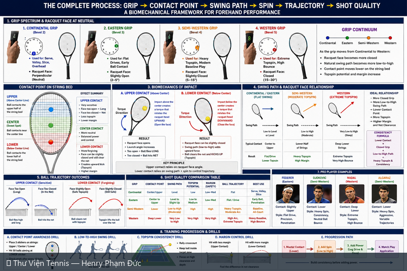
 

 <strong>Quy Trình Hoàn Chỉnh: Cầm Vợt → Điểm Tiếp Xúc → Đường Vung → Xoáy → Quỹ Đạo</strong>
 <em>Complete Process: Grip → Contact → Swing → Spin → Trajectory</em>
 

</a>
<a href="../../assets/thu-vien/complete_process_forehand_biomechanics.png" target="_blank" class="gallery-source">📂 Xem file gốc / View source PNG</a>

<a href="racquet_head_speed_drop_figure8_45whip/" class="gallery-card">
 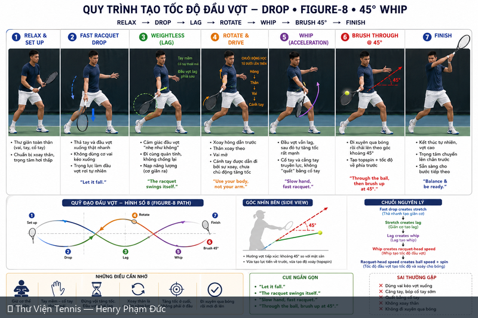
 

 <strong>Quy Trình Tạo Tốc Độ Đầu Vợt — Drop • Figure-8 • 45° Whip</strong>
 <em>Racquet Head Speed Process — Drop • Figure-8 • 45° Whip</em>
 

</a>
<a href="../../assets/thu-vien/racquet_head_speed_drop_figure8_45whip.png" target="_blank" class="gallery-source">📂 Xem file gốc / View source PNG</a>

<a href="rotational_vs_linear_engine_open_vs_closed_stance/" class="gallery-card">
 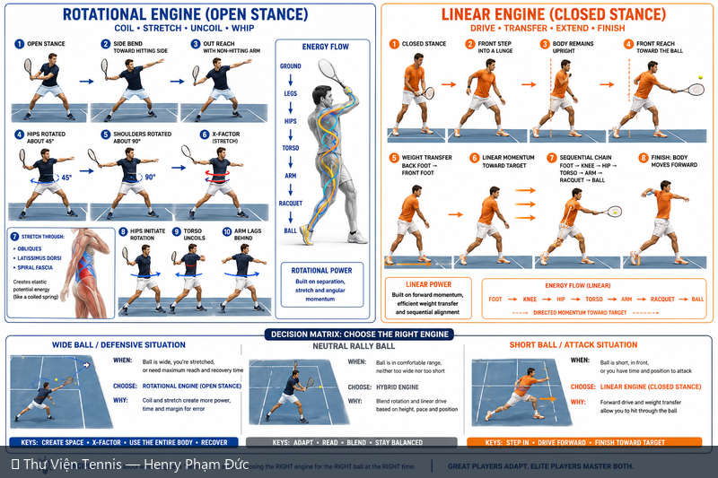
 

 <strong>Động Cơ Xoay vs Động Cơ Tuyến — Open vs Closed Stance</strong>
 <em>Rotational Engine vs Linear Engine — Open vs Closed Stance</em>
 

</a>
<a href="../../assets/thu-vien/rotational_vs_linear_engine_open_vs_closed_stance.png" target="_blank" class="gallery-source">📂 Xem file gốc / View source PNG</a>

<a href="complete_process_forehand_grip_contact/" class="gallery-card">
 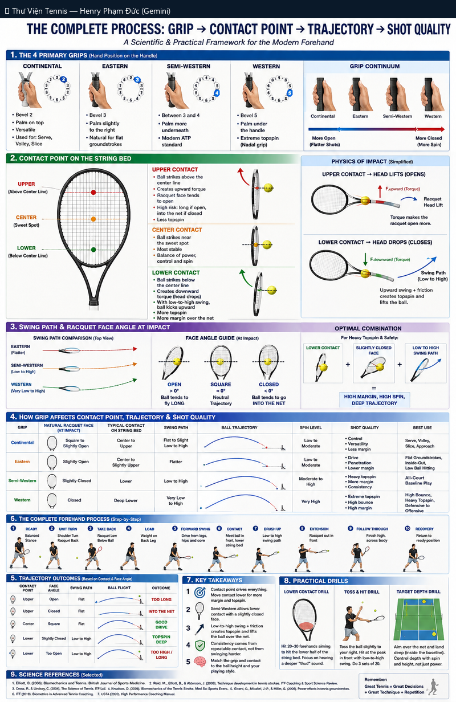
 

 <strong>Quy Trình Hoàn Chỉnh: Cầm Vợt → Điểm Tiếp Xúc → Quỹ Đạo → Chất Lượng Cú Đánh</strong>
 <em>Complete Process: Grip → Contact → Trajectory → Shot Quality</em>
 

</a>
<a href="../../assets/thu-vien/complete_process_forehand_grip_contact.png" target="_blank" class="gallery-source">📂 Xem file gốc / View source PNG</a>

<a href="full_process_coil_load_uncoil_release/" class="gallery-card">
 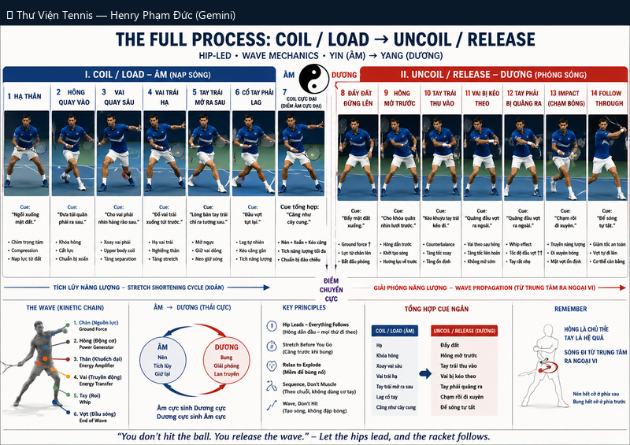
 

 <strong>Quy Trình Hoàn Chỉnh: Coil / Load → Uncoil / Release (Hip-Led Wave Mechanics)</strong>
 <em>Full Process: Coil / Load → Uncoil / Release (Hip-Led Wave Mechanics)</em>
 

</a>
<a href="../../assets/thu-vien/full_process_coil_load_uncoil_release.png" target="_blank" class="gallery-source">📂 Xem file gốc / View source PNG</a>

<a href="rotational_vs_linear_engine_open_vs_closed/" class="gallery-card">
 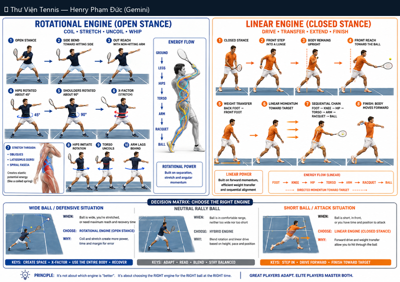
 

 <strong>Động Cơ Xoay vs Động Cơ Tuyến: Open Stance vs Closed Stance</strong>
 <em>Rotational Engine vs Linear Engine: Open Stance vs Closed Stance</em>
 

</a>
<a href="../../assets/thu-vien/rotational_vs_linear_engine_open_vs_closed.png" target="_blank" class="gallery-source">📂 Xem file gốc / View source PNG</a>

---

## ↩️ Backhand (Trái tay) / Backhand

**3 sơ đồ trong chủ đề — Backhand diagrams**

Click thumbnail để mở trang detail. Có thêm link Xem file gốc bên dưới mỗi ảnh.

<a href="master_two_handed_backhand_complete_system/" class="gallery-card">
 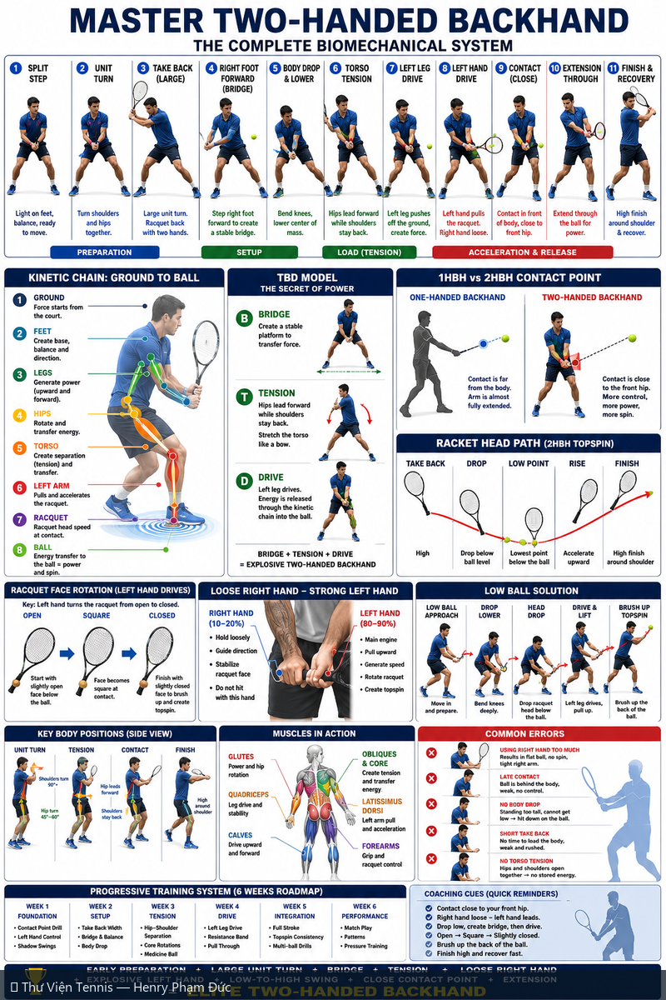
 

 <strong>Master Backhand Hai Tay — Hệ Thống Cơ Sinh Học Hoàn Chỉnh</strong>
 <em>Master Two-Handed Backhand — The Complete Biomechanical System</em>
 

</a>
<a href="../../assets/thu-vien/master_two_handed_backhand_complete_system.png" target="_blank" class="gallery-source">📂 Xem file gốc / View source PNG</a>

<a href="one_handed_backhand_essential_process/" class="gallery-card">
 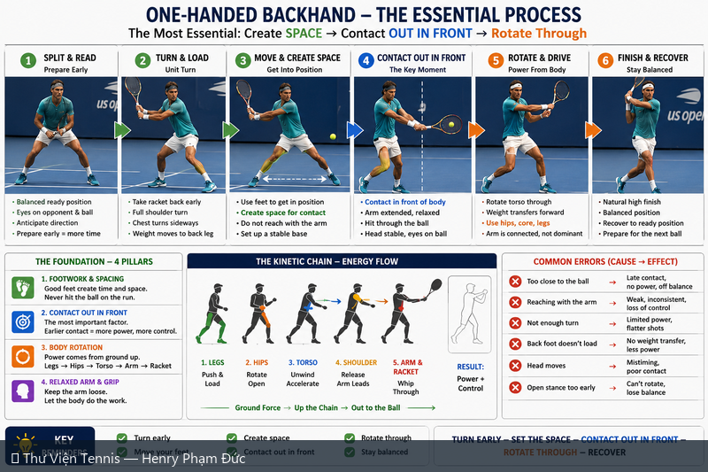
 

 <strong>Backhand Một Tay — Quy Trình Cốt Lõi</strong>
 <em>One-Handed Backhand — The Essential Process</em>
 

</a>
<a href="../../assets/thu-vien/one_handed_backhand_essential_process.png" target="_blank" class="gallery-source">📂 Xem file gốc / View source PNG</a>

<a href="two_handed_backhand_biomechanics_sequential/" class="gallery-card">
 
 

 <strong>Cơ Sinh Học Backhand Hai Tay — Trình Tự Hoàn Chỉnh</strong>
 <em>Two-Handed Backhand Biomechanics — Sequential Breakdown</em>
 

</a>
<a href="../../assets/thu-vien/two_handed_backhand_biomechanics_sequential.png" target="_blank" class="gallery-source">📂 Xem file gốc / View source PNG</a>

---

## 🚀 Serve (Giao bóng) / Serve

**6 sơ đồ trong chủ đề — Serve diagrams**

Click thumbnail để mở trang detail. Có thêm link Xem file gốc bên dưới mỗi ảnh.

<a href="cam_nang_giao_bong_4_phases/" class="gallery-card">
 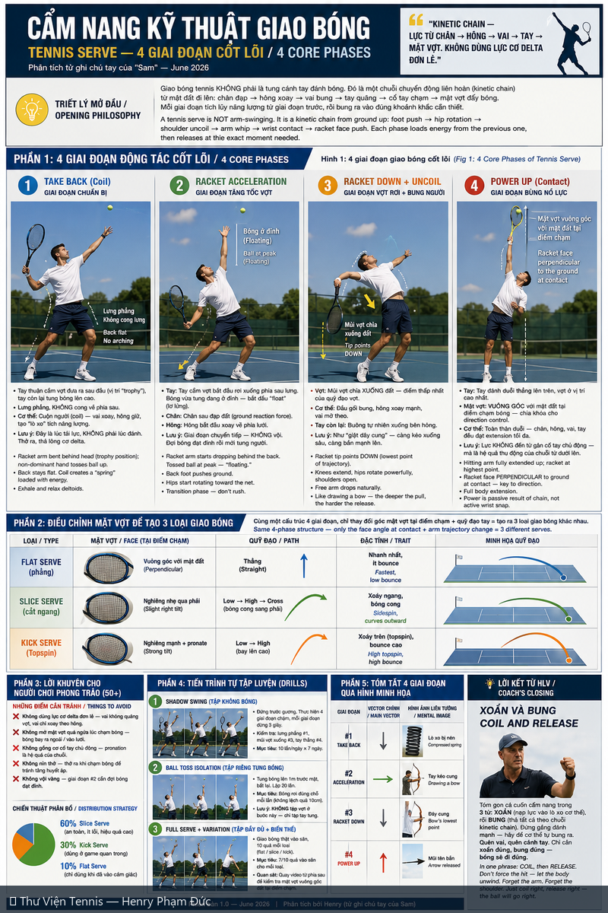
 

 <strong>Cẩm Nang Kỹ Thuật Giao Bóng — 4 Giai Đoạn Cốt Lõi</strong>
 <em>Tennis Serve Manual — 4 Core Phases</em>
 

</a>
<a href="../../assets/thu-vien/cam_nang_giao_bong_4_phases.png" target="_blank" class="gallery-source">📂 Xem file gốc / View source PNG</a>

<a href="tennis_serve_frame_by_frame_shelton_djokovic_nadal/" class="gallery-card">
 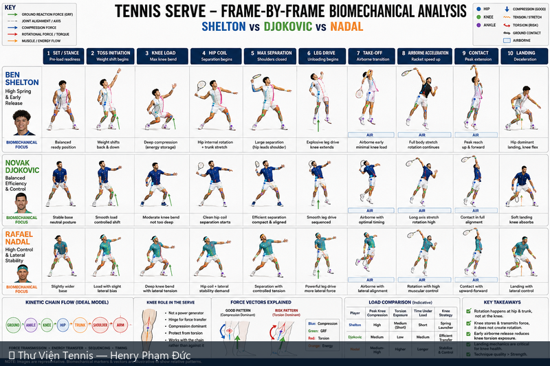
 

 <strong>Phân Tích Cú Giao Bóng Từng Khung Hình — Shelton vs Djokovic vs Nadal</strong>
 <em>Tennis Serve Frame-by-Frame Biomechanics — Shelton vs Djokovic vs Nadal</em>
 

</a>
<a href="../../assets/thu-vien/tennis_serve_frame_by_frame_shelton_djokovic_nadal.png" target="_blank" class="gallery-source">📂 Xem file gốc / View source PNG</a>

<a href="kinetic_chain_spiral_serve_ground_up/" class="gallery-card">
 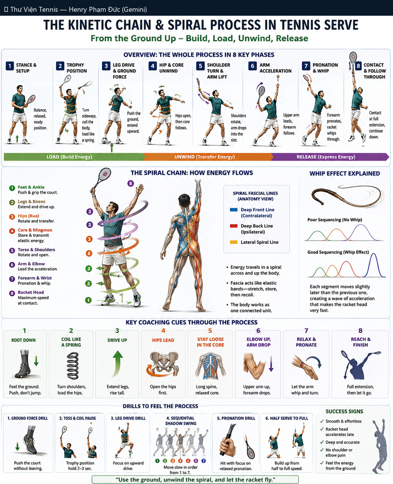
 

 <strong>Kinetic Chain & Spiral Process Trong Tennis Serve: Build → Load → Unwind → Release</strong>
 <em>Kinetic Chain & Spiral Process in Tennis Serve (Build → Load → Unwind → Release)</em>
 

</a>
<a href="../../assets/thu-vien/kinetic_chain_spiral_serve_ground_up.png" target="_blank" class="gallery-source">📂 Xem file gốc / View source PNG</a>

<a href="knee_biomechanics_serve_process_overview/" class="gallery-card">
 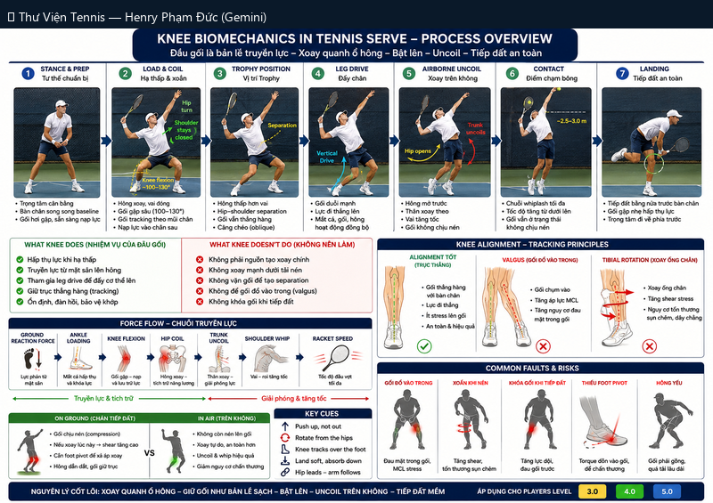
 

 <strong>Cơ Sinh Học Đầu Gối Trong Tennis Serve – Process Overview</strong>
 <em>Knee Biomechanics in Tennis Serve – Process Overview</em>
 

</a>
<a href="../../assets/thu-vien/knee_biomechanics_serve_process_overview.png" target="_blank" class="gallery-source">📂 Xem file gốc / View source PNG</a>

<a href="knee_complete_process_serve/" class="gallery-card">
 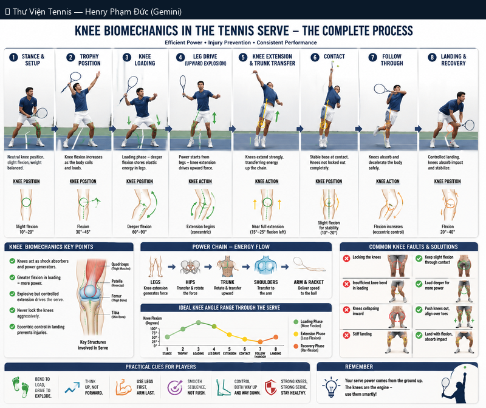
 

 <strong>Cơ Sinh Học Đầu Gối Trong Tennis Serve – Quy Trình Hoàn Chỉnh</strong>
 <em>Knee Biomechanics in the Tennis Serve – The Complete Process</em>
 

</a>
<a href="../../assets/thu-vien/knee_complete_process_serve.png" target="_blank" class="gallery-source">📂 Xem file gốc / View source PNG</a>

<a href="serve_frame_by_frame_shelton_djokovic_nadal/" class="gallery-card">
 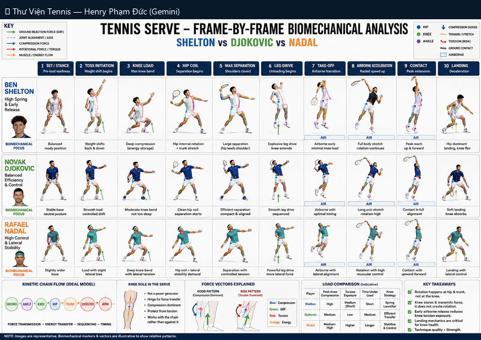
 

 <strong>Tennis Serve – Phân Tích Từng Khung Hình: Shelton vs Djokovic vs Nadal</strong>
 <em>Tennis Serve – Frame-by-Frame Biomechanical Analysis (Shelton / Djokovic / Nadal)</em>
 

</a>
<a href="../../assets/thu-vien/serve_frame_by_frame_shelton_djokovic_nadal.png" target="_blank" class="gallery-source">📂 Xem file gốc / View source PNG</a>

---

## 🦶 Footwork & Kinetic Chain / Footwork

**7 sơ đồ trong chủ đề — Footwork diagrams**

Click thumbnail để mở trang detail. Có thêm link Xem file gốc bên dưới mỗi ảnh.

<a href="footwork_kinetic_chain_complete_process/" class="gallery-card">
 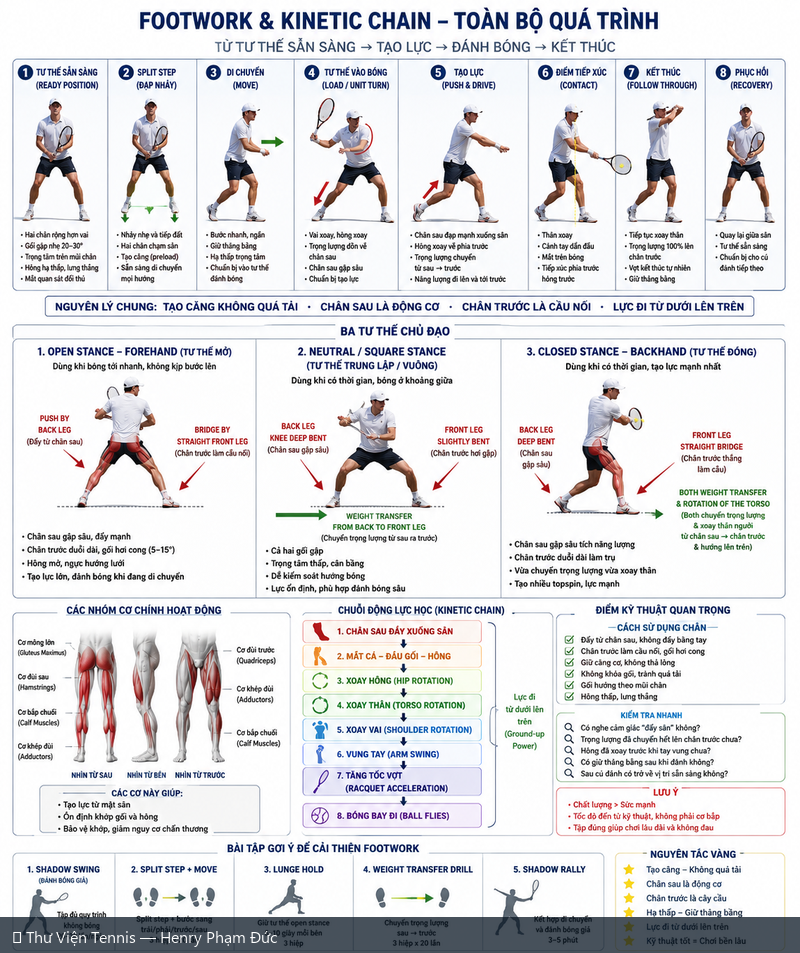
 

 <strong>Bước Chân & Chuỗi Động Lực — Toàn Bộ Quá Trình</strong>
 <em>Footwork & Kinetic Chain — The Complete Process</em>
 

</a>
<a href="../../assets/thu-vien/footwork_kinetic_chain_complete_process.png" target="_blank" class="gallery-source">📂 Xem file gốc / View source PNG</a>

<a href="split_step_complete_process/" class="gallery-card">
 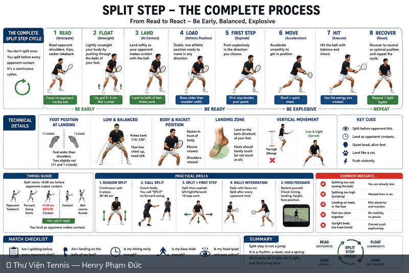
 

 <strong>Split Step — Quy Trình Hoàn Chỉnh</strong>
 <em>Split Step — The Complete Process</em>
 

</a>
<a href="../../assets/thu-vien/split_step_complete_process.png" target="_blank" class="gallery-source">📂 Xem file gốc / View source PNG</a>

<a href="force_transmission_heel_to_hand/" class="gallery-card">
 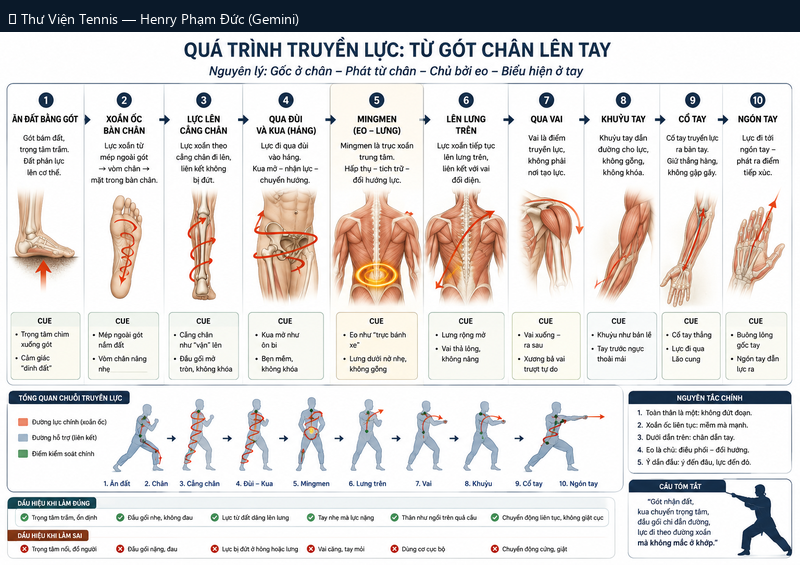
 

 <strong>Quá Trình Truyền Lực: Từ Gót Chân Lên Tay</strong>
 <em>Force Transmission Process: From Heel to Hand</em>
 

</a>
<a href="../../assets/thu-vien/force_transmission_heel_to_hand.png" target="_blank" class="gallery-source">📂 Xem file gốc / View source PNG</a>

<a href="kinetic_chain_tennis_ground_to_racket/" class="gallery-card">
 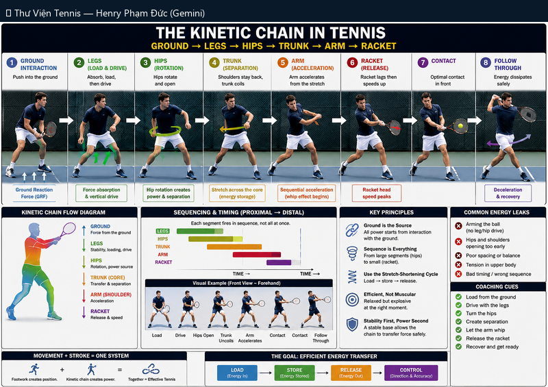
 

 <strong>The Kinetic Chain In Tennis: Ground → Legs → Hips → Trunk → Arm → Racket</strong>
 <em>The Kinetic Chain in Tennis (Ground → Legs → Hips → Trunk → Arm → Racket)</em>
 

</a>
<a href="../../assets/thu-vien/kinetic_chain_tennis_ground_to_racket.png" target="_blank" class="gallery-source">📂 Xem file gốc / View source PNG</a>

<a href="knee_time_gate_kinetic_chain/" class="gallery-card">
 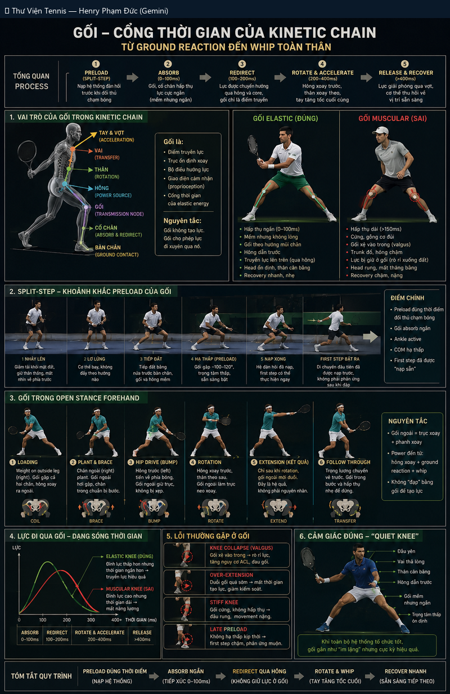
 

 <strong>Gối – Cổng Thời Gian Của Kinetic Chain (Từ Ground Reaction Đến Whip)</strong>
 <em>Knee – The Time Gate of the Kinetic Chain (from GRF to Whip)</em>
 

</a>
<a href="../../assets/thu-vien/knee_time_gate_kinetic_chain.png" target="_blank" class="gallery-source">📂 Xem file gốc / View source PNG</a>

<a href="spiral_chain_heel_mingmen_hand/" class="gallery-card">
 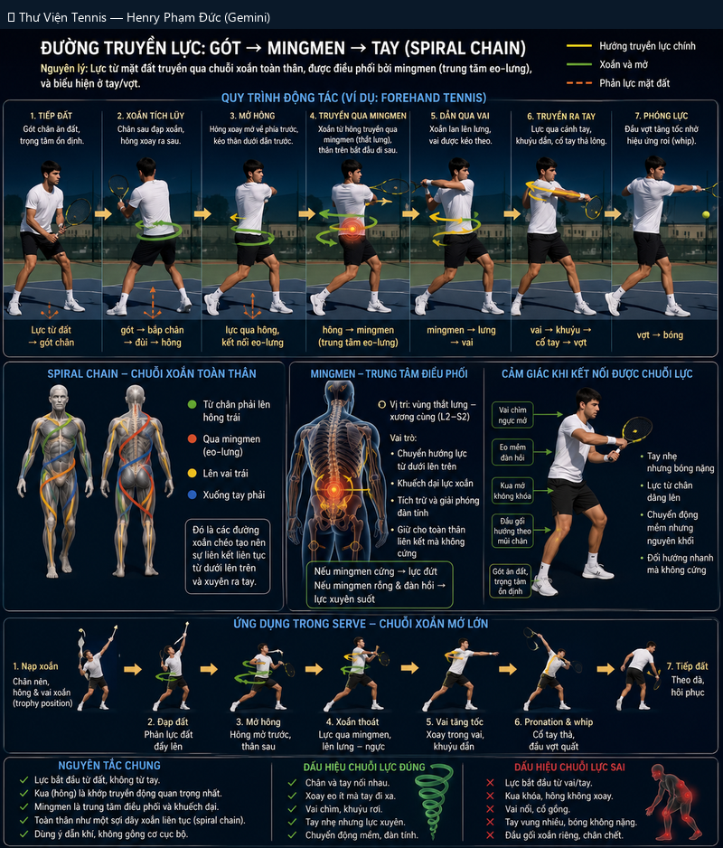
 

 <strong>Đường Truyền Lực: Gót → Mingmen → Tay (Spiral Chain)</strong>
 <em>Force Transmission Path: Heel → Mingmen → Hand (Spiral Chain)</em>
 

</a>
<a href="../../assets/thu-vien/spiral_chain_heel_mingmen_hand.png" target="_blank" class="gallery-source">📂 Xem file gốc / View source PNG</a>

<a href="universal_footwork_process_standard_prep/" class="gallery-card">
 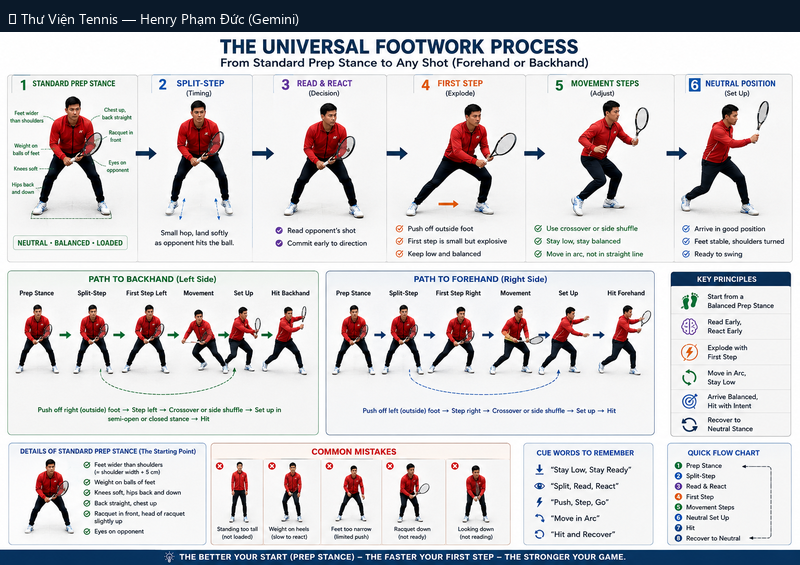
 

 <strong>Quy Trình Footwork Phổ Quát: Từ Tư Thế Chuẩn Bị Đến Mọi Cú Đánh</strong>
 <em>Universal Footwork Process: From Standard Prep Stance to Any Shot</em>
 

</a>
<a href="../../assets/thu-vien/universal_footwork_process_standard_prep.png" target="_blank" class="gallery-source">📂 Xem file gốc / View source PNG</a>

---

## ✋ Nền tảng kỹ thuật / Fundamentals

**4 sơ đồ trong chủ đề — Fundamentals diagrams**

Click thumbnail để mở trang detail. Có thêm link Xem file gốc bên dưới mỗi ảnh.

<a href="grip_forearm_turn_racquet_face_4_strokes/" class="gallery-card">
 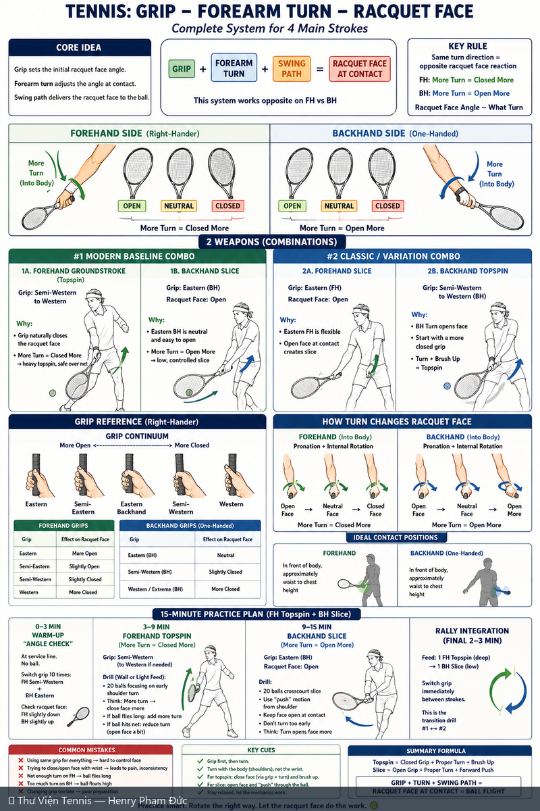
 

 <strong>Cầm Vợt – Xoay Cẳng Tay – Mặt Vợt: 4 Cú Đánh Chính</strong>
 <em>Grip – Forearm Turn – Racquet Face for 4 Main Strokes</em>
 

</a>
<a href="../../assets/thu-vien/grip_forearm_turn_racquet_face_4_strokes.png" target="_blank" class="gallery-source">📂 Xem file gốc / View source PNG</a>

<a href="neuromechanical_process_tennis_stroke/" class="gallery-card">
 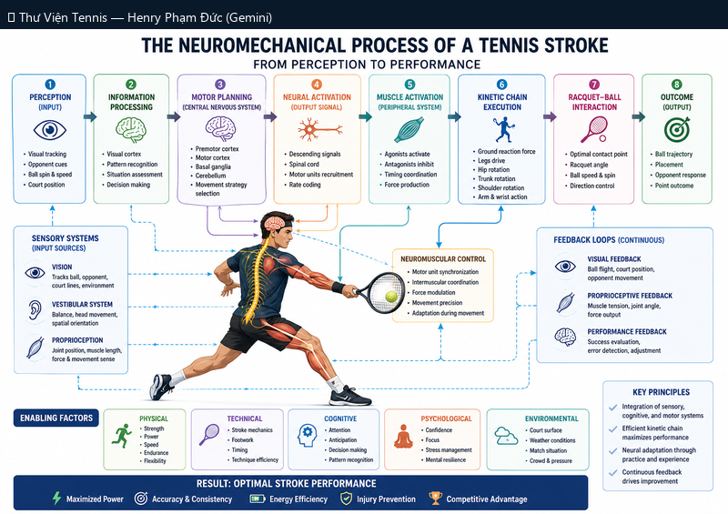
 

 <strong>Quá Trình Cơ Sinh Học Thần Kinh Của Cú Đánh Tennis</strong>
 <em>Neuromechanical Process of a Tennis Stroke (From Perception to Performance)</em>
 

</a>
<a href="../../assets/thu-vien/neuromechanical_process_tennis_stroke.png" target="_blank" class="gallery-source">📂 Xem file gốc / View source PNG</a>

<a href="dantian_mingmen_center_of_gravity/" class="gallery-card">
 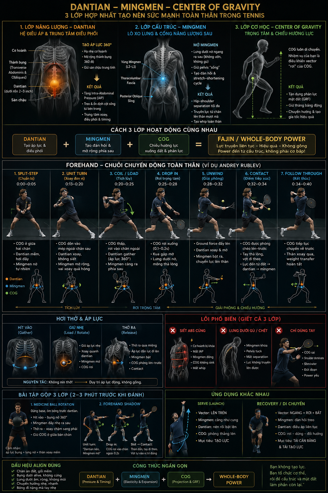
 

 <strong>Dantian, Mingmen & Center of Gravity — Hệ Thống Cơ Sinh Học</strong>
 <em>Dantian, Mingmen & Center of Gravity Biomechanics System</em>
 

</a>
<a href="../../assets/thu-vien/dantian_mingmen_center_of_gravity_biomechanics.png" target="_blank" class="gallery-source">📂 Xem file gốc / View source PNG</a>

<a href="tennis_universal_movement_system/" class="gallery-card">
 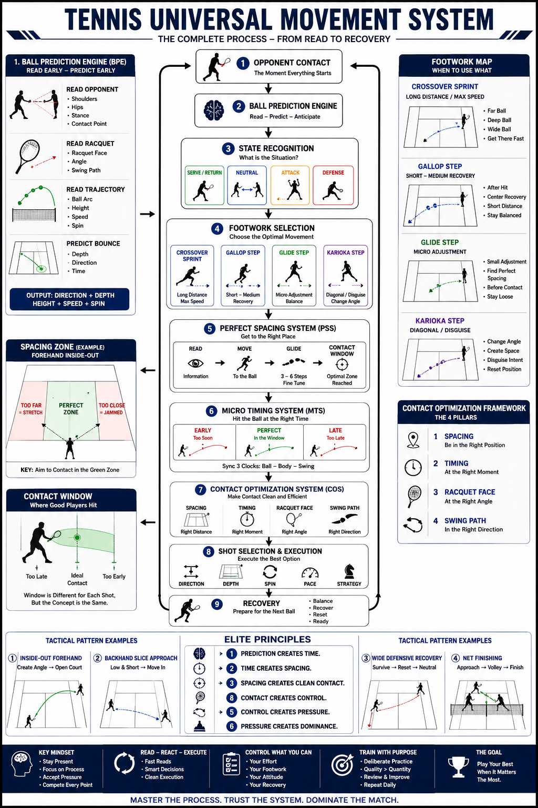
 

 <strong>Tennis Universal Movement System — Hệ Thống Di Chuyển Toàn Diện</strong>
 <em>Tennis Universal Movement System Complete Process</em>
 

</a>
<a href="../../assets/thu-vien/tennis_universal_movement_system.png" target="_blank" class="gallery-source">📂 Xem file gốc / View source PNG</a>

---

## 🔪 Slice (Bóng xoáy âm) / Slice

**2 sơ đồ trong chủ đề — Slice diagrams**

Click thumbnail để mở trang detail. Có thêm link Xem file gốc bên dưới mỗi ảnh.

<a href="returning_low_balls_slice_supination_pronation/" class="gallery-card">
 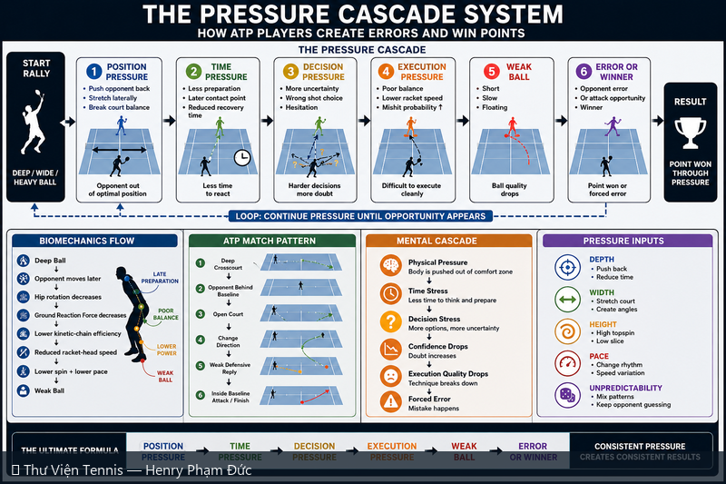
 

 <strong>Trả Bóng Thấp: FH Slice (Supination) & BH Slice (Pronation)</strong>
 <em>Returning Low Balls: FH Slice (Supination) + BH Slice (Pronation)</em>
 

</a>
<a href="../../assets/thu-vien/returning_low_balls_slice_supination_pronation.png" target="_blank" class="gallery-source">📂 Xem file gốc / View source PNG</a>

<a href="returning_low_balls_fh_bh_slice/" class="gallery-card">
 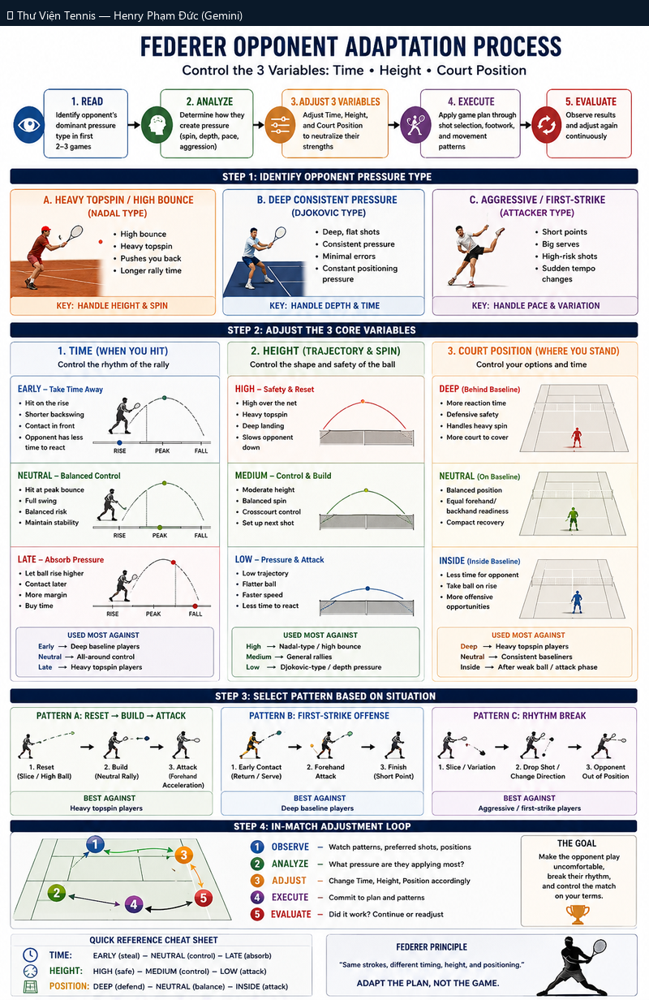
 

 <strong>Trả Bóng Thấp: Forehand Slice (Supination) & Backhand Slice (Pronation)</strong>
 <em>Returning Low Balls: Forehand Slice (with Supination) and Backhand Slice (with Pronation)</em>
 

</a>
<a href="../../assets/thu-vien/returning_low_balls_fh_bh_slice.png" target="_blank" class="gallery-source">📂 Xem file gốc / View source PNG</a>

---

## 🧠 Chiến thuật & Tư duy / Strategy & Mental

**12 sơ đồ trong chủ đề — Strategy & Mental diagrams**

Click thumbnail để mở trang detail. Có thêm link Xem file gốc bên dưới mỗi ảnh.

<a href="complete_tennis_system_technique_patterns_decisions_results/" class="gallery-card">
 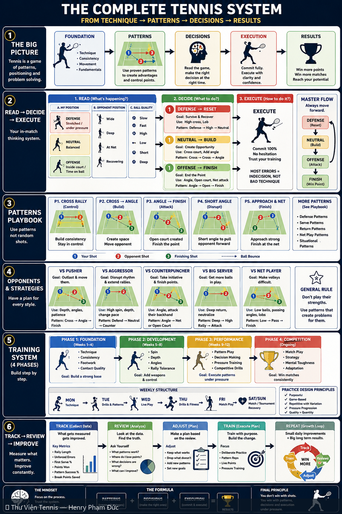
 

 <strong>Hệ Thống Tennis Hoàn Chỉnh: Kỹ Thuật → Mẫu → Quyết Định → Kết Quả</strong>
 <em>The Complete Tennis System: Technique → Patterns → Decisions → Results</em>
 

</a>
<a href="../../assets/thu-vien/complete_tennis_system_technique_patterns_decisions_results.png" target="_blank" class="gallery-source">📂 Xem file gốc / View source PNG</a>

<a href="exposed_angles_geometry_court_control/" class="gallery-card">
 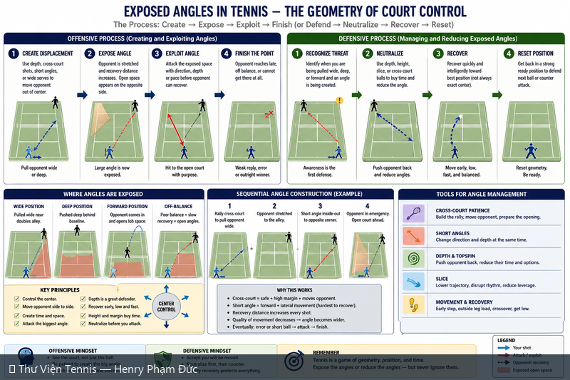
 

 <strong>Góc Mở Trong Tennis — Hình Học Kiểm Soát Sân</strong>
 <em>Exposed Angles — The Geometry of Court Control</em>
 

</a>
<a href="../../assets/thu-vien/exposed_angles_geometry_court_control.png" target="_blank" class="gallery-source">📂 Xem file gốc / View source PNG</a>

<a href="federer_adaptation_adaptive_process/" class="gallery-card">
 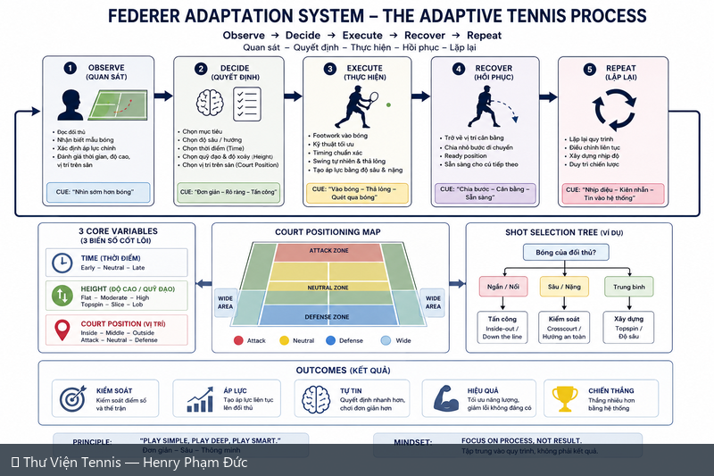
 

 <strong>Hệ Thống Thích Nghi Federer — Quy Trình Thích Nghi Trong Tennis</strong>
 <em>Federer Adaptation System — The Adaptive Tennis Process</em>
 

</a>
<a href="../../assets/thu-vien/federer_adaptation_adaptive_process.png" target="_blank" class="gallery-source">📂 Xem file gốc / View source PNG</a>

<a href="pressure_cascade_atp_system/" class="gallery-card">
 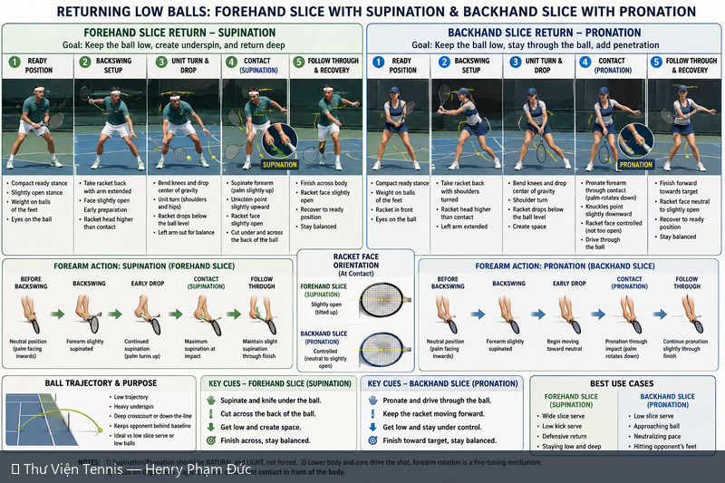
 

 <strong>Hệ Thống Áp Lực Liên Hoàn — Cách ATP Tạo Lỗi & Thắng Điểm</strong>
 <em>The Pressure Cascade System — How ATP Players Create Errors</em>
 

</a>
<a href="../../assets/thu-vien/pressure_cascade_atp_system.png" target="_blank" class="gallery-source">📂 Xem file gốc / View source PNG</a>

<a href="analyze_apply_elite_player_sinner_3_0/" class="gallery-card">
 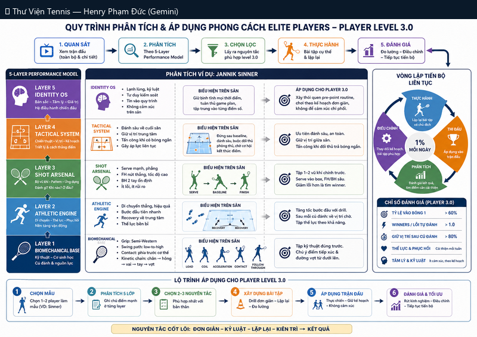
 

 <strong>Quy Trình Phân Tích & Áp Dụng Phong Cách Elite – Player Level 3.0 (Sinner Case Study)</strong>
 <em>Process for Analyzing & Applying Elite Player Style – Level 3.0 (Sinner Case Study)</em>
 

</a>
<a href="../../assets/thu-vien/analyze_apply_elite_player_sinner_3_0.png" target="_blank" class="gallery-source">📂 Xem file gốc / View source PNG</a>

<a href="complete_tennis_system_technique_patterns_decisions/" class="gallery-card">
 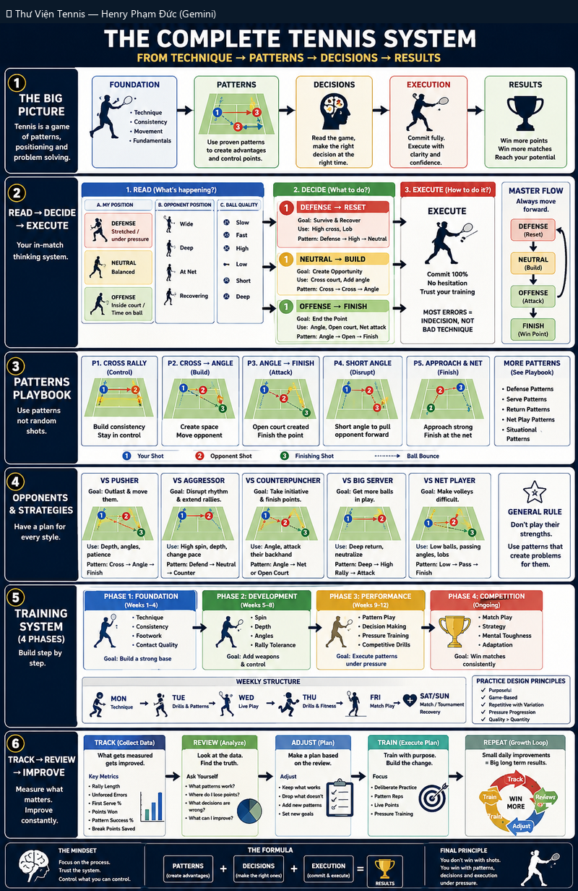
 

 <strong>Hệ Thống Tennis Hoàn Chỉnh: Kỹ Thuật → Patterns → Quyết Định → Kết Quả</strong>
 <em>Complete Tennis System: Technique → Patterns → Decisions → Results</em>
 

</a>
<a href="../../assets/thu-vien/complete_tennis_system_technique_patterns_decisions.png" target="_blank" class="gallery-source">📂 Xem file gốc / View source PNG</a>

<a href="endurance_tennis_system_5_pillars/" class="gallery-card">
 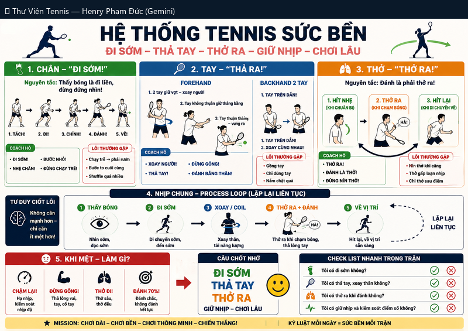
 

 <strong>Hệ Thống Tennis Sức Bền: 5 Trụ Cột (Chân · Tay · Thở · Nhịp · Mệt)</strong>
 <em>Endurance Tennis System: 5 Pillars (Legs · Arm · Breath · Rhythm · Fatigue)</em>
 

</a>
<a href="../../assets/thu-vien/endurance_tennis_system_5_pillars.png" target="_blank" class="gallery-source">📂 Xem file gốc / View source PNG</a>

<a href="federer_adaptation_process_3_variables/" class="gallery-card">
 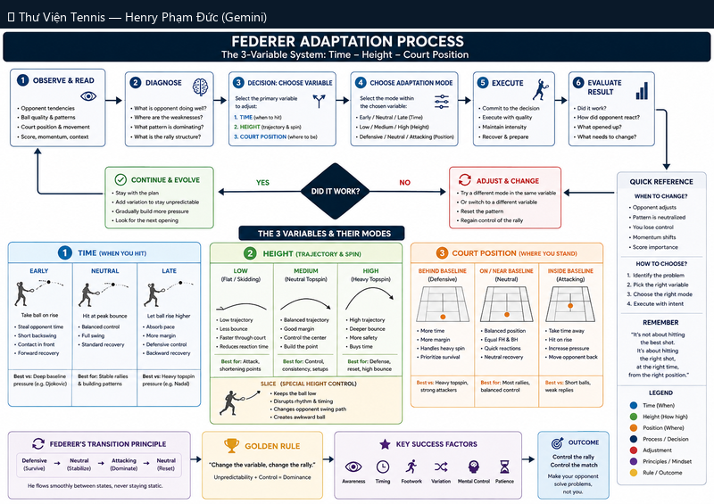
 

 <strong>Hệ Thống Thích Ứng Federer: Quy Trình Tennis Thích Ứng</strong>
 <em>Federer Adaptation System: The Adaptive Tennis Process</em>
 

</a>
<a href="../../assets/thu-vien/federer_adaptation_process_3_variables.png" target="_blank" class="gallery-source">📂 Xem file gốc / View source PNG</a>

<a href="federer_adaptive_system_full_loop/" class="gallery-card">
 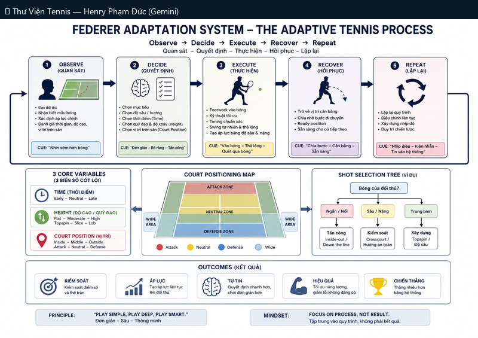
 

 <strong>Hệ Thống Thích Ứng Federer – Quy Trình Tennis Thích Ứng (Quan Sát → Quyết Định → Thực Hiện → Hồi Phục → Lặp Lại)</strong>
 <em>Federer Adaptive System – Adaptive Tennis Process (Observe → Decide → Execute → Recover → Repeat)</em>
 

</a>
<a href="../../assets/thu-vien/federer_adaptive_system_full_loop.png" target="_blank" class="gallery-source">📂 Xem file gốc / View source PNG</a>

<a href="federer_opponent_adaptation_3_variables/" class="gallery-card">
 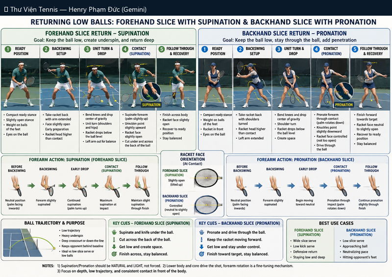
 

 <strong>Quy Trình Federer Thích Ứng Đối Thủ: 3 Biến Số (Thời Gian · Chiều Cao · Vị Trí Sân)</strong>
 <em>Federer Opponent Adaptation Process: 3 Variables (Time · Height · Court Position)</em>
 

</a>
<a href="../../assets/thu-vien/federer_opponent_adaptation_3_variables.png" target="_blank" class="gallery-source">📂 Xem file gốc / View source PNG</a>

<a href="federer_os_complete_process_diagram/" class="gallery-card">
 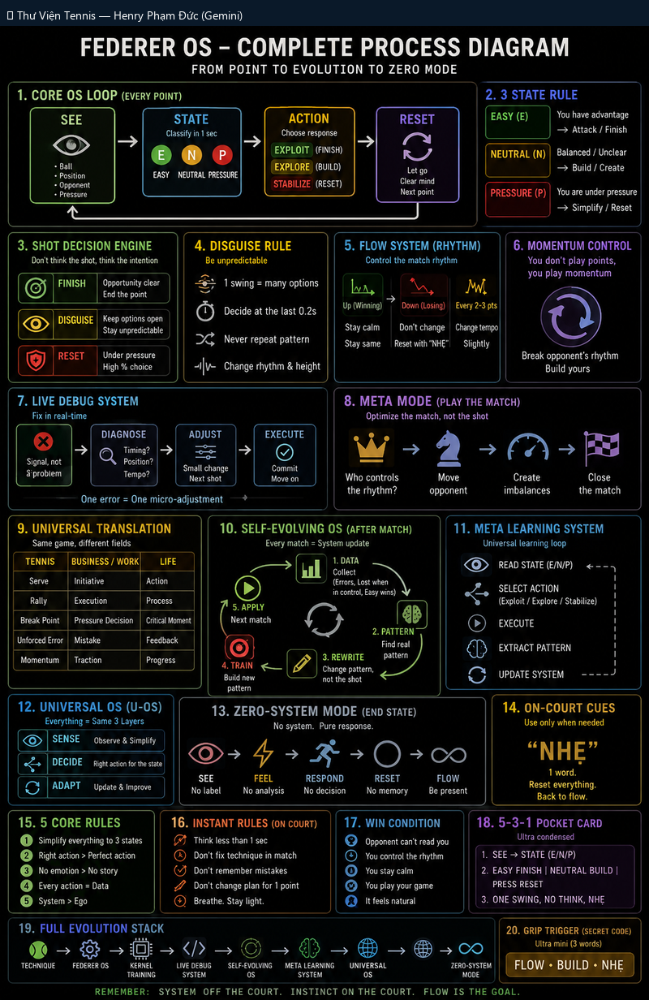
 

 <strong>Federer OS – Quy Trình Hoàn Chỉnh: Từ Point → Evolution → Zero Mode</strong>
 <em>Federer OS – Complete Process Diagram: From Point to Evolution to Zero Mode</em>
 

</a>
<a href="../../assets/thu-vien/federer_os_complete_process_diagram.png" target="_blank" class="gallery-source">📂 Xem file gốc / View source PNG</a>

<a href="playbook_doubles_3_complete_process/" class="gallery-card">
 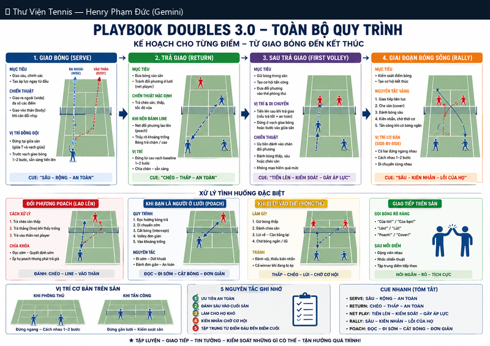
 

 <strong>Playbook Đánh Đôi 3.0 – Toàn Bộ Quy Trình (Từ Giao Bóng Đến Kết Thúc)</strong>
 <em>Doubles 3.0 Playbook – The Complete Process (From Serve to Finish)</em>
 

</a>
<a href="../../assets/thu-vien/playbook_doubles_3_complete_process.png" target="_blank" class="gallery-source">📂 Xem file gốc / View source PNG</a>

---

## 🔗 Tài nguyên liên quan / Related Resources

<h3>📚 Tài Liệu Tham Khảo</h3>
<ul>
<li><a href="https://henryphamduc.github.io/tennis/">📚 Tennis Ebook — Thư Viện Hoàn Chỉnh</a> — 35+ tài liệu tennis song ngữ</li>
<li><a href="https://henryphamduc.github.io/tennis/">📘 Tennis Manual (Master Reference v2)</a> — 22 deep dives + cơ sinh học</li>
<li><a href="https://tennis-doctor.henry-phamduc.workers.dev/">🤖 Tennis Doctor — AI Chat</a> — Hỏi đáp tennis bằng AI</li>
<li><a href="https://henryphamduc.github.io/tennis/">🎯 Cẩm nang Tennis (Wiki hub)</a></li>
</ul>

---

© 2026 Henry Phạm Đức · Tennis Future Lab · All site content is for educational purposes.

